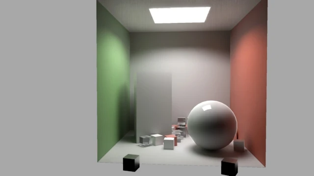

# gkNextEngine

**面向实时路径追踪、游戏原型与高质量视觉表现的跨平台 3D 引擎**

[English](README.en.md) | [简体中文](README.md)

[](https://deepwiki.com/gameknife/gkNextEngine)

[](LICENSE)




---

gkNextEngine 是一个基于现代 C++20 与 Vulkan 的跨平台 3D 游戏引擎 / 渲染实验场，核心目标始终是两件事：

- 用 **实时路径追踪、Hybrid Rendering 与 TrueHDR** 做出真正有展示力、且能稳定跑在运行时里的画面
- 用 **可运行、可扩展、可用于玩法原型验证与 AI Native 工作流的引擎能力** 支撑长期演进，而不是停留在单点 demo

项目以渲染器能力为核心，同时持续扩展编辑器、脚本、物理、内容导入与多游戏原型。当前的 MagicaLego、Brotato3D、KongLie3D、BrickPlayer、CharacterDemo、Flappy等原型，以及 SCAD、LDraw、Gaussian Splat 等结构化内容管线，并不是孤立功能点；它们都在为后续 AI Native 的内容生成、场景理解、玩法迭代和自动化验证打基础。

如果你关注以下方向，这个项目会比较值得参考：

- 想看实时路径追踪、金属 / 玻璃 / 塑料材质、HDR 环境光和高密度场景的实际画面
- 想研究一套**真正以运行时性能为约束**的 Vulkan 渲染架构，而不是只会离线出图的 demo
- 想看一个引擎如何把 **渲染、编辑器、脚本、物理、内容导入与玩法原型** 串成完整系统
- 想读一套规模可控、强调工程清晰度、适合学习现代 Vulkan 渲染与引擎实现的代码库

**支持平台：** Windows x86_64 · Linux x86_64 · macOS arm64 · Android arm64 · iOS arm64

---

## 项目特性

- **实时路径追踪与 Hybrid Rendering**
  围绕 1/2spp + temporal reuse、降噪、重投影和多管线切换持续推进，让路径追踪不只停留在离线效果演示，而是面向真实运行时表现。

- **以性能为约束的渲染管线**
  世界辐射缓存复用、稀疏显存布局、GPU-Driven 海量提交，目标是在固定 GPU 预算下尽量多出画面、少占显存，而不是为单帧画质无限堆资源。

- **游戏级取向的 GPU 架构**
  通过 Visibility Buffer、全 Bindless、GPU-Driven 单 draw 提交等设计，最小化状态切换和command编排，尽量把 CPU 开销留给内容与玩法，把 GPU 算力用在真正影响画面的地方。

- **引擎能力服务于内容与玩法原型**
  包括 ECS、反射、编辑器、脚本热重载、物理同步、运行时导入和稳定的渲染行为。这些能力共同支撑更完整的可玩内容系统。

- **AI Native 的基础设施**
  多个游戏原型用于验证玩法循环、输入、物理、脚本和渲染在真实运行时里的协作；SCAD、LDraw 与 Gaussian Splat 导入让 AI 可以生成、修改、理解并验证结构化 3D 内容，而不是只输出静态资源。

- **多格式内容导入与互操作**
  完整支持 glTF 运行时导入与部分导出；同时可直接导入 LDraw `.ldr` / `.mpd`、OpenSCAD `.scad` DSL 与 PlayCanvas `.sog` 高斯溅射资产，把结构化场景纳入统一的 Runtime、渲染与交互系统。

---

## 性能与渲染效率

性能是当前的核心约束之一。引擎围绕世界辐射缓存复用、稀疏显存布局、GPU-Driven 海量提交、按需驻留与多档上采等手段，在固定 GPU 预算下尽量多出画面、少占显存。下面给出一组**典型场景的运行时性能参考**，并配套内置的逐 pass profiler 与 Superluminal 集成做剖析。

### 性能参考数据

> 下面数据来自 `out/build/windows/bin/motion_benchmark_report.csv`，测试环境为 NVIDIA GeForce RTX 5070 Ti / NVIDIA 610.47.0，1280x720，单场景约 3 秒采样；DLSS、FSR 与 denoiser 均关闭。

| 场景 | 分辨率 | 渲染管线 | 帧时间 (ms) | GPU 时间 (ms) | FPS | 显存 | Draw AfterCull / View | 三角形 AfterCull / View |
|------|--------|----------|------------|---------------|-----|------|------------------------|-------------------|
| pbr | 1280x720 | PathTracing | 1.714 | 1.300 | 583 | 884 MiB | 10 / 10 | 8,754 / 8,754 |
| pbr | 1280x720 | SoftwareModernNoAmbient | 0.547 | 0.157 | 1,827 | 857 MiB | 10 / 10 | 8,753 / 8,753 |
| playground | 1280x720 | PathTracing | 2.432 | 1.924 | 411 | 857 MiB | 82 / 84 | 10,384 / 10,465 |
| playground | 1280x720 | SoftwareModernNoAmbient | 0.586 | 0.213 | 1,708 | 859 MiB | 83 / 85 | 10,479 / 10,561 |
| livingroom | 1280x720 | PathTracing | 1.408 | 0.948 | 710 | 893 MiB | 10 / 146 | 57,843 / 560,308 |
| livingroom | 1280x720 | SoftwareModernNoAmbient | 0.614 | 0.217 | 1,628 | 893 MiB | 10 / 141 | 56,086 / 537,628 |
| castle | 1280x720 | PathTracing | 3.695 | 3.224 | 271 | 859 MiB | 1,448 / 2,313 | 96,640 / 155,867 |
| castle | 1280x720 | SoftwareModernNoAmbient | 0.779 | 0.368 | 1,284 | 925 MiB | 1,426 / 2,276 | 94,235 / 152,691 |
| complex | 1280x720 | PathTracing | 3.041 | 2.446 | 329 | 925 MiB | 3,373 / 19,715 | 40,683 / 237,561 |
| complex | 1280x720 | SoftwareModernNoAmbient | 0.702 | 0.261 | 1,424 | 952 MiB | 3,219 / 18,662 | 37,963 / 224,852 |

> 以上数据可用 `gkNextMotionBenchmark` 在统一硬件 / 驱动下复现；可选模型先执行 `./gnb paks fetch`。启动时只传一个编排 JSON：
>
> ```bash
> ./gnb run gkNextMotionBenchmark --benchmark-config assets/configs/motion_benchmark.example.json
> ```

### 内置 Profiler

引擎内置一套 CPU / GPU 逐 pass 计时系统：每个渲染 pass 由命名 scope 标注，`VulkanGpuTimer` 采集各 pass 的 GPU 端耗时，运行时以 ImGui 叠加层（`ProfileDebugOverlay`）实时显示逐 pass 帧时间与统计。无需外部工具即可定位渲染热点、对比不同管线与设置的开销。

### Superluminal 集成

Windows 上若安装了 [Superluminal](https://superluminal.eu/) Performance API（默认探测 `C:/Program Files/Superluminal/Performance/API`），构建会自动启用 `WITH_SUPERLUMINAL`，把引擎的 CPU 与 GPU 命名事件投递到 Superluminal 时间线（GPU 事件经独立回放线程标注），便于做细粒度采样剖析与跨帧分析。未安装时自动跳过，不影响构建。

---

## 核心能力

### 1. 面向运行时的高质量渲染

- **实时路径追踪与 Hybrid Rendering**：围绕 1/2spp + temporal reuse、降噪、重投影和多管线切换持续推进，让路径追踪在真实运行时条件下可用
- **现代 GPU 光栅管线**：Visibility Buffer、全 Bindless、GPU-Driven 单 draw 提交、Soft Mesh Shader 和 GPU CSM 阴影服务于高密度场景与游戏级工况
- **多套渲染器热切换**：同一套资产与场景可切换 PathTracing、SoftwareTracing、SoftwareModern / NoAmbient 等管线，便于画质、性能与平台适配对比
- **GI、降噪与上采**：SHARC 世界辐射缓存、RESTIR DI，以及 FSR / DLSS / DLSS RR / Native TAAU / SGSR2
- **高斯溅射共渲染**：支持 PlayCanvas SOG v2 Gaussian Splatting，以硬件 billboard 路径和 mesh 场景共存

### 2. 运行时、编辑器与验证工具链

- **ECS + Reflection**：基于 entt 的组件系统，加上反射层，统一服务于运行时、编辑器属性面板、撤销 / 重做和 QuickJS 绑定
- **ImGui 编辑器与材质工作流**：`gkNextEditor` 面向场景、材质和运行时内容编辑，支持数据驱动设置、cvar 面板和 node-based material workflow
- **QuickJS + TypeScript 热重载**：运行时使用仓库内置 `tools/tsc/tsc[.exe]` 编译 TypeScript，无需 Node/npm 或全局 `tsc`；整合链路见 [docs/guides/typescript-integration.md](docs/guides/typescript-integration.md)
- **Jolt Physics 与交互运行时**：为拖拽、碰撞、角色移动、可玩原型和自动化场景验证提供真实物理基础
- **Agent 验证工具**：`gnb shot` 隐藏窗口截图验证，`gnb validate` 支持输入驱动、断言和 JSON report，适合渲染、UI 与玩法状态的自动化回归
- **Profiler / Benchmark / TUI**：内置 CPU / GPU pass profiler、`gkNextMotionBenchmark` CSV 性能报告、`gkNextVisualTest` 视觉回归，以及 `gnb tui` 终端渲染预览
- **Remote Play 模式**：`gnb remote` / `--remote` 可把任意桌面 target 作为 WebRTC host 运行，浏览器零安装接入画面，并通过键盘、鼠标和虚拟手柄回传输入；视频路径走 Vulkan Video H.264 硬件编码
- **gnb Dashboard 与本地 LLM**：`gnb dashboard` 提供 TODO、Build、Run、Test、Git、Chat、LOC 等本地工作台；`gnb llm` 集成 llama.cpp / Gemma，本地 OpenAI 兼容服务可复用于工具链和运行时 AI

### 3. AI Native 与多游戏原型

- **多原型验证真实需求**：MagicaLego、BrickPlayer、Brotato3D、KongLie3D、CharacterDemo、Flappy、AirportSim、StudioSim、NextRA 等应用，以及 Voyage3D 源码原型，覆盖搭建、动作、物理、脚本、UI、战斗、模拟和 AI 交互场景
- **结构化内容面向 AI 生成**：SCAD、LDraw、Gaussian Splat 与 glTF 管线让 AI 能处理可解析、可修改、可验证的 3D 内容，而不是只生成不可控的静态素材
- **AI 辅助玩法迭代**：本地 LLM、QuickJS 脚本、反射组件、agent validation 和 dashboard 形成闭环，为后续“生成内容 -> 运行验证 -> 迭代修改”的 AI Native 工作流铺底
- **脚本 parity 与确定性验证**：Flappy C++ / JS parity、输入脚本、隐藏窗口截图和 benchmark report 用于约束 AI 修改后的行为回归

### 4. glTF、LDraw、OpenSCAD 与高斯溅射的内容导入能力

- **glTF 完整导入 / 部分导出**：面向运行时支持 glTF 场景、材质、动画、骨骼蒙皮等内容导入，并可将部分运行时内容回写到 glTF 工作流
- **LDraw 直接导入 Runtime**：`.ldr` / `.mpd` 可直接进入 Runtime，从 `LDConfig.ldr`、LGEO realistic color 到引擎 PBR 材质的完整颜色与材质映射，并把零件连接语义转换成搭建系统可理解的数据
- **OpenSCAD DSL 与 ScadStudio**：直接解析 / 求值 `.scad`，几何走 Manifold CSG、文本走 FreeType，把程序化建模脚本变成可渲染网格；`ScadStudio` 基于此做建模、场景生成与角色绑定实验
- **ScadRig 刚体角色**：用 SCAD 描述刚体骨骼层级和动画片段，已用于 AirportSim / StudioSim 方向的角色可视化与职业配色实验
- **Gaussian Splat 资产**：直接加载 PlayCanvas `.sog`（打包 ZIP 或 `meta.json` + `.webp`），与 mesh、材质、相机和运行时场景共渲染

### 5. 代码规模可控，适合学习和扩展

- **第一方 Engine core 目标 < 50k LOC**：核心刻意保持在便于理解和持续演进的区间
- **优先清晰实现而非过度设计**：尽量用明确的数据流、职责边界和成熟三方库解决问题，避免把实验性功能过早抽象成沉重框架
- **适合阅读现代引擎实现**：从 Vulkan 渲染、资源管理、脚本、编辑器、反射、内容导入到测试 / benchmark / agent validation，都能看到完整的工程组织方式

---

## 视觉预览


<details>
<summary><b>示例截图</b></summary>

| 场景 | 截图 |
|------|------|
| still |  |
| livingroom |  |
| ldrawlego |  |
| luxball |  |
| brickplayer |  |

</details>

---

## 快速开始

对于墙内开发者，请首先确保网络的稳定性，个人推荐常年使用工具

[带邀请码链接](https://nxonearth.com/signupbyemail.aspx?MemberCode=93e1edc92a95412dbc7ff38c8288951920240913095147)
[不带邀请码链接](https://nxonearth.com/signupbyemail.aspx)

项目使用 CMake + Ninja，依赖由 vcpkg 管理。除了宿主机本身必须具备的基础工具（编译器 / IDE、CMake、平台 SDK 等），项目级依赖、外部工具链和可选资源包现在都尽量交给 `gnb` 准备。构建依赖下载阶段需要可访问 GitHub 的网络环境。

### 通用说明

- 推荐先执行 `./gnb.sh doctor`（Windows: `gnb.bat doctor`）检查宿主机缺失的基础工具
- `./gnb.sh setup`（Windows: `gnb.bat setup`）会准备 vcpkg、项目外部工具链与可选资源包；如果直接执行 `./gnb.sh build`，首次缺少 toolchain 时也会自动补齐核心依赖
- 桌面平台现在通过 `gnb` 统一构建和运行，通常不再需要先 `cd` 到 `out/build/<platform>/bin`
- 可用 CMake 预设收敛为：`windows`、`linux`、`macos-arm64`、`ios`

### 平台构建

<details>
<summary><b>Windows (Visual Studio 2022)</b></summary>

**前置条件：**

- CMake 3.26+
- Visual Studio 2022（C++ 工作负载）
- Vulkan SDK 1.4.341.1（默认由 `gnb` 自动下载到仓库内；若设置 `VULKAN_SDK` 则优先使用环境里的 SDK）
- 启用“使用 Unicode UTF-8 提供全球语言支持”

```bat
./gnb.bat setup
./gnb.bat build        # 默认构建核心目标 (gkNextRenderer + gkNextUnitTests)
./gnb.bat build --all  # 构建全量 15+ 子项目
./gnb.bat run gkNextRenderer
```

除 Visual Studio 这类宿主工具外，其余项目依赖通常都由 `gnb` 自动准备；默认会拉取项目约定版本的 Vulkan SDK、Slang 与 TypeScript 工具链到仓库内。`gnb` 在 Windows 上默认使用 **Ninja** 极速构建生成器（自动管理 MSVC 与 SDK 环境路径），Windows 默认启用 NVIDIA Streamline（DLSS）。

</details>

<details>
<summary><b>Linux (Ubuntu)</b></summary>

```shell
./gnb.sh setup
./gnb.sh build
./gnb.sh run gkNextRenderer
```

- 在 apt / pacman 环境下，`gnb setup` 与 Linux 首轮 `gnb build` 会在 vcpkg bootstrap 前自动安装桌面构建所需系统包
- 如果自动安装不可用，再手动补齐：`sudo apt install build-essential cmake ninja-build curl zip unzip tar pkg-config libxi-dev libxinerama-dev libxcursor-dev libxrandr-dev wayland-protocols libxkbcommon-dev xorg-dev`
- 非 apt/pacman 发行版仍会给出缺失桌面依赖提示

</details>

<details>
<summary><b>Steam Deck / Arch Linux</b></summary>

```shell
./gnb.sh setup
./gnb.sh build --reconfigure
./gnb.sh run gkNextRenderer
```

说明：

- 如果机器上没有可用的 `VULKAN_SDK`，`gnb setup` 会自动下载项目约定版本的 LunarG Vulkan SDK 到 `external/VulkanSDK/`
- 如果机器上还没有 `slangc`，`gnb setup` 会自动下载项目约定的 Slang 工具链到 `external/`
- 在 pacman 环境下，`gnb setup` / Linux 首轮 `gnb build` 会在 vcpkg bootstrap 前自动安装系统包；如果自动安装不可用，可手动执行 `sudo pacman -S --needed base-devel cmake ninja curl zip unzip tar pkgconf libx11 libxft libxext libxi libxinerama libxcursor libxrandr wayland-protocols libxkbcommon`
- 如果 vcpkg 阶段遇到 GitHub 归档下载失败，优先直接重试同一条构建命令
- 一次真实 Steam Deck 部署的复盘见 [docs/notes/steamdeck-deployment-notes.md](docs/notes/steamdeck-deployment-notes.md)

</details>

<details>
<summary><b>macOS</b></summary>

**前置条件：**

- Xcode / Command Line Tools
- CMake 3.26+
- Ninja（如果本机的 CMake 发行版未自带）

```shell
./gnb.sh setup
./gnb.sh build
./gnb.sh run gkNextRenderer
```

`gnb setup` 会自动下载项目使用的 Vulkan SDK、Slang 与 TypeScript 工具链，无需再单独准备这些项目级依赖。若显式设置 `VULKAN_SDK`，则优先使用该环境变量指向的 SDK。

</details>

### 运行示例

```shell
# 主渲染器
./gnb.sh run gkNextRenderer

# Editor
./gnb.sh run gkNextEditor

# TUI 终端模式（无窗口，画面刷到终端）
./gnb.sh tui --scene assets/models/playground.glb

# Remote Play（浏览器 WebRTC 远程游玩 host）
./gnb.sh remote --target gkNextRenderer --scene assets/models/playground.glb --res 1280x720
```

## 子项目

| 项目 | 说明 |
|------|------|
| `gkNextRenderer` | 主渲染器，路径追踪 / Hybrid Rendering / 多管线对比 |
| `gkNextStillBenchmark` | 静态场景渲染基准测试 |
| `gkNextMotionBenchmark` | 动态镜头 / 多场景渲染性能基准，输出 CSV profile 报告 |
| `gkNextVisualTest` | 自动化视觉测试与截图报告 |
| `RmlUiDemo` | RmlUi 运行时 UI 集成与交互验证 demo |
| `gkNextEditor` | ImGui 编辑器，服务于材质、场景与运行时工具链 |
| `ScadStudio` | OpenSCAD（`.scad`）DSL 建模 / 角色绑定实验编辑器 |
| `BrickPlayer` | 基于 LDraw 的数字乐高搭建原型 |
| `MagicaLego` | 更轻量的乐高 / voxel 风格玩法实验场 |
| `Brotato3D` | 俯视角 3D 生存射击原型，介绍见 [docs/projects/brotato-3d/introduction.md](docs/projects/brotato-3d/introduction.md) |
| `KongLie3D` | 棋盘布阵 / 羁绊 / 战斗回合原型 |
| `NextRA` | RTS / lockstep / replay 方向的确定性模拟原型 |
| `CharacterDemo` | 角色控制、AI 行为、导航与战斗交互实验 |
| `AirportSim` | 机场生态模拟，验证 SCAD POI、角色队列、寻路、LLM 决策与 ScadRig 角色 |
| `StudioSim` | 工作室经营模拟，验证本地 LLM 事件、员工目标、SCAD 办公室与 ScadRig 表现 |
| `FlappyCpp` / `FlappyJs` | Flappy Bird 双实现回归样例，用于验证 C++ 与 QuickJS/TypeScript 行为一致性，介绍见 [docs/projects/flappy-bird-parity/introduction.md](docs/projects/flappy-bird-parity/introduction.md) |
| `gkNextUnitTests` | Catch2 单元测试 |
| `Packager` | 资产打包为 `.pkg` |

> 桌面 target 通常都可以配合 `gnb remote --target <Target>` 进入 Remote Play host 模式；该模式目前面向 Windows / Linux 桌面 Vulkan Video H.264 设备。`src/Application/Game/Voyage3D` 仍保留为航海贸易 / 港口 / 海战方向源码原型，当前未暴露独立 CMake target。

---

## 参考与感谢

- [RayTracingInVulkan](https://github.com/GPSnoopy/RayTracingInVulkan)
- [Vulkan Tutorial](https://vulkan-tutorial.com/)
- [Vulkan-Samples](https://github.com/KhronosGroup/Vulkan-Samples)

---

## 参与贡献

欢迎 Issue / PR。

- 开发协作说明见 `AGENTS.md`
- 如果你对实时路径追踪、现代渲染架构、渲染性能优化、LDraw、编辑器工具链、AI Native 工作流或玩法原型验证感兴趣，欢迎交流

---

## 第三方依赖

cpptrace · cxxopts · sdl3 · glm · imgui · stb · curl · nlohmann-json · tinygltf · draco · fmt · meshoptimizer · ktx · joltphysics · xxhash · spdlog · cpp-base64 · catch2 · entt · libwebp · vulkan-loader · libavif

---

## 许可协议

gkNextEngine 以 [MIT 协议](LICENSE) 开源。第三方库的源代码详见 [LICENSE](LICENSE) 中的第三方声明。
