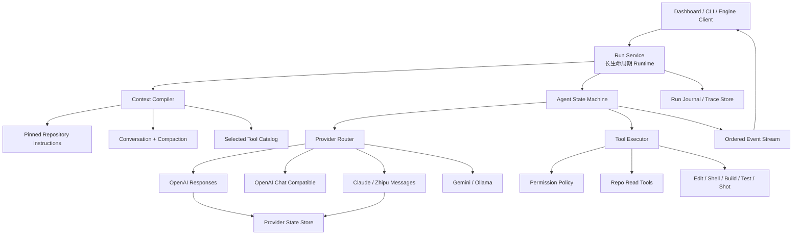
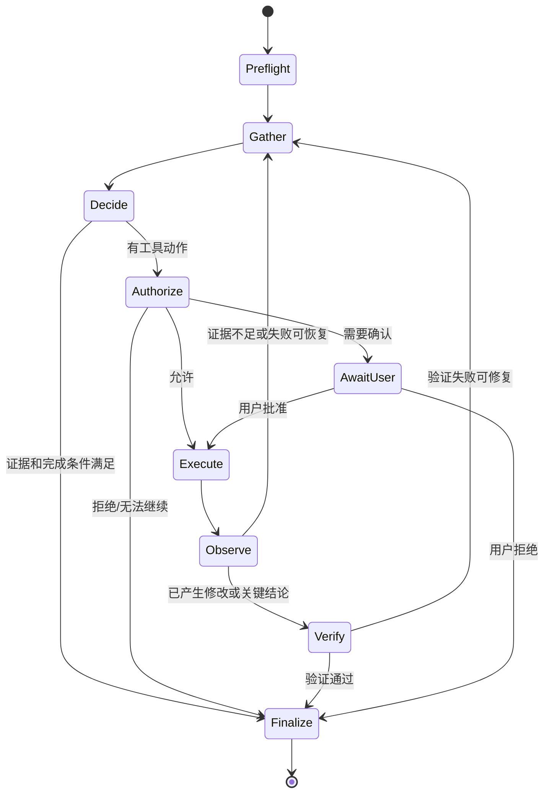

# gnb Chat Agent 质量目标架构

> **方向更新（2026-07-15）：** gnb Dashboard 不再向 Coding Agent 演进。本文保留为历史分析，当前目标架构见 [NextAI 面向具体产品能力的目标架构](nextai-product-focused-architecture.md)，执行顺序见 [轻量化重构计划](../plans/nextai-product-focused-refactor-plan.md)。

> 目标：在保留 gnb 统一 AI 控制面的前提下，把 Dashboard Chat 从“支持 tool call 的仓库问答”演进为可验证、可恢复、安全的 coding agent。
>
> 输入：[交互质量架构审计](../notes/gnb-chat-agent-quality-audit.md) · [AI / Agent 统一控制面计划](../plans/gnb-ai-agent-unification-refactor-plan.md)
>
> 落地顺序：[开发计划](../plans/gnb-chat-agent-quality-roadmap.md)

## 1. 设计决策

### 1.1 不再把所有 Provider 压成 Chat Completions 最小公分母

统一控制面不等于统一丢失能力。Agent 核心应统一“语义”，adapter 应保留 provider 原生的：

- content/tool/reasoning item；
- continuation / response id；
- thinking signature 或需要原样带回的 block；
- prompt cache、cached token 和 reasoning token；
- finish reason 与截断原因；
- provider 特有但可安全保存的恢复状态。

对上层统一的是 typed turn、事件、工具契约和状态引用，而不是强迫所有 provider 都变成 `role + content`。

### 1.2 Chat-compatible 与原生 Agent API 双轨并存

- `openai-chat-compatible`：兼容第三方 `/v1/chat/completions` 和本地 llama-server。
- `openai-responses`：面向真正支持 Responses API 的 endpoint。
- `claude-messages` / `claude-compatible`：保留原生 content blocks 和工具轮次状态。
- Gemini/Ollama：各自实现无损的 native tool history；不支持的能力明确标记 unsupported。

Router 按 profile 和经过验证的 capability 选 adapter，不能仅凭 endpoint 长相猜测能力。

### 1.3 隐藏推理状态可以延续，但不能泄漏

部分 provider 要求客户端在工具轮次中原样带回 reasoning block。该状态应由 provider adapter 的 state store 管理：

- Agent 核心只持有不透明 `ContinuationRef`；
- raw reasoning 不进入 Dashboard、普通日志、bridge transcript 或工具结果；
- 默认仅在 run 生命周期内存活；
- 若未来支持跨进程恢复，必须使用受限、加密的 provider-state 存储并有 retention policy；
- UI 只展示 provider 允许公开的 reasoning summary 或 agent 自己的简短进度说明。

这既保留模型连续性，也延续 [Agent Protocol v1](../plans/gnb-agent-protocol-v1.md) 对 reasoning 原文不进入 transcript 的安全边界。

### 1.4 质量由确定性系统兜底

模型负责决策，harness 负责：

- 完整传递状态；
- 可靠执行工具；
- 检测截断和错误；
- 在修改后强制验证；
- 执行权限策略；
- 管理 context 和预算；
- 记录可复现 trace；
- 依据明确完成条件结束。

不把安全、完整性和验证寄托在 prompt 自觉上。

## 2. 总体架构



### 层级职责

| 层 | 只负责 | 不负责 |
| --- | --- | --- |
| Provider adapter | 请求/响应映射、原生 continuation、流事件、错误归一化 | 任务是否完成、权限、工具执行 |
| Router | profile 解析、capability 匹配、明确 fallback | 修改请求语义、静默换隐私边界 |
| Context compiler | 指令、历史、工具、预算、compaction 组装 | 决定业务动作 |
| Agent state machine | 多步决策、工具循环、验证与完成条件 | provider JSON 细节 |
| Tool executor | schema 校验、权限、并发、超时、结构化结果 | 让模型直接绕过策略 |
| Run service | 生命周期、取消、事件序列、持久 trace | 模型策略本身 |
| Workflow | SCAD、commit 等确定性编排 | 替代开放式 Chat Agent |

## 3. Protocol v2：Typed Turn + Opaque Continuation

以下是语义草图，不要求字段名原样实现：

```go
type ModelRequest struct {
    Instructions     []ContentBlock
    Items            []TurnItem
    Tools            []ToolDefinition
    ToolPolicy       ToolPolicy
    Reasoning        ReasoningPolicy
    ResponseContract ResponseContract
    Continuation     *ContinuationRef
    Budget           TokenBudget
}

type ModelTurn struct {
    Blocks       []OutputBlock
    ToolCalls    []ToolCall
    Continuation *ContinuationRef
    Finish       FinishStatus
    Usage        Usage
    ProviderMeta SafeProviderMeta
}

type StreamEvent struct {
    RunID    string
    Sequence uint64
    Step     int
    Phase    EventPhase
    Type     EventType
    CallID   string
    Delta    string
}
```

### 3.1 `TurnItem`

至少支持：

- pinned instruction；
- user/assistant visible message；
- assistant tool call；
- tool result；
- public reasoning summary；
- compaction item；
- provider state reference。

不能再把 assistant tool call 和 tool result 当成普通文本，也不能按消息条数切断一个原子 tool exchange。

### 3.2 `FinishStatus`

采用稳定类别：

- `completed`
- `tool_calls`
- `max_output_tokens`
- `context_limit`
- `safety_stop`
- `cancelled`
- `provider_error`
- `budget_exceeded`
- `unknown`

保留脱敏后的 provider 原始 reason 供诊断。Dashboard 不得再固定写成 stop。

### 3.3 `Usage`

至少记录：

- input tokens；
- output tokens；
- cached input tokens；
- reasoning tokens；
- tool schema tokens（能估算时）；
- provider/model；
- step 累计和 run 累计。

缺失值必须是 unknown，而不是 0。

### 3.4 `ContinuationRef`

这是 Agent 与 provider adapter 的能力防火墙：

- OpenAI Responses 可引用 response/conversation state；
- Claude/Zhipu 可引用由 adapter 保存的 content/reasoning blocks；
- Chat-compatible endpoint 没有原生 state 时，由 adapter 明确声明 `stateless`，使用完整 typed history 重建；
- continuation 与 provider、model、session 绑定，禁止跨 provider 误用；
- fallback 换 provider 时必须丢弃不兼容 continuation，并重新编译可见/工具历史，同时向 trace 记录降级。

## 4. Provider 能力契约

### 4.1 Capability 不再使用乐观布尔值

每项能力采用三态：

- `native`：adapter 与 endpoint 原生支持并通过 conformance；
- `emulated`：gnb 可以模拟，但有明确语义损失；
- `unsupported`：请求时拒绝或由 profile 显式降级。

同时记录：

- adapter version；
- endpoint probe 结果和时间；
- 支持的参数取值；
- 是否支持 streaming tool arguments；
- 是否支持 parallel tools；
- 是否支持 strict schema；
- 是否支持 native continuation/compaction；
- 是否允许 preserved reasoning。

### 4.2 建议的初始矩阵

| Adapter | 原生状态 | Strict tools | 并行工具 | Reasoning 控制 | Compaction |
| --- | --- | --- | --- | --- | --- |
| OpenAI Responses | native | native | native | native | native/adapter |
| OpenAI Chat compatible | stateless/emulated | probe | probe | probe | gnb |
| Claude Messages | native block state | native/probe | native/probe | native | gnb/provider |
| Zhipu Claude-compatible | native block state | 以实测为准 | 以实测为准 | native/probe | gnb |
| Gemini | native history | probe | probe | provider-specific | gnb |
| Ollama Chat | stateless/emulated | model-specific | model-specific | model-specific | gnb |

“以实测为准”不是留白：开发计划要求提供固定 fixture 与可选 live conformance smoke，探测结果进入诊断页。

### 4.3 Adapter 输出规范

每个 adapter 必须：

1. 无损映射 assistant tool call 与 tool result；
2. 增量发出 text/tool/reasoning-summary/usage 事件；
3. 不向 UI 暴露 raw hidden reasoning；
4. 返回真实 finish status；
5. 对 4xx/5xx、限流、超时、断流给出稳定错误分类；
6. 仅声明测试覆盖的 capability；
7. 能用录制 fixture 重放多轮工具链；
8. 对 endpoint 差异提供明确配置，而不是按失败结果猜协议。

## 5. Context Compiler

### 5.1 分层输入

每个请求按稳定顺序编译：

1. **Safety / product policy**：权限、数据边界、不可绕过规则；
2. **Repository instructions**：完整且 pinned 的 AGENTS.md，作为稳定缓存前缀；
3. **Agent mode contract**：Ask / Research / Code 的目标、完成条件、工具规范；
4. **Workspace snapshot**：cwd、分支、dirty files、平台、日期等短信息；
5. **Conversation memory**：最近原子 turns + 旧历史 compaction；
6. **Current task evidence**：当前用户请求和仍有效的工具证据；
7. **Selected tools**：只加载本轮需要的 tool sets；其余 deferred；
8. **Output reserve**：先为模型输出和至少一个恢复轮次留预算。

AGENTS.md 不能在 compaction 时被普通摘要替代。可以利用 prompt caching，但缓存不能改变语义。

### 5.2 预算模型

预算不能继续只按可见字符估算。至少需要：

```text
context limit
- pinned instructions
- conversation/compaction
- provider continuation
- selected tool schemas
- current tool results
- required output reserve
= remaining evidence budget
```

当超预算时依次：

1. 外置并摘要已完成步骤的大型 tool output；
2. 删除可由文件位置重新读取的旧证据正文，保留引用和 digest；
3. 压缩已闭合的原子 turns；
4. deferred 不相关 tools；
5. 若仍不足，向用户报告 context limit，而不是静默截断 pinned rules。

### 5.3 Compaction 输出

Compaction 应生成结构化 memory：

- 用户目标与约束；
- 已确认事实及来源；
- 已执行动作和结果；
- 当前工作树/权限状态；
- 未解决问题；
- 下一步；
- provider continuation 是否仍有效。

摘要本身写入 trace，并可由测试验证关键事实未丢失。

## 6. Tool Contract v2

### 6.1 工具定义

每个工具至少包含：

- 稳定 name/version；
- 3–4 句高信息 description；
- 何时使用 / 不应何时使用；
- 严格 JSON schema：required、类型、范围、`additionalProperties: false`；
- input examples；
- read-only / mutating / external side effect；
- idempotency；
- timeout、最大结果和并发类别；
- 所属 tool set；
- 权限级别；
- 结果 schema。

### 6.2 工具结果

```json
{
  "ok": true,
  "data": {},
  "meta": {
    "truncated": false,
    "nextCursor": null,
    "source": "src/Engine/...",
    "lineStart": 120,
    "lineEnd": 220,
    "exitCode": 0,
    "durationMs": 18,
    "digest": "..."
  },
  "error": null
}
```

失败时使用稳定的 `error.category`、message、retryable 和 outcomeUnknown。展示给模型的文本可以紧凑，但底层事件必须保留结构。

### 6.3 Repo 读取工具

第一版必须修正为：

- `find_files(pattern, cursor, limit)`：先过滤再分页，不能预截断候选集；
- `read_file(path, lineStart, lineCount)`：返回行范围、总行数、next cursor；
- `search_text(query, paths, glob, cursor, limit, contextLines)`；
- `list_dir(path, cursor, limit, depth)`；
- `find_symbol` 返回定义位置、kind 和候选歧义；
- `git_log/git_show` 返回结构化 commit/file 元数据；
- `run_cmd` 若保留在只读模式，必须使用 allowlist 或命令分类，不能靠名称假定只读。

结果应优先返回位置、摘要和继续读取方法，而不是塞入 24K 无边界字符串。

### 6.4 Tool selection

`profile.tool_sets` 必须成为硬约束：

- Ask：默认不加载 repo tools，必要时显式升级；
- Research：repo-read、git-read；
- Code：repo-read、repo-write、build-test；高风险工具仍需批准；
- Workflow：只加载该工作流允许的工具。

工具较多时使用 deferred loading/tool search，减少 schema token 和错误选工具概率。

### 6.5 并行和去重

- 多个独立 read-only call 可有界并行；
- mutating call 串行；
- 同一 call id 幂等去重；
- 相同参数的重复只读调用可在同一 run 内缓存；
- tool result 必须按 call id 回填，不能只按 step；
- outcome unknown 的修改型调用禁止自动重放。

## 7. Agent 状态机



### 7.1 Preflight

- 解析 profile/mode；
- 固定 provider/model/endpoint，不允许不透明切换；
- 计算 context/step/tool/time budget；
- 选择 tool sets；
- 建立 run id、cancel handle、trace；
- 检查 continuation 是否与 provider/model 兼容。

### 7.2 Gather / Decide

Agent prompt 明确要求：

- 仓库事实应先取证；
- 工具返回 truncated 时必须继续或明确披露；
- 不得把“没搜到”当作“不存在”，除非搜索覆盖可证明；
- 引用文件与行范围；
- 只有满足 completion contract 才输出 final。

Harness 同时执行机械检查，例如最终回答声称读取完整文件但 trace 中仍有未消费 next cursor 时，触发一次 grounding/verification turn。

### 7.3 Execute / Observe

- 工具参数先做 schema 校验；
- 权限策略在模型之外执行；
- 事件实时发送；
- 错误按 category 决定是否重试、改用其他只读工具或交给模型；
- 结果过大时进入 artifact store，只把摘要、引用和 cursor 回给模型；
- failed call 也计入 tool budget，避免无限错误循环。

### 7.4 Verify

Code 模式按改动面生成验证计划：

- 纯文档：链接、格式、git diff；
- gnb/tools：Go targeted tests/build；
- 单个 program：对应 target；
- Engine：`gkNextRenderer + gkNextUnitTests`；
- 渲染：按 AGENTS.md 使用 `gnb shot`；
- 用户明确要求或广泛 ABI 改动才全量构建。

验证步骤由 harness 根据仓库规则和 tool metadata 约束，模型可以提出补充，但不能把“我认为正确”当作通过。

### 7.5 Finalize

Final 事件必须包含：

- outcome：completed / partial / blocked / cancelled / failed；
- 真实 finish reason；
- 已做事项摘要；
- 关键证据引用；
- 修改文件；
- 验证结果；
- 未解决风险；
- usage 与 trace id。

UI 可以简化展示，但数据必须存在。

## 8. 交互事件与 Dashboard

### 8.1 真流式事件

事件按 run 内单调 sequence 发送：

- `run.started`
- `model.commentary.delta`
- `model.final.delta`
- `reasoning.summary.delta`
- `tool.call.started`
- `tool.call.arguments.delta`
- `tool.call.completed`
- `tool.call.failed`
- `permission.requested`
- `compaction.completed`
- `usage.updated`
- `run.completed`

Agent 不再等待 provider 完成后批量回放。若 provider 无法区分 commentary/final，adapter 标记为 unknown phase，UI 不把未确认内容拼入最终答案。

### 8.2 用户控制

Dashboard 至少提供：

- Stop：取消 provider 和正在执行的可取消工具；
- Steer：在安全边界向当前 run 追加用户指令；
- 权限确认：显示命令、目标文件和风险；
- tool detail：按 call id 展示参数、结果摘要、耗时、截断和重试；
- context/usage：显示真实 provider limit 与预算；
- trace 恢复：刷新后仍可查看步骤；
- partial/blocked 状态：不能伪装成 completed。

### 8.3 Runtime 生命周期

Dashboard server 持有长生命周期 Runtime：

- provider clients、router、tool registry 可复用；
- run 独立并可取消；
- session 与 run journal 通过 id 关联；
- 配置更新使用原子 snapshot 或显式 reload；
- shutdown 时优雅取消并 flush journal。

不能再为每个 HTTP 请求重建整套 Runtime。

## 9. 会话、Trace 与存储

### 9.1 三类数据分开

| 数据 | 用途 | 默认保留 |
| --- | --- | --- |
| Visible transcript | 用户可见对话 | 随 session |
| Run trace | 调试、评测、恢复 | 可配置、脱敏 |
| Provider state | 原生 continuation/reasoning blocks | run 内；跨 run 需加密和显式策略 |

工具大结果进入 artifact/blob store，trace 只存摘要、digest 和引用，避免会话数据库无限膨胀。

### 9.2 Trace 最小字段

- run/session/profile/provider/model；
- prompt/context 各层 token 或估算；
- 每个 step 的开始/结束时间；
- stream events；
- tool call/result metadata；
- permission decision；
- compaction 前后摘要；
- usage 和 finish；
- final outcome；
- error chain；
- 代码改动与验证结果。

API key、Authorization header、raw hidden reasoning 和未脱敏 provider payload 不得进入普通 trace。

## 10. 权限与 Coding 模式

### 10.1 三种模式

| 模式 | 默认能力 | 典型用途 |
| --- | --- | --- |
| Ask | 无工具或最少只读 | 普通知识问答 |
| Research | repo/git 只读 | 代码分析、定位、报告 |
| Code | 读写 + 受控命令 + 验证 | 实施修改 |

模式是权限上限，不是 prompt 标签。

### 10.2 策略顺序

`deny > ask > allow`，按：

- tool；
- 参数/路径；
- 命令前缀；
- 工作区边界；
- side-effect 类别；
- profile/user policy

进行匹配。只读工具可默认 allow；写文件、shell、外部网络、git push 等分别定义策略。用户批准的范围要精确，不能把一次批准扩大成永久任意 shell。

### 10.3 Checkpoint

Code run 开始时记录：

- 初始 git status 和文件 digest；
- 哪些 dirty changes 属于用户；
- agent 修改的 patch 集；
- 每次关键写入后的 checkpoint。

撤销只能回退 agent 自己的变更，不能覆盖用户已有修改。修改型工具的未知结果必须停止自动执行并请求检查。

## 11. Eval 与质量门

### 11.1 三层测试

1. **协议单测**：typed items、stream、finish、usage、continuation；
2. **adapter conformance**：录制 fixture + 可选 live endpoint smoke；
3. **行为 eval**：固定仓库任务、trace grading、修改与验证。

### 11.2 关键指标

- grounded answer rate；
- unsupported claim rate；
- tool coverage / truncation recovery；
- native continuation preservation；
- task completion；
- build/test pass after edit；
- permission violation = 0；
- time-to-first-token / tool；
- context compaction fact retention；
- token/cost；
- 人工盲评偏好。

### 11.3 对比方法

“同模型同 endpoint”比较必须固定：

- 用户任务；
- 仓库 commit/dirty snapshot；
- 模型参数；
- 可用工具能力；
- 最大步数和时间；
- 是否允许写入；
- 评审 rubric。

工具能力不一致时，报告应拆成“模型决策质量”和“harness 完成能力”，不能把缺少 edit/test 工具误判为模型差。

## 12. 与现有实现的兼容迁移

1. Protocol v1 保持可用，新增 v2 内部模型并提供 v1 bridge projection；
2. 先让旧 adapter 实现 v2 的 stateless/emulated 路径；
3. 修复工具与真流式，不等待所有 provider 完成；
4. Claude/Zhipu 先接入 continuation state；
5. 新增 OpenAI Responses，不改现有 Chat-compatible profile；
6. Dashboard 改用 Run Service 和 journal；
7. 最后开放 Code 模式；
8. 每一阶段都由行为 eval 守住基线。

## 13. 非目标

首轮不追求：

- 复刻 Claude Code/Codex 的私有 prompt 或未公开内部实现；
- 同时实现多 agent 编排；
- 默认允许任意 shell、网络或 git 写操作；
- 把 SCAD/commit 等确定性 workflow 强行改成开放式 Agent；
- 在 UI 展示 raw chain-of-thought；
- 以更换模型掩盖工具和协议缺陷。

## 14. 架构验收标准

达到以下条件，才可称为“高质量 Research Agent”：

1. Zhipu/Claude 多轮工具调用能保留官方要求的原生状态；
2. OpenAI Responses 与 Chat-compatible 路径并存且能力不谎报；
3. 所有读取工具可分页，任何截断都显式可见；
4. UI 在 provider 生成时收到真实增量事件；
5. profile/thinking/tool sets/budget 全链路生效；
6. 长会话 compaction 后不丢 repository instructions 和关键事实；
7. 每次回答可追溯到 run trace 与文件证据；
8. 固定 Research eval 显著优于当前基线。

达到以下附加条件，才可称为“Coding Agent”：

1. Code 模式具有 edit/shell/build/test/diff/shot 等受控能力；
2. 权限与 checkpoint 由 harness 强制；
3. 修改后按仓库规则执行确定性验证；
4. outcome unknown 不会自动重放；
5. 固定修改任务的越权率为 0，build/test 通过率达到约定门槛。
