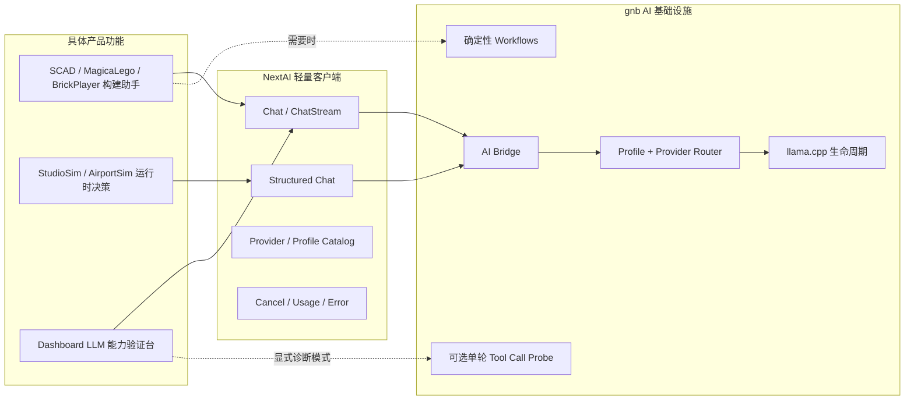

# NextAI 面向具体产品能力的目标架构

> 本文定义 NextAI 的长期方向、产品边界和公共模块职责。具体迁移顺序见 [NextAI 面向具体产品能力的轻量化重构计划](../plans/nextai-product-focused-refactor-plan.md)。
>
> 本文取代“把 NextEngine 发展为通用自主 Agent / Coding Agent”的方向，但保留统一 provider、profile、本地模型生命周期和 Engine/gnb bridge 已经产生的价值。

## 0. 架构决策

NextEngine 的 AI 能力收敛为三类：

1. **场景构建助手**：ScadStudio、MagicaLego，以及未来的 BrickPlayer 构建辅助。模型生成明确的领域产物，代码负责解析、校验、修复、预览和应用。
2. **运行时 AI 推理**：StudioSim、AirportSim 等游戏根据只读状态快照请求一次结构化决策，游戏代码负责合法性校验和确定性 fallback。
3. **LLM 能力验证台**：Dashboard Chat 快速检查 provider、模型、流式输出、reasoning、JSON 输出和基础 Tool Call，不承担仓库研究或代码修改职责。

核心约束：

- 删除 gkNextEditor 的通用 AI 场景操作 Agent；
- Dashboard 默认走普通 Chat，不进入开放式 Agent Loop；
- 删除 repo/Git/Shell 工具集和远程 Editor tools；
- Dashboard 如需验证 Tool Call，只提供一个内存诊断工具和一次结果回填；
- ScadStudio、MagicaLego、BrickPlayer、StudioSim、AirportSim 不使用 Tool Call；
- 多步行为由业务代码明确编排，模型不能自行选择、跳转或无限重试步骤；
- `NextAI` 是轻量 LLM 接入模块，不是 Agent SDK；
- `gnb` 继续统一拥有 provider、profile、凭据、模型路由和本地 llama.cpp 生命周期。

## 1. 需求判断

### 1.1 当前使用方需要什么

| 使用方 | 实际需求 | 合适抽象 | Tool Call |
| --- | --- | --- | --- |
| ScadStudio | 根据描述生成或修改完整 SCAD 工程 | 领域生成 workflow | 不需要 |
| MagicaLego | 根据描述和当前搭建摘要生成 `mlscript` | 领域生成 workflow | 不需要 |
| BrickPlayer | 未来根据零件与连接约束生成搭建方案 | 领域生成 workflow | 不需要 |
| StudioSim | 生成目标、任务、对白、决策和总结 | 结构化单次推理 | 不需要 |
| AirportSim | 为选中的 NPC 生成一次行动决策 | 结构化单次推理 | 不需要 |
| Dashboard Chat | 快速验证模型和 provider 能力 | Chat + 可选能力探针 | 仅诊断 |
| gkNextEditor AI Panel | 自主查询并修改任意场景内容 | 通用 Editor Agent | 删除 |

ScadStudio 当前直接构造专业 prompt，并通过 `ChatStream` 获取完整产物，见 [`ScadAIService.cpp`](../../src/Application/Editor/ScadStudio/ScadAIService.cpp#L301)。MagicaLego 生成完整脚本后再抽取执行，见 [`MagicaLegoAIService.cpp`](../../src/Application/Game/MagicaLego/MagicaLegoAIService.cpp#L533)。StudioSim 和 AirportSim 都是 `GenerateTextAsync` 后解析 JSON，见 [`GoalSystem.cpp`](../../src/Application/Game/StudioSim/GoalSystem.cpp#L224) 和 [`DecisionScheduler.cpp`](../../src/Application/Game/AirportSim/DecisionScheduler.cpp#L416)。

这些路径需要稳定输出契约、校验、超时、取消和 fallback，而不是让模型自行探索工具和改变外部状态。

### 1.2 为什么不继续扩建通用 Agent

通用 Editor Agent 和 Dashboard Repo Agent 会引入以下系统性成本：

- Tool schema、registry、执行上下文和多轮 transcript；
- Engine 到 gnb 的远程工具注册与反向执行；
- 主线程派发、超时、取消、幂等和结果不确定语义；
- 高风险动作确认、权限、审计和回滚；
- fallback tool-call 解析、grounding retry 和 Agent step UI；
- repo、Git、Shell、Scene 等持续扩张的安全边界。

这些复杂度只有在目标是“自主研究并执行任意任务”时才合理。NextEngine 的产品目标是把 AI 用在具体功能中，而不是复制 Codex/Claude Code。

### 1.3 继续保留的基础设施

方向调整不恢复多套 provider 实现。以下能力继续保留：

- provider adapter 和字符串 provider ID；
- profile 驱动的 provider/model/temperature/token 配置；
- gnb 统一管理 API key 和本地 llama.cpp；
- Engine 通过长生命周期 bridge 使用 gnb；
- 普通/流式 Chat、会话、取消、usage、finish reason 和统一错误；
- 由代码驱动的 `workflow.run`，例如 SCAD 生成和 commit message；
- provider 对原生 Tool Call 协议的适配，仅供 Dashboard 诊断模式验证。

## 2. 术语和非目标

### 2.1 统一术语

| 名称 | 定义 | 示例 |
| --- | --- | --- |
| LLM Request | 一次普通或流式模型推理 | StudioSim 生成一次决策 |
| Structured Request | 带 JSON mode/schema 的一次模型推理 | AirportSim 行动对象 |
| Assistant | 面向用户的一项特定 AI 功能 | ScadStudio Build Assistant |
| Generator | 生成一个明确领域产物的组件 | `mlscript` generator |
| Workflow | 由代码决定步骤的有限流程 | 生成 → 校验 → 修复一次 |
| Tool Call Probe | Dashboard 中验证模型工具协议的诊断流程 | 固定 fixture 查询 |
| AI Agent | 模型自主决定多步工具调用的循环 | 公共层不提供 |
| AgentDriver | `gnb validate` 的确定性输入与断言系统 | 与 LLM 无关 |
| Game Agent | 游戏内 NPC/行为实体 | 与 LLM Tool Call 无关 |

只有真正由模型控制下一步和工具选择的系统才使用 `Agent` 一词。普通生成器、workflow 和 NPC 决策请求不命名为 Agent Loop。

### 2.2 明确非目标

- 不建设通用 Coding/Research Agent；
- 不允许 LLM 通过公共工具任意读取仓库或执行 Shell；
- 不保留通用 Editor 场景操作 Agent；
- 不要求所有业务 workflow 都搬进 gnb；
- 不把 SCAD、积木、机场决策抽象成一个万能 Agent 协议；
- 不因未来可能使用而提前给 BrickPlayer 接模型；
- 不删除或重构 `AgentDriver`、`gnb validate`、agentscript 或游戏 NPC `AgentSystem`；
- 不取消 provider 原生 Tool Call 适配能力，只限制其产品暴露面。

## 3. 目标架构



### 3.1 固定依赖规则

- 应用拥有自己的领域 DTO、prompt、解析器、校验器和 fallback。
- `NextAI` 不知道 SCAD、积木、机场 NPC、场景节点或 Editor 命令。
- gnb Router 不根据 prompt 猜 workflow，也不自动给普通请求附加工具。
- Workflow 步骤由代码固定，模型只完成其中的生成或修复步骤。
- 模型输出不能直接修改 Scene；必须先变成领域产物，通过校验并由用户或游戏逻辑显式应用。
- Dashboard 的诊断 Tool Call 不能访问文件系统、Git、Shell、Scene、网络或用户数据。

## 4. 产品驱动模式

### 4.1 场景构建助手

ScadStudio、MagicaLego 和未来的 BrickPlayer 共享流程语义，但不共享领域格式：

```text
用户意图 + 当前领域上下文
        ↓
一次生成请求
        ↓
解析为领域产物
        ↓
本地校验
   ┌────┴────┐
 成功       失败
  ↓          ↓
预览/应用   可选一次定向修复请求
             ↓
          再次校验
```

共同约束：

- 默认最多一次生成；只有解析或领域校验明确失败时，才允许一次修复请求；
- 修复 prompt 包含机器产生的精确错误，不让模型自行调用“验证工具”；
- 第二次仍失败就展示错误和原始输出，不继续自主循环；
- 结果先进入预览或 pending 状态，不直接改变场景；
- 每个助手单独维护 prompt 版本和回归样例，不建立全局 prompt/tool registry。

#### ScadStudio

目标 workflow 是 `GenerateScadProject`：输入当前工程、编辑范围和用户指令，返回完整 `scad-project` 或单文件 `scad`，随后校验路径、工程结构和 SCADLoader 语法。失败时最多进行一次带 parser/evaluator 错误的修复，成功后更新预览。

不注册 `read_file`、`write_file`、`compile_scad` 工具。当前工程由调用方提供，编译和校验由 workflow 固定执行。

#### MagicaLego

目标 workflow 是 `GenerateLegoScript`：输入用户意图、颜色/砖块规则和按需裁剪的搭建摘要，输出完整 `mlscript`，再使用现有 parser 和 placement rules 校验。失败时最多修复一次，成功后由用户预览或应用。

不向模型开放逐块 `place/move/delete` Tool Call。批量脚本是更稳定、可审计、可撤销的领域接口。

#### BrickPlayer

BrickPlayer 当前没有 NextAI 接入。本轮只要求在未来功能开始前先定义最小领域产物，优先考虑受 JSON schema 约束的 `BrickBuildPlan`，或可被现有 LDraw/连接约束校验器解析的 `.ldr` 片段。

领域契约必须覆盖零件 ID、颜色、位姿、连接关系和库存约束；本地代码负责零件存在性、连接合法性、碰撞/吸附和库存校验。契约完成前不接模型，也不开放工具循环。

### 4.2 StudioSim / AirportSim

运行时 AI 使用统一模式：

```text
只读状态快照 → JSON schema 请求 → 解析/校验/钳制 → 主线程应用
                                      ↓失败
                               确定性本地 fallback
```

公共层补强 structured output，而不是 Tool Call：

- `FChatRequest` 支持可选 JSON mode / JSON schema；
- gnb adapter 翻译为各 provider 支持的结构化输出参数；
- 不支持 schema 的 provider 明确降级为 JSON prompt；
- 返回 finish reason、usage 和能力降级信息；
- 每个请求具备 deadline、generation ID 和取消能力；
- 迟到结果不能写入新一代游戏状态。

每个游戏拥有自己的 DTO 和 validator。LLM 只返回建议数据，不持有 Scene/ECS 引用；worker 线程只解析并入队，主线程应用；action/target 必须通过本地 allowlist，数值钳制、字符串限长。任何失败立即进入 deterministic fallback。`--agent-validation` 继续禁用真实 LLM。

### 4.3 Dashboard LLM Capability Lab

Dashboard 用于快速判断：

- provider 和模型是否可用；
- streaming、reasoning、JSON mode/schema 是否生效；
- token usage、finish reason、延迟和错误分类是否正确；
- provider 声称支持 Tool Call 时，基础协议能否完成一次往返。

默认 Chat 模式直接调用 `Router.Chat`，请求不带 tools，不运行 `RunAgent`，不做 grounding retry、fallback tool JSON 解析或自动续步。

显式 `Tool Call Smoke` 模式只提供：

```text
lookup_diagnostic_fixture(key)
```

约束：

- fixture 是进程内固定 map，例如 `alpha → A-17`、`beta → B-42`；
- 第一次响应最多接受一个该工具调用；
- 执行后只允许再调用模型一次生成最终回答；
- 第二次仍请求工具时诊断失败；
- 不做工具名猜测、JSON fence fallback、grounding retry 或递归循环；
- UI 展示规范化 tool name、arguments、result、finish reason 和两次请求用量。

这足以验证 schema、参数、tool result 回填和最终回答，不需要 repo、Git、Shell 或 Scene 工具。

### 4.4 gkNextEditor

删除 AI Assistant 自主查询和修改场景的整条路径，包括 Editor remote tools、Agent steps、AI pending actions 和 `agent.run`。

`FEditorScriptExecutor` 承载的手工 EditorScript/JavaScript 控制台不依赖模型，默认保留并迁为独立的 `Automation` 或 `Script Console` 面板。用户显式输入脚本，高风险动作由编辑器自身确认；该面板不连接 provider，也不展示 Agent 状态。

若产品决定手工脚本也无价值，应在独立变更中删除，不能把它与 Agent 清理隐式绑定。

## 5. 公共模块边界

### 5.1 `src/Modules/NextAI`

保留：

- `FAIService`，或后续更准确的 `FLLMService` facade；
- `Chat`、`ChatStream`、`GenerateTextAsync`；
- structured output 请求字段；
- provider/profile/model catalog；
- session、cancel、usage、finish reason 和统一错误；
- 启停 gnb bridge 的薄客户端。

移除：

- `IAITool` 和 `FToolRegistry`；
- Engine remote tool descriptor/handler；
- `RunAgent` client API；
- C++ Tool role、tool schema 和 tool calls DTO（确认无非 Editor 使用方后）；
- `SupportsTools()` 等对 Engine 应用没有实际用途的接口。

`GnbAgentClient` 最终重命名为 `GnbAIClient`。行为删除和机械改名分开完成。

### 5.2 `tools/gnb/internal/ai`

目标职责：

```text
internal/ai/
├── protocol/       # Chat、stream、structured output、usage、errors
├── config/         # provider/profile/secrets
├── provider/       # provider adapters
├── router/         # profile/provider/model 选择
├── session/        # Dashboard/Engine 会话与取消
├── workflow/       # 代码驱动的领域 workflow
└── bridge/         # Engine RPC
```

通用 `agent/`、`tool/`、`repotools/` 不属于目标架构。Dashboard Tool Call Smoke 使用局部固定实现，不能演变为第二个通用 registry。

Go provider protocol 可以保留 `ToolDescriptor`/`ToolCall`，用于 provider conformance 和 Dashboard 诊断；它们不进入 NextEngine 应用抽象。

### 5.3 Bridge 与 CLI

目标 CLI：

```text
gnb ai doctor
gnb ai bridge --stdio
gnb llm chat ...
```

迁移期可给 `gnb agent doctor/bridge` 保留一个版本的隐藏兼容别名；`gnb agent run` 删除。

目标 RPC：

- `initialize`
- `providers.list`
- `profiles.list`
- `session.create/reset/close`
- `llm.chat`
- `workflow.run`
- `run.cancel`
- `shutdown`

不再包含 `agent.run`、`tools.register` 或反向 `tool.execute`。

### 5.4 配置

保留业务 profile：`general`、`scad-scene`、`scad-studio`、`magicalego-script`、`simulation`；`brickplayer-build` 只在功能实际接入时增加。

移除通用 Agent 配置：

- `tool_sets`
- `max_steps`
- `max_tool_calls`
- `editor` Agent profile
- grounding retry / tool timeout

业务 workflow 使用业务名称描述限制，例如 `max_repair_attempts = 1`、`request_timeout_seconds` 和 `max_concurrency`。Dashboard Probe 的限制固定在诊断实现中，不进入全局 profile。

## 6. 重新引入 Tool Call 的门槛

未来某项具体功能只有同时满足以下条件，才可重新评估 Tool Call：

1. 输入上下文无法在一次请求中合理提供；
2. 步骤不能由代码根据校验结果确定；
3. 模型必须根据中间观察自行选择下一步；
4. 相比固定 workflow，有可量化的成功率或体验收益；
5. 工具集合是该产品私有、最小且有明确 side-effect policy；
6. 已有失败、取消、超时、幂等和回滚测试。

即使满足，也优先实现产品内的有限 Agent：

- 默认不超过三个工具；
- 不自动获得 repo/Git/Shell/Scene 权限；
- 不进入 `NextAI` 全局 registry；
- 不让 Dashboard 自动继承；
- 不以“以后可能有用”为由抽成通用框架。

## 7. 架构验收标准

- gkNextEditor 不存在 LLM 驱动的场景操作 Agent；
- Dashboard 默认 Chat 不包含 tools，也不进入多步 Agent Loop；
- Dashboard 只有一个固定内存 Tool Call Probe；
- `NextAI` 不包含 Tool Registry 或通用 Agent API；
- 场景构建助手输出领域产物并经过本地校验；
- StudioSim/AirportSim 使用结构化单次推理和确定性 fallback；
- provider/profile/streaming/session/cancel/usage 等统一基础设施继续可用；
- AgentDriver、`gnb validate` 和游戏 NPC Agent 不受影响。

目标不是减少 AI 功能，而是让每项 AI 功能都直接对应一个产品需求、有限输出契约和可验证的失败处理路径。
