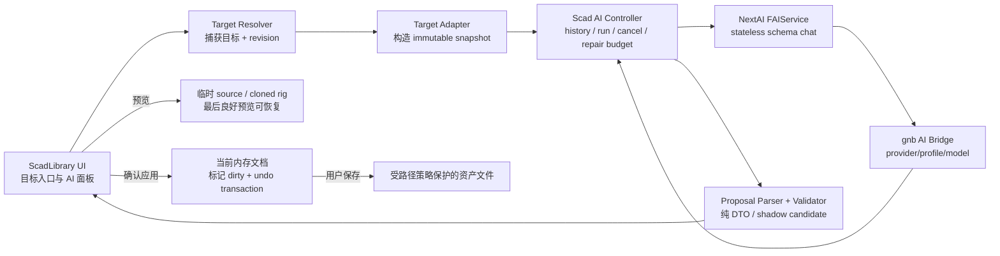

# ScadLibrary AI 融合创作架构

## 1. 结论

ScadLibrary 应成为 SCAD 资产的统一作者工具，ScadStudio 的自然语言创作能力迁入
ScadLibrary；但迁移的核心不是把 ScadStudio 的三栏 UI 和“整文件自动替换”原样搬过来，
而是建立一套**面向当前编辑目标、产出候选变更、经本地验证后由用户确认应用**的 AI
创作层。

首批必须覆盖四类目标：

1. 选中的单个 Kit module；
2. 当前 SCAD 场景，包括自由源码场景和 ScadLibrary 对象化场景；
3. 当前过程场景中的 Terrain feature 与 `ter_*` rule；
4. 角色动作编辑器中的现有 clip 调整与新 clip 添加。

融合后统一遵守以下原则：

- 磁盘 SCAD、`FBenchItem`、`FTerrainProcessDocument`、`FCharacterWorkbench::Clips()` 仍是各自
  领域的事实来源，聊天记录不是事实来源。
- 模型只返回产品定义的 artifact；不获得 repo、shell、Scene、文件系统或通用 Tool Registry。
- AI 结果先成为 proposal，不能在 worker thread 中写文件、改 Scene、改 ImGui 或改活跃文档。
- proposal 必须经过目标身份、基线 revision、严格 JSON、领域约束和真实 SCAD/Rig 校验。
- “预览”“应用到未保存文档”“保存到磁盘”是三个独立动作；模型成功返回不等于自动应用。
- 每次请求最多只有**一轮**自动修复，修复预算由统一 controller 管理，不能在 service 和 UI
  两层叠加。
- ScadStudio 在功能和会话迁移完成前继续保留；达到退役门槛后再移除，不能先删后补。

本设计服从 [NextAI 产品化边界](nextai-product-focused-architecture.md) 与
[gnb AI Bridge v2](gnb-ai-bridge-protocol-v2.md)。

## 2. 目标与非目标

### 2.1 目标

- 在 ScadLibrary 的当前工作上下文中用自然语言创建、调整、预览和确认 SCAD 资产变更。
- 多轮对话始终注入当前最新 snapshot，支持“再高一点”“把刚才的河再拓宽”等连续修改。
- 对不同编辑器使用不同的结构化变更协议，而不是让模型猜测如何改内部状态。
- AI 离线、取消、超时、输出损坏或目标已变化时，所有手工编辑功能仍完整可用。
- 保留最后一个可用预览；失败候选不能污染当前文档或磁盘文件。
- 为后续角色合成、装备和 Scene Spec 编辑保留同一 adapter 扩展点。

### 2.2 非目标

- 不恢复已经删除的通用 Agent Loop、repo/Git/Shell 工具或任意 Scene 写入。
- 不让 NextAI 理解 SCAD、Kit、Terrain、Rig 或 ScadLibrary UI。
- 不在首版中让模型同时修改多个 Kit 文件或重命名公开 module。
- 不自动编辑 `assets/scad/source/generated/*.scad 或 assets/scad/proc/generated/*.scad` 的生成结果；首版只能另存为人工场景副本。
- 不以 parser 成功代替 evaluator、Manifold、Rig loader 和可视预览成功。
- 不承诺让 AI 自动判断审美是否正确；用户仍通过 candidate preview 作最终判断。

角色合成 `FCharacterDesigner` 的自然语言选件/配色很适合复用本架构，但不属于本次四项
首批交付的退出条件，见 §12.2。

## 3. 当前基础与迁移取舍

| 现有能力 | 位置 | 融合后的处理 |
| --- | --- | --- |
| ScadStudio provider/model、stream、异步 handoff | `src/Application/Editor/ScadStudio/ScadAIService.*` | 提炼请求生命周期和 UI 经验；不继续使用“永远返回完整项目并自动替换”的单一协议 |
| ScadStudio source 注入、focused module scope | `ScadPromptContext.*` | 保留“每轮注入最新 snapshot、history 不重复携带源码”的原则，改为 target adapter 生成上下文 |
| ScadStudio lexer/parser outline | `ScadOutline.*` | 抽出通用 source validation/source index 到 ScadLoader 或共享作者层；Studio 临时调用兼容包装 |
| ScadStudio session store | `ScadSessionStore.*` | 只用于迁移旧会话；ScadLibrary 不把 session workspace 当资产事实来源 |
| Kit 浏览与 module preview | `ScadLibrary/KitCatalog.*`、`PreviewModule()` | 增加单 module draft、依赖上下文、候选 preview、影响面和 catalog 同步 |
| 场景对象/源码编辑 | `FBenchItem`、`assemblySource_`、`BuildBenchSource()` | 分别使用 typed scene operations 和受控 source replacement |
| Terrain 过程文档 | `FTerrainProcessDocument` | 直接作为 typed operations 的 clone/apply 目标，继续只重写已识别 span |
| Rig 动作工作台 | `FCharacterWorkbench` | 直接编辑 typed clip DTO；补齐新增 clip 的内存预览能力 |
| NextAI structured output | `FChatRequest::responseFormat` | 每个 adapter 使用独立 JSON Schema；本地仍做严格解析和语义校验 |
| Bridge session/cancel | Bridge v2 | 请求设为 `stateless=true`，对话由产品维护；补齐 C++ facade 的显式 run id/cancel |

不能直接复用 ScadStudio 当前 conversation 行为：Bridge 在非 stateless 模式会自行累积 session
messages，而 ScadStudio 又把本地 history 重发，容易重复上下文。融合层必须以产品侧有界
history 为准，并对 Bridge 使用 `stateless=true`。

## 4. 总体架构



建议把新增代码放在 `src/Application/Editor/ScadLibrary/AI/`，按职责拆分为：

- `ScadAIContracts.*`：target、request、proposal、revision、validation issue；
- `ScadAIController.*`：唯一 in-flight run、stream、cancel、一次 repair、结果 handoff；
- `ScadAIHistoryStore.*`：按文档保存有限对话与 proposal 元数据；
- `ScadAIPanel.*`：通用 UI，不直接访问各编辑器私有字段；
- `Adapters/KitModuleAIAdapter.*`；
- `Adapters/SceneAIAdapter.*`；
- `Adapters/TerrainProcessAIAdapter.*`；
- `Adapters/RigClipAIAdapter.*`。

adapter 必须对值对象工作：它接收 immutable snapshot，返回 candidate/proposal。它不能长期持有
`bench_`、`terrainProcess_`、`workbench_`、`Assets::Scene` 或 ImGui 指针。主线程 host bridge
负责从现有 UI 状态捕获 snapshot，并在用户确认后把 candidate 交回对应文档。

## 5. 通用数据契约

### 5.1 Target

```cpp
enum class EScadAIEditKind
{
    KitModule,
    SceneSource,
    SceneObjects,
    TerrainProcess,
    RigClip,
};

struct FScadAIEditTarget
{
    EScadAIEditKind kind;
    std::string documentKey; // canonical asset path; kit target再附 module
    std::string displayName;
    std::string primaryId;   // module / selected object / feature / rule / clip
    std::vector<std::string> secondaryIds; // selected bones, objects, etc.
};
```

`documentKey` 只用于本地路由和 history key，不能由模型决定。不同模式的默认 conversation key：

- Kit：规范化 Kit 路径 + module 名；
- 场景/过程场景：规范化场景路径；未保存新场景使用本地 draft id；
- Rig：规范化角色 SCAD 路径。

### 5.2 Revision 与过期结果

每个请求捕获：

```cpp
struct FScadDocumentRevision
{
    uint64_t generation; // 每次手工或 AI 内存修改递增
    uint64_t contentHash; // snapshot canonical serialization 的 xxHash64/FNV64
};
```

本地 request envelope 至少包含 `requestId`、target、base revision、instruction、snapshot 和
conversation key。模型即使回显 target/revision，它们也只作协议校验；真正的身份来自本地
envelope。

结果返回时，只要当前 document key、kind、generation 或 content hash 不一致，proposal
立即进入 `Stale`：

- 不自动 rebase；
- 不自动预览或应用；
- UI 保留摘要，并提供“基于当前内容重新生成”；
- 用户切换选中项不会把结果写给新选中项。

### 5.3 Proposal

```cpp
struct FScadAIProposal
{
    std::string requestId;
    FScadAIEditTarget target;
    FScadDocumentRevision baseRevision;
    std::string summary;
    std::vector<FScadAIValidationIssue> issues;
    FScadAIArtifact artifact; // target-specific variant
    FScadAICandidate candidate; // local apply-to-clone 后的结果
};
```

模型不输出 unified diff。source diff 和 semantic diff 都由本地根据 before/candidate 生成，
避免把模型生成的 diff 当执行协议。

### 5.4 状态机

```mermaid
stateDiagram-v2
    [*] --> Idle
    Idle --> Generating: Submit
    Generating --> Validating: Model result
    Generating --> Cancelled: Cancel / deadline
    Validating --> Generating: deterministic failure and repair budget = 1
    Validating --> Ready: valid proposal
    Validating --> Error: invalid and no budget
    Ready --> Stale: base document changed
    Ready --> Previewing: Preview
    Previewing --> Ready: Restore current / reject preview
    Previewing --> Applied: Confirm apply
    Ready --> Applied: Confirm apply without visual preview
    Applied --> Idle: document is dirty; conversation continues
    Applied --> Ready: Undo last AI transaction
    Ready --> Rejected: Reject
```



`Applied` 只表示 candidate 已进入当前内存文档并标记 dirty；保存仍由 Kit、场景或动作编辑器
原有的显式保存按钮完成。

## 6. 请求、对话与上下文预算

### 6.1 Bridge 请求

所有 adapter 统一使用：

- profile：新增 `scad-authoring`，初始参数与 `scad-studio` 相同（temperature 0.4、
  max output 4096）；迁移期保留旧 profile；
- `responseFormat=Schema`，每个 artifact 独立 schema；
- `strictSchema=true`，但不能依赖 provider 一定支持 native schema；
- `stateless=true`；
- `enableThinking=false`；
- 显式 `runId`、deadline 和 cancel。

即使 Bridge 返回 `structuredOutputMode=prompt_only`，本地 parser 也必须拒绝未知字段、错误
类型、非有限数值、越界数组和未知枚举。

### 6.2 多轮 history

history 只保存用户自然语言、assistant 摘要和已接受/拒绝状态，不把旧 source 或大型 artifact
重复放入每条消息。每次请求重新注入：

1. 当前 target 描述；
2. 当前 authoritative snapshot；
3. 当前选中项；
4. 必要的 Kit/骨架/语言约束；
5. 最近有限对话（建议最多 24 条 message）。

proposal 本体可独立持久化用于 UI 审计，但跨进程恢复后只有 base hash 仍匹配才允许再次预览；
默认不能直接应用旧 proposal。

### 6.3 最小上下文

- Kit：目标 module 完整 source、签名、默认 metrics，以及其直接/传递 helper
  module/function 的只读闭包；不发送整个大型 Kit。
- 对象场景：只发送场景尺寸、当前对象的 snapshot id/module/TRS/args/color、当前 Kit 菜单；
  默认突出选中对象。
- 自由源码场景：发送当前文件和使用到的 Kit 摘要；大文件优先使用唯一 expected-text span
  replacement，不要求模型回传完整文件。
- Terrain：发送 `FTerrainSpec`、feature/rule 的紧凑 JSON 和选中 snapshot id。
- Rig：发送骨架层级、bind 信息摘要、clip 名单、当前/参考 clip 与选中骨骼；不发送角色几何。

## 7. Adapter 设计

### 7.1 Kit module

#### 权威状态

目标是 `assets/scad/lib/kit_*.scad` 中一个已存在的公开 module。`catalog.json` 是它的派生索引，
不是编辑事实来源。

#### Artifact

模型返回完整 module definition，而不是 Kit 文件、代码片段或 diff：

```json
{
  "version": 1,
  "summary": "把路灯改为双灯头并保留原参数",
  "moduleName": "hc_prop_lamp",
  "moduleSource": "module hc_prop_lamp(...) { ... }"
}
```

首版约束：

- `moduleName` 必须等于目标；
- 参数名、顺序和默认值默认锁定；
- 不允许新增/删除其他顶层 module/function；
- helper closure 只读；确需跨定义重构时提示用户改用源码页/后续多目标方案；
- candidate 只能替换 source index 给出的精确 module span。

ScadLoader 目前 AST 只有 line，没有可靠 byte span。实现前应增加共享
`FScadSourceIndex`（token byte begin/end + top-level definition span），供 Kit adapter、source
adapter 和未来 outline 共用；不要继续用正则匹配嵌套大括号。

#### 验证与预览

1. 替换到 Kit source clone；
2. 确认 clone 可 lex/parse，定义集合除目标外完全一致；
3. 通过真实 `LoadScadProgram` 和 evaluator 调用目标 module；
4. 若有默认参数，比较 triangle、bbox、颜色桶与 warning；异常增长显示 warning 或阻止；
5. 用唯一临时 candidate Kit + wrapper 预览，不能覆盖原 Kit；
6. 显示本地 source diff 与引用该 module/Kit 的场景影响面。

用户点击“应用”后进入 Kit draft；点击“保存 Kit”才原子写回源文件。保存事务必须同步重建
修改后 Kit 的完整 catalog entry（后续 module 的行号也可能变化）并刷新浏览器。catalog
重建失败时恢复旧 Kit 文件，保留内存 candidate 供重试，不能留下 source/catalog 半更新状态。

### 7.2 SCAD 场景

场景 adapter 必须根据当前真正的事实来源选择协议：

| 当前场景形态 | 事实来源 | AI 协议 | Apply 行为 |
| --- | --- | --- | --- |
| ScadLibrary 平铺对象场景 | `bench_` / `FBenchItem` | typed `scene_ops` | 对 clone 执行 add/update/remove/duplicate/reorder，确认后替换 bench 并 dirty |
| 普通自由 SCAD | `assemblySource_` | `replace_source` 或 exact-span `source_edits` | 校验 candidate source，确认后替换 source 并 dirty |
| 求值后展开的复杂场景 | 原始 `assemblySource_` | 默认只能 source edit | 不能把派生 `bench_` 写回原逻辑；对象操作必须先“另存为可编辑副本” |
| `gen/*.scad` 生成结果 | `specs/*.json` 才是上游 | 只允许 preview/另存副本 | 首版禁止覆盖 generated 文件 |
| 多文件场景 | root + selected file | 一次只改一个 selected file | 安全相对路径，完整项目预览，不能跨文件任意写入 |

`scene_ops` 使用 snapshot id（如 `o0`、`o1`）而不是当前 vector index。snapshot id 只在捕获的
base revision 内稳定；apply 时先建立 id→对象映射，再统一执行操作，删除造成的下标移动不能
改变后续操作含义。新增对象使用 proposal 内临时 id。

允许的对象字段与 `FBenchItem` 对齐：

- module + validated arguments；
- position `[x,y,z]`；
- rotation `[x,y,z]`；
- scale `[x,y,z]`；
- optional RGBA。

module 必须来自当前 catalog；参数仍需经过 SCAD parser/evaluator，不能只做字符串拼接。

自由 source artifact 有两种形式：

- 小文件或新文件：返回完整 candidate source；
- 大文件/聚焦定义：返回若干 `{expectedText, replacementText}`，每个 expected text 必须在
  base source 中唯一匹配，且总 candidate 通过完整校验。禁止执行模型提供的行号或 unified diff。

新建 AI 场景以无路径 draft 开始，首次保存仍受现有 `assets/scad/evaluated/` 路径策略保护。

### 7.3 Terrain 过程场景

模型不得返回过程场景的整段 SCAD，而应返回 typed operations：

- `set_terrain`：size/cells/seed/base/roughness/water/palette；
- `add_feature`、`update_feature`、`remove_feature`、`move_feature`；
- `add_rule`、`update_rule`、`remove_rule`、`move_rule`。

现有 feature/rule 以 `f0...`、`r0...` snapshot id 暴露。操作引用原 snapshot id；新增项使用
proposal-local id。adapter 在 `FTerrainProcessDocument` clone 上应用全部操作，再统一验证：

- feature/rule type 和字段组合合法；
- cells、尺寸、半径、宽度、坡度、count、点数、区域和有限数值范围合法；
- module child 来自 catalog；
- bridge、river、road、water、pad 等已知契约生成 warning；
- `BuildSource()` 后可重新 parse/evaluate，并仍只有预期的 TERR 与规则；
- 原文件未识别的自由 SCAD、注释和非字面量表达式保持不变。

非字面量 `ter_*` 参数继续是只读项。AI 要修改它时 proposal 应失败并引导用户切到源码编辑，
不能把表达式求值结果反写成字面量。

candidate preview 复用现有 dependency rewrite、camera preservation 与 terrain workspace reload。
确认应用后只替换内存 `terrainProcess_`、标记 `terrainProcessDirty_` /
`assemblySourceDirty_`，不自动保存源文件。

### 7.4 Rig 动作

Rig adapter 只操作 `FEditableRigClip`，不生成原始 `anim_*` SCAD。Artifact 支持：

- `create_clip`；
- `replace_clip`；
- `set_clip_meta`；
- `upsert_channel` / `remove_channel`；
- `upsert_key` / `remove_key`。

clip snapshot 使用 SCAD 作者空间：Z-up、位置单位米、旋转 XYZ 度、角色正面朝 −Y。bone 必须
逐字来自当前 `FRigAsset`，channel 只能是 `pos/rot/scale`。

本地验证至少包括：

- clip 名符合资产命名约定且不重复；
- 时间非负、有限、严格递增；同 bone/type 只有一条 channel；
- key value 为三个有限数；
- scale 大于 0；明显异常的位移、缩放、时长和 key 数给出错误或 warning；
- 未知 bone/channel 一律拒绝；
- candidate 能转换为 `Assets::FRigClip` 并由 `FRigAnimator` 采样。

当前 `FCharacterWorkbench::ApplyToAsset()` 要求 clip 数量和顺序不变，因此“新增动作”落地前必须
先把它改成按 clip name 重建/同步 `asset.clips`，或提供等价的 candidate asset rebuild。
AI candidate 在独立 `FRigAsset` clone 上预览；用户确认后替换 workbench clip DTO、标记
`rigDirty_` 并继续使用现有 marker 区 `SCADLIBRARY_RIG_EDITOR_BEGIN/END` 保存。

新增 clip 的 UI 应自动选中并播放；拒绝/撤销 proposal 后恢复原 clip、播放时间和选中骨骼。

## 8. UI/UX

### 8.1 入口

现有右侧 Inspector 增加 `属性 | AI` 两个一级页签，避免永久再挤出第四栏；标题栏增加 AI
toggle。source diff 可打开中央大尺寸 compare overlay。

每个上下文还提供明确入口：

- Kit module 行：`AI 编辑此模块`；
- 场景对象/源码页：`AI 编辑场景`，选中对象时默认带入对象；
- 过程页：`AI 调整选中 Feature/Rule`；
- 动作页：`AI 调整当前动作` 与 `AI 新动作`。

### 8.2 Target chip

输入框上方始终显示捕获目标，例如：

- `Kit · kit_city_hd · hc_prop_lamp`；
- `Scene · village.scad · selected o7`；
- `Process · terrain_layout_demo.scad · River f3`；
- `Rig · nextdayz_survivor.scad · stand_idle · bone_arm_l`。

可以 pin target。请求发出后 target 固定；用户切换模式/选择不会改变在途请求的归属。

### 8.3 Proposal card

proposal card 显示：

- assistant summary；
- `Schema / Domain / Parse / Evaluate / Preview` 状态；
- source diff 或 semantic operation list；
- warnings、预估影响面、triangle/bounds 或 clip 时长/key 数变化；
- `预览`、`应用`、`拒绝`、`重新生成`；
- 应用后提供 `撤销上次 AI 修改`。

“应用”按钮只在 proposal 非 stale、无 error 且当前 document key/revision 匹配时可用。Kit 这类
共享资产应在 card 上持续显示“尚未保存 / 将影响多个引用场景”。

### 8.4 Provider 与离线

沿用 ScadStudio 的 provider/model selector，但 AI service 延迟到首次打开 AI 面板或提交请求
时初始化。Bridge/provider 不可用时显示 `gnb ai doctor` 提示，ScadLibrary 不应启动失败，
也不能禁用任何手工编辑按钮。

## 9. Validation pipeline

所有 adapter 使用同一层级，后层不能替代前层：

1. **Transport**：请求成功、run id 匹配、未取消/超时；
2. **Protocol**：严格 JSON、版本、允许字段和类型；
3. **Identity**：本地 request target 与 base revision 仍匹配；
4. **Domain**：module/bone/id/enum/range/path/operation budget；
5. **Artifact**：apply 到 clone，无冲突、无越界引用；
6. **SCAD/Rig**：lexer/parser、真实 program/evaluator 或 Rig conversion/sampling；
7. **Preview readiness**：candidate 可投影到唯一 workspace 路径，并可经现有 loader/preview
   链显示；用户可选择实际切换到 candidate 观察；
8. **Save policy**：用户确认、路径白名单、原子写入、派生产物同步。

仅 2、4、5、6 中适合确定性反馈的问题可触发一次自动 repair。target stale、用户取消、路径
权限、可视效果不满意和 preview runtime 故障不自动循环。

建议的全局 hard limits：

- 单 proposal operations 不超过 128；
- source candidate 和 history 有显式字节上限；
- Terrain cells 不突破现有 4..256 契约；
- Rig key/channel/clip 数设置产品上限；
- 非有限数、绝对路径、`..`、未知字段立即拒绝；
- triangle/bounds 巨幅增长标为 high-risk，并要求额外显式确认。

具体阈值应集中在 `ScadAIValidationPolicy.hpp`，不要散落在 prompt 和 UI。

## 10. 线程、预览与文件

### 10.1 线程

- 主线程捕获 snapshot、revision 和 target。
- worker 只持有值拷贝，调用 NextAI、解析 JSON、执行不接触 Scene/GPU 的纯验证。
- pending result 通过 mutex/atomic handoff 回主线程。
- Scene reload、Rig preview 绑定、ImGui 状态和 authoritative document mutation 只在主线程发生。
- cancel 使用 Bridge `run.cancel`，而不是只对 `std::jthread` 调 `request_stop()` 后继续等待阻塞 Chat。

### 10.2 Preview token

每个 candidate 使用包含 request id 的唯一 preview 目录/文件；controller 维护 active preview
token。旧 preview 即使迟到完成，也不能改变当前 proposal 状态。Reject、Undo 或切换文档时
重新加载当前 authoritative preview。

### 10.3 用户数据

AI history、proposal cache 和临时 preview 使用：

```text
NextPlatform::UserPaths::GetUserDataDir("ScadLibrary")/
  ai/sessions.json
  ai/proposals/<request-id>.json
  preview/<request-id>/...
```

它们不能写进 `assets/`、`scad_studio/` 或仓库根目录。preview 中的相对 `use/include` 通过现有
dependency rewrite 投影到安全绝对路径；投影文件不是资产事实来源。

### 10.4 保存

把 `CharacterWorkbench.cpp` 中的安全写入做法抽成可复用
`FScadAuthoringFileTransaction`。所有 AI 相关保存：

- 先写同目录临时文件并 flush；
- 再替换目标；
- 失败时保留内存 candidate 和旧文件；
- 不允许写出 adapter 的白名单根目录；
- Kit + catalog 作为一项逻辑事务处理；
- undo transaction 保存 before/candidate snapshot，不依赖重新询问模型。

## 11. ScadStudio 迁移与退役门槛

融合分两阶段：

### 11.1 共存期

- ScadLibrary 增加 `NextAI` 链接和新 `scad-authoring` profile。
- ScadStudio 继续构建，旧 `scad-studio` profile 保留。
- 通用 source validation、artifact fence/JSON helper 如需共享，应向 ScadLoader/共享作者层
  提炼，不能反向让 ScadLibrary include ScadStudio 产品类。
- 增加“导入 ScadStudio 会话”：读取旧 session 的最新 artifact，用户选择导入为 scene、
  Kit draft 或多文件 scene project；默认不直接覆盖任何现有资产。

### 11.2 退役门槛

同时满足后才删除 ScadStudio target：

1. ScadLibrary 可以新建和多轮修改单文件场景；
2. selected-file 多文件场景能导入并安全编辑，或明确保留一个兼容入口；
3. provider/model/stream/cancel/history/restore proposal 达到可用等价；
4. 四个首批 adapter 全部通过 unit + deterministic integration 验收；
5. 旧 session 有可验证的导入路径；
6. `gnb run ScadStudio`、文档、CMake 和测试夹具有明确迁移处理。

删除后应把 `docs/projects/scad-studio/architecture.md` 改为迁移说明或退出当前索引，而不是让
它继续描述不存在的事实。

## 12. 后续扩展

### 12.1 Scene Spec

`gen/*.scad` 的正确上游是 `assets/scad/specs/*.json` 和 `gnb scad compose`。后续可新增
`SceneSpecAIAdapter`，复用 `tools/gnb/internal/scadcompose` 的严格 schema/workflow；在没有
共享 C++/Go 契约或受控 `workflow.run` facade 前，不要在 C++ 再复制一套会漂移的 Spec。

### 12.2 角色合成与装备

- `CharacterDesignerAIAdapter`：只输出部件选择、配色和 accessory enable 列表；
- `EquipmentAIAdapter`：只输出 `FEquipmentAttachment` typed operations。

它们不需要生成 SCAD，接入成本低，可在四个首批 adapter 稳定后追加。

### 12.3 多目标重构

只有单目标 module 已稳定、影响分析和 transaction 能覆盖多个文件后，才考虑“一次修改
多个 Kit module”。仍应是产品内有界 workflow，不能因此恢复通用 Agent/Tool Registry。

## 13. 验收不变量

后续实现与评审必须守住：

- AI 不可直接写磁盘或 Scene。
- 任意在途结果都绑定原 target + revision。
- schema native 与 prompt-only 两种 provider 都经过同一本地 parser。
- 每个请求总修复次数最多一次。
- invalid/stale/cancelled proposal 对 authoritative state 的修改数为零。
- Preview 可撤销且最后良好内容始终可恢复。
- Apply 后只变 dirty；Save 才落盘。
- Kit 保存后 source/catalog 同步。
- Terrain 未识别源码与注释保持原样。
- Rig 新 clip 可内存预览、保存并重新加载。
- `--agent-validation` 和单元测试不调用真实 LLM，使用 fake transport/fixture。
