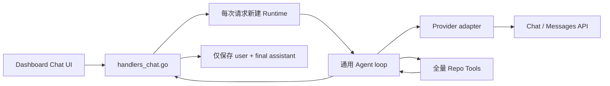

# gnb Chat Agent 交互质量架构审计

> 审计对象：截至 2026-07-13 的当前工作树，包括尚未提交的 `claude-compatible` provider 适配器。
>
> 目标：解释为什么同一 API endpoint、同一模型在 gnb Chat 中明显弱于 Claude Code / Codex 类 coding agent，并判断 OpenAI-compatible `/v1/chat/completions` 是否构成工具调用短板。
>
> 配套文档：[目标架构](../designs/gnb-chat-agent-quality-architecture.md) · [开发计划](../plans/gnb-chat-agent-quality-roadmap.md) · [既有统一控制面计划](../plans/gnb-ai-agent-unification-refactor-plan.md)

## 1. 执行结论

### 1.1 同一个模型不等于同一个 Agent

当前体验差距的主因不是模型本身，也不只是 API endpoint。Claude Code / Codex 类产品的质量来自完整的 agent harness：

1. 稳定且任务化的系统指令；
2. 高质量、可分页、可验证的工具；
3. 保留 provider 原生状态的多轮协议；
4. 对上下文、压缩、缓存和 token 预算的管理；
5. “收集证据 → 执行动作 → 验证结果 → 再决定是否结束”的循环；
6. 权限、取消、checkpoint、可观察 trace 和持续评测；
7. 真实流式进度和可理解的交互界面。

gnb 已经具备统一 provider、Agent loop、repo tools 和 Dashboard 的骨架，但目前主要是“能完成 tool call 协议”，还没有形成上述质量闭环。相同模型放入不同 harness，行为差异完全可能大于模型版本之间的差异。

### 1.2 当前最关键的五个损失

| 优先级 | 损失 | 直接影响 |
| --- | --- | --- |
| P0 | Claude/Zhipu 工具轮次间的原生 reasoning 状态被扁平化并丢弃 | 模型每次工具返回后都要重新建立思路，长链任务明显退化 |
| P0 | Agent 把 provider 流式事件先缓冲；有 tool call 时还丢弃该轮文本/思考事件 | UI 是“伪流式”，用户看不到真实进度，模型中间计划也不可追踪 |
| P0 | repo tools 缺少分页和结构化截断语义，且 `find_files` 在过滤前截断 | Agent 会在不知情时基于不完整证据作答 |
| P1 | profile、thinking、capability、session、finish reason 等配置/状态未真正贯通 | UI 看似有选项，运行时行为却与选项不一致 |
| P1 | 没有持久 trace、上下文压缩和行为评测 | 无法复现失败、比较 provider，也无法持续逼近顶级 agent |

其中，对本次 Zhipu / GLM-5.2 体验最有解释力的是第一项。智谱官方文档明确要求：工具调用与交错思考结合时，客户端需要保留并在后续工具结果轮次中带回 `reasoning_content`；保留思考状态有利于连续性和缓存。当前公共协议没有承载该状态的字段，Claude-compatible 适配器只把 thinking delta 临时发给 UI，下一轮请求无法恢复它。

### 1.3 OpenAI Chat Completions 的判断

`/v1/chat/completions` 对基础 function calling 并不存在“明显不能用”的硬伤：它支持原生 tool calls、并行调用、tool choice 和流式参数增量。当前 gnb 的明显短板，大部分是自身没有使用或没有正确实现这些能力。

但对于 reasoning model 驱动的长链 coding agent，Chat Completions 确实不是最优控制面。与 OpenAI Responses API 相比，它缺少或较难统一表达：

- typed response items；
- reasoning item 在工具轮次间的原生延续；
- `previous_response_id` / conversation state；
- 原生 compaction；
- built-in tools 与更细粒度的流事件；
- 面向 agent 的统一状态和用量语义。

因此正确方案不是“一刀切废弃 OpenAI-compatible v1”，而是双轨：

- 保留 `openai-chat-compatible`，服务第三方兼容端点、本地 llama-server 和只实现 Chat API 的模型；
- 为真正支持 Responses 的 endpoint 增加 `openai-responses`；
- Agent 核心协议升级为可保留 provider 原生 continuation/state，而不是强迫所有 provider 降级到 Chat message 最小公分母。

## 2. 审计范围与方法

本次审计覆盖：

- 公共协议：`tools/gnb/internal/ai/protocol`
- provider/router/config：`tools/gnb/internal/ai/provider`、`router.go`、`config.go`
- Agent loop：`tools/gnb/internal/ai/agent`
- session/runtime/bridge：`tools/gnb/internal/ai/session`、`runtime.go`、bridge 相关代码
- Dashboard Chat：`tools/gnb/internal/dashboard/handlers_chat.go`、`chat.go`、模板和前端脚本
- repo tools：`tools/gnb/internal/repotools`
- 现有单元测试与一条刚完成的真实 Zhipu 会话
- OpenAI、Anthropic、Claude Code、智谱的官方协议和工具使用文档

本报告只做架构分析，没有修改运行时代码，也没有把某次回答“看起来正确”当作实现正确的证据。当前 Dashboard 刷新后不会保留完整 tool trace，所以对真实会话只能确认最终输入输出，不能证明模型究竟读取了哪些文件片段；这本身就是审计结论之一。

## 3. 当前调用链

这条链已经比旧版“各处各写一套 provider/loop”更清晰，但多个质量信号在层间被丢弃：

- UI 的 thinking 选项没有进入请求；
- profile 的 step/tool/timeout/tool set 没有进入 Agent options；
- provider 的 thinking/reasoning block 没有进入下一轮；
- tool 的截断、游标、退出码等信息没有进入 observation；
- Agent 的实际 finish reason、usage、tool trace 没有进入 Dashboard 存储；
- session store 没有成为 Dashboard 多轮对话的真实上下文来源。

## 4. 详细问题

### 4.1 公共协议过度扁平化

`protocol.Message` 目前只有 role、content、name、tool call id 和 tool calls；`ChatResponse` 只有 content、tool calls、finish reason 和简化 usage。它无法无损表达：

- Claude/智谱的 content blocks、thinking blocks、signature 或 provider continuation；
- OpenAI Responses 的 message、reasoning、function call、function output 等 typed items；
- reasoning effort、summary、encrypted/opaque state；
- cached input、reasoning token、context budget；
- strict tools、tool choice、parallel policy；
- provider 原生的截断和安全结束原因。

结果是 adapter 只能把 provider 能力降级到“可显示文本 + 函数名 + JSON 参数”。这对单轮问答足够，对需要多轮工具推理的 coding agent 不够。

当前 `claude-compatible` 适配器可以解析 thinking delta，但 normalize 后没有对应的持久状态；Agent 又会在工具轮次丢弃这些事件。智谱文档所要求的 preserved thinking 因而无法成立。

### 4.2 capability 是声明，不是约束

OpenAI-compatible 和当前 Claude-compatible adapter 都声明 Streaming、NativeTools、StructuredOutput、ReasoningControl、JSONMode 等能力，但实际 request body 没有实现其中多项能力。Router 也没有依据 capability 选择路径或拒绝不支持的请求。

这会产生“能力谎报”：

- UI/上层认为 reasoning 已开启，provider 实际没有收到参数；
- 上层以为 strict schema 可用，实际仍是宽松 JSON；
- 上层以为所有 adapter 都能正确延续 tool history，Gemini/Ollama 映射却会丢失 assistant tool call 的结构。

capability 应当是经过 adapter conformance test 验证的可执行契约，而不是乐观布尔值。

### 4.3 OpenAI-compatible adapter 只用了最小子集

当前 adapter 发送 `messages`、`tools`、temperature、top_p、max_tokens 和 stream，但没有贯通：

- `tool_choice`；
- `parallel_tool_calls`；
- strict function schema；
- reasoning effort / summary；
- structured output；
- provider continuation/state；
- cached/reasoning token usage。

所以即便 endpoint 本身支持更完整的 Chat API，gnb 也没有利用。不能把这部分损失归咎于 v1 Chat API。

### 4.4 Agent 的“流式”实际上被缓冲

`agent.Run` 先把 provider 的事件累计到内存；只有本轮最终没有 tool call 时才统一发送。若本轮产生 tool call，则这一轮已生成的文本/thinking 事件不会传给 Dashboard。

后果：

- time-to-first-token 接近整次模型调用耗时；
- 用户看到的 thinking 只是 Dashboard 自己显示的占位文案；
- 工具调用前的解释或计划消失；
- 无法区分“过程 commentary”和“最终 answer”；
- 一旦超时或取消，已生成的有用进度也不可见。

顶级 agent 的体感很大程度来自及时、稳定且不会自相矛盾的过程反馈。这里是直接的交互质量缺陷，不是模型能力问题。

### 4.5 Agent loop 只有“调用直到没工具”，没有完成闭环

当前状态机近似：

1. 请求模型；
2. 若有工具则逐个执行并回填；
3. 若无工具则结束。

缺少：

- 任务类型识别和完成条件；
- 收集证据、行动、验证的显式阶段；
- 写操作后的 diff/build/test 检查；
- tool error 分类、恢复和重试策略；
- 重复调用检测；
- 安全并行只读工具；
- grounding/evidence contract；
- 对 max tokens、context overflow、provider safety stop 的分支处理。

Dashboard 使用 `agent.Options{}`，使已有的 grounding retry 默认也没有启用。模型第一次输出无工具文本时，Agent 就把它当作完成。

### 4.6 profile 配置没有真正控制运行

`config.Profile` 已经包含 tool sets、max steps、max tool calls、timeout 等字段，但 Dashboard：

- 固定 temperature 为 0.7；
- 没有把 profile limits 转成 `agent.Options`；
- 没有按 tool set 筛选工具；
- 没有把 thinking 复选框映射为请求参数。

此外，配置 merge 以“数值是否为 0”判断是否覆盖，导致 0 不能表达合法的 temperature/top_p。应改为指针/optional 或显式 presence。

### 4.7 repo tools 会制造“未知的不完整证据”

#### 已确认的 `find_files` 缺陷

`find_files` 先调用公共 command helper 执行 `rg --files`。该 helper 会把 stdout 截断到 24,000 字符，然后 `find_files` 才做模式过滤。

在本次审计的工作树中：

- `rg --files` 输出约 74,720 字符、1,614 个文件；
- `src/Engine/Rendering/VulkanBaseRenderer.hpp` 出现在约第 39,881 个字符；
- 因此通过当前 `find_files` 搜索这个文件时，候选列表在过滤前已经把它删除。

这不是召回率微调，而是确定性错误。模型可能因此断言“文件不存在”，且工具结果不会告诉它数据已被预截断。

#### 其他工具契约问题

- `read_file` 只能读文件前缀，没有 offset、行号范围或 continuation cursor；
- 工具输出统一为字符串，没有 `truncated`、`nextCursor`、`lineRange`、`exitCode` 等元数据；
- schema 没有系统性声明 required 和 `additionalProperties: false`；
- tool description 只有一句短说明，没有解释何时使用、边界、结果格式和失败处理；
- 所有工具无条件注入，profile 的 `tool_sets` 没有生效；
- 工具逐个串行执行，即使多个 read-only call 可以安全并行；
- 失败只是 `ERROR: ...` 文本，没有稳定错误类别和 retryability。

Anthropic 官方指南把详细 tool description 视为工具性能最重要的因素之一，并建议清晰说明输入、输出、边界与组合方式。当前工具定义离这一标准有明显距离。

### 4.8 当前 gnb Chat 本质上还是只读问答助手

目前 repo tool 集合可以搜索和读取，但不能：

- 应用 patch；
- 运行通用、受控的构建/测试命令；
- 查看和验证 diff；
- 执行 `gnb shot` 或交互验证；
- 建立 checkpoint 或撤销自己的修改。

因此它可以向 Claude Code/Codex 的“仓库问答”质量靠近，却无法仅靠 prompt 成为 coding agent。要支持真正的 Code 模式，必须增加写入、验证和权限系统；不能简单把 shell/edit 工具直接暴露给模型。

### 4.9 会话和上下文管理没有形成系统

当前存在两个互相脱节的概念：

- AI session store：最多保留 100 条 message，超出后直接从头切掉；
- Dashboard ChatStore：只保存可见 user/assistant 文本，不保存 tool calls、tool results、usage 或 provider continuation。

Dashboard 每个请求重新构造 Runtime，没有复用长生命周期 session。直接按消息条数截断还可能：

- 丢掉 system/AGENTS 指令；
- 把 assistant tool call 与 tool result 拆开；
- 丢掉仍然影响后续决策的事实；
- 保留大量已经无价值的原始工具输出。

Dashboard 的 token 估算只是字符启发式，没有计入 tool schemas、tool results、reasoning 和输出预算；外部模型还可能显示本地 llama 配置的 context limit。当前 AGENTS.md 约 22.5K 字符，整份注入虽然尚未超限，但随着历史与工具结果增长，没有明确预算和 compaction 策略。

### 4.10 可观察性不足，无法做质量工程

当前持久记录没有：

- 每次 provider request/response 的脱敏结构；
- step/call id；
- tool arguments、结果摘要、耗时和截断状态；
- usage、cached tokens、finish reason；
- context 构成和 compaction 事件；
- 错误类别和恢复动作；
- 最终答案引用了哪些证据。

Dashboard 结束事件还固定报告 `finish_reason: stop` 和 `truncated: false`，可能掩盖 max tokens 等真实结束原因。前端 tool panel 以 step 而不是 call id 为键，同一步多工具可能互相覆盖；刷新后 trace 消失，也没有 cancel/steer。

没有 trace，就不能回答“这次为什么比 Claude Code 差”；没有固定任务评测，就只能凭单次体感调 prompt。

### 4.11 安全模型尚未准备好承接写工具

`ToolDescriptor.Mutating` 已经存在，但没有贯穿一个中心化的 allow / ask / deny 策略。若直接增加 edit/shell：

- 模型可以把不可信仓库文本当作指令；
- 修改型工具在网络/超时后可能出现 outcome unknown；
- 自动重试可能重复产生副作用；
- 用户无法在执行前看见命令或 diff；
- 无 checkpoint 时很难只撤销 agent 自己的修改。

Claude Code 官方文档明确把权限规则、只读默认、修改确认和 checkpoint 放在 agent harness，而不是交给模型“自觉遵守”。gnb 也应采用这一边界。

## 5. 与顶级 Coding Agent 的能力差距

下表比较的是产品级能力，不声称复刻任何未公开内部实现。

| 能力面 | 当前 gnb Chat | 目标级 Agent |
| --- | --- | --- |
| 模型状态 | 文本/tool call 最小公分母 | 原生 reasoning/tool state 可延续 |
| 工具 | 8 个只读字符串工具 | 高召回、分页、结构化、可验证的读写工具 |
| 循环 | 无工具即结束 | gather → act → verify → finish |
| 流式 | provider 完成后批量回放 | 真正增量的 commentary/tool/final 事件 |
| 上下文 | 全量规则 + 线性消息历史 | 分层 context、预算、缓存、compaction |
| 会话 | 只存最终可见文本 | 可恢复 run journal 与 provider continuation |
| 权限 | 尚未支持写操作 | allow/ask/deny、checkpoint、outcome unknown |
| 验证 | 靠模型自觉 | diff/build/test/shot 等确定性验证 |
| 可观察性 | 无持久 tool trace | 可重放 trace、指标、失败分类 |
| 评测 | 协议单测为主 | 固定任务集、trace grading、provider conformance |

## 6. 为什么“只改 Prompt”不够

更好的 system prompt 确实能改善：

- 何时先搜索再回答；
- 如何引用证据；
- 遇到截断时继续读取；
- 最终回答的结构。

但 prompt 无法修复：

- 工具根本搜不到位于截断后的文件；
- read_file 没有后半段读取能力；
- reasoning state 在协议转换时被删除；
- provider 事件被 Agent 缓冲或丢弃；
- profile/thinking 选项没有传到请求；
- tool trace 没有持久化；
- 没有 edit/build/test 权限和执行能力。

所以应先修协议、工具和状态链路，再基于 trace 调 prompt。

## 7. 建议优先级

### 第一批：立刻修复确定性质量损失

1. 修复 `find_files` 的过滤前截断；
2. 为 read/search/list 增加分页与结构化 `truncated/nextCursor`；
3. provider 事件直接流向 sink，以 phase 区分 commentary/final；
4. 让 thinking、profile limits、tool sets、finish reason 真正贯通；
5. 为 Zhipu/Claude 保留工具轮次所需的原生 reasoning/content blocks；
6. 增加可脱敏的 run trace 和取消能力。

### 第二批：升级协议和 provider

1. 引入 typed `ModelTurn` 与 opaque provider continuation；
2. capability 变为可验证契约；
3. 增加 OpenAI Responses adapter，保留 Chat-compatible fallback；
4. 修复 Gemini/Ollama 的 native tool history 映射；
5. 建立 adapter conformance fixtures。

### 第三批：形成 coding agent 闭环

1. 分层 context compiler 与 compaction；
2. 长生命周期 Runtime、run journal 和恢复；
3. Research / Code 模式与权限策略；
4. edit、shell、build、test、diff、shot 等工具；
5. gather/act/verify 状态机和完成条件；
6. 固定任务集、trace grading 与跨 provider A/B。

详细拆分和验收条件见[开发计划](../plans/gnb-chat-agent-quality-roadmap.md)。

## 8. 推荐的质量基线

在继续主观比较前，先固化一组可重放任务：

1. “列出 VulkanBaseRenderer 当前公开接口并逐项给出处”；
2. 搜索一个位于 `rg --files` 输出 24K 字符之后的文件；
3. 读取一个超过 24K 的文件后半段并回答精确问题；
4. 需要 3–5 次工具调用才能完成的跨文件架构问题；
5. 工具返回错误后能换路径恢复；
6. 长会话压缩后仍遵守 AGENTS.md；
7. 同一步两个只读工具安全并行；
8. Code 模式修改一处小代码并完成 targeted build/test；
9. 模型达到 max tokens、用户取消、provider 429 等非正常结束；
10. 同模型同 endpoint 在 gnb 与参考 agent 中的盲评。

至少记录：

- 最终答案正确率和证据覆盖率；
- 不受支持断言数量；
- tool success / retry / truncation rate；
- time-to-first-token、time-to-first-tool、总时长；
- input/output/cached/reasoning tokens；
- task completion 与人工盲评分；
- 修改任务的 build/test 通过率和越权次数。

## 9. 官方资料

### OpenAI

- [Migrate to the Responses API](https://developers.openai.com/api/docs/guides/migrate-to-responses)：官方建议新项目采用 Responses，并说明 typed items、stateful context 和 agentic primitives。
- [Function calling](https://developers.openai.com/api/docs/guides/function-calling)：strict mode、tool choice、parallel calls 与流式 tool arguments。
- [Reasoning models](https://developers.openai.com/api/docs/guides/reasoning)：建议在工具循环中带回 reasoning items。
- [Conversation state](https://developers.openai.com/api/docs/guides/conversation-state)：`previous_response_id` 等状态管理方式。
- [Compaction](https://developers.openai.com/api/docs/guides/compaction)：长上下文压缩机制。
- [Agent evals](https://developers.openai.com/api/docs/guides/agent-evals)：使用 trace grading 定位 workflow 级失败。
- [Tool search](https://developers.openai.com/api/docs/guides/tools-tool-search)：按需加载工具，避免全量 schema 挤占上下文。

### Anthropic / Claude Code

- [Define tools](https://platform.claude.com/docs/en/agents-and-tools/tool-use/define-tools)：tool descriptions、strict、input examples 和高信号结果。
- [Manage tool context](https://platform.claude.com/docs/en/agents-and-tools/tool-use/manage-tool-context)：tool search、context editing 与 programmatic tool calling。
- [Tool use with prompt caching](https://platform.claude.com/docs/en/agents-and-tools/tool-use/tool-use-with-prompt-caching)：稳定 prompt/tool prefix 的缓存策略。
- [How Claude Code works](https://code.claude.com/docs/en/how-claude-code-works)：gather/act/verify、session、compaction、deferred tools 和 checkpoint。
- [Claude Code permissions](https://code.claude.com/docs/en/permissions)：权限规则与工具安全边界。
- [Claude Code subagents](https://code.claude.com/docs/en/sub-agents)：隔离上下文和受限工具的任务委派。

### 智谱

- [Claude API 兼容说明](https://docs.bigmodel.cn/cn/guide/develop/claude/introduction)：兼容入口及仍然存在的差异。
- [思考模式](https://docs.bigmodel.cn/cn/guide/capabilities/thinking)：GLM-5.2 的 thinking/reasoning 配置。
- [深度思考与工具调用](https://docs.bigmodel.cn/cn/guide/capabilities/thinking-mode)：交错思考中保留 reasoning content 的要求。
- [Function Calling](https://docs.bigmodel.cn/cn/guide/capabilities/function-calling)：智谱标准 API 的 tool choice 语义。
- [流式工具调用](https://docs.bigmodel.cn/cn/guide/capabilities/stream-tool)：reasoning 与 tool call 的流式事件。

## 10. 最终判断

本次体验问题可以归纳为一句话：

> gnb 目前把“模型 API + 函数调用”接通了，但还没有完整保留模型状态、工具证据和执行闭环；Claude Code/Codex 的优势恰好主要位于这些模型之外的层。

优先修复 provider 状态、真流式和工具完整性，预计会比换模型或继续堆 system prompt 更快改善体感与正确率。随后再引入 Responses、context compaction、Code 模式权限和 eval，才能把 gnb Chat 从 repo Q&A 提升为可信的 coding agent。
