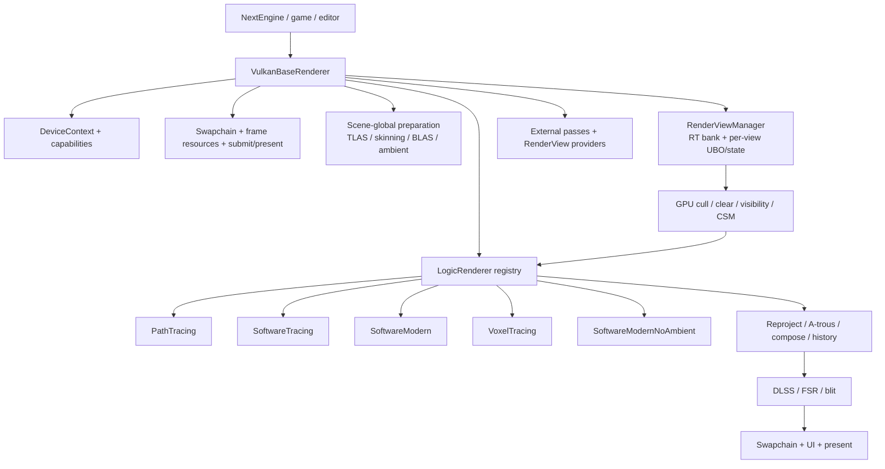

# VulkanBaseRenderer 架构、LogicRenderer 与渲染正确性审计

> 审计基线：`dev` / `967dade`，并以 2026-07-11 当前未提交工作树为准。
>
> 结论性质：这是一次**静态架构与 Vulkan 正确性审计基线**，用于后续逐条核对、修订和拆分开发任务；本文没有修改渲染器实现，也不把“可疑”写成“已复现”。行号会随代码演进漂移，复核时以链接目标和问题 ID 为准。

## 1. 范围、方法与结论分级

### 1.1 审计范围

本次覆盖：

- `VulkanBaseRenderer` 的设备、交换链、帧循环、场景、GPU-driven、GI bake、RT AS、截图、upscaler、外部 pass 与多视口编排；
- 五个 `LogicRenderer`：`PathTracing`、`SoftwareTracing`、`SoftwareModern`、`VoxelTracing`、`SoftwareModernNoAmbient`；
- `RenderView` / RT bank / per-view UBO / temporal history / CSM；
- 共用的 reproject、A-trous、compose、history copy；
- 直接影响上述流程的 Vulkan image layout、access mask、semaphore wait stage、swapchain capability；
- 相关 Slang shader 的输入、输出和 dispatch 边界契约。

不在本轮范围：

- 逐算法验证 BRDF、采样分布和降噪器数值质量；
- 每个游戏/编辑器模块的 UI 行为；
- 实施修复或重构；
- 全平台 GPU 实机矩阵。本文最后给出后续动态验证矩阵。

### 1.2 分级

| 标记 | 含义 |
| --- | --- |
| **C：已确认** | 源码路径和 Vulkan 规范足以证明契约不成立；不依赖肉眼是否立即看见坏图。 |
| **H：高风险** | 静态路径高度可疑，但还需要 validation、RenderDoc 或定向场景确认具体表现。 |
| **D：设计债** | 当前可能工作，但扩展性、可维护性或性能边界已经不清晰。 |

优先级使用 P0（先恢复正确性）、P1（近期架构收口）、P2（演进与性能）。

## 2. 执行摘要

当前渲染器已经具备可用的分层雏形：Vulkan 后端、scene-global 准备、per-view 预处理、可切换 LogicRenderer、共享时序链和 RenderView bank 都已存在；renderer descriptor 表、RAII active-view scope、按需创建 LogicRenderer 也是正确方向。

但实现还没有形成一套可被验证的“渲染资源契约”。最主要的五个结论是：

1. **P0：image layout / history 生命周期没有权威状态。** `InitializeBarriers()` 每次把整张 bindless image 表按 `UNDEFINED → GENERAL` 处理；Vulkan 允许这一步丢弃内容。它在 scene-global 阶段和每个 LogicRenderer 内重复执行，因而与 temporal history、multi-view bank 独立历史的目标直接冲突。
2. **P0：交换链同步契约不闭合。** acquired image 首次在 transfer stage 清理，但 submit 只在 `COLOR_ATTACHMENT_OUTPUT` 等待 acquire semaphore；swapchain 写入又反复从 `UNDEFINED` 开始，present barrier 只声明 shader write，不能覆盖 blit/clear 的 transfer write。
3. **P0/P1：多视口只隔离了 RT bank 和部分时序状态，没有隔离 CSM、scene-global 资源与 SHARC。** 不同相机或 `SceneOverride` 可能覆盖主场景共享阴影图，且更新 mask 仍来自主视口。
4. **P1：LogicRenderer 的 requirements 太窄，缺少输入/输出能力契约。** Base 无条件执行 visibility + CSM，后续 upscaler/debug/external pass 又默认公共 G-buffer 存在；`VoxelTracing` 只写最终颜色，`NoAmbient` 却声明需要 voxel geometry，实际与这些隐含假设不一致。
5. **P1：三个时序 renderer 复制了同一 pass 链，barrier 已经发生实现漂移。** `SoftwareTracing`、`SoftwareModern` 和 `PathTracing` 对相同 shader 输出使用不同且不完整的 barrier 集，说明同步不能继续靠每个 renderer 手写。

建议不要先做大规模“类拆分”。第一阶段应先建立资源状态、pass 输入输出和 history invalidation 三个可测试契约；否则重排类只会移动现有隐患。

## 3. 当前架构

### 3.1 责任图



### 3.2 `VulkanBaseRenderer` 实际角色

`VulkanBaseRenderer` 并非只有 Vulkan backend，它同时是：

| 角色 | 当前实现 |
| --- | --- |
| 设备所有者 | instance/device/queue/command pool/debug/profiler/capability。 |
| swapchain owner | images、views、depth、command buffers、semaphore/fence、present。 |
| scene renderer | skinning、GPU culling、visibility、CSM、ambient cube、BLAS/TLAS。 |
| view scheduler | primary/reference/offscreen/thumbnail view 的 active state 与执行顺序。 |
| render-mode host | LogicRenderer 注册、创建、切换和 swapchain 生命周期。 |
| post stack host | temporal、upscaler、wireframe、visual debugger、screenshot、frame generation。 |
| extension host | external pass 与 RenderView provider。 |

文件虽已按职责拆为 `VulkanBaseRenderer.cpp`、`.GpuDriven.cpp`、`.GiBake.cpp`、`.RayTracingAS.cpp`，但运行时状态仍汇聚在一个对象中。类声明和 LogicRenderer 接口见 [VulkanBaseRenderer.hpp:78](../../src/Engine/Rendering/VulkanBaseRenderer.hpp#L78) 与 [VulkanBaseRenderer.hpp:451](../../src/Engine/Rendering/VulkanBaseRenderer.hpp#L451)。

### 3.3 资源作用域

| 理想作用域 | 当前代表 | 主要不匹配 |
| --- | --- | --- |
| Device | `ctx_`、`caps_` | 基本清晰。 |
| Swapchain | `frame_`、depth、swapchain-dependent pipelines | `RecreateSwapChain()` 与若干逻辑状态存在重复/遗漏回调。 |
| Scene | TLAS/BLAS、skinning、ambient、CSM resources | 只为主 scene 执行一次；`SceneOverride` 复用主 scene 的 CSM/TLAS 等状态。 |
| View | RT bank、camera UBO、temporal state、A-trous | CSM image、SHARC、部分 history reset 仍不是 per-view。 |
| Frame/submit | command buffer、fence、semaphore、serial | 数组按多 frame 配置，实际每帧等待上一次 submit，等效单帧 GPU in-flight。 |
| Logic mode | mode pipelines、SHARC | 缺少 scene-changed/history-invalidated 生命周期和产物契约。 |

### 3.4 RenderView 现状

RT bank 采用固定 stride 256，总计 8 个 bank，bank 0 永久属于 primary，最多只有 7 个 additional view，见 [RenderView.hpp:94](../../src/Engine/Rendering/RenderView.hpp#L94)。每个 `RenderView` 已拥有：

- camera UBO ring；
- bank base 和独立 screen-space RT；
- previous UBO、CSM bookkeeping、progressive counter、reset flag；
- per-view A-trous 与 `TemporalResolve`；
- visibility framebuffer 和可选 `SceneOverride`。

active-view 切换通过 RAII scope 保存并恢复 bank、extent、camera address、framebuffer、scene override 和 view pointer，这一点实现稳健，见 [RenderView.cpp:166](../../src/Engine/Rendering/RenderView.cpp#L166)。

不足在于 manager 只有 `DestroyAdditionalViews()`，没有单 view 销毁/回收 API，且该函数当前无调用者；`Persistent / OnDemand / Transient` 也主要是描述字段，manager 没有统一落实调度和回收策略，见 [RenderView.hpp:296](../../src/Engine/Rendering/RenderView.hpp#L296) 与 [RenderView.hpp:352](../../src/Engine/Rendering/RenderView.hpp#L352)。

## 4. 一帧的真实流程

主入口是 [VulkanBaseRenderer.cpp:1417](../../src/Engine/Rendering/VulkanBaseRenderer.cpp#L1417)。按命令记录和提交顺序可还原为：

1. 如有请求，重建 swapchain 并提前返回。
2. upscaler `BeginFrame` / Reflex marker。
3. `BeforeNextFrame()`：所有已创建 LogicRenderer、RenderView provider、engine tick delegate。
4. acquire swapchain image。
5. 等待上一次 submit fence，再等待当前 frame-slot fence。
6. `Scene::UpdateNodes()`，必要时扩容 GPU-driven buffer，随后更新 primary UBO。
7. 开始 command buffer 和 GPU profiler。
8. `BeginSceneFrame()`：**TLAS update → CPU skinning data update → 全表 image barriers → ambient invalidation → skinning dispatch → BLAS update**，见 [VulkanBaseRenderer.cpp:1301](../../src/Engine/Rendering/VulkanBaseRenderer.cpp#L1301)。
9. 对 primary/reference view：`GPU cull → clear → visibility → CSM → LogicRenderer → object-ID history copy`，见 [VulkanBaseRenderer.cpp:1312](../../src/Engine/Rendering/VulkanBaseRenderer.cpp#L1312) 和 [VulkanBaseRenderer.cpp:1405](../../src/Engine/Rendering/VulkanBaseRenderer.cpp#L1405)。
10. 普通模式执行 external passes、wireframe，然后 DLSS/FSR/blit resolve primary。
11. 调度 auxiliary/offscreen/thumbnail views，并复制或合成其输出。
12. renderer 内部把 swapchain 转为 present layout。
13. `PostRender()` 做 ambient bake 和可选 visual debugger；visual debugger 会重新打开 swapchain 再 present。
14. frame-generation capture/tag。
15. UI/其他 frame consumer 通过 delegate 追加命令；UI render pass依赖自己的 present→color→present 隐式转换。
16. submit、present、after-submit、frame index 前进。

这个流程的关键特征是：scene-global、view-local、swapchain resolve 和模块扩展虽然有命名分区，但资源访问仍靠调用者约定，没有机器可检查的 pass contract。

## 5. 五个 LogicRenderer 的实际设计

### 5.1 总览矩阵

| Renderer | primary surface | indirect / secondary | direct sun | 最终链路 | 声明 requirements | 实际契约问题 |
| --- | --- | --- | --- | --- | --- | --- |
| PathTracing | visibility buffer 重建 | hardware ray query，多 bounce；可选 SHARC | hardware RayQuery | shade → reproject → A-trous → JBF compose → 3-channel history | ambient + RT | CSM prepass无用；SHARC 非 per-view/per-scene；history/barrier 不闭合。 |
| SoftwareTracing | visibility buffer 重建 | `FSoftwareRayTracer`，screen/voxel DDA hybrid | CSM | 同上 | ambient | 共享链 barrier 最不完整。 |
| SoftwareModern | visibility buffer 重建 | `FAmbientCubeRayTracerIndirect`，单次低成本 GI | CSM | 同上 | ambient | 与 SoftwareTracing 高度重复；motion-moment 等状态契约不完整。 |
| VoxelTracing | `FVoxelRayCaster` 全屏体素 primary | `FHiVoxelDDARayTracer` / ambient cube | 无独立 direct sun | 直接写 `RT_DENOISED` | ambient | 仍跑 visibility/CSM；只写颜色却继承公共 G-buffer 假设；secondary extent 错。 |
| SoftwareModernNoAmbient | visibility buffer 重建 | IBL diffuse/specular + 显式 GGX；可选 GTAO | CSM | shade → GTAO → compose | voxel geometry | shader不使用 voxel；无时序链，产物与通用 upscaler/debug 契约未显式描述。 |

descriptor 单一表集中 name、requirements、reference layout 和 factory 是值得保留的设计，见 [VulkanBaseRenderer.cpp:210](../../src/Engine/Rendering/VulkanBaseRenderer.cpp#L210)。问题不在表本身，而在 requirements 只有 ambient / RT / voxel 三个 bool，无法表达前置 pass 和输出产物。

### 5.2 PathTracing

入口 shader [Core.PathTracing.comp.slang:7](../../assets/shaders/Core.PathTracing.comp.slang#L7) 使用：

- `FVisibilityBufferRayCaster` 重建 primary surface；
- `FHardwareRayTracer` 做 secondary ray；
- `FHardwareDirectIlluminator` 用 RayQuery 测太阳阴影；
- `FPathTracingRenderer` 做多 bounce，ambient cube 可作为终端/辅助辐射来源。

C++ 侧 [PathTracingRenderer.cpp:300](../../src/Engine/Rendering/PathTracing/PathTracingRenderer.cpp#L300) 选择普通 path 或 SHARC update→resolve→query，然后走 `Process.ReProject`、per-view A-trous、`Process.DenoiseJBF`，最后复制 diffuse/specular/albedo 三个 history channel。

优点：硬件路径、offline progressive、SHARC 和公共降噪链边界较清楚；A-trous 已归入 RenderView。

问题：

- base 仍为它画 CSM，但 shader direct sun 使用 RayQuery；这是 renderer capability 缺失导致的冗余。
- `FSharcState` 是 LogicRenderer 单例成员，[PathTracingRenderer.hpp:31](../../src/Engine/Rendering/PathTracing/PathTracingRenderer.hpp#L31)；每个 view render 都会更新同一个 cache。
- SHARC 参数读取 primary/global `GetLastUniformBufferObject()` 而非 active view UBO，[PathTracingRenderer.cpp:201](../../src/Engine/Rendering/PathTracing/PathTracingRenderer.cpp#L201)。
- swapchain delete 只销毁 pipeline，不销毁/失效 SHARC buffer；scene 切换若光照值相同，不会可靠触发清空。

### 5.3 SoftwareTracing

[Core.SwTracing.comp.slang:7](../../assets/shaders/Core.SwTracing.comp.slang#L7) 仍从 visibility buffer 获取 primary hit，用 `FSoftwareRayTracer` 做 secondary tracing，并通过 `FShadowMapDirectIlluminator` 采样 CSM。之后复用与 PathTracing 相同的 reproject/A-trous/JBF/history 链。

它的定位是“无硬件 RT 的较完整软追踪”，而不是纯 raster deferred。requirements 请求 ambient cube，因此也隐含请求 voxel geometry。

主要问题在同步：shading 后只对 `RT_SINGLE_DIFFUSE` 插入一个 shader-write→shader-write barrier，[SoftwareTracingRenderer.cpp:56](../../src/Engine/Rendering/SoftwareTracing/SoftwareTracingRenderer.cpp#L56)，但公共 renderer shader还会写 specular、albedo、normal、object ID、motion、depth、hit distance 等，紧接着 reproject/A-trous 会读其中多项。

### 5.4 SoftwareModern

[Core.SwModern.comp.slang:7](../../assets/shaders/Core.SwModern.comp.slang#L7) 使用 visibility primary、ambient-cube indirect tracer、CSM direct light，并设置 `ExitAfterFirst / ForceExitAfterFirst / FuzzyTracing`，实际是成本较低的 raster-primary + probe-indirect 路径。

C++ 侧与 SoftwareTracing 几乎同构，[SoftwareModernRenderer.cpp:70](../../src/Engine/Rendering/SoftwareModern/SoftwareModernRenderer.cpp#L70)。它比 SoftwareTracing 多声明了若干 shading output barrier，但仍遗漏公共 shader会写/后续会读的状态（例如 motion moment），进一步说明三套复制链已经产生同步漂移。

### 5.5 VoxelTracing

[Core.VoxelTracing.comp.slang:19](../../assets/shaders/Core.VoxelTracing.comp.slang#L19) 不消费 visibility buffer，而是 `FVoxelRayCaster + FHiVoxelDDARayTracer` 直接追踪 primary，采样 ambient cube，乘材质 diffuse，最终只写 `RT_DENOISED`。

这是五条路径里契约差异最大的一个：

- 没有 reproject、A-trous、object/motion/depth/normal/albedo 等公共输出；
- base 仍无条件执行 GPU cull、visibility 和 CSM；
- `RequiresObjectIdHistory()` 继承默认 `true`，于是会把本 renderer 未写入的 `RT_OBJECTID_0` 复制到 history；
- dispatch 使用 `SwapChain().RenderExtent()` 而不是 active view extent，[VoxelTracingRenderer.cpp:42](../../src/Engine/Rendering/VoxelTracing/VoxelTracingRenderer.cpp#L42)；shader 又没有越界 early-return。当前 renderer 被用于不同尺寸 secondary view 时会越过该 bank 的有效 extent。

因此 VoxelTracing 不应继续被当作“与另外四个 renderer 只有 shader不同”的实现；它需要显式的 produced-output 与 post-process compatibility 标志。

### 5.6 SoftwareModernNoAmbient

[Core.SwModernNoAmbient.comp.slang:55](../../assets/shaders/Core.SwModernNoAmbient.comp.slang#L55) 从 visibility buffer 重建 surface，计算显式 GGX/PBR、IBL diffuse/specular 和 CSM sun，将直接项与 ambient 分开；可选半分辨率 GTAO，再由 [Process.GTAOCompose.comp.slang:115](../../assets/shaders/Process.GTAOCompose.comp.slang#L115) 输出最终图。它不走 temporal/JBF/history，并明确不复制 object-ID history。

descriptor 却声明 `{requestAmbientCube=false, requestRayTracing=false, requestVoxelGeometry=true}`，[VulkanBaseRenderer.cpp:238](../../src/Engine/Rendering/VulkanBaseRenderer.cpp#L238)。从当前 shader 路径看不到 voxel/ambient cube 读取，因此这是一个高可信的 stale requirement：它会让主 scene 不必要地准备 voxel geometry，并影响低显存 renderer fallback 逻辑。

## 6. 正确性审计发现

### 6.1 总表

| ID | 优先级 | 置信 | 问题 | 主要后果 |
| --- | --- | --- | --- | --- |
| R-001 | P0 | C | 全表反复 `UNDEFINED → GENERAL` | temporal history、先前 bank 内容可被合法丢弃。 |
| R-002 | P0 | C | history copy 后不恢复 layout | 下一使用点没有合法、保内容的 layout 链。 |
| R-003 | P0 | C | swapchain layout/access owner 不唯一 | clear、subrect compose、blit、present 的内容/可见性不可靠。 |
| R-004 | P0 | C | acquire semaphore wait stage 太晚 | transfer clear/write 可在 acquired image 可用前执行。 |
| R-005 | P0/P1 | C | visibility copy 与 LogicRenderer producer/consumer barrier 错漏 | reproject/denoise 可能读到未完成写入。 |
| R-006 | P0/P1 | C | primary history invalidation 没有被 primary UBO 路径消费 | scene/resize/switch 后可能跨状态重投影。 |
| R-007 | P0/P1 | C | CSM image 与更新 mask 非 per-view | 多相机/SceneOverride 阴影图与矩阵混用。 |
| R-008 | P1 | H | SceneOverride 不拥有 scene-global prepare | skinning、AS、ambient、shadow resources 可能仍属于主 scene。 |
| R-009 | P1 | C/H | SHARC 是共享 renderer 状态并读取主 UBO | 多 view互相污染；同光照 scene 切换可能沿用旧 cache。 |
| R-010 | P1 | C | VoxelTracing extent / output contract 错配 | secondary view 越界；DLSS/debug/history 输入陈旧。 |
| R-011 | P1 | C | renderer requirements / prepass contract 太弱 | NoAmbient 多做 voxel；Path/Voxel 多做无用 CSM/visibility。 |
| R-012 | P1 | C | RenderView bank 无单体释放，容量可能耗尽 | 合法功能组合最终抛出 allocation failure。 |
| R-013 | P1 | C | swapchain usage/composite alpha 未校验 surface capability | 部分平台 swapchain 创建不合法/失败。 |
| R-014 | P1 | C | recreate 双回调且不归一化 frame slot | upscaler teardown 重复；image count 变小时存在越界窗口。 |
| R-015 | P1 | H | 多个 compute shader无 dispatch 边界保护 | 非 8 倍数 extent 可能越界访问 storage image。 |
| R-016 | P1/P2 | H | skinned BLAS/TLAS 更新顺序和 scratch/request 假设不稳 | 重复 model request 可越界或重复更新 AS。 |
| R-017 | P2 | C | 实际只有一个 GPU frame in flight | 复杂多帧资源没有换来 CPU/GPU overlap。 |
| R-018 | P2 | D | registry / external pass 依赖副作用与人工顺序 | 扩展点无法声明资源、同步和产物。 |

### 6.2 R-001：`InitializeBarriers()` 会丢弃需要保留的内容

[VulkanBaseRenderer.cpp:1720](../../src/Engine/Rendering/VulkanBaseRenderer.cpp#L1720) 遍历 `bindless_.images`，对每张 image 都执行：

```cpp
oldLayout = VK_IMAGE_LAYOUT_UNDEFINED;
newLayout = VK_IMAGE_LAYOUT_GENERAL;
```

Vulkan 规范明确允许在 `oldLayout == UNDEFINED` 时丢弃原内容。该函数在 `BeginSceneFrame()` 调一次，五个 LogicRenderer 的 `Render()` 又各自调一次；multi-view 时后渲 view 还会重新处理其他 bank。

这不是“barrier 偏保守”，而是**把保留内容的 image重新声明成内容不重要**。受影响的正是 previous diffuse/specular/albedo、object ID history、motion moment、primary bank在 auxiliary view 之后的历史等。

规范依据：[Vulkan synchronization / image layout transitions](https://docs.vulkan.org/spec/latest/chapters/synchronization.html#synchronization-image-layout-transitions)。

建议：立即把它拆成“一次性初始化”和“真实 producer→consumer transition”；维护每张 image 的 initialized/layout/access/stage 状态，禁止运行期用 `UNDEFINED` 作为万能 old layout。

### 6.3 R-002：`TemporalResolve::CopyToHistory()` 的 layout 链没有闭合

[TemporalResolve.cpp:37](../../src/Engine/Rendering/PipelineCommon/TemporalResolve.cpp#L37) 把 accumulation 转到 `TRANSFER_SRC_OPTIMAL`、history 转到 `TRANSFER_DST_OPTIMAL` 并 copy，但函数结束时没有恢复到 `GENERAL` 或下一真实 consumer 的 layout。

下一帧只能依赖 R-001 的 `UNDEFINED → GENERAL`，而那会允许丢弃刚复制的 history。另有 `MarkHistoryValid()` / `IsHistoryValidForFrame()` API，但当前没有调用者，[TemporalResolve.cpp:20](../../src/Engine/Rendering/PipelineCommon/TemporalResolve.cpp#L20)，所以程序也没有逻辑层的 valid-generation 兜底。

建议：copy 后显式回到读写契约；更好的做法是由 pass/state tracker生成 transition，并将 history validity 绑定 `(sceneGeneration, viewGeneration, rendererGeneration, extent, frame)`。

### 6.4 R-003：swapchain transition、access 与内容保留不一致

`SwapChain::InsertBarrierToWrite()` 永远从 `UNDEFINED` 转 `GENERAL`，`InsertBarrierToPresent()` 又只以 `SHADER_WRITE` 作为 source access，见 [SwapChain.cpp:355](../../src/Engine/Vulkan/SwapChain.cpp#L355)。具体冲突包括：

- primary clear 已用 transfer 写入，resolve 随后又 `UNDEFINED → GENERAL`，clear 后需要保留的区域可被丢弃；
- reference mode 每个 quadrant compose 都重新 `UNDEFINED → GENERAL`，先写 quadrant 可被后一次 transition 丢弃；
- blit 的 swapchain producer 是 `TRANSFER_WRITE`，present barrier却只声明 `SHADER_WRITE`；
- primary fallback blit 前，`RT_DENOISED` barrier 的 destination access 是 `SHADER_READ`，实际 consumer 是 `TRANSFER_READ`，[VulkanBaseRenderer.cpp:1887](../../src/Engine/Rendering/VulkanBaseRenderer.cpp#L1887)；
- visual debugger 和 UI 又各自通过隐式/显式路径重新接管 swapchain，状态 owner 分散。

建议：一帧内由唯一 `SwapchainImageState` 记录 `PRESENT → TRANSFER_DST/GENERAL/COLOR → PRESENT`；clear、FSR storage、DLSS、blit、UI 根据真实路径生成 access/stage。subrect compose 只做一次 acquire-to-write transition。

### 6.5 R-004：acquire semaphore 没有阻塞首次 transfer use

submit 在 [VulkanBaseRenderer.cpp:1587](../../src/Engine/Rendering/VulkanBaseRenderer.cpp#L1587) 使用：

```cpp
pWaitDstStageMask = VK_PIPELINE_STAGE_COLOR_ATTACHMENT_OUTPUT_BIT;
```

但 swapchain image 的首次使用是 [VulkanBaseRenderer.GpuDriven.cpp:216](../../src/Engine/Rendering/VulkanBaseRenderer.GpuDriven.cpp#L216) 中的 transfer transition + `vkCmdClearColorImage`。等待 color-output stage 不会自动阻塞 earlier/unmatched transfer stage。

规范依据：[VkSubmitInfo `pWaitDstStageMask`](https://docs.vulkan.org/refpages/latest/refpages/source/VkSubmitInfo.html)。

建议：旧同步 API 下至少等待真实 earliest consumer（当前为 `TRANSFER_BIT`，复杂分支可用更保守的 `ALL_COMMANDS_BIT`）；迁移 sync2 后用 `VkSemaphoreSubmitInfo::stageMask` 表达路径真实首用。

### 6.6 R-005：producer/consumer barrier 已发生分叉

已确认的例子：

1. visibility target copy 后，destination `RT_MINIGBUFFER` 的 source access 写成 `COLOR_ATTACHMENT_WRITE`，真实 producer 是 `vkCmdCopyImage` 的 `TRANSFER_WRITE`，[VulkanBaseRenderer.GpuDriven.cpp:300](../../src/Engine/Rendering/VulkanBaseRenderer.GpuDriven.cpp#L300)。
2. SoftwareTracing shading 后只 transition `RT_SINGLE_DIFFUSE`，且 destination仍是 shader write；紧随其后的 reproject 要读完整 G-buffer/output 集。
3. PathTracing、SoftwareModern 各自维护另一套“应 transition 的 image列表”，两者也不一致。
4. 初始化 clear 只清 `SINGLE_DIFFUSE / SINGLE_SPECULAR / PREV_DEPTH`，[Util.BufferClear.comp.slang:18](../../assets/shaders/Util.BufferClear.comp.slang#L18)；首帧会被读取的 object history、motion moment 和三路 temporal history 没有明确初值。

建议：不要逐 renderer补 barrier清单。先为 pass 声明 reads/writes，再由统一层生成 barrier；短期至少抽一个共享 `RunTemporalDenoiseChain()`，所有 renderer 使用同一 output transition 表。

### 6.7 R-006：history invalidation 对 primary view不生效

`SetScene()` 会调用 `PrimaryView().InvalidateTemporalHistory()`，[VulkanBaseRenderer.cpp:498](../../src/Engine/Rendering/VulkanBaseRenderer.cpp#L498)。auxiliary UBO 经过 `FinalizeTemporalUbo()`，会消费 `state.resetHistory` 并把 previous matrices 设为 current，[VulkanBaseRenderer.cpp:1386](../../src/Engine/Rendering/VulkanBaseRenderer.cpp#L1386)。

primary UBO 则由 [Engine.CameraUbo.cpp:59](../../src/Engine/Runtime/Engine.CameraUbo.cpp#L59) 单独构建，只检查 `previousUniformBuffer.TotalFrames`，不检查 `resetHistory`，随后直接覆盖 previous UBO。结果是 primary 的 reset flag 初始化为 true 后也没有统一消费路径。

此外 `SwitchLogicRenderer()` 只切换 enum并确保 pipeline，[VulkanBaseRenderer.cpp:1824](../../src/Engine/Rendering/VulkanBaseRenderer.cpp#L1824)，不会失效：

- per-view temporal history；
- object-ID / motion-moment history；
- upscaler history；
- SHARC / renderer-specific accumulation。

建议：所有 view（包括 primary）必须走同一个 UBO finalize/invalidation入口；renderer switch、scene generation、resize、camera cut 都产生明确 `EHistoryInvalidationReason`。

### 6.8 R-007：CSM 不是 per-view，且会发生矩阵/贴图混配

`FViewRenderState` 虽包含 per-view cascade cache/mask，但只有 primary UBO 路径更新这些字段，[Engine.CameraUbo.cpp:128](../../src/Engine/Runtime/Engine.CameraUbo.cpp#L128)。secondary UBO 会计算自己的四个 cascade matrix，却没有维护对应 update mask。

真正画 shadow 时，[VulkanBaseRenderer.GpuDriven.cpp:326](../../src/Engine/Rendering/VulkanBaseRenderer.GpuDriven.cpp#L326) 始终读取 `NextEngine::GetSunShadowCascadeUpdateMask()`，它返回 primary view mask。于是 secondary camera 可能只用自己的矩阵重画“primary 本帧选中的 cascade”，其余 cascade image仍属于旧相机。

同时 `ShadowMapPass` 的四个 framebuffer在主 scene 创建资源时固定绑定主 scene image view，[ShadowMapPass.cpp:49](../../src/Engine/Rendering/Shadow/ShadowMapPass.cpp#L49)。`SceneOverride` view绘制时会把 override geometry 画进这些共享主场景阴影图。

这比“第二相机阴影略不精确”更严重：它可能在同一组 4 张 image中混合不同相机/不同 scene 的 cascade，之后 primary 也继续采样这些 image。

建议优先选择两种明确模型之一：

- **正确隔离**：每个需要 CSM 的 view/scene拥有 shadow atlas/image set与 update state；
- **受限共享**：只允许同 scene同 camera-family共享，secondary 每次全画四 cascade，并在回到 primary 前恢复 primary shadow set。该方案简单但成本高，只适合过渡。

### 6.9 R-008：`SceneOverride` 只是临时换指针，不是完整 scene render context

`FActiveRenderViewScope` 只把 `activeSceneOverride_` 临时换成 view scene，[RenderView.cpp:166](../../src/Engine/Rendering/RenderView.cpp#L166)。而 `BeginSceneFrame()` 在任何 view scope之前只为主 scene执行一次。

因此 override scene不会自然获得：

- 本帧 skinning dispatch / BLAS-TLAS update；
- ambient cache update/bake；
- 自己的 ShadowMapPass framebuffer/bindless shadow set；
- PathTracing 所需的 scene-local TLAS context。

当前 editor thumbnail固定优先用 NoAmbient，降低了暴露概率，但这不是可泛化的 multi-scene 设计。建议引入 `FSceneRenderState`，先按本帧 schedule 收集 scene，再对每个 scene恰好执行一次 prepare。

### 6.10 R-009：SHARC 生命周期和 view/scene作用域不匹配

SHARC buffer/state挂在单个 `PathTracingRenderer` 上，参数更新读取主 camera UBO，并在每个 active view内部执行。`DeleteSwapChain()` 只删 SHARC pipeline；cache buffer和 last lighting/camera state保留，[PathTracingRenderer.cpp:75](../../src/Engine/Rendering/PathTracing/PathTracingRenderer.cpp#L75)。

若切到一个光照参数相同的新 scene，`lightingChanged` 可能为 false，而 renderer frame counter也未必回退，因此旧 scene radiance cache可继续被查询。多相机则会共享同一 camera-history字段，但参数仍以 primary camera为准。

建议将 SHARC定义为明确的 `FSceneRadianceCache`：key至少包含 scene generation和相关配置；update是 scene-global pass，query才是 per-view pass。camera-dependent clip/eviction参数若确实需要 per-view，应选择主驱动 view或拆出 per-view metadata。

### 6.11 R-010：VoxelTracing 不满足公共输出与 extent 契约

除了前述 dispatch extent错误，还需确认所有 downstream consumer：

- DLSS/FSR frame inputs默认获取 motion、depth、normal、accumulation/hit-distance等 common RT；
- visual debugger默认展示这些 RT；
- base默认复制 object-ID history；
- external pass可能默认 primary G-buffer有效。

VoxelTracing 没有生产这些数据。当前“旧内容还在”不能算有效输入，因为 R-001 又允许内容被丢弃。

建议在 descriptor中声明 `produces`：color、depth、motion、objectId、normalRoughness、noisyDiffuse/specular、hitDistance；upscaler和 external pass按 capability降级或拒绝。Voxel renderer还应覆写 `RequiresObjectIdHistory=false`，并使用 active extent + shader bounds guard。

### 6.12 R-011：requirements 不能表达前置 pass

当前 `FRendererRequirements` 只有 `requestAmbientCube / requestRayTracing / requestVoxelGeometry`，[VulkanBaseRenderer.hpp:46](../../src/Engine/Rendering/VulkanBaseRenderer.hpp#L46)，而 `PreRenderPerView()` 对所有 renderer固定执行 cull、clear、visibility、CSM。

实际需要：

| Renderer | visibility | CSM | ambient/voxel | TLAS | temporal history |
| --- | ---: | ---: | ---: | ---: | ---: |
| PathTracing | 是 | 否 | 是 | 是 | 是 |
| SoftwareTracing | 是 | 是 | 是 | 否 | 是 |
| SoftwareModern | 是 | 是 | 是 | 否 | 是 |
| VoxelTracing | 否 | 否 | 是 | 否 | 否 |
| NoAmbient | 是 | 是 | 否 | 否 | 否 |

建议把 descriptor扩展为 `prepasses + scene resources + produces + post compatibility` 四组 bitmask，而不是继续添加单个 bool。

### 6.13 R-012：RenderView bank 会被合法功能组合耗尽

additional bank只有 7 个。现有功能可持久创建：

- offscreen camera view：最多 3 个，[OffscreenRenderViewController.hpp:32](../../src/Modules/RenderViews/OffscreenRenderViewController.hpp#L32)；
- reference views：4 个，且保存于 map；
- editor thumbnail view + material preview view：2 个。

它们总计可达到 9 个 additional view，而且创建后没有单 view释放；`RenderViewResourceFactory::EnsureView()` 在 allocator返回空时直接抛异常，[RenderView.cpp:34](../../src/Engine/Rendering/RenderView.cpp#L34)。即使功能不在同一帧活跃，历史创建也能耗尽 bank。

建议增加 `DestroyView(handle)`、generation-safe handle、LRU/transient回收和预分配 admission check；`Transient` view不应永久占有全历史 bank。

### 6.14 R-013：swapchain 创建参数没有遵守 surface capability

[SwapChain.cpp:106](../../src/Engine/Vulkan/SwapChain.cpp#L106) 无条件请求：

```cpp
COLOR_ATTACHMENT | TRANSFER_SRC | TRANSFER_DST | STORAGE
```

且固定 `VK_COMPOSITE_ALPHA_OPAQUE_BIT_KHR`。Vulkan 要求 `imageUsage` 是 `supportedUsageFlags` 子集，`compositeAlpha` 也必须属于 `supportedCompositeAlpha`。

规范依据：[VkSwapchainCreateInfoKHR valid usage](https://docs.vulkan.org/refpages/latest/refpages/source/VkSwapchainCreateInfoKHR.html)。

建议启动时 fail-fast打印缺失 usage；若 surface不支持 STORAGE，FSR/visual-debug应写 intermediate image后 blit，而不是让 swapchain创建失败。composite alpha按支持位优先选择 OPAQUE。

### 6.15 R-014：swapchain recreate 生命周期有重复与索引遗漏

`RecreateSwapChain()` 先调用一次 `upscaler_->OnSwapChainDestroyed()`，随后 `DeleteSwapChain()` 又调用一次，[VulkanBaseRenderer.cpp:1072](../../src/Engine/Rendering/VulkanBaseRenderer.cpp#L1072) 与 [VulkanBaseRenderer.cpp:1153](../../src/Engine/Rendering/VulkanBaseRenderer.cpp#L1153)。除非接口明确幂等，这属于重复生命周期事件。

此外 `CreateSwapChain()` 重建 per-image数组但没有把 `frame_.currentFrame` 归一到新 image count；如果新 swapchain image数更少，下一帧在取 semaphore/fence前存在越界风险。它只在 renderer首次 device初始化路径设为 0。

建议 lifecycle只有 `DeleteSwapChain()` 发 destroyed事件；create末尾将 currentFrame/currentImageIndex安全归零，并给 upscaler状态机加断言。

### 6.16 R-015：ceil dispatch 与缺少 shader bounds guard

C++ 广泛使用 `GetSafeDispatchCount(extent, 8)`，即向上取整。以下入口没有显式 `DTid >= image size` early-return：

- [Core.PathTracing.comp.slang:7](../../assets/shaders/Core.PathTracing.comp.slang#L7)
- [Core.SwTracing.comp.slang:7](../../assets/shaders/Core.SwTracing.comp.slang#L7)
- [Core.VoxelTracing.comp.slang:19](../../assets/shaders/Core.VoxelTracing.comp.slang#L19)
- [Process.ReProject.comp.slang:192](../../assets/shaders/Process.ReProject.comp.slang#L192)
- [Process.DenoiseJBF.comp.slang:59](../../assets/shaders/Process.DenoiseJBF.comp.slang#L59)
- [Util.VisualDebugger.comp.slang:128](../../assets/shaders/Util.VisualDebugger.comp.slang#L128)

`Core.SwModern`、NoAmbient、GTAO和GTAOCompose已有正确 guard，可作为样板。是否被设备 robustness掩盖不应成为算法契约；必须用 1279×719、1001×777、1×1 等 extent在 validation/RenderDoc下核对。

### 6.17 R-016：动态 BLAS/TLAS 更新需定向验证

当前顺序是 TLAS update → skinning compute → BLAS update，[VulkanBaseRenderer.cpp:1301](../../src/Engine/Rendering/VulkanBaseRenderer.cpp#L1301)。更自然且容易证明的依赖顺序应是 skinning write → BLAS update → AS build barrier → TLAS update → ray-query read。

另有两个具体风险：

- `RequestSkinUpdate()` 直接 push model ID，不去重也不做边界检查；scene按每个 playing skinned node提交，同 model多 instance会重复，[Scene.Update.cpp:37](../../src/Engine/Assets/Core/Scene.Update.cpp#L37)。
- BLAS update scratch offset按 request累计 `buildScratchSize`，但 scratch buffer只按每个 BLAS一次的总 build size分配；重复 request可越界。update所需 scratch也应按 `updateScratchSize`/两者最大值验证，[VulkanBaseRenderer.RayTracingAS.cpp:48](../../src/Engine/Rendering/VulkanBaseRenderer.RayTracingAS.cpp#L48)。

建议先将 request归并为 validated model set，再用真实 update scratch requirement计算本帧 scratch arena；用 validation + animated shared-model场景验证 AS build hazard。

### 6.18 R-017：多 frame资源与实际串行执行不一致

每个 swapchain image都创建 fence/semaphore/UBO/command buffer，但每帧 acquire后都会等待 `previousSubmitFence`，[VulkanBaseRenderer.cpp:1486](../../src/Engine/Rendering/VulkanBaseRenderer.cpp#L1486)。因此 GPU submit之间没有多帧 overlap。

这不是正确性 bug，且对大量共享 scene/view资源而言串行更简单；问题是架构同时承担多帧复杂度和单帧性能特征。应做明确选择：

- 若保持 one-frame-in-flight：简化 frame slots，并把这一约束写进资源生命周期；
- 若追求吞吐：使用 per-swapchain-image ownership/fence映射，去掉无条件 previous-submit wait，并把真正共享资源改成 ring或显式依赖。

### 6.19 R-018：扩展点没有资源契约

`RegisterLogicRenderer()` 同时“注册”和“切换 current”，注册顺序会影响状态，[VulkanBaseRenderer.cpp:1730](../../src/Engine/Rendering/VulkanBaseRenderer.cpp#L1730)。`IExternalRenderPass` 则只有 `CreateResources/Execute` 和整数 priority，[ExternalPassRegistry.hpp:15](../../src/Engine/Rendering/ExternalPassRegistry.hpp#L15)，无法声明：

- 插入点；
- scene/view/frame作用域；
- reads/writes和 layout/access；
- 需要/产生哪些 G-buffer；
- 是否支持 reference/secondary/SceneOverride。

建议让 register纯注册，switch纯切换；external pass与 LogicRenderer都接入同一轻量 pass-declaration体系。

## 7. 已有设计中值得保留的部分

1. **renderer descriptor集中化**：type/name/requirements/layout/factory已经是一处真相源，适合扩展而非推翻。
2. **LogicRenderer按需构建**：避免无用 renderer pipeline常驻，reference mode再按需确保。
3. **RT bank兼容旧 bindless slot**：bank 0保持旧绝对布局，迁移成本可控。
4. **active-view RAII scope**：临时全局状态至少能成对恢复，减少早退污染。
5. **per-view UBO、temporal helper和A-trous**：说明 view-local状态已经开始从 engine全局剥离。
6. **scene-global / per-view函数已命名分开**：`BeginSceneFrame` 与 `PreRenderPerView` 是进一步建立 render context/pass schedule 的好切入点。
7. **ShadowMapPass内部 render-pass dependency**：depth write→shader read的局部依赖表达比外围 image状态更完整，可以保留。

## 8. 目标架构建议

### 8.1 先建立五种显式 context

不要求一次拆成五个大类，先让 API参数和 ownership清晰：

| Context | 内容 |
| --- | --- |
| `FDeviceContext` | device/queues/features/debug/global descriptors。 |
| `FSwapchainContext` | swapchain image state、output format/extent、per-image sync、upscaler lifecycle。 |
| `FFrameContext` | frame slot、command buffer、submit serial、deferred destruction。 |
| `FSceneRenderState` | scene generation、GPU scene buffers、AS、skinning、ambient、scene-local radiance cache/shadow resources。 |
| `FViewRenderContext` | scene ref、camera UBO、extent、bank、history generation、outputs、shadow view state。 |

LogicRenderer和pass不再通过 `NextEngine::GetInstance()` 猜 active state，而是接收 `FViewRenderContext&`；scene-global pass接收 `FSceneRenderState&`。

### 8.2 引入轻量线性 render schedule，不必一开始做完整 RenderGraph

每个 pass声明：

```text
name / scope(scene|view|frame)
reads  = image/buffer + stage + access + required layout
writes = image/buffer + stage + access + resulting layout
condition / insertion point
```

编译器只需做三件事：

1. 按现有固定顺序拼接 pass；
2. 为相邻 producer/consumer生成 sync2 barrier；
3. 在 debug构建检查“读取未生产 output”“history generation不匹配”“layout owner不一致”。

这已经足以消除当前大多数问题，不需要先实现资源别名、自动 transient allocation等重型 RenderGraph特性。

### 8.3 扩展 LogicRenderer descriptor

建议结构：

```cpp
struct FRendererContract
{
    ESceneResource sceneResources; // Ambient, Voxel, TLAS, SHARC...
    EViewPrepass prepasses;        // Cull, Visibility, CSM, Clear...
    ERenderOutput produces;        // Color, Depth, Motion, ObjectId, Normal...
    EPostCompatibility post;       // Temporal, DLSS, FSR, Debug, ExternalGBuffer...
};
```

然后：

- base只调度 renderer需要的 prepass；
- post-process只消费 renderer声明的 output；
- fallback在 renderer创建前就能解释“为什么不兼容”，而不是读到旧 RT后静默工作。

### 8.4 统一时序链

PathTracing / SoftwareTracing / SoftwareModern只应负责“生成 noisy frame + G-buffer”。公共 helper负责：

```text
validate/clear history
→ transition shading outputs
→ reproject
→ optional A-trous
→ compose
→ copy history
→ transition history to next-frame steady state
```

history key建议至少包含：

```text
sceneGeneration + viewGeneration + rendererType + renderExtent + cameraCutSerial
```

### 8.5 RenderView 生命周期

- 使用 generation handle，不向模块长期暴露裸 `RenderView*`；
- `DestroyView` 释放 bank与sampled output；
- `Transient` 使用无完整历史的临时 bank/pool；
- `OnDemand` 由 manager根据 dirty/request自动决定是否入 schedule；
- 创建前做 bank/VRAM admission，给出可诊断错误而不是执行中 throw。

### 8.6 CSM / SHARC 的正确作用域

- CSM：`FSceneRenderState` 管 shadow resource pool，`FViewRenderContext` 管 cascade matrices/update state；不同 scene不可共享 image set。
- SHARC：scene-local cache，update/resolve每 scene每帧最多一次，query per-view；scene generation改变必须 clear或重建。
- Ambient bake：scene-global；若多个 scene同帧活跃，按 scene contract决定是否准备，thumbnail可显式选择不准备。

## 9. 分阶段修订路线

### Phase P0：恢复可证明的正确性

1. 实现 image state tracker或最小手工 state table，删除运行期万能 `UNDEFINED` barrier。
2. 闭合 temporal history copy layout，初始化所有 history，并统一 invalidation generation。
3. 修复 acquire wait stage、swapchain transfer/shader/color access与单次 present transition。
4. 修复 visibility copy和三条 temporal renderer的 producer/consumer barrier；优先迁移 sync2。
5. 修复 Voxel active extent/bounds/output capability。
6. 暂时禁止或正确隔离不同相机/不同 scene的 CSM共享。

验收：validation无 layout/access错误；renderer/scene切换无跨模式 ghost；odd extent无越界；reference四象限每帧稳定。

### Phase P1：建立 renderer/pass契约

1. 扩展 renderer descriptor为 scene resources / prepasses / produces / post compatibility。
2. 抽取共享 temporal chain，删除三套同步清单。
3. 所有 view统一 UBO finalize和 history invalidation。
4. 引入轻量 pass declaration与 barrier生成。
5. 明确 SceneOverride限制，或实现 per-scene prepare/state。
6. 修正 NoAmbient requirement，跳过 Path CSM和Voxel visibility/CSM。

### Phase P2：完成多视口与性能演进

1. view handle、单体销毁、bank回收、transient pool。
2. CSM per-view/per-scene资源策略。
3. SHARC scene-local化。
4. 决定 one-frame-in-flight还是完整多帧并行。
5. AS update request去重、scratch arena和依赖顺序收口。
6. external pass接入统一资源契约。

## 10. 后续动态验证矩阵

### 10.0 本轮 smoke 结果与限制（2026-07-11）

使用现有 `out/build/windows/bin/gkNextRenderer.exe`（时间戳 2026-07-10 17:43）在 NVIDIA GeForce RTX 5070 Ti / driver 596.49 上，以 `playground.glb`、SDR、1279×719 奇数分辨率执行了非侵入式 agent-validation截图：

| 用例 | 结果 | 能说明什么 |
| --- | --- | --- |
| renderer 0 PathTracing | exit 0，场景图像完整 | 当前 NVIDIA 驱动上 primary odd-extent基本 smoke通过。 |
| renderer 1 SoftwareTracing | exit 0，场景图像完整 | 同上；不能证明 temporal barrier正确。 |
| renderer 2 SoftwareModern | exit 0，场景图像完整 | 同上。 |
| renderer 4 NoAmbient | exit 0，场景图像完整 | 同上。 |
| renderer 3 VoxelTracing | 180 帧仍近似纯灰；600 帧出现可辨识体素/材质区域 | 路径能运行，但 warm-up / ambient residency收敛很慢；需另设稳定条件和质量 baseline。 |
| `--reference` 四路比较 | 600 帧、exit 0、scene已打印 uploaded，但截图仍是黑色四象限 + `Loading` overlay | 记为 **V-001 待复现**；可能是 reference schedule、loading task或当前二进制/工作树差异，尚不能归到某个 R-ID。 |

尝试加入 `--validation=true` 时，进程在 Vulkan device日志出现前以 exit 1结束。`vulkaninfo --summary` 确认本机 instance layer只有 NVIDIA/RTSS/Steam层，没有 `VK_LAYER_KHRONOS_validation`；因此本轮**没有得到 validation或 synchronization-validation证据**。非 validation smoke只能说明“当前驱动未崩溃且有输出”，不能推翻 R-001～R-016 的规范/静态结论。

此外现有 executable早于当前未提交工作树；V-001 和截图结果应在安装 validation layer、重新构建当前源码后复跑，才可作为关闭问题的证据。

### 10.1 必须先补的验证能力

当前 `--validation` 只启用 `VK_LAYER_KHRONOS_validation`，没有显式打开 synchronization validation。建议增加 debug选项启用 `VK_VALIDATION_FEATURE_ENABLE_SYNCHRONIZATION_VALIDATION_EXT`，否则部分 access hazard不会被普通 core validation发现。

建议所有日志记录：GPU/driver、surface usage flags、swapchain format/usage、renderer contract、view/scene generation和每张 tracked image的最后状态。

### 10.2 最小测试轴

| 轴 | 用例 |
| --- | --- |
| Renderer | `r.rendererType` 0..4，各跑 startup、稳定 90 帧、scene reload、热切换。 |
| Extent | 1280×720、1279×719、1001×777、最小窗口、resize后 image count变化。 |
| Scene | 静态、有太阳、无太阳、动画 skin、同 model多 skinned instance、同光照连续换 scene。 |
| View | primary；3 camera views；reference 4格；thumbnail + material preview；SceneOverride。 |
| Output | SDR/HDR；blit/FSR/DLSS（可用GPU）；visual debugger；UI；screenshot。 |
| Capability | no RT、低 ambient budget、swapchain不支持 STORAGE/TRANSFER_SRC的 surface。 |

单 renderer命令模板：

```powershell
out/build/windows/bin/gkNextRenderer.exe `
  --validation `
  --agent-validation `
  --agent-validation-frames=90 `
  --width=1279 --height=719 `
  --load-scene=assets/models/playground.glb `
  --cvar "r.rendererType 0"
```

依次替换 0..4。静态修复完成后再执行：

```powershell
./gnb.bat build gkNextRenderer gkNextUnitTests
./out/build/windows/bin/gkNextUnitTests.exe
./gnb.bat shot --scene assets/models/playground.glb
./out/build/windows/bin/gkNextRenderer.exe --validation --reference --agent-validation `
  --agent-validation-frames=90 --width=1279 --height=719 `
  --load-scene=assets/models/playground.glb
```

还应补 agent script执行 `0→1→2→3→4→0` renderer热切换、scene A→B→A、resize和多 view开关，并对每步截图/关键 query做断言。

### 10.3 每项修复的完成证据

每个 R-ID关闭时至少附：

1. 修复 commit / 源码链接；
2. 能在旧实现失败或被 validation捕获的最小复现；
3. 修复后的 validation日志；
4. 对应截图或 RenderDoc event/resource-history证据；
5. 新增自动测试；
6. 剩余平台风险。

## 11. 与既有文档的关系

- [vulkan-renderer-refinement-plan.md](../plans/vulkan-renderer-refinement-plan.md) 是 2026-06-15 的命名/去重计划，其中多处类名、文件分布和行数已过时；本审计以当前实现为准，但其“共享 temporal chain去重”方向仍有效。
- [multi-viewport-renderview-design.md](../designs/multi-viewport-renderview-design.md) 已记录 `InitializeBarriers`、SHARC、shadow共享尚未收口；本文进一步确认 CSM update mask / framebuffer的实际错误链，建议把旧文档中的“略不精确但可用”修订为显式限制或缺陷。
- [vulkan-renderview-core-refactor-plan.md](../plans/vulkan-renderview-core-refactor-plan.md) 主要记录代码组织收口；组织层完成不代表本文列出的资源与同步契约已经完成。

本轮刻意不直接改写上述历史设计文档，以便后续核对时保留“当时设计判断”和“当前实现证据”的差异。待 R-ID逐项确认后，再把结论回填到现行 design/plan。

## 12. 复核清单

- [ ] R-001：确认所有 `UNDEFINED` transition仅用于首次创建或明确 discard。
- [ ] R-002：RenderDoc确认 history copy后与下一帧读取前 layout/access闭合。
- [ ] R-003/R-004：逐路径确认 acquire→clear/resolve/UI→present同步。
- [ ] R-005：从 shader reflection或声明表生成每个 pass的 reads/writes。
- [ ] R-006：scene/resize/camera cut/renderer switch都产生可观察 history generation变化。
- [ ] R-007/R-008：明确多相机和 SceneOverride的 CSM/scene-global支持边界。
- [ ] R-009：SHARC key包含 scene generation，view策略明确。
- [ ] R-010/R-011：五个 renderer contract与实际 shader输出一致。
- [ ] R-012：超过 7 个历史 view时能回收或在创建阶段明确拒绝。
- [ ] R-013/R-014：跨 surface capability和 swapchain image-count变化验证。
- [ ] R-015：所有 ceil-dispatch shader都有边界保护。
- [ ] R-016：共享 skinned model场景验证 BLAS request/scratch。
- [ ] R-017：明确并记录 frame-in-flight策略。
- [ ] R-018：external pass能声明插入点和资源访问。
