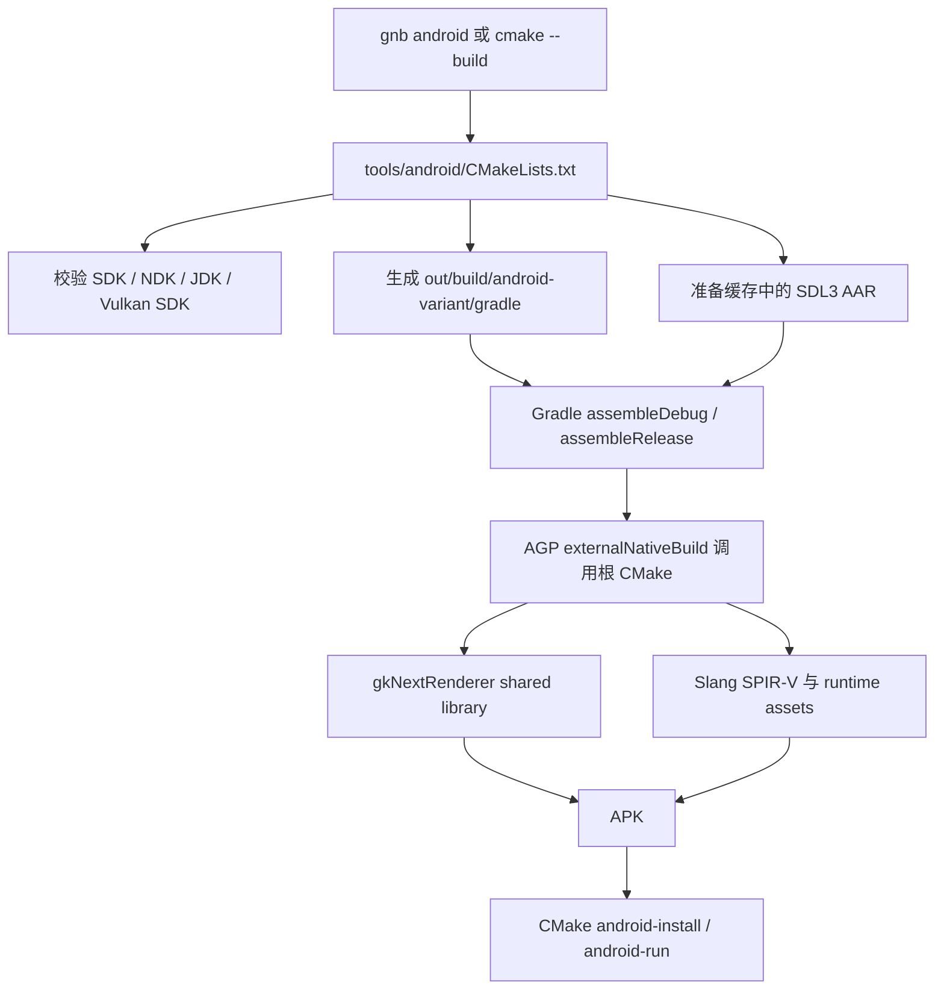

# Android 纯 CMake 驱动构建重构方案

> 2026-08-12：M1–M4 已完成。Windows + NDK 27.0.12077973 + Android 35 环境完成
> debug APK 构建、安装和 16 KB page-size AVD 启动验收，日志出现
> `committed scene [conf_room.glb]`。SDL AAR 升级至 3.4.10 以提供 16 KB LOAD 对齐；
> driver 同时加入 libc++ `<ranges>` 能力前置检查，避免使用不兼容 NDK 时在 native 编译中段失败。

## 1. 目标与结论

本方案以 `P:/github/AndroidTest` 已在本机 AVD 验证通过的“模板生成临时 Gradle 工程、CMake 编译 native target、Gradle 只负责 Android 打包”模式为基线，重做 gkNextRenderer 的 Android 构建链。

最终目标：

- 删除仓库根目录 `android/`，不再维护一个可变的、半源码半产物的 Gradle 工程。
- Android 模板归 `tools/android/templates/` 所有；每次构建生成到 `out/build/android-<variant>/gradle/`。
- CMake 是唯一构建编排者；Gradle 仍作为生成 APK 所必需的内部打包后端，但不再是用户和 `gnb` 直接操作的入口。
- 保留 `gnb android [debug|release]` 作为仓库统一 CLI；它只调用 CMake configure/build，不再了解 Gradle task、APK 内部路径或 `adb` 细节。
- native、assets、Gradle 中间文件和 APK 全部位于 `out/`，构建后源码树保持干净。
- 第一阶段仅迁移当前 `gkNextRenderer`、`arm64-v8a` 和现有 SDK/API 策略，不借机重做运行时或增加多 ABI。

这里的“纯 CMake 驱动”是指公开入口、阶段依赖、环境校验、模板生成、打包、安装和启动均由 CMake target 编排；并不表示手写 ZIP 取代 Android Gradle Plugin。APK manifest/resource 合并、AAR/Prefab 解析和签名仍应交给 Android 官方打包链。

## 2. 现状问题

当前链路为：

```text
gnb android
  -> android/gradlew installAndLaunch 或 build
    -> Gradle externalNativeBuild
      -> 根 CMakeLists.txt
        -> gkNextRenderer.so + Assets
    -> APK / adb install / adb logcat
```

主要问题：

1. 根 `android/` 一共跟踪 118 个文件，混合了 Gradle wrapper、应用模板、Java、资源、公开 keystore、12 个自定义 triplet 和 69 个 community triplet。
2. `assets/cmake/RuntimeAssets.cmake` 将 Android 资产写回 `android/app/src/main/assets/`，构建会修改源码目录。
3. `gnb` 直接知道 `gradlew`、`installAndLaunch` 和 `android/` 路径，构建策略散落在 Go、Groovy 和 CMake 三处。
4. Gradle 固定要求 SDK 内安装 CMake `3.31.6`；它与根 CMake 的真实最低版本、用户 PATH 中的 CMake 以及参考项目已验证的环境没有统一来源。
5. `android/custom-triplets/arm64-android.cmake` 带有只适用于 macOS NDK 布局的 `VULKAN_SDK` 设置；同时当前 vcpkg baseline 已提供内建 `arm64-android` triplet。
6. SDL AAR 下载、native build、asset 生成、APK 打包和安装启动没有清晰的产物契约，失败后也难以从固定目录定位结果。

## 3. 从 AndroidTest 采用与不采用的部分

### 3.1 采用

- Gradle 工程是模板，不是长期存在的工作目录。
- 每次 configure 生成独立 staging 目录。
- 根 CMake 继续拥有 native shared library。
- APK 构建、安装、启动是可独立调用的目标。
- SDK/JDK 路径来自环境或显式 cache variable，不写入仓库文件。

### 3.2 不直接采用

AndroidTest 使用 NDK `NativeActivity` 和 `android_native_app_glue`；gkNextRenderer 当前依赖 SDL3 的 `SDLActivity`、AAR/Prefab、SDL callback main、外部存储 asset 复制以及 Java 侧库加载顺序。直接改成 `android.app.NativeActivity` 会变成一次平台运行时重写，不符合“改动尽可能精简”。

因此本次保留：

- SDL3 AAR 和 Prefab；
- 当前 `AndroidMain.cpp` 的 SDL callback 入口；
- 一个最小的 `GkNextActivity extends SDLActivity`；
- 当前 debug/release 库名契约：`gkNextRendererd` / `gkNextRenderer`；
- 当前 asset 落到 external files 后由引擎读取的运行时语义。

NativeActivity、直接读取 APK AssetManager、移除 Java asset 复制等优化应作为独立后续任务，不与构建迁移捆绑。

## 4. 目标架构



职责边界：

| 层 | 唯一职责 |
|---|---|
| `tools/android/CMakeLists.txt` | 环境解析、模板生成、依赖顺序、Gradle 调用、APK 归档、adb 安装与启动 |
| `tools/android/templates/` | Android application metadata、SDL Activity、资源、Gradle wrapper 和最薄的 AGP 配置 |
| 根 CMake | Android native target、vcpkg 依赖、shader 和 runtime assets |
| Gradle/AGP | AAR/Prefab 解析、externalNativeBuild 桥接、manifest/resource 合并、APK 与签名 |
| `gnb` | 保留统一命令体验，将 mode 映射为 CMake build 目录和 target |

禁止重新引入独立 PowerShell/Bash Android 构建脚本。Windows、Linux 和 macOS 主机差异在 driver CMake 中用 `CMAKE_HOST_WIN32` 等处理。

## 5. 目录与产物布局

建议的版本库布局：

```text
tools/android/
├── CMakeLists.txt
├── cmake/
│   └── FetchSdlAar.cmake
└── templates/
    ├── build.gradle
    ├── settings.gradle
    ├── gradle.properties
    ├── gradlew
    ├── gradlew.bat
    ├── gradle/wrapper/
    │   ├── gradle-wrapper.jar
    │   └── gradle-wrapper.properties
    └── app/
        ├── build.gradle.in
        └── src/main/
            ├── AndroidManifest.xml
            ├── java/com/gknext/renderer/GkNextActivity.java
            └── res/values/{strings.xml,styles.xml}
```

不保留 launcher 图标全集、backup XML、空 proguard 文件、`copy-sdl-aars-here.txt` 或仓库内 keystore；只有 manifest 实际引用的资源进入模板。

建议的构建布局：

```text
out/build/android-debug/
├── gradle/                 # 生成的临时 Gradle 工程
├── native/                 # AGP/CMake native staging
├── assets/assets/          # 运行时资产和编译后的 .spv
├── cache/SDL3-<ver>.aar    # 可复用下载缓存或其稳定引用
└── apk/gkNextRenderer-debug.apk

out/build/android-release/
└── apk/gkNextRenderer-release.apk
```

路径不包含用户名、盘符或本机 SDK 位置。`/out/` 已被根 `.gitignore` 忽略，因此删除旧 Android 专用 ignore 项即可。

## 6. CMake driver 设计

`tools/android/CMakeLists.txt` 使用 `project(gkNextAndroidDriver LANGUAGES NONE)`，避免为只做编排的 host project 探测 C/C++ 编译器。

### 6.1 输入

只暴露必要参数：

| 变量 | 默认/来源 | 说明 |
|---|---|---|
| `GK_ANDROID_VARIANT` | `debug` | `debug` 或 `release` |
| `GK_ANDROID_ABI` | `arm64-v8a` | 本次只验收该 ABI |
| `GK_ANDROID_SDK_ROOT` | `ANDROID_SDK_ROOT`，回退 `ANDROID_HOME` | Android SDK |
| `GK_ANDROID_NDK_ROOT` | 显式值，回退 SDK/环境可发现的 NDK | 传给 Gradle/CMake，不写死用户路径 |
| `GK_ANDROID_JAVA_HOME` | `JAVA_HOME` | JDK；不复制 AndroidTest 的本地 `jdk17/` |
| `GK_ANDROID_SERIAL` | 空 | 多设备时显式选择 adb serial |

应用 ID、Activity、min/target/compile SDK、SDL 版本是项目策略，不做成日常命令行参数。迁移阶段保持当前值，避免把版本升级混入结构重构。

迁移基线固定为当前仓库值，而不是顺带切换到 AndroidTest 的版本组合：

| 项目策略 | 迁移基线 |
|---|---|
| application ID | `com.gknext.renderer` |
| ABI | `arm64-v8a` |
| min / target / compile SDK | `21` / `35` / `35` |
| native API | `33` |
| SDL AAR | `3.4.10`（3.2.22 的预编译库仅 4 KB 对齐，无法在 Android 15 16 KB page-size 设备加载） |
| Android Gradle Plugin / Gradle wrapper | `8.7.0` / `8.12` |

AndroidTest 的 AGP `8.2.2`、Gradle `8.7`、SDK `34` 证明模板化路径可行，但版本降级与本次目录/职责重构无关。若当前组合本身无法在已验证环境运行，应单独记录工具兼容性结论后再调整版本，不能在迁移中静默改变。

### 6.2 目标

- `android-prepare`：校验工具，复制/配置模板，准备 SDL AAR 和生成的 `local.properties`。
- `android-apk`：依赖 `android-prepare`，执行对应 `assembleDebug`/`assembleRelease`，将 APK 复制到固定 `apk/` 路径。
- `android-install`：依赖 `android-apk`，检查设备数并执行 `adb install -r`；无设备或多设备未指定 serial 时明确失败。
- `android-run`：依赖 `android-install`，启动固定 component；只用于可安装的 debug 包。
- `android-logcat`：独立前台目标，按 gkNext tag 过滤日志，不隐式挂在构建后无限阻塞。

所有命令使用 `cmake -E`、`cmake -P` 和 `VERBATIM`，不在 CMake 中拼接依赖 PowerShell/bash 语义的命令字符串。

### 6.3 工具发现

configure 阶段一次性验证：

- `${GK_ANDROID_SDK_ROOT}/platform-tools/adb`；
- NDK toolchain 文件；
- `${GK_ANDROID_JAVA_HOME}/bin/java`；
- 当前 `${CMAKE_COMMAND}` 满足根项目 `cmake_minimum_required`；
- Gradle wrapper/template 完整；
- vcpkg toolchain 已由 `gnb setup` 准备；
- host `slangc` 可由当前 Vulkan SDK/项目 external 发现。

不要在 Gradle 中固定 SDK Manager 的某个 CMake component 版本。driver 应把当前可执行的 CMake 位置传给生成工程，使“外层编排 CMake”和“AGP 调用的 native CMake”来自同一安装。

## 7. Gradle 模板约束

模板应保持声明式和最小化：

1. `externalNativeBuild.cmake.path` 指向生成时注入的仓库根 `CMakeLists.txt`。
2. `buildStagingDirectory` 指向 `out/build/android-<variant>/native/`，不生成 `.cxx` 到模板或源码树。
3. 仅启用 `arm64-v8a`、Prefab 和当前 debug/release build type。
4. CMake arguments 只传稳定边界：vcpkg toolchain、NDK chainload toolchain、内建 `arm64-android` triplet、Android API、asset 输出目录。
5. SDL AAR 由 `android-prepare` 放到 build cache；Gradle 只声明 `implementation files(...)`，不再包含下载脚本。
6. Android asset merge 必须显式依赖相同 variant 的 native/Assets 构建，保证全新 staging 目录第一次打包就包含 `.spv`，不能依赖上一次构建残留。
7. 删除 `installAndLaunch` 和 logcat Gradle task；这些属于 CMake driver。
8. debug 使用 Android 默认 debug 签名。release 默认只做可重复的构建验证；正式签名通过未入库的显式参数注入，不提交通用密码和 keystore。

模板生成时只替换路径和构建参数；不要动态生成大段 Groovy，以便模板本身可审阅、可在 staging 目录单独排障。

## 8. 根 CMake 与 vcpkg 收口

### 8.1 Asset 输出

将 `assets/cmake/RuntimeAssets.cmake` 中写死的 `../android/app/src/main/assets/assets/` 替换为必填 cache path，例如 `GK_ANDROID_ASSET_OUTPUT_DIR`。Android configure 未提供该值时直接报错，避免悄悄写错位置。

`Assets` 继续作为 `gkNextRenderer` 的依赖，保留当前 Slang 的 `PLATFORM_ANDROID` define。模板/Gradle 必须保证 APK merge 在 `Assets` 完成后发生。

### 8.2 Triplet

删除 `android/custom-triplets/`，并从 `vcpkg-configuration.json` 删除两个 `overlay-triplets` 项。统一使用当前 vcpkg registry 的内建 `arm64-android`，Android API/ABI 由 native CMake arguments 明确传入。

已检查当前 `.vcpkg/triplets/arm64-android.cmake`：内建 triplet 使用 dynamic CRT、static libraries 和默认 API 28；旧项目 triplet 使用 static CRT 和 API 31，而 Gradle 当前又显式要求 `c++_shared` 与 native API 33。目标状态采用内建 triplet 并显式统一到 API 33，使 `c++_shared` 语义不再互相冲突。必须以 configure 日志和 APK 中的 `libc++_shared.so` 做实测，不能把这项差异当成纯文件搬迁。

在删除前做一次依赖 configure 对照，确认以下信息仍进入 vcpkg：

- `VCPKG_TARGET_TRIPLET=arm64-android`；
- `ANDROID_ABI=arm64-v8a`；
- NDK chainload toolchain；
- 统一 Android API level；
- static/dynamic linkage 与最终 APK 中的 `.so` 集合符合预期。

不迁移当前 custom triplet 中的 macOS 专用 `VULKAN_SDK` 环境赋值。

### 8.3 SDL

继续让 Gradle Prefab 为 native configure 提供 `SDL3::SDL3`。SDL 版本与下载 SHA256 在 driver CMake 中成对固定；首次下载后进入 `out/`/外部缓存，不写入 `tools/android/templates` 或源码树。

本阶段不改为 vcpkg Android SDL，以免同时改变 Java SDLActivity、native `.so` 来源和库加载关系。

## 9. gnb 与 CI

保留用户命令：

```bash
./gnb.sh android debug
./gnb.sh android release
```

Windows 对应 `gnb.bat`。`tools/gnb/internal/android/android.go` 只做：

1. 确保仓库 external/vcpkg/Vulkan SDK 已准备；
2. 选择 `out/build/android-debug` 或 `out/build/android-release`；
3. 调用 `cmake -S tools/android -B <dir> -DGK_ANDROID_VARIANT=<mode>`；
4. debug 构建 `android-run`，release 构建 `android-apk`。

Go 层不再直接执行 Gradle、adb 或拼 APK 路径。若需要只构建不启动，应给 `gnb android` 增加一个小的显式 flag，而不是恢复 Gradle task 泄漏。

`.github/workflows/android.yml` 可继续使用 `./gnb.sh android release`；缓存键和 artifact 路径更新为新 `out/` 位置。CI 使用 JDK setup 提供的 `JAVA_HOME`，本地使用用户环境或 Android Studio JBR，不在仓库内保存 JDK。

## 10. 实施步骤

### M1：建立新 driver 与模板

1. 新增 `tools/android/CMakeLists.txt`、SDL 获取脚本和最小模板。
2. 从当前 Android 工程只迁移仍必要的 manifest、SDL Activity 行为、styles/strings 和 wrapper。
3. 生成 build-tree Gradle 工程，确保其中没有绝对路径被提交。
4. 暂时保留旧 `android/` 只用于结果对照，不建立长期兼容分支。

完成条件：`android-prepare` 可在 Windows 与 Linux CI 环境 configure，生成目录可被 Gradle 识别。

### M2：打通 native、asset 与 APK

1. 将 Android asset 输出改为 cache variable 指定的 build-tree 路径。
2. Gradle externalNativeBuild 传递 vcpkg/NDK/ABI/API/asset 参数。
3. 固化 native build 与 asset merge 的 variant 依赖。
4. 生成固定命名 APK，并检查其中 native libraries、manifest 和关键 assets。

完成条件：全新删除 `out/build/android-debug` 后，一次 `android-apk` 即得到完整 APK，不依赖源码树或历史产物。

### M3：切换 gnb、adb 与 CI

1. 将 `gnb android` 改为调用 driver CMake。
2. 添加 install/run/logcat CMake target 的设备检查和错误信息。
3. 更新 Android CI 缓存与 artifact 路径。
4. 在本机 AVD 完成 debug 安装、启动和日志验收；在 CI 完成 release 构建。

完成条件：普通开发和 CI 均不直接调用 `gradlew`。

### M4：删除旧布局并清理文档

1. 删除整个根 `android/`。
2. 删除 `vcpkg-configuration.json` 的 Android overlay triplet 引用。
3. 清理 `.gitignore`、`tools/validate_cmake.sh` 和源码中的旧 `android/` 路径。
4. 更新 `AGENTS.md`、`docs/guides/gnb-cli.md`、`docs/guides/cmake-structure.md`、`docs/AGENT_GUIDE/quick-commands.md` 与 `contextual-rules.md` 的 Android 输出说明。
5. 通过 `rg` 确认没有把已删除目录当作当前入口的文档或代码。

完成条件：构建前后 `git status --short` 均不出现 Android 生成文件，根目录不存在 `android/`。

## 11. 验收清单

### 构建

- Windows：从空 Android build 目录执行 `gnb.bat android debug` 成功。
- Linux CI：执行 `./gnb.sh android release` 成功。
- 不要求安装 Android SDK CMake `3.31.6`；实际使用的 CMake 版本在日志中唯一、明确。
- 构建过程中没有第二个并发 gnb/CMake/Ninja 构建。

### APK 内容

- 固定产物存在：`out/build/android-debug/apk/gkNextRenderer-debug.apk`。
- APK 含 `arm64-v8a` 的 SDL3 和 gkNextRenderer shared library，debug 后缀与 Java 加载名一致。
- APK 中 `libc++_shared.so` 与 native/vcpkg 链接策略一致，无缺失或重复冲突。
- APK 含 `assets/shaders/*.spv` 和当前运行场景所需资源。
- `aapt dump badging`/等价检查显示 application ID 和 launchable activity 正确。

### AVD 运行

- `adb install -r` 成功，Activity 启动成功。
- logcat 无 `UnsatisfiedLinkError`、Prefab/asset 路径错误或 Vulkan loader 初始化错误。
- 日志出现 `committed scene [...]`。
- 第二次增量构建可复用 Gradle/vcpkg/SDL 缓存；删除 staging 后仍可从零重建。

### 仓库卫生

- 根 `android/` 已删除。
- `git status --short` 在构建前后保持一致。
- 仓库内无 JDK、SDK、NDK、keystore 密码、`local.properties`、APK 或 `.cxx/.gradle` 产物。
- `rg "android/app|android/custom-triplets|installAndLaunch|CMake 3.31.6"` 不再命中现行构建代码和现行文档。

## 12. 风险与控制

| 风险 | 控制方式 |
|---|---|
| 把参考项目的 NativeActivity 直接套到 SDL 引擎导致启动失败 | 明确保留 SDLActivity/Prefab，运行时迁移另立任务 |
| 第一次干净构建 APK 缺 shader/assets | Gradle asset merge 显式依赖 native `Assets`，以删空 staging 的构建作为验收 |
| debug shared library 后缀与 Java 加载名不一致 | APK 内容检查 + AVD `UnsatisfiedLinkError` 验收 |
| 删除 custom triplet 改变依赖链接方式 | M2 先对照 CMake/vcpkg configure 输出和 APK `.so` 列表，再删除旧目录 |
| Gradle 使用了另一套 CMake | driver 注入当前 `${CMAKE_COMMAND}`，日志打印最终解析路径 |
| release 签名行为改变 | 将“CI 可构建”和“正式签名发布”分开；签名参数只从安全环境注入 |
| 多个设备时安装到错误目标 | 零设备/多设备默认失败，使用 `GK_ANDROID_SERIAL` 明确选择 |

## 13. 预期改动面

新增：

- `tools/android/CMakeLists.txt`
- `tools/android/cmake/FetchSdlAar.cmake`
- `tools/android/templates/**`

修改：

- `assets/cmake/RuntimeAssets.cmake`
- `vcpkg-configuration.json`
- `tools/gnb/internal/android/android.go`
- `tools/gnb/cmd/gnb/main.go`（仅帮助文本/可选 flag）
- `.github/workflows/android.yml`
- `.gitignore`
- `tools/validate_cmake.sh`
- Android 相关现行文档

删除：

- `android/**`

原则上不修改 `src/Engine/**`、渲染代码、`AndroidMain.cpp` 或应用业务代码。若实施中发现必须修改这些文件，应先把原因从“构建布局问题”与“Android 运行时问题”中分离，避免扩大本重构范围。
