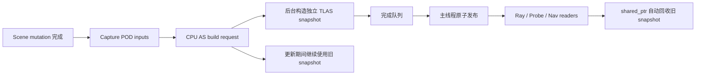

# CPU TLAS 异步与并行更新计划

## 结论

`FCPUAccelerationStructure::UpdateBVH` 有明确的并行化空间，但要区分两个目标：

1. **消除主线程 23ms 尖峰：可行性高，且不依赖升级 tinybvh。**
   把实例快照构造、TLAS build 和 nav bounds diff 放到后台，以不可变 snapshot 原子发布；主线程只发请求、轮询完成并合并结果。
2. **缩短 tinybvh `Build` 自身的 wall time：当前 vendored 1.3.8 可行性低，升级后可行性中高。**
   仓库内的 tinybvh 1.3.8 builder 是串行实现，没有并行 build hook。官方 1.8.0 已提供 threaded build 和
   `BVHContext` 的 `spawn` / `barrier` / `parallel_for` hook，可以接入引擎任务池；这条路线必须作为独立依赖升级 gate，
   不能直接在 `ThirdParty/` 内打私有补丁。
3. **逐节点输入准备可立即并行。**
   节点筛选、transform/AABB、`BLASInstance`、材质上下文和 nav bounds 生成彼此独立，可采用主线程计数和固定区间写入，
   工作线程数取 `max(1, hardware_concurrency() / 2)`。
4. **不能直接对 TLAS 调用 `BVH::Refit`。**
   本地版本的实现按三角形叶节点 refit；官方 1.8.0 更明确拒绝 TLAS refit。若未来需要增量 refit，必须由引擎维护
   TLAS parent/leaf 元数据、质量退化策略和周期重建，不能把现有 `Refit()` 当作捷径。

推荐按“度量拆分 → 不可变快照 → 后台串行 build → 并行输入准备 → tinybvh 升级 gate → 可选静动态拆分”推进。
前四阶段已经能把主要问题从 frame time 移出；只有 benchmark 证明后台 build latency 仍不满足 30 帧更新周期时，
才进入依赖升级与 builder 内部并行。

## 当前实现与瓶颈

### 当前调用时序

运行时更新位于 `Scene::Tick`：

- 每 30 帧检查一次 CPU AS；
- voxel/ambient 路径通过 `AsyncProcessFull(..., incremental=true)` 间接调用 `UpdateBVH`；
- 无 voxel 更新需求时直接同步调用 `RebuildBVHOnly`；
- 调用完成后立即清除 `sceneDirtyForCpuAS_`。

初次载入时，`Scene::RebuildMeshBuffer` 调用 `InitBVH`，先为每个 model 构造 BLAS，再同步构造首个 TLAS。
初始构建必须在 `OnSceneLoaded` 和 NavGrid 首次采样前得到可用快照；运行时重建则可以允许有限陈旧。

### `UpdateBVH` 当前包含的工作

当前函数把下列不同性质的成本揉在一次主线程调用中：

1. 扫描旧 `bvhTLASContexts`，建立 `previousNavBounds` 哈希表；
2. 顺序扫描 `scene.Nodes()` 并筛选 RenderComponent；
3. 对每个实例调用 `RecalcTransform(true)`；
4. 用 model local AABB 与 world transform 计算 world bounds；
5. 构造 `tinybvh::BLASInstance`、16 个 material slot 和 `FCPUTLASInstanceInfo`；
6. 建立 `currentNavBounds`，再做两次 map diff；
7. 在全局 `FCpuBvhState::bvh` 上原地执行 tinybvh TLAS `Build`；
8. 调用全局 `WaitForAllParralledTask()`；
9. swap instance/context vectors，并重绑全局裸指针；
10. 合并 nav dirty bounds。

因此“23ms”必须先拆分为至少以下指标，不能默认全部来自 tinybvh：

- `capture/filter`；
- `transform + bounds`；
- `instance/context fill`；
- `nav diff`；
- `tinybvh instance Update/AABB preparation`；
- `tinybvh SAH build`；
- `global parallel drain`；
- `publish`。

### 当前并发模型的隐患

`CpuBvh.cpp` 中的 ray query 和 ProbeBaker worker 都通过进程级 `GCpuBvhState` 读取同一个 `tinybvh::BVH` 及三组裸指针。
`UpdateBVH` 则直接修改该 BVH，之后才等待通用 parallel queue。当前安全性依赖调用方事先保证没有 reader，而不是由数据结构和
发布协议保证：

- `AsyncProcessFull` 入口会检查通用并行任务是否完成，但 `RebuildBVHOnly` 没有同等的 snapshot/reader 保护；
- `WaitForAllParralledTask()` 会等待纹理、probe、node proxy 等不属于 CPU AS 的工作，范围过大；
- build 与 reader 一旦在新调用路径中重叠，原地修改 BVH 就会产生数据竞争；
- instance/context vector swap 后，全局裸指针的生命周期无法由 reader 自己延长。
- `GCpuBvhState` 是进程级单例，多 Scene、RenderView/preview 或切换 active Scene 时会互相覆盖，不只是线程安全问题；
- 0 instance 时当前代码跳过 `Build`，但仍 swap 成空 instance/context，旧 `bvh` 本体没有被清空，可能留下“旧树 + 空上下文”；
- `IsAllParralledTaskComplete()` 只检查 worker 是否 idle，不检查仍留在 `parralledTaskQueue_` 的任务，不能作为 CPU AS reader fence；
- `Scene::MarkDirty()` 会设置 `sceneDirtyForCpuAS_`，但 `MarkTransformDirty()` 当前不会，纯 transform 变化可能没有形成 CPU AS pose revision。

所以只把现有 `UpdateBVH` 整体塞进 worker 是不完整方案：它会把卡顿移走，却把 active BVH 的并发读写变成真实竞态。

## 可行性矩阵

| 方案 | 主线程收益 | Build wall time | 风险 | 建议 |
|---|---:|---:|---|---|
| 后台构造独立 TLAS snapshot，完成后原子发布 | 很高 | 不变 | 中；需重做所有权 | 第一优先级 |
| 并行节点输入准备、固定区间写入 | 高 | 小幅降低 | 低至中；需锁定 Scene 读取窗口 | 第一优先级 |
| tinybvh 1.3.8 内部直接并行 | 不适用 | 潜在高 | 很高；需 fork 第三方 builder | 不采用 |
| 升级 tinybvh 1.8 并接入任务池 hook | 高 | 中至高 | 中；依赖升级与缓存兼容 | benchmark gate 后采用 |
| 对现有 TLAS 调用 `BVH::Refit` | 高 | 看似很高 | 致命；API 不支持 TLAS | 禁止 |
| 引擎自维护 TLAS refit | 高 | 高 | 高；依赖 tinybvh 内部 layout、质量会退化 | 暂不采用 |
| 静态 TLAS + 动态 TLAS | 高 | 动态比例低时很高 | 中；查询需遍历两棵树 | 后续决策项 |
| 多 shard TLAS forest | 中 | 高 | 高；查询、hit index、nav 语义复杂 | 不作为默认路线 |
| 给 active BVH 加全局读写锁 | 低 | 不变 | 高；ray/probe 会制造新卡顿 | 不采用 |

## 目标架构

### 1. 不可变 snapshot

引入三个所有权层次：

```cpp
struct FCPUBLASSet
{
    uint64_t generation = 0;
    std::vector<FCPUBLASContext> contexts;
    std::vector<tinybvh::BVHBase*> list;
};

struct FCPUMaterialTable
{
    uint64_t generation = 0;
    std::vector<FCPUMaterialView> entries; // 仅保留 CPU ray/probe 所需字段
};

struct FCPUTLASBuildInput
{
    uint64_t sceneRevision = 0;
    std::shared_ptr<const FCPUBLASSet> blasSet;
    std::shared_ptr<const FCPUMaterialTable> materialTable;
    std::vector<FCPUASInstanceInput> instances;
};

struct FCPUTLASSnapshot
{
    uint64_t sceneRevision = 0;
    std::shared_ptr<const FCPUBLASSet> blasSet;
    std::shared_ptr<const FCPUMaterialTable> materialTable;
    std::vector<tinybvh::BLASInstance> instances;
    std::vector<FCPUTLASInstanceInfo> contexts;
    tinybvh::BVH tlas;
};
```

关键约束：

- `FCPUTLASSnapshot` 从创建起就在最终 heap 地址上 build，build 后不 move；tinybvh 内部保存 instance/BLAS 指针；
- active snapshot 使用 C++20 `std::atomic<std::shared_ptr<const FCPUTLASSnapshot>>` 发布；
- 每次 ray query 在入口 acquire-load 一次并持有到查询结束；
- ProbeBaker 每个 task 或 batch 捕获一次 snapshot，避免每条 ray 都做 atomic shared_ptr 操作；
- snapshot 持有 `FCPUBLASSet`，scene reload 或 mesh rebuild 不会提前释放旧 reader 使用的 BLAS；
- `FCPUBLASSet::contexts` 是 BLAS owner，`list` 只是指向其中 `bvh` 的 non-owning view；必须先确定 contexts最终容量/地址，
  再生成 list，并在 set发布后禁止 resize/move；
- snapshot 同时持有与 instance material id 同 revision 的最小 `FCPUMaterialTable`。ProbeBaker 不再从 worker 调用
  `NextEngine::GetInstance()->GetScene().Materials()`；当前只需投影 `MaterialModel` 等 CPU probe 实际读取字段；
- build 中的 snapshot 永远不暴露给 reader，publish 后永远不再修改。

进程级 `GCpuBvhState` 及其裸指针应被删除，或仅在迁移期退化为 Scene-owned atomic snapshot owner；最终 ray API 显式接收/获取
目标 Scene 的 snapshot，不能通过 active Scene 隐式解析 BVH 或材质。

### 2. Capture、Build、Publish 三段式管线



Capture 只读取 Scene 并生成不含 `Node*`、`RenderComponent*` 的 POD 输入。Build 阶段不得再访问 Scene、Node、materials vector
或 physics component；这样后台 build 不需要 Scene 锁，也不会与下一帧 gameplay mutation 竞争。

Publish 在主线程执行，工作仅包括：

- 检查 request epoch / BLAS generation；
- atomic exchange active snapshot；
- 合并 build result 携带的 nav dirty bounds；
- 更新 published revision 和 profiling counters；
- 若构建期间又有更新，只保留最新 revision 并发起下一次 capture。

0 instance 也要发布一个显式 empty snapshot，并让 query 直接返回 miss；不能复用未清空的旧 `tinybvh::BVH`。当前
`AsyncProcessFull` 在同步 `UpdateBVH` 后才派发 voxel/probe 工作，改成异步后必须保留这一因果关系：依赖新几何的 voxel/probe batch
要等目标 revision publish 后再派发，并在 batch 入口固定持有该 snapshot，不能读取正在 build 的 candidate。

### 3. Revision 与请求合并

至少区分：

- `blasGeneration`：model topology/CPU mesh 改变；
- `instanceTopologyRevision`：实例加入、删除、model/participation/visibility 改变；
- `instancePoseRevision`：world transform 改变；
- `instanceMetadataRevision`：materials、ray-cast flag、nav mobility 改变。

`MarkTransformDirty()` 及所有直接修改 world/local transform 的入口必须递增 pose revision；不能继续只依靠
`sceneDirtyForCpuAS_` 这个容易漏标和过早清除的 bool。只有请求被 capture 接收或被明确合并时才算消费 dirty revision。

运行时最多允许：

- 1 个 building request；
- 1 个“latest requested revision”槽位。

不为每次 dirty 排队，避免高频移动产生无限 backlog。构建期间的新 revision 合并到 latest；当前结果完成后可以先发布，使陈旧程度向前推进，
随后立即为 latest 再构建。scene unload/reload 则递增 epoch，取消未发布结果，并等待持有旧 BLAS set 的 build task 退出。

`sceneDirtyForCpuAS_` 不能在“请求被接受”时直接清零。只有满足以下之一时才可认为该 revision 已处理：

- 对应或更新的 snapshot 已发布；
- revision 已被明确合并进当前 in-flight/latest request。

## 任务调度设计

### Capture 并行

沿用 Scene node proxy 更新已经采用的模式：

1. 主线程简单遍历，判断 CPU AS eligibility，计算精确输出数量和每个 work item 的输出区间；
2. 一次性 `resize` input vector；
3. 按 `max(1, hardware_concurrency() / 2)` 划分连续区间；
4. 每个 worker 只写自己的区间；
5. 计数和 dirty-bounds 局部归约，任务结束时再合并，避免逐节点原子操作；
6. 最后一个 capture task 完成后，把纯 POD input 交给专用 build host。

共享原子只用于 group countdown、已处理数量等少量标量（`fetch_add`/`fetch_sub`，尽量 relaxed）；instance/context本体不做并发
`push_back`，也不为每个节点争用全局计数器。

若 `UpdateNodesGpuDriven` 已在同一 Scene mutation 之后完成候选节点遍历和分区，可复用它的半核心 worker预算、稳定 node index/range
及调度基础设施，避免同帧创建第二套全量分片；但 CPU AS eligibility 与 GPU proxy eligibility 必须分别判断，不能假设两者数量或顺序相同。

不建议 worker 调用 `Node::RecalcTransform(true)`。parent/child transform 递归会跨节点写数据，破坏“每个任务只写独占节点”的假设。
应先确认 Scene mutation 阶段已经产生最终 world transform，capture 只复制 `WorldTransform()`。若确实需要统一 transform propagation，另建按层级的
Scene transform phase，不夹在 CPU AS capture 内。

world AABB 可把当前 8-corner 变换替换为等价的 affine center/extents 公式：

```text
worldCenter = M * localCenter
worldExtent = abs(mat3(M)) * localExtent
worldMin/Max = worldCenter -/+ worldExtent
```

这项优化独立于多线程，应先用旋转、非均匀缩放、负缩放测试确认结果，再纳入 capture。

### Build host 与 task group

增加专用串行 host（例如 `ENamedTaskThread::CPU_AS_BUILD`），保证同一个 `FCPUAccelerationStructure` 同时只有一次 build。
host 负责执行 tinybvh Build；它不是 active snapshot reader，也不在通用 parallel worker 中阻塞等待自己的子任务。

TaskCoordinator 需要 scoped task group/fence，而不是 `WaitForAllParralledTask()`：

- `CreateTaskGroup()`；
- `AddParallelTask(group, func, priority)`；
- `Wait(group, assist=true)`；
- group 完成不依赖全局 `completedTaskIds_`，完成后可立即回收；
- group 的未完成计数覆盖 queued + running，不能复用当前只观察 worker idle 的 `IsAllParralledTaskComplete()`；
- CPU AS 子任务为低优先级，node proxy/frame-critical task 优先；
- 总并行预算默认核心数一半，至少 1；不额外创建另一套全核心 worker。

后台串行 tinybvh 1.3.8 build 阶段只占 build host 一个核心。进入 1.8 threaded build 后，host 通过 scoped group 派生 subtree/binning
任务并在 barrier 中协助执行，避免嵌套任务死锁。

## tinybvh 路线

### 当前 1.3.8

仓库版本为 1.3.8。TLAS `Build(BLASInstance*, ...)` 顺序执行：

1. 更新每个 instance 的 BLAS-derived AABB；
2. 填 fragment/root bounds；
3. 执行串行 binned SAH subdivision。

本地 TLAS overload 最终直接调用标量 `Build()`；旁边的 “or BuildAVX” 只是注释，`BuildAVX` 的公开 overload 只覆盖 triangle input。
它没有线程池参数或并行 hook。可以在不同线程上并发构造**不同的** `tinybvh::BVH` 实例，但不能让多个线程同时修改同一个 builder。
因此本计划在不升级时只做：独立 snapshot 后台 build，以及 tinybvh 外部的 capture 并行。

### 官方 1.8 threaded build gate

官方 1.8.0 提供：

- `ENABLE_THREADED_BUILDS`；
- `BVHContext::spawn` / `barrier` / `parallel_for`；
- 可禁用内建 pool 并接入引擎 pool；
- 默认 `MT_BUILD_THRESHOLD=50000`，大 TLAS 才进入并行路径；
- subtree fork/join 与 AVX binning parallel-for。

参考：

- [TinyBVH 官方仓库与 1.8.0 功能说明](https://github.com/jbikker/tinybvh)
- [固定 revision 的 BVHContext/threaded build 实现](https://github.com/jbikker/tinybvh/blob/0e4584287823252cf83f0e9cd072848bec5f79c5/tiny_bvh.h)

由于仓库规则禁止 agent 直接修改 `ThirdParty/`，依赖升级必须单独获得授权并采用正式 vendoring/update 流程。不得只拷贝官方 builder 的几段代码
到 Engine 中形成无人维护的 fork。

升级 spike 必须处理：

1. 1.3.8 → 1.8.0 API/ABI 差异；
2. Windows AVX、Linux x86、macOS/Android/iOS ARM NEON 编译；
3. `cpubvh` disk cache 版本。当前 cache key 只有 vertex hash；新版本 `Load` 失败必须检查返回值并 rebuild，cache namespace/key 应包含
   tinybvh version、layout 和 build settings；
4. `BVHContext` adapter payload copy、group fence 和异常/取消语义；
5. 内建 tinybvh pool必须关闭，否则会在引擎核心数一半的 pool之外再创建全核心线程并过度订阅；
6. TLAS build、BLAS cache load/save、ray hit index 和 material mapping parity；
7. threaded build 只在实例数超过实测 threshold 时启用，小场景保持串行。

只有满足以下 gate 才默认启用 threaded build：

- 50k+ instances、8+ logical cores 上，background build wall time p95 至少提升 1.8×；
- frame-critical node proxy/probe task p95 没有退化超过 5%；
- ray traversal throughput/SAH cost没有显著退化；
- 所有目标平台编译通过。

否则保留“后台串行 build”，因为它已经消除了主线程尖峰。

## Nav dirty bounds

Nav diff 不应再依赖 active mutable vectors。每个 build input/output携带 revision 和 nav records，后台把“构建基线 snapshot”与新 input 比较，
产生一个 dirty union：

- 新增：加入 current bounds；
- 删除：加入 previous bounds；
- 移动：同时加入 previous/current bounds；
- metadata 从 navRelevant ↔ non-navRelevant：按删除/新增处理。

scene-reference internal nodes可能共享 editable node id。当前 unordered_map 的覆盖语义不够明确；实施前应以测试锁定语义，推荐同一 editable id 的
多个 nav bounds先求 union，再参与 diff，避免 vector 顺序影响结果。

完成结果只能在 snapshot publish 时合并到 `navRelevantDirtyWorldMin/Max`。若过期 result 被丢弃，则不能单独发布它的 nav bounds；后续 latest build
必须相对仍 active 的 snapshot 计算，保证变化不丢失。

## Ray reader 迁移

需要迁移的 reader 包括：

- `FCPUAccelerationStructure::RayCastInCPU`；
- `CpuBvh.cpp::TraceRay`；
- `FCPUProbeBaker::ProcessCube` 间接调用的 ray；
- Gameplay `FNavGrid` 的大量 raycast；
- editor/engine picking。

读取契约：

1. query 从明确的目标 Scene 获取 snapshot；不再通过 `NextEngine` active Scene 取 BVH 或 material；
2. 一次逻辑 query/batch只使用一个 snapshot；
3. snapshot 内 instance、context、BLAS generation和 material generation必须一致；
4. publish 不等待 reader，旧 snapshot 由 shared ownership 延迟销毁；
5. runtime 删除节点后，旧 snapshot 可能短暂返回旧 nodeId；面向 Scene 的 picking API必须验证 nodeId仍存在，或 topology change 使用更严格的
   publish barrier；
6. scene reload/model topology change必须等待 build host退出或由 shared BLAS/material set保证资源存活，不能仅清空通用 parallel queue。

## 可选：Static/Dynamic TLAS 拆分

如果完成 threaded build 后，巨量场景仍因每次重建所有实例超出更新周期，则进入此决策阶段：

- static TLAS：静态、长期不变实例，只在 topology/visibility/model改变时 rebuild；
- dynamic TLAS：会移动的 kinematic/dynamic 实例，按当前 cadence rebuild；
- query 同时遍历两棵 TLAS，选择最近 hit；
- 两棵 TLAS共享同一个 immutable BLAS set。

启用条件建议为：

- total instances ≥ 50k；
- 连续采样中 pose-dirty 比例 p95 ≤ 10%；
- 双 TLAS query throughput 退化 ≤ 10%；
- static rebuild频率远低于 dynamic rebuild。

这条路线对“大量静态节点 + 少量移动对象”收益很高；对所有实例持续运动的场景没有帮助。第一版不实现 TLAS forest 或多层 TLAS，因为 tinybvh
hit instance index、material context和 nav mapping 都需要额外重写。

## 分阶段实施

### 阶段 0：基线与分段计时

工作：

1. 为 UpdateBVH 增加前述八段 wall-clock profiling；
2. 记录 instance/node/model count、nav record count、dirty reason、build revision；
3. 增加 CPU AS benchmark fixture：1k、10k、30k、50k、100k、131070 instances；
4. 每个规模测试 0%、1%、10%、100% transform dirty；
5. 记录主线程时间、后台 wall time、SAH cost、ray throughput和内存峰值。

完成标准：

- 能确认 23ms 中 tinybvh Build 与 Scene/input准备各占多少；
- benchmark 可重复，固定 seed，Release 构建；
- 不改变现有行为。

### 阶段 1：不可变 snapshot与 reader迁移

工作：

1. 引入 `FCPUBLASSet` / `FCPUMaterialTable` / `FCPUTLASSnapshot`；
2. 把 active snapshot owner收进 `Scene`/`FCPUAccelerationStructure`，消除 `GCpuBvhState` 裸指针发布；
3. 所有 query acquire目标 Scene snapshot并持有到结束；
4. ProbeBaker task捕获 batch snapshot，材质读取改用 snapshot material projection；
5. 初始加载仍同步 build，但构造到独立 snapshot后一次发布；0 instance发布显式 empty snapshot；
6. 增加 Scene unload/build cancel/join 生命周期处理；
7. 增加并发 reader/publish 与双 Scene 隔离 stress test。

完成标准：

- active snapshot publish 后不可变；
- 8 个并发 ray reader 与连续 1000 次 snapshot publish无竞态、崩溃或无效指针；
- 两个 Scene/preview 同时存在时，query不会读到另一个 Scene 的 TLAS或 materials；
- ThreadSanitizer（Linux）通过 CPU AS stress test；
- ray/material/nav结果与旧实现 parity。

### 阶段 2：运行时后台串行 build与请求合并

工作：

1. 增加 CPU AS build host和 state machine；
2. Scene runtime update改为 Request/Poll/Publish；
3. building期间继续使用 active snapshot；
4. 只保留一个 latest revision；
5. 把 nav dirty bounds放入 build result，在 publish合并；
6. 依赖新几何的 voxel/probe batch等待目标 revision publish，并固定持有该 snapshot；
7. 删除 `UpdateBVH` 内全局 `WaitForAllParralledTask()`。

完成标准：

- 30k/100k scene runtime rebuild不再产生 tinybvh Build 主线程尖峰；
- tinybvh Build 在主线程上的时间为 0；这一阶段仍单独报告同步 POD capture成本，不把它伪装成已解决；
- build backlog恒定有界；
- 运行时 snapshot staleness有统计，并且 p95 build-to-publish 小于当前 30-frame更新周期。

### 阶段 3：并行 Capture与 cheap path

工作：

1. 主线程精确计数和固定输出区间；
2. 核心数一半 worker并行生成 input；
3. 局部统计归约；
4. 移除/证明不需要 capture 内 `RecalcTransform(true)`；
5. 验证后使用 center/extents world bounds；
6. `MarkTransformDirty`及所有 transform mutation入口改为 pose revision；
7. 能与 `UpdateNodesGpuDriven` 同阶段运行时复用其分区/worker预算；
8. metadata-only change不重建 TLAS时增加 context-only snapshot路径（需保证 tinybvh instance顺序不变）。

完成标准：

- input与旧实现逐实例一致；
- 同一 scene多次生成的 instance顺序稳定；
- capture wall time相对单线程至少提升 1.5×（≥30k nodes、8+ logical cores）；
- 主线程 CPU AS capture/request/publish p95：30k ≤ 1ms，131070 ≤ 2ms；
- frame-critical parallel task没有明显饥饿。

### 阶段 4：tinybvh 1.8 threaded build spike

前置：用户明确授权依赖升级，且阶段 2 数据证明后台 build latency仍值得优化。

工作：

1. 正式升级 tinybvh并版本化 cache；
2. 实现 TaskCoordinator scoped group；
3. 用 `BVHContext` hook适配引擎 pool；
4. 禁用 tinybvh内建 pool；
5. 对 10k～131070 instances扫描 build threshold与 worker count；
6. Windows/Linux/macOS ARM验证，Android/iOS至少完成编译验证。

完成标准：采用前述 1.8× speedup、≤5% task regression gate。不达标则关闭 threaded build并保留阶段 2 架构。

### 阶段 5：Static/Dynamic TLAS 决策

仅在 benchmark满足拆分条件时实施。否则在计划中标记“不需要”，不为理论收益增加长期复杂度。

### 阶段 6：收口与观测

1. 把 snapshot/revision/reader不变量提炼为 `docs/designs/` 当前架构文档；
2. dashboard/profile overlay显示 active/requested/published revision、instances、build ms、staleness、queue state；
3. 保留同步 fallback CVar一段时间，便于 A/B 和问题回滚；
4. 稳定后删除旧 global-state路径和 plan中的一次性进度内容。

## 测试与验收矩阵

### 正确性

- 0 instances、1 instance、重复 model instances；
- visible/participation/rayCastVisible切换；
- 节点新增、删除、替换 model；
- scene-reference共享 editable id；
- static/kinematic/dynamic navRelevant变化；
- scene reload发生在 capture/build/publish各阶段；
- 旧 snapshot被长时间 ray task持有时发布新 snapshot；
- 非空 Scene切换到 0 instance后，query不得命中旧 TLAS；
- material修改与旧 ProbeBaker batch并发时，每个 batch仍只看到自己 snapshot的 material generation；
- 两个 Scene/preview交错 build/publish/query，结果保持 Scene隔离；
- 随机 rays对比同步基线的 hit/miss、T、normal、material、instance id；
- empty build不调用 tinybvh要求 nonzero count的 Build API。

### 并发

- TSAN 下多 reader + 连续 publish；
- build取消与 Scene析构；
- ProbeBaker占满 parallel pool时发起 CPU AS build；
- node proxy task与 tinybvh子任务同时排队；
- scoped group只等待自己的任务；
- scoped group在任务仍 queued、尚未分发给 idle worker时不得提前报告完成；
- worker task异常/取消不会让 build host永久卡在 barrier。

### 性能

- 30k playground/asteroid级场景；
- 50k threshold两侧；
- 100k与131070 massive场景；
- 共享少量 BLAS与大量独立 BLAS两种分布；
- 1/2/4/核心数一半 worker A/B；
- 单线程同步、后台串行、后台 threaded三组对照；
- 主线程 p50/p95/p99、build wall time、CPU总时间、memory peak、ray throughput、SAH cost。

## 预计修改文件

核心：

- `src/Engine/Assets/Acceleration/CPUAccelerationStructure.hpp`
- `src/Engine/Assets/Acceleration/CPUAccelerationStructure.Internal.hpp`
- `src/Engine/Assets/Acceleration/CPUAccelerationStructure.cpp`
- `src/Engine/Assets/Acceleration/CpuBvh.cpp`
- `src/Engine/Assets/Acceleration/ProbeBaker.cpp`
- `src/Engine/Assets/Core/Scene.hpp`
- `src/Engine/Assets/Core/Scene.Update.cpp`
- `src/Engine/Runtime/Subsystems/TaskCoordinator.hpp`
- `src/Engine/Runtime/Subsystems/TaskCoordinator.cpp`

测试/benchmark：

- `src/Tests/` 下新增 CPU AS snapshot、parity、concurrency和输入生成测试；
- 复用或扩展 benchmark common，避免把一次性计时塞进游戏代码。

依赖升级 gate：

- `src/ThirdParty/tinybvh/tiny_bvh.h` 只能通过明确授权的正式升级流程处理；
- cache版本与相关测试同时更新，不能单独替换 header。

## 风险与缓解

| 风险 | 后果 | 缓解 |
|---|---|---|
| snapshot内部 tinybvh保存外部 vector指针 | move/realloc后悬空 | 最终 heap地址构造；resize完成后再 Build；publish后不可变 |
| 旧 snapshot引用旧 BLAS | scene reload UAF | snapshot shared-own `FCPUBLASSet`；reload epoch/cancel测试 |
| ProbeBaker从 active Scene读取材质 | snapshot几何与材质跨 revision | snapshot shared-own最小 material projection；batch固定 snapshot |
| 进程级 active BVH被其他 Scene覆盖 | preview/picking命中错误 Scene | active snapshot归属 Scene；query显式携带 Scene/snapshot |
| 0 instance跳过 Build但保留旧树 | 空场景仍命中旧几何或越界 | 发布专门 empty snapshot；query先检查 empty状态 |
| transform只触发GPU dirty | CPU TLAS长期停留在旧位姿 | pose revision覆盖全部 transform mutation入口；测试dirty合并 |
| 通用 worker池被 builder占满 | node proxy/probe延迟 | scoped group、低优先级、核心数一半预算、专用 build host |
| continuous dirty导致永远追不上 | snapshot长期陈旧 | 单 in-flight + latest合并；staleness指标；必要时静动态拆分 |
| nav dirty bounds乱序/丢失 | NavGrid不更新区域 | 相对 active baseline计算；只随 snapshot发布；union语义测试 |
| 依赖升级使旧 BLAS cache失效 | 空/错误 BLAS或加载变慢 | 检查 Load返回值；versioned cache key；失败自动 rebuild |
| parallel builder总CPU上升 | frame竞争反而恶化 | wall time与frame p95双 gate；不达标回退后台串行 |
| stale topology返回已删除 node id | picking/gameplay错误 | query结果验证；topology变更严格 barrier或 tombstone policy |
| 自定义 TLAS refit质量退化 | ray traversal逐帧变慢 | 默认不实现；若未来实施必须监控SAH并周期重建 |

## 明确不做

- 不在第一阶段修改 tinybvh源码；
- 不用一把全局 mutex包住 Build和所有 rays；
- 不让 build worker调用 `WaitForAllParralledTask()`；
- 不从后台线程读取正在变化的 Scene/Node/Component；
- 不对 TLAS调用现有 `BVH::Refit()`；
- 不同时保留多个待构建 revision；
- 不在没有 benchmark gate时引入 Static/Dynamic双 TLAS或 TLAS forest；
- 不以“frame不卡了”为唯一验收，还必须检查后台延迟、CPU总量、内存和 reader正确性。

## 最终成功标准

1. 巨量节点 runtime CPU AS更新不再在主线程出现 23ms级尖峰；
2. active snapshot在任意 reader数量下保持不可变且生命周期安全；
3. build请求有界合并，陈旧程度可观测且低于现有30帧 cadence；
4. nav dirty bounds、ray hit/material/instance语义与同步基线一致；
5. tinybvh threaded build仅在实测同时改善后台 wall time和frame p95时启用；
6. 所有支持平台保留可工作的串行 fallback。
