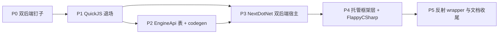

# .NET 脚本运行时开发计划

按 [.NET 脚本运行时架构](../designs/dotnet-scripting-design.md) 落地 `NextDotNet`，以
`FlappyCSharp` 在 CoreCLR 与 NativeAOT 双后端下同时通过 parity 为主验收。

工期为单人全职粗估，总计 **17–19 天**。

## 1. 阶段依赖



P2 与 P3 的 native 骨架可并行，但 P3 的表填充依赖 P2 的 `.def.h` 定稿。

## 1.1 两条排序原则（先读这里）

**为什么退场排在 P1 而不是最后。** QuickJS 退场不依赖 .NET 的任何进展，是完全自包含的清理
任务；parity 验收的 golden reference 是 `FlappyCpp` 而非 `FlappyJs`，删除后 P4 验收不受影响。
提前退场让 P2 之后的全部开发在干净地基上进行，且文档一次改到位而不是先写共存版再改。

**为什么仍然保留 P0 在退场之前。** P0 只有 2 天，买的是一个确定性：万一双后端路线不成立，
QuickJS 还在，损失 2 天而不是一次没有退路的迁移。这是全程唯一的回退窗口。

**双后端不会拖慢日常开发。** 两种后端的差异完全隔离在 native 侧的两个 `IManagedHost` 实现
（`FCoreClrHost` ~200 行 / `FAotHost` ~60 行），托管代码零差异，唯一的 `#if` 只在
`GkNext.Bootstrap` 一个文件里。P2/P4/P5 写的代码不感知后端。**日常开发只面对 CoreCLR**，
AOT 在 P0 立起来后由 CI 守着，只有 P4 主验收会显式双跑一次。

反过来，AOT 不能后置：托管侧的 5 条硬约束（设计 3.4）如果没有 AOT 构建在跑就没有任何强制
机制，等到后期再补，要回头改的是已验收的框架层、Source Generator 与组件 wrapper，且会波及
托管侧公开 API 形态。AOT 兼容性是贯穿写法的约束，不是可以事后加开关的特性。

## 2. Phase 0 — 双后端钉子（2 天）

**这一阶段不通过就必须重新选型，不要往下走。**

最小 C++ 程序 + 最小 C# 类库，一次验证两条路：

1. `GkNext_Bootstrap` 双向调用跑通（native → managed 的 `Tick`，managed → native 的一个绑定）。
2. **同一份 C# 源码**分别用 CoreCLR（hostfxr）与 NativeAOT 跑通，托管代码零改动。
3. CoreCLR 下 collectible ALC 卸载重载，确认 `[UnmanagedCallersOnly]` 入口位于默认 ALC 时
   热重载可行（设计 3.3 的两程序集拆分）。
4. iOS `--staticlib` 至少验证能编译（不要求上设备）。
5. `gnb dotnet setup` 拉 pinned SDK 到 `external/dotnet/`，`gnb.toml` 加 `[external.dotnet]`。

**验收**：一个脚本能在两种后端下打印相同结果；CoreCLR 下改一行 C# 后热重载生效。

## 3. Phase 1 — QuickJS 退场（2 天）

P0 通过后立即执行，让后续开发在干净地基上进行。按设计第 8 节的退场清单逐项删除并核对悬空
引用。要点：

- `EditorScriptExecutor` 只删 `EvalJavaScript` / `RegisterEditorBindings` 与 882–1485 行，
  **保留前 ~880 行的 editorscript 行命令 DSL**，Script Console 继续可用。
- `gnb fetch` 的 tsc 分支与 `TSCConfig` 一并删除，注意 `main.go:312` 的帮助文本。
- **先抄走再删**：`EngineApi.def.h` 的绑定面范围以当前 QuickJS 注册表为基线（P2 需要），
  删除前先把 `QuickJSEngine.cpp:94-161` 的注册清单和 `BuildTypeScriptDefinitions()` 的签名
  誊出来，不要等删完再从 Git 历史里翻。
- 文档：删 `docs/guides/typescript-integration.md` 与 `docs/AGENT_GUIDE/QuickJSBindings.md`；
  更新 `AGENTS.md` 的技术栈、Modules 列表与 Subprojects 段落（如实写成"脚本层迁移中"）；
  `docs/projects/flappy-bird-parity/introduction.md` 暂标为"仅 C++ 基线，C# 对照待 P4"。
  C# 侧的新文档等 P4/P5 有实物后再补，不要提前写不存在的东西。

**本阶段结束后到 P4 之间引擎没有脚本能力**，真空期约 9–12 天。实际影响为零：脚本层当前的
唯一用户是 `FlappyJs`（演示）与 Editor eval（已决定放弃）。

**验收**：`gnb build --all --reconfigure` 全绿；`gkNextEditor` 启动后 Script Console 的
editorscript 命令仍可用；全仓 `rg -i quickjs` 只剩 Git 历史。

## 4. Phase 2 — EngineApi 表 + codegen（3 天）

- `EngineApi.def.h` 收纳全部绑定面。范围以 P1 誊出的 QuickJS 注册清单为基线（Global/Input/
  UI/Audio/SceneBuild 与顶层函数，约 40 项），**但不得窄化到只够 Flappy 用**（设计 1 的非目标）。
- `GkStr`、`FRenderNodeSpec` 等跨界结构体定稿，全部 blittable。
- `gnb csharpgen` 子命令：读 `.def.h` 生成 `Engine.g.cs`，含默认参数、UTF-8 编码、`Vector3` 包装。
- 补全 `NextEngine` / `Assets::Scene` 的 `entt::meta` 注册，消掉设计 2 记录的现存漂移。

**验收**：`gkNextUnitTests` 新增一致性单测（def 项数 = 表字段数 = 生成的 C# 方法数）；
生成物无手工修改痕迹。

## 5. Phase 3 — NextDotNet 双后端宿主（4–5 天）

- `IManagedHost` 接口 + `FCoreClrHost`（hostfxr）与 `FAotHost`（直接链接）两个实现。
- `DotNetRuntime` 实现 [`Runtime::IScriptRuntime`](../../src/Engine/Runtime/Interface/ScriptRuntime.hpp)，
  生命周期钩子集合沿用 P1 誊出的 QuickJS 钩子集。
- 两程序集拆分：`GkNext.Bootstrap`（默认 ALC）+ `GkNext.Game`（collectible ALC）。
- `dotnet build` + `.dotnet.stamp` 时间戳跳过，与已删除的 `CompileTypeScriptSources()` 同构。
- CMake option `GK_DOTNET_BACKEND=CoreCLR|AOT`，默认 CoreCLR；release/移动端 preset 强制 AOT。
- `NextDotNet` 加入 `src/cmake/SourceFiles.cmake` 的 `GK_MODULE_NAMES`，Android/iOS 首版排除。
- **CI 双后端构建接进 gnb**（设计 3.4 第 5 条）。这一项不能推迟到后面阶段。

**验收**：空脚本工程在两种后端下都能启动到 `committed scene [...]`；CI 两条构建线都绿。

## 6. Phase 4 — 托管框架层 + FlappyCSharp（4 天）

- `NextGameInstance` 基类（对标已删除的 `NextGameInstanceBase.ts`）+ `[GameInstance]`
  Source Generator 注册表。
- 基类内置 dev-only 的 per-frame 分配量断言（设计 9 的 GC 风险对策）。
- `FlappyCSharp`：C++ 侧约 30 行，照 `FlappyJsGameInstance.cpp` 的结构；C# 侧翻译
  Bird / Pipes / Rng / GameInstance；复用同一份 `assets/configs/flappy/*.json`。
- `tools/flappy/diff_traces.py` 扩展为 cpp/cs 双向对比，并按设计 9 放宽门槛：
  `score`/`deathFrame`/`frameCount`/每帧 `state` 严格相等，`birdY`/`birdVelocityY` 容差 1e-3。

**验收（主验收）**：

```bash
gnb run FlappyCpp --flappy-replay
gnb run FlappyCSharp --flappy-replay          # GK_DOTNET_BACKEND=CoreCLR
gnb run FlappyCSharp --flappy-replay          # GK_DOTNET_BACKEND=AOT
python3 tools/flappy/diff_traces.py
```

三份 trace 必须同时通过门槛。**两种后端结果不一致即视为阶段失败**，这是双后端语义一致性的
唯一硬证据。

## 7. Phase 5 — 反射组件 wrapper 与文档收尾（2–3 天）

- 引擎新增 `--dump-reflection` 导出反射清单 JSON。
- `gnb csharpgen` 消费清单生成 `Components.g.cs`，propId 为编译期常量。
- `PropertyFlags::JSExposed` → `ScriptExposed`，保留 deprecated 别名一个版本周期。
- 文档收尾（P1 刻意推迟到此处的部分）：新增 `docs/AGENT_GUIDE/DotNetBindings.md`
  （"加一个绑定"从三步降为一步）；`docs/projects/flappy-bird-parity/introduction.md`
  改写为 C++/C# parity；`AGENTS.md` 从"脚本层迁移中"改为 C# 现状；更新 `docs/README.md`
  索引并把本 plan 移入已完成段。

**验收**：`node.GetComponent<RenderComponent>().Visible = false` 可用；改动反射属性后
Editor PropertyPanel、undo/redo 与 C# wrapper 三条链同时验证通过。

## 8. 风险与回退

| 风险 | 触发点 | 对策 |
|---|---|---|
| 双后端路线不成立 | P0 | **唯一的回退窗口**：QuickJS 尚未删除，止损为 2 天 |
| CoreCLR/AOT 行为不一致 | P4 验收 | 双后端 parity 是硬门槛；不一致则停在 P4 排查，不进 P5 |
| AOT 兼容性静默腐烂 | 任意阶段之后 | P3 就接入 CI 双后端构建，不推迟 |
| GC spike 影响帧时间 | P4 之后 | 框架层分配断言 + 热路径规矩；必要时收紧到对象池强制 |
| `[UnmanagedCallersOnly]` 与 collectible ALC 冲突 | P0 | 已知约束，两程序集拆分是既定方案；P0 必须实证 |
| 绑定面在退场时丢失 | P1 | P1 要求先誊出 QuickJS 注册清单再删，不依赖事后翻 Git 历史 |
| iOS 静态链接符号问题 | P0 / 未来 | 首版只要求编译通过，设备验证另立任务 |

**回退边界**：**P0 是全程唯一的回退窗口**。P1 执行后 QuickJS 即不可逆地退场（仅存于 Git
历史），引擎在 P4 之前没有脚本能力。因此 P1 的前置条件是 P0 的四项验证全部实证通过——
尤其是"同一份 C# 在两种后端下跑通"与"collectible ALC 热重载可行"这两项，它们决定了整条
路线是否成立。P1 之后各阶段失败只影响进度，不影响引擎其余功能。
