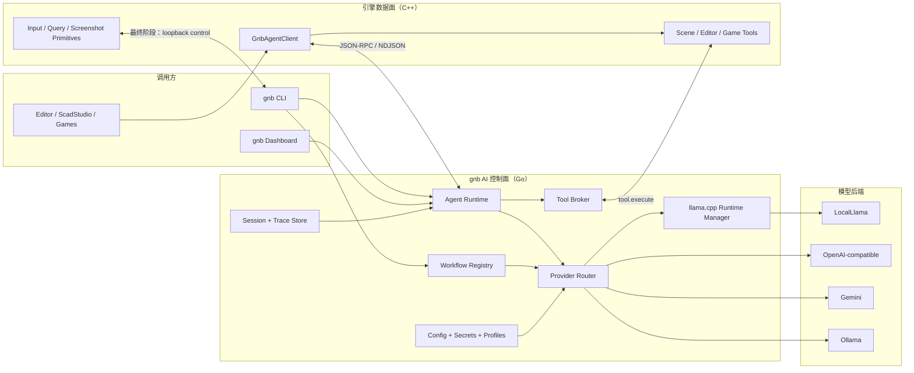
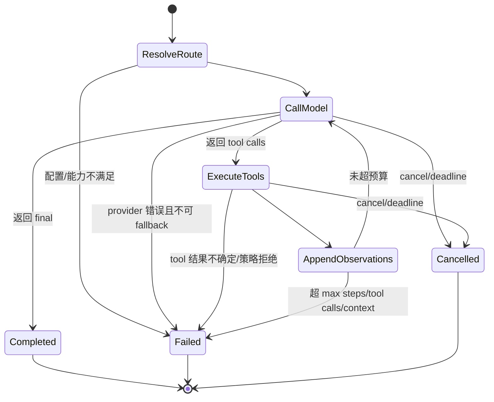
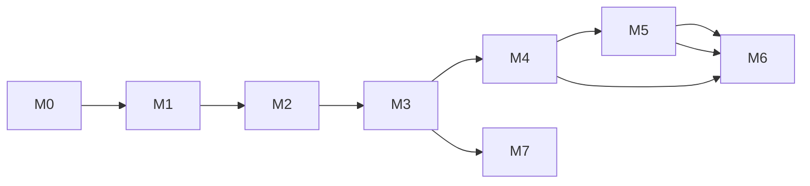

# gnb AI / Agent 统一控制面重构计划

> 状态：草案，待后续 agent 分阶段实施  
> 目标：把 provider 调用、Agent 循环、会话、工具调度和领域生成工作流统一收敛到 `gnb`；NextEngine 只保留一个薄客户端及必须访问运行时状态的工具实现。  
> 范围：`tools/gnb/**`、`src/Modules/NextAI/**`、现有 AI 使用方，以及最后一阶段的确定性 `AgentDriver` 控制面迁移。  
> 不要求本计划的编写者实施代码；本文应作为后续 agent 的执行依据。

## 0. 结论

本次重构不应只是把 C++ `FAgentLoop` 翻译成 Go，也不应把所有模型请求强行塞进同一种工具循环。目标结构应明确分为三层：

1. **LLM 层**：统一 provider、模型选择、流式协议、凭据、重试和用量统计；一次请求只负责一次模型推理。
2. **Agent 层**：在 LLM 之上运行“模型 → 工具 → observation → 模型”的有界循环，统一取消、步数、事件和安全策略。
3. **Workflow 层**：为 SCAD 生成、commit message、游戏结构化决策等任务编排确定性步骤。`gnb scad generate` 的“生成 → 校验 → 修复”属于 Workflow，不应依赖模型自觉调用校验工具。

最终只有 `gnb` 持有 provider 实现和 Agent 状态机。引擎侧通过一个长生命周期的 `gnb agent bridge --stdio` 子进程交互；本地场景查询、编辑器修改等无法移出进程的能力，以远程工具形式回调到引擎执行。

同时要区分两种同名概念：

- **AI Agent**：模型驱动、多步工具调用，是本计划的主线。
- **AgentDriver / `gnb validate`**：确定性输入回放与断言，不调用模型。它不与 AI Agent 共用状态机，但其脚本解释和报告控制也应在最终阶段移到 `gnb`，从而真正做到“控制面都在 gnb”。

## 1. 现状基线

### 1.1 当前存在的五条路径

| 路径 | 当前所有者 | 行为 | 主要问题 |
| --- | --- | --- | --- |
| `gnb llm` | Go | 下载/启动 llama.cpp、直接调用 `/v1/chat/completions` | 只认识 `external.llm` 和本地 llama-server |
| `gnb scad generate` | Go | 本地模型生成 spec，compose 失败后回喂修复 | 工作流正确，但 provider 被写死为 LocalLlama |
| Dashboard Chat | Go | 自己维护 12 步 JSON 工具控制循环和 repo tools | 与 C++ AgentLoop 完全重复，且只支持本地模型 |
| `NextAI` | C++ | 六种 provider、chat/stream、AgentLoop、RepoTools | provider/密钥/HTTP/Agent 控制全部进入引擎进程 |
| `AgentDriver` | C++ + gnb 启动器 | 解释 `.agentscript.json`，注入输入、等待、断言、写报告 | `gnb` 只是启动进程，真正控制状态机仍在引擎 |

源码证据：

- `gnb scad generate` 在 [`tools/gnb/cmd/gnb/scad.go:34`](../../tools/gnb/cmd/gnb/scad.go#L34) 直接确保本地 server 运行，再调用 `scadgen.Generate`；修复循环位于 [`tools/gnb/internal/scadgen/generate.go:64`](../../tools/gnb/internal/scadgen/generate.go#L64)。
- `gnb llm chat` 位于 [`tools/gnb/cmd/gnb/llm.go:141`](../../tools/gnb/cmd/gnb/llm.go#L141)，当前 client 注释和 URL 都明确面向 llama-server，见 [`tools/gnb/internal/llm/client.go:17`](../../tools/gnb/internal/llm/client.go#L17)。
- Dashboard 的独立工具控制 prompt 和循环位于 [`tools/gnb/internal/dashboard/chat_tools.go:23`](../../tools/gnb/internal/dashboard/chat_tools.go#L23) 与 [`tools/gnb/internal/dashboard/chat_tools.go:89`](../../tools/gnb/internal/dashboard/chat_tools.go#L89)。
- C++ provider 枚举和服务 API 位于 [`src/Modules/NextAI/AIService.hpp:13`](../../src/Modules/NextAI/AIService.hpp#L13)；六种 provider 实现在 [`src/Modules/NextAI/AIService.cpp:449`](../../src/Modules/NextAI/AIService.cpp#L449) 起。
- C++ AgentLoop 位于 [`src/Modules/NextAI/AI/AgentLoop.cpp:148`](../../src/Modules/NextAI/AI/AgentLoop.cpp#L148)，Editor 在 [`src/Application/Editor/gkNextEditor/AI/EditorAIService.cpp:702`](../../src/Application/Editor/gkNextEditor/AI/EditorAIService.cpp#L702) 调用它。
- 确定性验证驱动位于 [`src/Modules/AgentDriver/AgentDriver.hpp:12`](../../src/Modules/AgentDriver/AgentDriver.hpp#L12)，`gnb validate` 入口位于 [`tools/gnb/cmd/gnb/main.go:577`](../../tools/gnb/cmd/gnb/main.go#L577)。

截至 2026-07-12 的粗略物理行数：

| 范围 | LOC |
| --- | ---: |
| `src/Modules/NextAI/**` | 3,517 |
| 其中 provider/protocol/AgentLoop/RepoTools | 2,746 |
| Dashboard 独立 `chat_tools.go` | 899 |
| gnb 本地 LLM 包（不含测试） | 1,110 |
| gnb SCAD generation（不含测试） | 228 |

这些数字说明主要收益不是减少某一个函数，而是消除两套 Agent 循环、两套 provider 协议和两套 repo tools。

### 1.2 配置也分成两条线

- [`gnb.toml:28`](../../gnb.toml#L28) 的 `[external.llm]` 只描述 llama.cpp 二进制、本地 GGUF 模型和 server 生命周期。
- [`assets/configs/ai_config.json`](../../assets/configs/ai_config.json) 描述 Gemini/Ollama/Zhipu/DeepSeek/OpenAI/LocalLlama、默认 provider、模型和 Agent 步数。
- C++ `FAIService::LoadConfig` 自己寻找并合并 secrets，见 [`src/Modules/NextAI/AIService.cpp:1224`](../../src/Modules/NextAI/AIService.cpp#L1224)。
- 当前 C++ 服务在首选 provider 不可用时会静默遍历其他 provider，见 [`src/Modules/NextAI/AIService.cpp:1344`](../../src/Modules/NextAI/AIService.cpp#L1344)。这可能在用户不知情时改变成本、隐私边界和模型行为。

### 1.3 当前使用方

| 使用方 | 当前模式 | 迁移后模式 |
| --- | --- | --- |
| `gnb llm chat` | 本地单轮 chat | provider-agnostic LLM 请求 |
| `gnb git commit-msg` + Dashboard Git | 本地单轮生成 | `commit-message` workflow |
| `gnb scad generate` | 本地模型 + 硬编码 repair loop | `scad-scene` workflow |
| Dashboard Chat | 自有 repo tool loop | 统一 Agent runtime + gnb 本地 tools |
| gkNextEditor AI Panel | C++ AgentLoop + repo/editor tools | gnb Agent runtime + 远程 editor tools |
| ScadStudio | C++ provider streaming chat | gnb session chat/stream |
| MagicaLego | C++ 单轮脚本生成 | gnb workflow/LLM profile |
| StudioSim / AirportSim | C++ async 单轮 JSON/文本生成，并强制 LocalLlama | gnb `simulation` profile，不再在游戏里切 provider |
| `gnb shot` / `gnb validate` | 引擎内状态机 | 最终由 gnb 编排，引擎仅暴露控制原语 |

## 2. 目标与非目标

### 2.1 必须达到的目标

1. Provider、凭据、模型路由和 llama.cpp 生命周期只由 `gnb` 管理。
2. AI Agent 的循环、会话、取消、重试、工具事件和 trace 只由 `gnb` 管理。
3. NextEngine 不再直接访问 Gemini/OpenAI/Ollama/llama-server，也不再读 llama PID 文件。
4. Provider 使用字符串 ID 和能力描述；增加 provider 不再需要修改 C++ enum。
5. CLI、Dashboard 和 Engine 客户端使用同一套消息、工具和运行时语义。
6. 保留现有功能：流式聊天、多轮会话、Editor 工具、SCAD 修复、commit message、游戏异步生成和本地离线模型。
7. 外部 provider 不可用时是否 fallback 必须由 profile 显式配置，不允许全局静默切换。
8. 最终把 `.agentscript.json` 的脚本解释、等待、断言和报告也移到 gnb；引擎保留输入/查询/截图等数据面能力。

### 2.2 明确非目标

- 本轮不设计“自动按价格/速度智能选模型”的动态路由；只做确定、可解释的 profile 路由。
- 不把 Scene、ECS、ImGui 或编辑器命令实现搬进 Go；这些仍是引擎远程工具。
- 不改变 SCAD spec、mlscript、simulation JSON 等领域输出格式。
- 不要求 Android/iOS 在应用沙箱内启动 gnb 子进程。首版 sidecar 是桌面能力；移动端保持 AI 不可用或未来连接外部 gnb service。
- 不把 gnb 变成公开网络服务。首版 Engine bridge 仅使用匿名管道；验证控制通道仅绑定随机 loopback 地址并带一次性 token。

## 3. 统一术语与职责

| 名称 | 定义 | 示例 |
| --- | --- | --- |
| Provider | 一种模型 API 适配器 | `localllm`、`openai`、`gemini`、`ollama` |
| Profile | 某类业务的默认 provider/model/预算/回退策略 | `editor`、`scad-studio`、`simulation` |
| LLM request | 单次模型推理，无自主工具循环 | StudioSim 一次 JSON 决策 |
| Agent run | 多步模型与工具循环 | Editor 查场景后修改节点 |
| Workflow | 由代码强制推进的领域步骤 | SCAD 生成→校验→修复 |
| Tool | Agent 可调用的一项能力 | `read_file`、`scene_rename` |
| Session | 多轮消息和固定 profile/provider/model 的上下文 | ScadStudio 编辑会话 |
| Run | Session 中一次可取消、可追踪的执行 | 一次用户发送 |
| Bridge | Engine 与 gnb 的双向进程协议 | `gnb agent bridge --stdio` |
| Runtime control | gnb 驱动引擎输入/查询/截图的确定性通道 | `gnb validate` |

这组术语必须进入 CLI help、Go 类型名和 C++ 客户端 API，避免继续把“任何自动化”都叫 `AgentLoop`。

## 4. 目标架构



### 4.1 固定依赖方向

```text
Application -> GnbAgentClient -> gkNextEngine
                         |
                         +-> child process: gnb agent bridge

gnb agent runtime -> provider adapters / workflows / local tools
gnb agent runtime -X-> C++ headers or engine libraries
gkNextEngine       -X-> provider SDK / provider HTTP schema
```

引擎应用可以依赖薄客户端模块，但核心 `gkNextEngine` 不应依赖 `gnb` 的实现类型。Bridge 不链接成 C++ 库；进程边界就是架构边界。

### 4.2 为什么选择长生命周期 sidecar，而不是每次 `system("gnb ...")`

一次性子进程无法合理支持：

- 多轮 session；
- token 流式事件；
- 从 gnb 回调引擎工具；
- 取消在途请求；
- 并发请求和稳定的 provider/model 状态；
- 正确回收子进程与所有 worker。

因此桌面 Engine 在第一次 AI 请求时惰性启动一个 `gnb agent bridge --stdio`，整个 Engine 生命周期复用。Bridge 崩溃时所有在途 run 明确失败；只有在尚未产生输出、尚未执行工具时才允许自动重启一次。

CLI 和 Dashboard 已经运行在 gnb 进程内，直接调用 Go runtime，不再自连一个 sidecar。

## 5. gnb 内部目标模块

建议目录如下；文件名可调整，但依赖分层不要合并回大包：

```text
tools/gnb/internal/ai/
├── protocol/          # Message/Tool/Usage/Event DTO，禁止 provider 特有字段外泄
├── config/            # provider/profile/user config/secrets 合并与校验
├── provider/          # Provider interface + registry + capability descriptors
│   ├── openaicompat/
│   ├── gemini/
│   ├── ollama/
│   └── localllama/    # 组合现有 internal/llm 的 server lifecycle
├── router/            # profile/override/fallback 解析
├── agent/             # 有界工具循环、fallback tool parser、取消、事件
├── tool/              # Tool registry/broker；local 与 remote executor
├── workflow/          # Workflow interface/registry
│   ├── scadscene/
│   └── commitmessage/
├── session/           # 会话、context trim、run registry、trace
└── bridge/            # JSON-RPC stdio server

tools/gnb/internal/repotools/  # 从 Dashboard chat_tools.go 抽出的通用只读仓库工具
```

现有 `tools/gnb/internal/llm` 在迁移中拆成两部分：

- llama.cpp 下载、布局、PID、server 生命周期保留为 local runtime 基建；
- `ChatMessage`、`ChatRequest`、client protocol 上移到 `internal/ai/protocol` 和 provider adapters。

### 5.1 Provider 接口

建议最小接口：

```go
type Provider interface {
    Descriptor() Descriptor
    Chat(ctx context.Context, req protocol.ChatRequest, sink protocol.EventSink) (protocol.ChatResponse, error)
}
```

`Chat` 同时支持无 sink 的普通调用和有 sink 的流式调用。Provider adapter 必须把各家差异归一为：

- assistant content；
- reasoning delta（可选，默认不持久化、不显示原文）；
- 完整 tool calls；
- finish reason；
- prompt/completion token usage；
- 结构化错误类别。

`Descriptor.Capabilities` 至少包含：

- `streaming`
- `native_tools`
- `structured_output`
- `reasoning_control`
- `json_mode`

Agent runtime 根据 capability 选择原生 tool calls 或严格 JSON fallback。Provider adapter 内不得实现 Agent 循环。

### 5.2 Provider ID 必须是字符串

当前 C++ `EAIProviderType` 把 provider 集合编译进每个应用。目标 API 使用配置 ID，例如 `openai`、`corp-openai`、`localllm`。Provider 的 `kind` 决定适配器，同一种 kind 可以配置多个实例。

这允许：

- 两个不同 OpenAI-compatible endpoint 同时存在；
- profile 选择不同 endpoint；
- 增加 provider 时不重新编译引擎；
- UI 直接使用 `providers.list` 返回的 display name、models、capabilities 和配置状态。

## 6. 配置与选择规则

### 6.1 配置职责拆分

`[external.llm]` 继续只负责本地 llama.cpp runtime：二进制版本、GGUF 下载、端口、GPU layers、idle timeout。新增 `[ai]` 负责 provider 和 profile。

建议 `gnb.toml` 形状：

```toml
[ai]
default_profile = "general"

[ai.providers.localllm]
kind = "llama-cpp"
runtime = "external.llm"

[ai.providers.openai]
kind = "openai-compatible"
display_name = "OpenAI"
endpoint = "https://api.openai.com/v1"
default_model = "gpt-5.5"
models = ["gpt-5.5"]
api_key_env = "OPENAI_API_KEY"

[ai.providers.gemini]
kind = "gemini"
endpoint = "https://generativelanguage.googleapis.com/v1beta"
default_model = "gemini-3-flash-preview"
api_key_env = "GEMINI_API_KEY"

[ai.profiles.general]
provider = "localllm"
temperature = 0.7
max_output_tokens = 2048

[ai.profiles.editor]
provider = "openai"
model = "gpt-5.5"
fallback_providers = ["localllm"]
tool_sets = ["repo-read", "engine-editor"]
max_steps = 12
max_tool_calls = 32
timeout_seconds = 300

[ai.profiles.scad-scene]
provider = "localllm"
temperature = 0.4
max_output_tokens = 4096

[ai.profiles.simulation]
provider = "localllm"
temperature = 0.4
max_output_tokens = 1024
max_concurrency = 1
tool_sets = []
```

### 6.2 非敏感配置与 secrets

配置合并顺序固定为：

1. repo `gnb.toml`；
2. `GNB_AI_CONFIG` 指定的用户覆盖文件，或平台用户数据目录下的 `gnb-ai.toml`；
3. `GKNEXT_AI_SECRETS` 指定的 secrets JSON，或现有平台默认 `gkNextEngine/ai_secrets.json`；
4. provider 声明的 `api_key_env` 环境变量；
5. 单次 CLI/RPC 请求中的非敏感 provider/model override。

密钥永远不进入：

- repo 配置；
- Engine bridge 请求/响应；
- Dashboard HTML；
- trace/transcript；
- provider status 的错误详情。

Catalog 将状态拆成 `configured`（配置与凭据齐全）、`available`（当前平台可使用）和可选 `health`（显式 doctor 探测结果）。普通 UI 刷新不得通过一次计费推理来“健康检查”外部 provider。

迁移期由 gnb 只读兼容 `assets/configs/ai_config.json`，打印一次 deprecation warning。所有 Engine 使用方迁移后删除该文件和 C++ secrets loader。

### 6.3 Profile 与 override 优先级

一次 run 的选择顺序：

1. 请求显式给出的 `provider` / `model`；
2. 请求指定的 profile；
3. `[ai].default_profile`；
4. 配置校验失败，拒绝执行并返回可操作诊断。

禁止按“模型名碰巧匹配”跨 provider 猜测。`--model` 始终在已选 provider 内解析。

### 6.4 Fallback 规则

- 只有 profile 明确声明 `fallback_providers` 才允许 fallback。
- 只有在**尚未发出可见内容、尚未执行任何工具、尚未产生领域副作用**时才允许换 provider。
- 鉴权失败、配额失败默认不 fallback，除非 profile 针对该错误类别显式允许。
- 一旦有远程 mutating tool 被调用，bridge 断开或结果不确定时必须中止，禁止自动重放。
- 最终 trace 必须记录实际 provider/model 和 fallback 原因。

### 6.5 LocalLlama 的单模型租约

当前 llama-server 进程同一时刻只加载一个模型，`EnsureRunningOrReuse` 还可能复用一个与请求不同的已运行模型。统一 Router 后必须改成显式租约：

- 模型解析顺序为：请求 override → profile model → 当前健康 server 的 model → `external.llm.active`。
- 每个 LocalLlama run 获取一个 `(model, server generation)` lease；同模型请求可以按 server 的 parallel 配置并发。
- 请求另一模型时，必须等旧模型所有 lease 释放后再切换，或返回结构化 `model_busy`；绝不能杀掉仍有在途请求的 server。
- 显式指定 model 时不允许 `reuse running` 偷换成另一个模型。
- server 意外重启会使旧 generation 的所有 run 失败，不把迟到响应记到新 generation。

这部分应由 `localllm` provider/runtime manager 实现，调用方不直接读 PID 或协调模型切换。

## 7. 统一 Agent Runtime

### 7.1 状态机



Agent runtime 必须统一实现：

- `maxSteps`、`maxToolCalls`、总 deadline、单工具 timeout；
- 原生 tool calls 和 fallback JSON tool calls；
- unknown tool、坏参数、tool exception 作为 observation 回喂；
- grounding retry，但是否启用由 profile/run 明确决定；
- cancellation 和进程退出传播；
- 每步结构化事件；
- transcript/context trim；
- provider/model/usage/elapsed/tool count trace。

现有 C++ `FAgentLoop` 测试覆盖的 unknown tool、exception、max steps、grounding、cancel、fallback JSON 和 main-thread dispatch，都必须在 Go runtime 有等价测试后才能删除原实现。

### 7.2 Tool schema

统一使用 JSON Schema object，而不是当前 C++ 的扁平 `FToolParam`。Tool descriptor 最少包含：

```json
{
  "name": "scene_rename",
  "description": "Rename one scene node",
  "inputSchema": {
    "type": "object",
    "properties": {
      "nodeId": { "type": "integer" },
      "name": { "type": "string" }
    },
    "required": ["nodeId", "name"],
    "additionalProperties": false
  },
  "metadata": {
    "readOnly": false,
    "requiresMainThread": true,
    "confirmation": "none",
    "timeoutMs": 5000
  }
}
```

工具分两类：

- **gnb local tools**：repo 文件、git 只读查询、SCAD compose/validate 等，直接在 Go 执行。
- **remote engine tools**：scene/editor/game runtime 工具，由 gnb 通过 bridge 请求 Engine 执行。

注册表只表示“能力存在”，不等于“本次 run 已授权”。Profile 必须声明 `tool_sets` 或显式 allowlist；Agent 最终可见工具是“profile allowlist ∩ 当前 client 已注册工具”。`simulation`、commit message 等 profile 默认没有通用 repo/editor tools。带命令执行或写文件能力的 tool set 必须单独显式开启。

同一 assistant turn 返回多个工具时，默认按声明顺序执行。只有全部工具均标记 `readOnly=true` 且 profile 显式允许 parallel tools 时才并发，保证 Editor mutation 顺序可预测。

高风险 Editor action 沿用当前“排队等待用户确认”语义：Engine 不立即执行，返回结构化 `{status:"deferred", actionId, message}`；Agent 告知用户后结束本轮。不要让 gnb 在后台无限等待 UI 确认。

### 7.3 Tool exactly-once

- 每个 tool call 都带全局唯一 `callId`。
- Engine 在一个 run 生命周期内缓存已完成 `callId` 的结果；重复请求返回缓存，不重复修改场景。
- mutating tool 执行中 bridge 断开时，gnb 把 run 标为 `outcome_unknown`，不自动 retry。
- read-only tool 可按 descriptor 的 retry policy 重试。

### 7.4 Workflow 不等于 Agent

建议首批内建 workflow：

| Workflow | 强制步骤 | 是否允许工具自主循环 |
| --- | --- | --- |
| `scad-scene` | build prompt → LLM → parse → compose validate → repair（有界）→ write | 否，校验必须每轮执行 |
| `commit-message` | collect diff → LLM → sanitize → validate message | 否 |
| `magicalego-script` | build domain prompt → LLM → extract → syntax validate | 首版否 |
| `simulation-decision` | build prompt → LLM → JSON parse/schema validate → deterministic fallback | 否 |
| `dashboard-assistant` | session → repo tools → final | 是 |
| `editor-assistant` | session → repo/engine tools → final | 是 |

这样既复用 provider/runtime，又不会为了“统一”牺牲确定性。

## 8. Engine Bridge 协议 v1

### 8.1 传输选择

- 命令：`gnb agent bridge --stdio --protocol-version 1 --repo-root <root>`。
- 传输：stdin/stdout 上“一行一个 JSON”的 JSON-RPC 2.0（NDJSON framing）。
- stdout 只允许协议帧；gnb 日志全部写 stderr。
- Engine 使用独立 reader/writer 线程；主线程永不阻塞等 provider 网络响应。
- 每个 frame 限制大小，默认建议 8 MiB；超限以协议错误关闭连接。
- 握手不匹配时 fail fast，不尝试猜协议。

### 8.2 最小方法集

| 方法 | 方向 | 作用 |
| --- | --- | --- |
| `handshake` | Engine → gnb | 协议版本、client/app/repo、功能协商 |
| `catalog.get` | Engine → gnb | provider/profile/model/capability/configured 状态 |
| `session.open` | Engine → gnb | 创建 profile 固定的 ephemeral/persistent session |
| `session.reset` / `session.close` | Engine → gnb | 会话生命周期 |
| `llm.chat` | Engine → gnb | 无工具或调用方提供完整消息的单次/多轮 chat |
| `agent.run` | Engine → gnb | 启动有工具循环的 run |
| `workflow.run` | Engine → gnb | 启动命名领域 workflow |
| `run.cancel` | Engine → gnb | 取消 run，传播到 HTTP context/tool wait |
| `run.event` | gnb → Engine notification | 流式 delta、step、tool、usage、完成/失败事件 |
| `tool.execute` | gnb → Engine request | 执行 remote engine tool |
| `config.reload` | Engine → gnb | 开发期重新加载 provider/profile 配置 |

### 8.3 典型交互

```json
{"jsonrpc":"2.0","id":1,"method":"handshake","params":{"protocol":1,"client":"gkNextEditor","repoRoot":"..."}}
{"jsonrpc":"2.0","id":1,"result":{"protocol":1,"serverVersion":"..."}}
{"jsonrpc":"2.0","id":2,"method":"session.open","params":{"profile":"editor","tools":["..."]}}
{"jsonrpc":"2.0","id":2,"result":{"sessionId":"s_01"}}
{"jsonrpc":"2.0","id":3,"method":"agent.run","params":{"sessionId":"s_01","input":"把选中节点改名为 Hero"}}
{"jsonrpc":"2.0","method":"run.event","params":{"runId":"r_01","seq":1,"type":"tool.call","name":"scene_get_selection"}}
{"jsonrpc":"2.0","id":"tool_01","method":"tool.execute","params":{"runId":"r_01","callId":"c_01","name":"scene_get_selection","arguments":{}}}
{"jsonrpc":"2.0","id":"tool_01","result":{"status":"ok","content":{"nodeId":42,"name":"Cube"}}}
{"jsonrpc":"2.0","method":"run.event","params":{"runId":"r_01","seq":2,"type":"content.delta","text":"已将"}}
{"jsonrpc":"2.0","id":3,"result":{"runId":"r_01","status":"completed","content":"已将选中节点改名为 Hero。"}}
```

真正实现时 JSON 必须压成单行；上例只展示语义。

### 8.4 事件顺序与终态

- 每个 run 的事件带从 1 开始单调递增的 `seq`。
- 每个 run 恰好一个终态：`completed`、`failed`、`cancelled`、`outcome_unknown`。
- 收到终态后同一 run 的迟到事件必须丢弃并记录 debug 日志。
- `run.cancel` 是幂等操作。
- reasoning 默认只发“正在思考”状态，不把原始 chain-of-thought 存盘或透传；provider 返回的安全摘要可作为普通 content。
- Bridge reader 必须持续处理后续 request；`agent.run`/`workflow.run` 在 worker goroutine 中执行，最终再写原 request 的 response，否则同一连接上的 `run.cancel` 和 `tool.execute` response 会死锁。
- writer 必须单线程串行化 frame，禁止不同 goroutine 把 JSON 字节交叉写到 stdout。
- 中间 tool step 的 content delta 标记为 `visibility:"internal"`；只有 final turn 的 `visibility:"user"` 内容进入对话 UI，避免把模型调用工具前的草稿当成最终回答。

### 8.5 协议测试夹具

新增共享 fixture 目录，例如：

```text
tests/fixtures/gnb-agent-protocol/v1/
├── handshake.ndjson
├── chat-stream.ndjson
├── tool-roundtrip.ndjson
├── cancellation.ndjson
└── protocol-errors.ndjson
```

Go 和 C++ 测试都读取同一批 fixture，防止两边 DTO 各自演化。

## 9. Engine 侧薄客户端

### 9.1 最终保留内容

建议最终将 `src/Modules/NextAI` 重命名为 `src/Modules/GnbAgentClient`；迁移期保留 `NextAI::FAIService` facade，降低一次性改动面。最终模块只包含：

- `FGnbAgentProcess`：跨平台启动/停止子进程和匿名管道；
- `FGnbAgentProtocol`：JSON-RPC DTO、编码、解码、请求关联；
- `FGnbAgentClient`：session/run/catalog/cancel API；
- `FRemoteToolRegistry`：Engine tool descriptor + handler；
- `FMainThreadToolDispatcher`：把需要主线程的 tool 排队执行；
- Engine `Tick` 中的事件泵与生命周期安装入口。

### 9.2 必须删除的 C++ 职责

全部使用方迁移后删除：

- `AIService.cpp` 内的 provider HTTP 实现和 secrets loader；
- `AI/AIChat.*` 的 provider request/response serializer；
- `AI/AgentLoop.*`；
- `AI/Tools/RepoTools.*` 与 `PathSandbox.*`；
- `AI/LlamaPidFile.*`；
- `FToolRegistry` 中只为本地 AgentLoop 服务的部分。

Editor 的 scene/editor tool handler 保留在 Application 层，但改为注册远程 tool descriptor，不再继承 `IAITool`。

### 9.3 进程发现与部署

Engine 查找 gnb 的顺序固定为：

1. 启动参数 `--gnb-path`；
2. 环境变量 `GNB_EXECUTABLE`；
3. repo root 下的 `gnb.exe` / `gnb`；
4. 与应用一起打包的 sidecar 路径；
5. `PATH`。

同时给 gnb 增加可在 repo discovery 前生效的 `--repo-root` 或 `GNB_REPO_ROOT`。当前 gnb 在 Cobra 构建前就从 cwd/executable 搜索 repo；bridge 场景必须能显式覆盖。

找不到 gnb 或握手失败时：

- AI service 返回 `NotConfigured` 和具体诊断；
- 游戏使用现有 deterministic fallback，不崩溃；
- Editor/ScadStudio UI 显示“gnb bridge unavailable”及探测过的路径；
- 不回退到旧 C++ provider（迁移期显式 feature flag 除外）。

开发树可直接使用 repo root 的 gnb；发布包若启用 AI，Packager 必须复制与 Engine 协议版本匹配的 gnb binary，并在 manifest 中记录版本。握手发现 binary 过旧时给出升级/重新打包提示，不尝试以不兼容字段继续运行。

### 9.4 生命周期与线程

- 禁止继续使用捕获裸 `this` 的 detached worker。
- reader/writer thread 由 client 对象拥有，析构时 cancel、关闭 pipe、join。
- network/provider 工作都在 gnb；C++ reader 只解码 frame 并入队。
- Engine 主线程 `PumpEvents()` 分发 UI callback 和主线程 tool。
- 每个请求返回 `runId`/handle；调用方按 owner 生命周期取消。
- 同一 session 运行期间 provider/model 不可切换，切换只影响下一次 run。

### 9.5 桌面与移动平台

- Windows/Linux/macOS desktop 支持 child sidecar。
- Android/iOS 首版不 spawn gnb；模块报告 unavailable，业务走 fallback。
- 如未来需要移动端 AI，新增“连接外部 gnb service”部署模式，不把 provider SDK 再塞回引擎。

## 10. 各使用方迁移设计

### 10.1 gnb CLI

保留兼容命令：

```text
gnb llm setup|serve|stop|status       # 明确仍是 LocalLlama runtime 生命周期
gnb llm chat --profile general --provider <id> --model <id> <prompt>
gnb llm providers
gnb llm models --provider <id>
gnb agent run --profile <id> <prompt>
gnb agent doctor
gnb agent bridge --stdio              # Engine 内部使用，默认不面向人
```

现有 `--model` 保持兼容；新增 `--provider` 和 `--profile`。Help 文案不再把 `llm chat`、`scad generate`、`commit-msg`描述为“本地 LLM”功能。

### 10.2 Dashboard

- Chat session 从只存 `ModelID` 升级为 `ProfileID + ProviderID + ModelID`，旧存档迁移时把旧 model 映射到 `localllm`。
- 删除 Dashboard 自有 controller prompt/loop，调用统一 Agent runtime。
- repo tools 迁到通用 `repotools` registry，Dashboard 只负责 UI 与事件转 SSE。
- Provider 下拉由 catalog 动态生成；LocalLlama 才显示 setup/start/stop 控件，外部 provider 显示配置状态。

### 10.3 `gnb scad generate`

- 命令只负责 catalog/menu、输入参数和输出文件；生成/repair 调用 `scad-scene` workflow。
- `--provider`、`--model`、`--profile` 均可覆盖配置。
- parse/compose validation 永远由代码执行，错误作为下一轮 repair observation。
- 继续保留 `--repairs`、`--temp`、`--debug`，debug transcript 必须去除 secrets。
- LocalLlama 仍可自动启动；选择外部 provider 时不得启动 llama-server。

### 10.4 gkNextEditor

- `BuildAgentSystemPrompt` 和动态 selection snapshot 可暂留 C++，作为 `agent.run` 输入。
- repo tools 从 Engine registry 删除，由 gnb 本地提供。
- scene/editor tools 改为 remote descriptors；需要主线程的 handler 通过 client dispatcher 执行。
- conversation 移到 gnb session；Editor 只保存 `sessionId` 和用于 UI 的可见消息。
- Agent event panel 直接消费统一 `run.event`，保留 step/tool/result/cancel UI。
- legacy “生成 editorscript 再解析”路径只作为迁移 feature flag，M6 删除。

### 10.5 ScadStudio

- 使用 `scad-studio` profile 创建 session，调用 `llm.chat` 并消费 stream。
- Provider/model UI 改为 catalog 字符串 ID，不再调用硬编码 `EAIProviderType`。
- 当前 source/files/edit scope 仍由 C++ 构造 prompt；生成后的 fenced block 解析可先留 C++，后续可独立迁成 workflow，不阻塞主重构。
- 切换 provider/model 时 reset session，语义保持不变。

### 10.6 MagicaLego

- domain prompt 与颜色/积木上下文仍由游戏生成。
- 首版调用 `magicalego-script` workflow 或无工具 `llm.chat`，由 gnb 负责 provider。
- 加入已有 mlscript parser 的校验结果后，可升级为与 SCAD 类似的有界 repair workflow；不要直接启用通用 repo/editor Agent 工具。

### 10.7 StudioSim / AirportSim

- 删除在游戏启动时强制 `SwitchProvider(LocalLlama)` 的代码，当前位置见 [`StudioSimGameInstance.cpp:470`](../../src/Application/Game/StudioSim/StudioSimGameInstance.cpp#L470) 和 [`AirportSimGameInstance.cpp:99`](../../src/Application/Game/AirportSim/AirportSimGameInstance.cpp#L99)。
- 使用 `simulation` profile 的 `llm.chat`/`workflow.run`；保持每个游戏已有的串行队列和 deterministic fallback。
- JSON schema 校验属于 `simulation-decision` workflow，不启用通用 AgentLoop，避免多次往返和不可控成本。
- Engine unavailable、timeout、bad JSON 时必须与当前一样平稳退化。

### 10.8 确定性 AgentDriver / validate / shot

这是单独的最后阶段，但属于最终“控制面在 gnb”目标：

- 把 `.agentscript.json` 解析、step index、wait、assert、report、退出策略搬到 `tools/gnb/internal/validate`。
- Engine 保留 `SyntheticInput`、query registry、CVar/exec、screenshot 和 quit 原语。
- `gnb validate` 启动 Engine 时创建随机 loopback endpoint 和一次性 token，通过 `--agent-control=<endpoint>` 传入。
- Engine 的 control endpoint 不解释脚本，只执行一个原子命令并返回结果。
- `gnb shot` 也逐步改成“等待 frame → 请求 screenshot → 等待落盘 → quit”的 gnb workflow，删除 `NextEngine::TickAgentValidation` 状态机。
- 完成后删除 `IAgentDriver` factory、`agentDriver_` 和 `src/Modules/AgentDriver`；`GameInstance::RegisterAgentQueries` 可改名并挂到薄 control endpoint。

不要把这个确定性控制通道与 LLM provider bridge 误做成一个 AgentLoop。二者可复用 JSON DTO、鉴权和事件命名，但生命周期方向不同：普通应用是 Engine 启动 gnb sidecar；validate 是 gnb 启动 Engine 并监督它。

## 11. 分阶段实施计划

每个里程碑应独立 PR、独立验收。除 M6 的 CMake/模块删除外，不要提前做全量重构。

### M0 — 行为定格与协议夹具

任务：

- [ ] 为现有 gnb client 补齐 content/stream/error 的 HTTP fixture 测试。
- [ ] 把 C++ `Test_AIChatProtocol.cpp`、`Test_AgentLoop.cpp` 的行为列成 Go 迁移清单。
- [ ] 为 SCAD first-shot/repair/exhausted 三条路径保留 golden tests。
- [ ] 建立 `tests/fixtures/gnb-agent-protocol/v1`，提交 handshake/tool/cancel/error fixture。
- [ ] 写出 protocol error code 表和兼容规则。

验收：没有生产行为变化；`go test ./...` 和现有 `[Unit][AI]` 测试通过。

### M1 — gnb Provider Registry、配置和 Router

任务：

- [ ] 新建 `internal/ai/protocol|config|provider|router`。
- [ ] 先实现 `localllm`，复用现有 llama server lifecycle。
- [ ] 为 LocalLlama 实现 model lease/generation，覆盖同模型并发、异模型切换和 server 重启。
- [ ] 移植 OpenAI-compatible、Gemini、Ollama adapters；用 mock HTTP server 测试，不在 CI 调真实 API。
- [ ] 引入 provider descriptors/capabilities/configured reason。
- [ ] 在 `gnb.toml` 增加 `[ai]` 示例与 profile；实现旧 `ai_config.json` 只读兼容。
- [ ] 实现 secrets merge/redaction。
- [ ] 迁移 `gnb llm chat`、`gnb git commit-msg`、Dashboard commit-msg 和 `gnb scad generate` 的底层模型调用到 Router。
- [ ] 新增 `gnb llm providers`、`gnb agent doctor`、`--provider/--profile`。

退出条件：这些命令均可显式选择 `localllm` 与至少一个 mock external provider；选择 external provider 时不会启动 llama-server。

### M2 — 统一 Agent Runtime、Tools 与 Workflows

任务：

- [ ] 新建 `internal/ai/agent|tool|workflow|session`。
- [ ] 移植 C++ AgentLoop 的 max steps、cancel、unknown tool、exception、grounding、fallback JSON 语义。
- [ ] 从 Dashboard `chat_tools.go` 抽出 repo tools，改为 JSON Schema descriptors。
- [ ] Dashboard Chat 切换到统一 Agent runtime 和事件流。
- [ ] `scadgen.Generate` 接入 `scad-scene` workflow registry；保留现有确定性 compose 校验。
- [ ] commit message 接入 workflow registry。
- [ ] 加入 per-run trace 与 provider/model/usage/elapsed 统计。
- [ ] 删除 Dashboard 独立 `runChatToolLoop`；不得保留两套循环作为长期 fallback。

退出条件：Dashboard、SCAD、commit message 共用同一 provider/router/event 类型；Go fake provider 测试覆盖完整多步工具链。

### M3 — stdio Bridge 与 C++ 薄客户端

任务：

- [ ] 实现 `gnb agent bridge --stdio` 和 JSON-RPC 方法集。
- [ ] gnb bootstrap 支持显式 repo root，stdout/stderr 严格分流。
- [ ] 更新 Packager/开发运行路径：可发现并携带协议兼容的 gnb sidecar，manifest 记录版本。
- [ ] 新建 Engine 侧 process/pipe/protocol/client/dispatcher。
- [ ] 使用共享 v1 fixture 做双端协议测试。
- [ ] 实现 catalog、session、chat、agent run、event、cancel、remote tool roundtrip。
- [ ] 加入进程崩溃、半帧、坏 JSON、超大 frame、版本不匹配测试。
- [ ] 给旧 `FAIService` 加 `gnb` transport facade；迁移期保留 `GKNEXT_AI_TRANSPORT=legacy`，默认先由测试环境切到 gnb。

退出条件：C++ 测试可启动真实 gnb bridge + fake provider，完成一轮 stream 和一轮 remote tool call；关闭 Engine 后无孤儿 gnb 进程。

### M4 — gkNextEditor 迁移

任务：

- [ ] 把 Editor tools 改为 remote registry/handler。
- [ ] repo tools 改由 gnb 提供。
- [ ] conversation、run/cancel、事件 UI 接入 bridge。
- [ ] provider/model UI 改为动态 catalog。
- [ ] 保持 main-thread mutation、undo/redo、高风险 deferred action 语义。
- [ ] 增加 Editor fake-agent 集成测试：查询 selection、rename、unknown node、cancel、deferred load scene。
- [ ] Editor 验收后删除它对 C++ `FAgentLoop`/`RepoTools` 的调用。

退出条件：Editor 默认走 gnb Agent；常规聊天不强制工具，源码问题使用 gnb repo tools，场景修改使用 remote tools。

### M5 — 其余 Engine 使用方迁移

建议拆成三个可独立提交的子 PR：

- [ ] M5a ScadStudio：stream/session/catalog/provider switch。
- [ ] M5b MagicaLego：script workflow/provider profile。
- [ ] M5c StudioSim + AirportSim：simulation profile、async handle、fallback。

退出条件：`rg "SwitchProvider\(.*LocalLlama" src/Application` 无结果；所有模型请求都经 gnb bridge。

### M6 — 删除 legacy C++ AI 实现并收口配置

任务：

- [ ] 删除 C++ provider、AI protocol serializer、AgentLoop、RepoTools、PathSandbox、LlamaPidFile。
- [ ] 删除 `assets/configs/ai_config.json` 和 legacy secrets merge；更新 `AGENT_GUIDE`/docs。
- [ ] 删除 `EAIProviderType`，所有 UI 使用字符串 descriptor。
- [ ] 将模块/target 重命名为 `GnbAgentClient`，或至少确保 `NextAI` 只剩兼容别名且标明 client-only。
- [ ] 删除 `GKNEXT_AI_TRANSPORT=legacy`。
- [ ] 检查 libcurl 是否仍有第一方正式使用方；只有确实无使用方时才从对应 target/vcpkg 移除。
- [ ] 运行全量 reconfigure/build，确认所有 program 的链接面。

退出条件：`src/**` 中没有 provider endpoint、API key、llama PID、AgentLoop 或 repo exploration tool 实现。

### M7 — 确定性 AgentDriver 控制面迁到 gnb

任务：

- [ ] 新增 Engine 原子 control endpoint 和一次性 token 握手。
- [ ] 把脚本 parser/wait/assert/report 移入 gnb。
- [ ] 迁移 `gnb validate`，保持脚本格式和 report schema 向后兼容。
- [ ] 迁移 `gnb shot` 的 frame wait/screenshot/quit 编排。
- [ ] 删除 Engine `AgentDriver` 状态机、factory、overlay ownership；需要的状态 HUD 改为可选 control overlay provider。
- [ ] 跑现有 smoke/camera-tour 脚本并比较 report。

退出条件：Engine 只提供运行时控制原语，不再解释 Agent 脚本或推进 Agent 状态机。

### 11.1 依赖顺序



M7 可在 M3 协议稳定后与 M4/M5 并行，但不得修改同一批 Engine process/protocol 文件而不先协调。

## 12. 验证矩阵

### 12.1 每阶段基础验证

| 改动范围 | 命令 |
| --- | --- |
| 纯 gnb Go | `cd tools/gnb && go test ./...` |
| C++ client / protocol | `./gnb.bat build gkNextUnitTests` + 对应 `[Unit][AI]`/bridge tests |
| Editor | `./gnb.bat build gkNextEditor` |
| ScadStudio | `./gnb.bat build ScadStudio` |
| MagicaLego | `./gnb.bat build MagicaLego` |
| StudioSim / AirportSim | 分别构建对应 target |
| M6 模块/CMake 广面删除 | `./gnb.bat build --reconfigure` |
| M7 validate | `./gnb.bat validate --script assets/agentscripts/smoke.agentscript.json` |

常规阶段遵守 targeted build；只有 M6 这种广泛 CMake/链接变化才默认全量 reconfigure。

### 12.2 Provider contract tests

每种 adapter 使用本地 mock server 覆盖：

- 普通 content；
- SSE/stream 分片；
- tool call（包括 arguments 分片）；
- usage/finish reason；
- HTTP 4xx/5xx、超时、断流、坏 JSON；
- API key 不进入 error/trace；
- capability 不满足时在请求前拒绝。

### 12.3 Agent tests

- 单工具、多工具、parallel tool calls 的确定顺序；
- unknown tool、坏 arguments、tool error；
- fallback JSON fence/bare object；
- grounding retry 开/关；
- max steps/tool calls/context/deadline；
- cancel 在 provider wait、tool wait、stream 中发生；
- provider fallback 只在无副作用阶段发生；
- mutating tool 的 callId 去重与 outcome_unknown。

### 12.4 端到端人工/本地 smoke

```powershell
./gnb.bat llm chat --provider localllm "只回答 OK"
./gnb.bat scad generate --provider localllm --name agent_smoke "一个小型村庄广场"
./gnb.bat agent doctor
./gnb.bat dashboard
./gnb.bat editor
```

配置了外部 provider 的本地环境再补：

```powershell
./gnb.bat llm chat --provider openai "只回答 OK"
./gnb.bat scad generate --provider openai --name agent_external_smoke "一个小型村庄广场"
```

真实外部 API smoke 不进入默认 CI，避免凭据和费用依赖。

## 13. 风险与约束

| 风险 | 约束/缓解 |
| --- | --- |
| Bridge 跨平台进程/pipe 难度 | 先 stdio 匿名管道，协议与 transport 分层；Windows/Linux/macOS 都有集成测试 |
| Engine 主线程卡死 | reader 只入队；`tool.execute` 由主线程 dispatcher 有界泵送和 timeout |
| mutating tool 重放 | callId 去重；结果不确定即中止，不自动 retry |
| 外部 provider 行为不一 | capability descriptor + adapter contract tests；fallback parser 只在 Agent 层 |
| 静默产生外部费用 | profile 显式 provider/fallback；UI/trace 显示实际 provider/model |
| secrets 泄漏 | secrets 只在 gnb；统一 redactor；协议/catalog 不返回 secret 值 |
| 全局 provider switch 数据竞争 | provider/model 固定在 session/run，不再修改进程全局 singleton |
| sidecar 缺失/崩溃 | 可诊断 unavailable；游戏 deterministic fallback；无副作用时最多重启一次 |
| Dashboard 会话不兼容 | store version 升级；旧 ModelID 映射为 `localllm`，保留备份 |
| 移动端不能 spawn | 首版明确 desktop-only；移动端不回塞 provider 实现 |
| 重构期双实现漂移 | legacy 仅作为短期 feature flag；每个使用方迁完立即删其旧入口，M6 删除总开关 |

## 14. 完成定义

以下条件全部满足才算完成，而不是“bridge 能回复一句话”就结束：

- [ ] `gnb llm chat`、SCAD、commit message、Dashboard、Editor、ScadStudio、MagicaLego、StudioSim、AirportSim 都使用统一 Router。
- [ ] LocalLlama 和至少一种外部 provider 通过同一 protocol/Agent/workflow API 工作。
- [ ] Engine 不包含 provider HTTP、endpoint、API key、PID reader 或 AgentLoop。
- [ ] Dashboard 不包含独立工具控制循环。
- [ ] Provider/model UI 完全由 catalog 驱动，没有 C++ provider enum。
- [ ] SCAD 校验/repair 仍是确定性 workflow，行为和输出路径兼容。
- [ ] Editor remote tools 保持 main-thread、undo/redo、deferred confirmation 和 cancel 语义。
- [ ] 游戏在 gnb/provider 不可用时仍能使用 deterministic fallback。
- [ ] 子进程正常退出、崩溃、取消和 Engine shutdown 均无泄漏/孤儿进程。
- [ ] `.agentscript.json` 与 `gnb shot` 的控制状态机也已移到 gnb。
- [ ] 文档、CLI help、配置示例和测试命令均更新。

## 15. 后续 agent 接手建议

1. 从 M0 开始，不要直接先写 C++ subprocess；没有协议 fixture 时双端会快速漂移。
2. M1/M2 先让 gnb 自己完全复用统一 runtime，再接 Engine。若 CLI/Dashboard 仍走旧 client，说明抽象边界还没有成立。
3. 每个 PR 在描述中列出：迁移了哪个使用方、旧路径是否已删除、运行了哪些 targeted tests、还剩哪些 legacy 入口。
4. 不要在一个 PR 同时迁 Editor、ScadStudio 和两个 simulation；它们的会话/流式/异步语义不同，应分别验收。
5. 遇到需要调整协议的情况，先更新 v1 fixture 和本文，再同时修改 Go/C++；不要在单边临时加字段。
6. M6 前允许短期 facade，不允许长期维护“两套 provider + 两套 AgentLoop”。

建议第一个实施任务可直接写成：

> 建立 `internal/ai/protocol`、Provider contract fixtures 和 `[ai]` 配置 loader；用 fake provider 让 `gnb llm chat` 与 `gnb scad generate` 在不启动 llama-server 的情况下跑通，并保持 LocalLlama 兼容。
