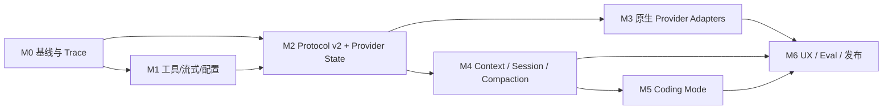

# gnb Chat Agent 质量提升开发计划

> **方向更新（2026-07-14）：** Dashboard 不再以 Research/Coding Agent 为产品目标。本计划不再执行；Dashboard 的目标已收敛为普通 Chat + 最小 Tool Call 能力探针，见 [NextAI 面向具体产品能力的轻量化重构计划](nextai-product-focused-refactor-plan.md)。

> 目标：按可独立合并、可回归、可回滚的里程碑实施 [质量目标架构](../designs/gnb-chat-agent-quality-architecture.md)。
>
> 问题证据见：[交互质量架构审计](../notes/gnb-chat-agent-quality-audit.md)。
>
> 本计划延续 [AI / Agent 统一控制面计划](gnb-ai-agent-unification-refactor-plan.md)，不重复 provider 收口工作，重点补齐 agent 质量。

## 0. 交付结论

建议分两条目标线：

1. **Research Agent 快速线（M0–M4）**：先解决本次 Zhipu 对话暴露的状态丢失、伪流式、工具不完整、上下文和 trace 问题。
2. **Coding Agent 完整线（M5–M6）**：在权限、checkpoint 和验证框架就绪后，再开放写文件、shell、build/test 等能力。

最先带来体感提升的不是大规模 UI 重写，而是：

- 修复 repo tools 的确定性漏检和不可续读；
- 让 provider 事件真流式；
- 让 profile/thinking/finish reason 真正生效；
- 保留 Zhipu/Claude 工具轮次间的原生状态；
- 建立能复现每次失败的 trace 和 eval。

## 1. 计划约束

### 1.1 实施原则

- 每个 PR 只跨越一个明确兼容边界；
- 先测量当前基线，再声称质量提升；
- capability 只能在 conformance test 通过后声明；
- raw hidden reasoning 不进入 UI、普通日志或 transcript；
- 修改型工具必须晚于权限/checkpoint 基础设施；
- 保持 OpenAI Chat-compatible 路径，不强制第三方 endpoint 迁移；
- Dashboard、CLI 和 bridge 最终共用同一个 Run Service；
- SCAD、commit message 等确定性 workflow 不迁入开放式 Agent；
- tools/gnb 改动默认只跑 Go targeted tests/build，不触发 C++ 全量构建。

### 1.2 估算口径

下文 effort 是一名熟悉当前 Go 代码的工程师的粗略工程日，包含单元测试和文档，不是交付承诺。真实排期应在 M0 基线完成后校正。

| 里程碑 | 目标 | 估算 | Research 必需 |
| --- | --- | ---: | --- |
| M0 | 基线、trace 骨架、固定 eval | 2–4 天 | 是 |
| M1 | 工具完整性、真流式、配置贯通 | 4–7 天 | 是 |
| M2 | Protocol v2、Zhipu/Claude 状态延续 | 5–8 天 | 是 |
| M3 | OpenAI Responses、adapter conformance | 5–9 天 | 是 |
| M4 | Context compiler、session、compaction | 5–9 天 | 是 |
| M5 | 权限、checkpoint、Coding tools、验证 | 8–14 天 | 否 |
| M6 | Dashboard 完成度、质量门、发布 | 4–7 天 | 是 |

Research Agent 目标约 21–37 工程日；完整 Coding Agent 目标约 33–58 工程日。M0 与 M1 中互不依赖的测试/工具工作可以并行开发，但合并顺序仍按依赖执行。

## 2. 依赖关系



如果只想尽快改善当前 Zhipu Research 体验，应先交付 M0、M1、M2 中的 Claude/Zhipu vertical slice，不必等待 OpenAI Responses 或 Code 模式。

## 3. M0：建立可测基线和安全 Trace

### 目标

让“为什么这次回答差”从体感问题变成可重放、可比较的数据问题，同时避免为后续 protocol v2 建立一次性实现。

### 工作项

1. 在 `tools/gnb/internal/ai` 下增加 run id、sequence 和最小 `RunTrace`：
   - provider/model/profile；
   - step 开始/结束；
   - tool call id/name/参数摘要；
   - tool success/error/truncated/duration；
   - finish reason、usage、总耗时；
   - final outcome。
2. 增加统一 redaction：
   - Authorization/API key；
   - provider raw payload 中的敏感 header；
   - hidden reasoning；
   - 超长 tool output 只保留 digest、长度和安全摘要。
3. Dashboard 把 trace id 与 chat message 关联；开发模式可查看本地 trace。
4. 固化 `tools/gnb/internal/ai/testdata/evals`：
   - VulkanBaseRenderer 公开接口；
   - 24K 之后文件搜索；
   - 大文件后半段读取；
   - 跨文件多工具问答；
   - tool error 恢复；
   - max tokens/cancel/provider error。
5. 增加一个本地 deterministic fake provider，能回放：
   - text delta；
   - thinking summary delta；
   - 两个并行 tool calls；
   - tool call 后继续回答；
   - max token 与断流。
6. 写 baseline runner，输出 JSON，不把在线 provider 测试放入普通单元测试。
7. 用当前 Zhipu、OpenAI profile 各跑一轮可选 live baseline，记录环境和模型，不提交凭据/原始 hidden reasoning。

### 主要文件

- `tools/gnb/internal/ai/agent/agent.go`
- `tools/gnb/internal/ai/protocol/protocol.go`
- `tools/gnb/internal/ai/runtime.go`
- `tools/gnb/internal/dashboard/chat.go`
- `tools/gnb/internal/dashboard/handlers_chat.go`
- 新增 `tools/gnb/internal/ai/trace/**`
- 新增 `tools/gnb/internal/ai/eval/**`

### 验收

- 同一 fake-provider run 可 100% 重放事件顺序；
- 每个 tool call 由 call id 唯一定位；
- trace 中没有 key、Authorization、raw hidden reasoning；
- Dashboard 最终消息能定位 trace id；
- baseline JSON 包含正确率 rubric、延迟和工具指标；
- 当前代码在没有启用 trace 持久化时行为兼容。

### 测试

`tools/gnb` 目录下：

```powershell
go test ./internal/ai/...
go test ./internal/dashboard/...
```

## 4. M1：修复工具完整性、真流式和配置贯通

M1 应拆成三个小 PR，降低回归面。

### M1-A：Repo tools v2 read path

#### 工作项

1. 修复 `find_files`：不能在 pattern 过滤前经过 24K command 截断。
2. 为 `find_files`、`read_file`、`search_text`、`list_dir` 增加 cursor/limit。
3. `read_file` 支持 lineStart/lineCount，并返回总行数、实际范围、next cursor。
4. 工具结果增加结构化 meta：truncated、nextCursor、source、line range、exit code、duration。
5. schema 补 required、范围和 `additionalProperties: false`。
6. 每个工具补充高信息 description、何时使用、失败和分页说明。
7. tool error 使用稳定 category/retryable；失败调用也计入 budget。
8. 结果在进入模型前压缩展示，但结构化结果完整进入 trace。

#### 测试

新增 `tools/gnb/internal/repotools/repotools_test.go`：

- 创建输出超过 24K 的临时文件树，目标位于末尾，搜索必须命中；
- 30K+ 文本可通过 cursor/lineStart 连续读完且不重不漏；
- 搜索分页稳定、无重复；
- 非法路径、越界和取消返回稳定错误；
- truncation 与 nextCursor 一致；
- schema snapshot 通过 strict 校验。

#### 验收

- 不再存在未知的静默截断；
- Agent 能确定自己是否读完整个结果；
- 审计中的 VulkanBaseRenderer 搜索用例稳定通过。

### M1-B：真实事件流与取消

#### 工作项

1. provider stream event 到达后立即进入 sink，不在 `agent.Run` 中等待整轮结束。
2. 引入 phase：commentary、provisional、final、tool、usage。
3. tool call 前产生的文本放入过程区，不直接污染 final answer。
4. Dashboard SSE 使用 run sequence 去重和重连。
5. 增加 Stop；取消向下传播到 provider HTTP request 和可取消工具。
6. 前端 tool panel 改用 call id，不再只用 step。
7. `run.completed` 返回真实 outcome、finish reason、truncated。

#### 测试

- fake provider 尚未结束时，sink 已收到第一个 delta；
- 有 tool call 的轮次不会丢 thinking summary/commentary；
- 同一步两个 tool call 在 UI state 中独立；
- cancel 后 provider 与工具收到 context cancellation；
- max tokens 不会显示为 completed/stop。

#### 验收

- time-to-first-event 不再等于整轮模型耗时；
- 用户可以取消卡住的 run；
- 刷新/重连不会重复拼接 delta；
- final 文本不混入已废弃的 provisional 内容。

### M1-C：Profile 和请求语义贯通

#### 工作项

1. Dashboard 不再固定 temperature 0.7。
2. config 的可为 0 数值改为 optional/presence 语义。
3. profile 的 max steps、max tool calls、timeout、tool sets 进入 Agent。
4. thinking UI 映射为 `ReasoningPolicy`；不支持时明确提示，不得静默假开启。
5. Router 根据 capability 拒绝或显式降级。
6. Dashboard 显示实际 provider/model/profile 和真实 context limit。
7. Runtime 注册工具后，按 profile tool sets 生成本轮视图。

#### 验收

- temperature=0 可被明确配置；
- profile 每个限制都有集成测试；
- 未授权 tool set 无法被模型调用；
- thinking 开关可在录制请求 fixture 中验证；
- UI 显示值等于实际请求值。

### M1 统一测试

```powershell
go test ./internal/repotools/...
go test ./internal/ai/...
go test ./internal/dashboard/...
go test ./...
```

手工 smoke：

```powershell
..\..\gnb.bat dashboard --browser
```

无需 C++ 构建。

## 5. M2：Protocol v2 与 Zhipu/Claude 状态延续

### 目标

消除当前最影响 GLM-5.2 多步工具质量的状态损失，同时为 Responses API 奠定非 provider-specific 的核心模型。

### 工作项

1. 新增 typed `ModelRequest`、`ModelTurn`、`TurnItem`、`FinishStatus`、`Usage`。
2. 保持现有 protocol v1 bridge 可用，提供 v1 projection；不得把 provider state 放进 bridge transcript。
3. 新增 `ProviderStateStore` 和不透明 `ContinuationRef`：
   - run/provider/model 绑定；
   - 默认内存生命周期；
   - TTL 和显式销毁；
   - redaction/test hook。
4. Claude-compatible adapter 保留并回送 provider 要求的 content/reasoning blocks。
5. 区分：
   - 可公开 reasoning summary；
   - 只能 opaque 保存的 hidden reasoning；
   - 普通 visible text。
6. Agent 每次工具 observation 后携带 continuation ref。
7. fallback 换 provider 时记录 state downgrade，并从 typed visible/tool history 重建。
8. 修复 sink error 被忽略的问题：UI/bridge 消费失败应取消 run 或进入可诊断状态。

### Provider fixture

至少覆盖：

1. assistant thinking → tool call；
2. tool result；
3. assistant 继续 thinking → 第二个 tool call；
4. 第二个 tool result；
5. final answer；
6. 每轮请求中的 preserved block 字节级一致；
7. trace/UI 中找不到 raw hidden reasoning。

### 验收

- 智谱官方 preserved thinking 要求在 fixture 中成立；
- 两次工具调用后 continuation 仍绑定正确 provider/model；
- raw hidden reasoning 不进入可见 transcript、普通 trace、bridge；
- state TTL/取消/run 完成会释放资源；
- protocol v1 使用方不需要同步迁移；
- Agent 现有测试全部迁移到 typed turns 或明确保留 compatibility test。

## 6. M3：原生 Provider 路径与 Conformance

### M3-A：OpenAI Responses

#### 工作项

1. 新增 `tools/gnb/internal/ai/provider/openairesponses`。
2. 映射 typed items、function calls/outputs、stream events、usage、finish。
3. 支持 `previous_response_id` 或显式 item 回传；由配置选择存储语义。
4. 支持 strict tools、tool choice、parallel tool calls、reasoning policy。
5. 接入 provider-native compaction 时仍保留 gnb pinned instructions 和 trace。
6. profile 明确选择 Responses；不根据错误自动把 Chat endpoint 当 Responses。
7. Chat-compatible adapter 保留并将 unsupported/emulated capability 标注准确。

#### 验收

- 同一固定多工具任务可在 Responses 与 Chat-compatible 路径分别运行；
- Responses 路径保留 reasoning items/response state；
- Chat-compatible 路径不会宣称不存在的 native state；
- 两条路径的 finish/usage/tool history 都通过 fixture。

### M3-B：其余 Adapter

#### 工作项

1. Gemini 完整映射 assistant function call 与 function response history。
2. Ollama 完整映射 native tool calls；模型不支持时显式降级。
3. Claude/Zhipu 区分官方 Claude 与兼容实现的 capability。
4. 建立统一 adapter conformance suite：
   - single tool；
   - multi-turn tools；
   - parallel tools；
   - stream arguments；
   - strict invalid arguments；
   - max tokens；
   - 429/5xx/timeout/disconnect；
   - usage；
   - state continuation。
5. 增加可选 `gnb ai doctor` 或等价诊断入口，探测 endpoint 能力但不修改 profile。

### 验收

- capability matrix 由测试生成/校验；
- 任一 adapter 不再只凭实现者声明支持 reasoning/structured output；
- 不同 endpoint 的差异在诊断中可见；
- fallback 不静默跨越凭据、成本或隐私边界。

## 7. M4：Context Compiler、Session 与 Compaction

### 目标

让长会话维持 repository rules、工具证据和任务连续性，并使 Dashboard 真正复用 Runtime/session。

### 工作项

1. Dashboard server 创建一个长生命周期 `ai.Runtime`，请求只创建 run。
2. 合并 Dashboard ChatStore 与 AI session 的职责：
   - visible transcript；
   - atomic tool exchanges；
   - compaction items；
   - run/trace references；
   - provider continuation references。
3. 实现 Context Compiler 的固定层级：
   - safety；
   - 完整 pinned AGENTS.md；
   - mode contract；
   - workspace snapshot；
   - compaction + recent turns；
   - current task/evidence；
   - selected tools；
   - output reserve。
4. 使用 provider tokenizer 时优先精确计数；否则提供按模型校准的估算和安全 margin。
5. tool schema、tool result、reasoning/continuation 和输出预算计入 context。
6. 实现 atomic-turn compaction，禁止拆开 tool call/result。
7. 大工具结果外置为 artifact，保留 digest、引用、摘要和 continuation cursor。
8. 规则文件变化时记录新 hash，并在下一 run 重编译 pinned instructions。
9. session 恢复时验证 continuation 的 provider/model/TTL；无效时从可见历史重建并提示降级。

### 测试

- 超过 100 条消息后 system/AGENTS 仍在；
- compaction 不拆 tool exchange；
- 固定关键事实在压缩前后问答一致；
- 大 tool output 被外置但可按引用重新读取；
- 外部模型 context limit 不再读取本地 llama 配置；
- Runtime 在多请求间复用，run 取消互不影响；
- AGENTS.md 修改后 context hash 更新。

### 验收

- 长会话 eval 不再因简单头部截断丢规则；
- UI 显示的 context 使用量包含 tools 和 output reserve；
- 刷新后可以恢复可见 transcript 和 run trace；
- provider state 失效时行为可解释且不会发送到错误 endpoint。

## 8. M5：安全 Coding Mode

M5 不应在 M4 前提前开放。

### M5-A：权限与 Checkpoint

#### 工作项

1. 实现中心化 policy engine：`deny > ask > allow`。
2. policy 可按 tool、路径、命令前缀、side-effect、profile 匹配。
3. 建立 permission request/decision 事件和 Dashboard UI。
4. run 开始记录 git status、dirty file digest 和用户已有改动。
5. 写入工具记录 agent patch/checkpoint，只能撤销自己的修改。
6. 修改型工具严格 call-id 去重；outcome unknown 不自动重放。
7. 防止路径逃逸 workspace；保护 ThirdParty/external 和用户配置/secret。

#### 安全测试

- prompt injection 无法绕过 deny；
- 未批准 shell/edit 不执行；
- 精确批准一个命令不会扩大到任意命令；
- 用户已有 dirty change 不被 rollback；
- timeout 后未知写入状态会停止并请求检查；
- symlink/path traversal 无法越界。

### M5-B：Coding tools

建议按顺序增加：

1. `apply_patch`：结构化 patch、preimage digest、修改文件列表；
2. `git_status` / `git_diff`：只读验证；
3. `shell_command`：命令分类、cwd、timeout、输出 artifact；
4. `go_test` / `gnb_build`：仓库感知 wrapper；
5. `gnb_shot` / report read：渲染验证；
6. 可选 format/lint wrapper。

不要先提供一个无限制 shell 再用 prompt 约束。

### M5-C：验证状态机

1. 根据修改路径推导 AGENTS.md 中的 targeted build/test；
2. 模型提出验证计划，harness 校验其覆盖；
3. 修改完成后进入 Verify，未验证不得报告 completed；
4. 失败后允许有界修复循环；
5. final 汇总修改、验证、风险和未完成项；
6. 用户取消或预算耗尽时报告 partial，不伪装成功。

### 验收

- 纯文档、Go 工具、单 program、Engine、渲染五类验证规则有测试；
- 任何修改 run 都能给出 diff 与验证状态；
- 越权率为 0；
- 失败验证不会生成 completed outcome；
- checkpoint 可只撤销 agent 修改。

## 9. M6：Dashboard、Eval Gate 与发布

### 9.1 Dashboard 完成项

- Stop / Steer；
- call-id tool timeline；
- permission modal；
- commentary 与 final 分区；
- finish reason / partial / blocked；
- context 与 usage；
- trace detail 和刷新恢复；
- provider capability/降级提示；
- Code 模式 diff、checkpoint、验证结果。

### 9.2 Eval Gate

M0 先测基线，M6 再冻结发布阈值。建议初始门槛：

- 固定 Research tasks 的 task success 至少比 M0 提升 20 个百分点，或达到 85%，取更严格者；
- evidence coverage ≥ 90%；
- unsupported claims 比 M0 降低至少 50%；
- 已声明 truncated 的结果，继续读取或明确披露率 = 100%；
- provider state conformance = 100%；
- permission violation = 0；
- Code task 报告 completed 时 targeted verification pass = 100%；
- p50 time-to-first-event 相比 M0 至少降低 50%；
- compaction fact-retention ≥ 95%。

若 M0 表明某项指标不适用，可在实现前修改阈值，但必须在代码评测前冻结，不能看到结果后移动标准。

### 9.3 同模型盲评

对 Zhipu/GLM-5.2 和一个 OpenAI profile：

1. 固定仓库 snapshot 和 15–20 个任务；
2. gnb 新旧版本各运行至少两次；
3. 可行时加入 Claude Code/Codex 类参考结果；
4. 去掉产品标识后人工盲评；
5. 分开评分：正确性、证据、完成度、交互、耗时；
6. 报告工具能力差异，不把能力不对等包装成模型差异。

### 9.4 发布策略

使用短期 feature flags：

- `agent_protocol_v2`
- `agent_true_stream`
- `agent_provider_state`
- `agent_openai_responses`
- `agent_context_compaction`
- `agent_code_mode`

顺序：

1. 开发环境默认开；
2. Research 模式按 profile opt-in；
3. eval 通过后 Research 默认开；
4. Code 模式始终显式选择并受权限策略；
5. 两个稳定版本后删除仅用于回滚的旧路径。

## 10. 推荐 PR 拆分

| PR | 内容 | 依赖 |
| --- | --- | --- |
| Q1 | Trace id、redaction、fake provider、baseline runner | 无 |
| Q2 | Repo tools 分页/结构化结果与回归测试 | Q1 可选 |
| Q3 | 真流式、call id UI、cancel、真实 finish | Q1 |
| Q4 | Profile/thinking/tool sets 全链路 | Q1 |
| Q5 | Protocol v2 typed turns + v1 projection | Q1–Q4 |
| Q6 | ProviderStateStore + Zhipu/Claude preserved state | Q5 |
| Q7 | OpenAI Responses adapter | Q5 |
| Q8 | Gemini/Ollama 修复 + conformance suite | Q5 |
| Q9 | 长生命周期 Runtime + unified session | Q5 |
| Q10 | Context compiler + artifact/compaction | Q9 |
| Q11 | Permission policy + checkpoint | Q10 |
| Q12 | Coding tools + verification state | Q11 |
| Q13 | Dashboard 完整交互 + eval gate + 默认切换 | Q6–Q12 |

Q2、Q3、Q4 可以独立并行；Q6、Q7、Q8 在 Q5 后可以并行。若团队只有一人，推荐按表顺序执行。

## 11. 每个 PR 的完成定义

每个 PR 必须：

1. 包含对应单元/集成测试；
2. 更新 capability 或协议文档；
3. 通过 `go test ./...`；
4. 不写入 key、raw hidden reasoning 或未脱敏 provider payload；
5. 新事件带 run id、sequence，tool 事件带 call id；
6. 新配置有默认值、迁移和错误提示；
7. 失败/取消/max tokens 不报告 completed；
8. 提供 feature flag 或兼容路径，除非是明确 bug fix；
9. 记录对 M0 baseline 的影响；
10. 不修改 `src/ThirdParty`、`external` 或生成构建产物。

涉及 Dashboard 的 PR 额外完成：

- 浏览器模式 smoke；
- SSE 中断/重连测试；
- 刷新后 trace/session 恢复检查；
- 无 JavaScript console error。

涉及 provider 的 PR 额外完成：

- 录制 fixture；
- 错误/断流 fixture；
- capability conformance；
- 可选 live test 明确 opt-in，不进入默认 CI。

涉及 Code 模式的 PR 额外完成：

- 权限拒绝测试；
- dirty worktree 保留测试；
- outcome unknown 测试；
- targeted verification 测试。

## 12. 风险与应对

| 风险 | 应对 |
| --- | --- |
| Protocol v2 影响 bridge/现有 workflow | v1 projection；先内部双栈，后迁移调用方 |
| 保存 provider state 触及 hidden reasoning | adapter 私有 state store；默认仅内存；严格 redaction |
| 第三方“兼容 API”行为不一致 | capability probe + fixture；显式 profile，不猜测 |
| 真流式出现 provisional 文本反复 | phase 分区；未确认文本不进入 final |
| Trace/工具结果使磁盘膨胀 | artifact + digest + TTL + size quota |
| Compaction 丢关键事实 | 结构化摘要、fact-retention eval、pinned rules |
| Code 模式破坏用户 dirty changes | preimage digest、agent patch set、checkpoint |
| Eval 被固定仓库内容过拟合 | 核心固定集 + 每版本轮换隐藏任务 |
| 同模型比较受采样波动影响 | 多次运行、固定参数、盲评、置信区间 |

## 13. 第一轮建议实施范围

若只批准一个短周期，建议完成 Q1–Q6，范围是：

1. 可观测 baseline；
2. repo tools 完整性；
3. 真流式和取消；
4. profile/thinking 生效；
5. Protocol v2 最小 vertical slice；
6. Zhipu/Claude preserved thinking/tool state。

这一轮暂不增加写工具，也不必等待 OpenAI Responses。它直接命中本次“同模型同 endpoint 但明显不如 Claude Code”的主要损失，并能用固定任务集证明提升是否真实。

第二轮完成 Q7–Q10，形成稳定 Research Agent；第三轮完成 Q11–Q13，才对外称为 Coding Agent。
