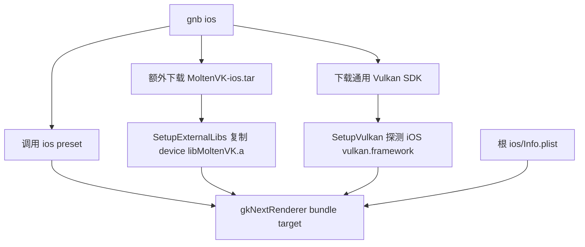
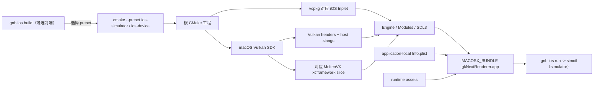

# iOS 纯 CMake 驱动构建重构方案

> **2026-08-12 实施决策：device-only。** 实测 Simulator Metal 能力无法承载完整 renderer，
> 因此撤销所有 Simulator preset、triplet、`simctl`、smoke UI 和渲染兼容分支。下文涉及
> Simulator 的内容保留为原始规划与调查记录，不再属于实现或验收范围；当前唯一支持目标为
> `ios-device`，入口为 `./gnb.sh ios build [--team-id <TEAM>]`。

## 1. 目标与结论

本方案以 `/Users/gameknife/github/LocalIOS` 已验证的最小 MoltenVK iOS Demo 为参照，重新收口
gkNextRenderer 的 iOS 构建链。最终只保留一条公开构建路径：

```text
CMake preset -> Xcode generator -> gkNextRenderer.app
```

目标状态：

- 删除仓库根目录 `ios/`；`Info.plist` 与 `gkNextRenderer` target 放在同一 owner 目录。
- CMake 直接使用 macOS Vulkan SDK 自带的 `MoltenVK.xcframework`，不再另下 MoltenVK tar、复制
  `libMoltenVK.a` 或要求一套独立的 iOS Vulkan framework 目录。
- 显式提供 `ios-simulator` 与 `ios-device` 两组 configure/build preset，构建目录完全隔离。
- 保留 `gnb ios`，但改成只有 `build`/`run` 的平台薄前端：build 选择 CMake preset，run 通过
  `simctl` 安装和启动 CMake 已生成的 `.app`；它不再拥有依赖布局、编译参数或签名策略。
- 保留 SDL3 callback main 和现有 Engine/Application 分层；本次不复制 LocalIOS 的 UIKit
  `main.mm`，不重写窗口、输入或应用生命周期。
- simulator 与 unsigned device 都用相同的根 CMake 工程构建；签名只保留一个可选的 Team ID
  输入，不在仓库中保存个人 identity 或 provisioning profile。

这里的“纯 CMake 驱动”指 configure、编译、链接、bundle、资源和签名都只有 CMake 一份定义。
`gnb ios build` 只是选择 preset 并复用通用 CMake runner，`gnb ios run` 属于构建后的部署/启动，
不构成第二套 build graph。Xcode 仍是 CMake 在 Apple 平台生成和调用的原生后端，vcpkg 仍负责
第三方 C/C++ 依赖。

## 2. 参考项目实测结论

2026-08-12 在本机对 LocalIOS 做了独立临时目录验证：

- CMake 3.31.5、Xcode 26.5；
- Vulkan SDK `1.4.350.0/macOS`；
- `iphonesimulator` + arm64 configure/build 成功，产出可用的 `VulkanIOSApp.app`；
- `iphoneos` + arm64 configure 成功；
- simulator 链接
  `lib/MoltenVK.xcframework/ios-arm64_x86_64-simulator/libMoltenVK.a`；
- device 链接 `lib/MoltenVK.xcframework/ios-arm64/libMoltenVK.a`。

参考项目证明了以下最小闭环：

1. `CMAKE_SYSTEM_NAME=iOS` 与 Xcode generator 足以生成 `.app`；
2. `CMAKE_OSX_SYSROOT` 是 simulator/device 的唯一平台分流输入；
3. Vulkan headers、host `slangc` 和两个 MoltenVK slice 可以来自同一份 macOS Vulkan SDK；
4. bundle metadata、Apple frameworks 和签名属性都可以附着在 CMake target 上；
5. 不需要提交 `.xcodeproj`，也不需要长期存在的 iOS 工程目录。

本项目采用这套构建骨架，不采用参考项目自己的 renderer、`CAMetalLayer` 创建代码和 UIKit
入口。gkNextRenderer 已由 SDL3 提供 iOS 应用生命周期与 Vulkan surface，这部分替换会扩大成
平台运行时重构，不属于本任务。

## 3. 当前链路的问题

当前路径实际由多处共同决定：



主要问题：

1. `CMakePresets.json` 只有含义模糊的 `ios` preset，固定 `arm64-ios`，没有 simulator 路径。
2. `cmake/SetupVulkan.cmake` 的 iOS 分支要求 `lib/vulkan.framework/vulkan`；它无法识别
   LocalIOS 已验证的新版布局 `macOS/lib/MoltenVK.xcframework`。
3. `cmake/SetupExternalLibs.cmake` 和 `EnsureIOSExternal` 又维护另一份 MoltenVK 1.4.0，且只选择
   device slice，再把静态库复制到人工拼出的 `lib/` 目录。
4. 当前 `gnb ios` 只有 device build，没有 simulator build/run；同时承担独立 MoltenVK 下载和
   签名开关，形成了第二个依赖/策略入口。
5. 根 `ios/Info.plist` 与唯一使用它的 application target 相隔过远；其中仍声明 `armv7`，并带有
   当前 renderer 未使用的相机、麦克风、照片库权限文案。
6. `src/CMakeLists.txt` 的 iOS Objective-C++ 特判仍指向已删除的
   `Engine/Runtime/Subsystems/NextAudio.cpp`；真正包含 miniaudio iOS Objective-C 实现的是
   `Modules/NextAudio/MiniaudioBackend.cpp`。
7. 当前 asset post-build 会把整个 CMake `assets` binary directory 复制进 bundle，而不是只复制
   runtime `assets/` 子树，容易夹带 stamp/CMake 中间文件。
8. 签名有 skip flag、team、identity、profile 四组输入；对本地 simulator、CI unsigned build 和
   普通开发设备这三个场景而言过度复杂。

## 4. 目标架构与职责



职责边界：

| 层 | 唯一职责 |
|---|---|
| `CMakePresets.json` | simulator/device、sysroot、架构、vcpkg triplet、独立 build tree |
| `cmake/SetupVulkan.cmake` | 解析一份 Vulkan SDK，选择正确的 MoltenVK slice，提供 headers 与 host `slangc` |
| `src/Application/Render/gkNextRenderer/CMakeLists.txt` | `.app`、plist、framework、资源装包、可选签名 |
| vcpkg | SDL3 及现有第三方 C/C++ 依赖；device 与 simulator 使用不同 triplet/cache |
| Xcode | CMake 生成的 Apple 原生编译、bundle 和 codesign 后端 |
| `gnb setup`（可选） | 只准备 vcpkg、Vulkan SDK、tsc；不参与 iOS build graph |
| `gnb ios build/run` | 选择 preset；定位 CMake 产物并调用 `simctl`，不复制 CMake build policy |

明确不新增 `tools/ios/`、iOS toolchain 文件、手写 `.xcodeproj`、平台构建脚本或 CMake 外的资源
复制步骤。

## 5. CMake 设计

### 5.1 Preset

将旧 `ios` preset 替换为两个语义明确的 preset：

| preset | `CMAKE_OSX_SYSROOT` | 架构 | vcpkg triplet | 默认签名 |
|---|---|---|---|---|
| `ios-simulator` | `iphonesimulator` | `arm64` | `arm64-ios-simulator` | 关闭 |
| `ios-device` | `iphoneos` | `arm64` | `arm64-ios` | Team ID 为空时关闭 |

两者都继承现有 `base`，使用 Xcode generator，并设置：

- `CMAKE_SYSTEM_NAME=iOS`；
- `CMAKE_OSX_DEPLOYMENT_TARGET=15.0`；
- 独立的 `out/build/ios-simulator/`、`out/build/ios-device/`；
- build preset 的 configuration 固定为 `RelWithDebInfo`。

不再额外设置 `CMAKE_XCODE_ATTRIBUTE_ARCHS[sdk=iphoneos*]`；标准 CMake 的
`CMAKE_OSX_ARCHITECTURES` 与 `CMAKE_OSX_SYSROOT` 是唯一来源。项目当前目标平台是 macOS arm64
主机，因此本阶段不增加 Intel host 的 x86_64 simulator preset。

直接使用 CMake 的规范命令为：

```bash
# 可选：使用系统安装的 Vulkan SDK；gnb setup 管理的 external SDK 也可自动发现
export VULKAN_SDK="$HOME/VulkanSDK/<version>/macOS"

cmake --preset ios-simulator
cmake --build --preset ios-simulator --target gkNextRenderer

cmake --preset ios-device
cmake --build --preset ios-device --target gkNextRenderer
```

对应的日常入口为：

```bash
./gnb.sh ios build simulator
./gnb.sh ios build device
./gnb.sh ios run
```

不保留 `cmake --preset ios` 隐式指向 device 的兼容 alias，避免新旧命令继续并存。

### 5.2 Vulkan SDK 与 MoltenVK

`SetupVulkan.cmake` 不再维护独立的 iOS SDK resolver，而是与 macOS 共用同一个 Apple Vulkan SDK
resolver。两者使用相同的 SDK root，只在最终链接目标上分流：macOS 使用 host Vulkan loader，
iOS 使用所选 MoltenVK xcframework slice。

解析优先级固定为：

1. 用户显式设置的 `VULKAN_SDK`；一旦设置就必须使用它，路径无效时直接报错，不静默回退。
2. 项目已下载到 `external/VulkanSDK/` 的版本，优先读取 `.current_version`，再扫描其他版本。
3. 仅在直接运行 CMake、前两项都不存在时，回退扫描 `$HOME/VulkanSDK/*`。

`gnb setup` / `gnb ios build` 沿用相同语义：有有效 `VULKAN_SDK` 时不下载；否则复用 external 中
已存在的 SDK；external 也没有时才下载 `gnb.toml` 固定的版本。iOS 不再单独下载 MoltenVK，因为
macOS Vulkan SDK 已包含所需 xcframework。

共享 Apple SDK root 必须具备：

```text
include/vulkan/vulkan.h
bin/slangc
```

iOS 在此基础上额外要求：

```text
lib/MoltenVK.xcframework/Info.plist
```

随后只根据 `CMAKE_OSX_SYSROOT` 选择：

```text
iphonesimulator -> ios-arm64_x86_64-simulator/libMoltenVK.a
iphoneos        -> ios-arm64/libMoltenVK.a
```

CMake 直接把所选静态库链接给 `gkNextEngine`。删除以下旧行为：

- 寻找 `iOS/lib/vulkan.framework/vulkan`；
- 下载独立 `MoltenVK-ios.tar`；
- 在 configure 阶段 `configure_file(... COPYONLY)` 复制静态库；
- 维护 `MOLTENVK_ROOT/lib/libMoltenVK.a` 中间布局。

缺文件时在 configure 阶段一次性报出 SDK root、sysroot 和预期 slice。不要静默回退到 device
library，否则 simulator 直到 link 才会暴露架构/平台不匹配。

本次不顺带升级 Vulkan SDK 版本。LocalIOS 的 1.4.350.0 是已验证样本，不是硬编码版本；当前
`gnb.toml` 管理的 SDK 只要包含上述契约即可。

### 5.3 Objective-C++、bundle 与 plist

根 project 继续只声明通用 `C`/`CXX`；进入 iOS 分支后调用 `enable_language(OBJCXX)`，并将
`Modules/NextAudio/MiniaudioBackend.cpp` 在 iOS 下按 Objective-C++ 编译。这样不会要求 Windows/
Linux 主机安装 Objective-C compiler，也修正当前已失效的源文件特判。

把 plist 移到：

```text
src/Application/Render/gkNextRenderer/Info.plist
```

plist 以 LocalIOS 的最小版本为基线，只保留 bundle 基本字段、`LSRequiresIPhoneOS`、arm64/Metal
能力和 iPhone/iPad orientation。`CFBundleIdentifier` 使用
`$(PRODUCT_BUNDLE_IDENTIFIER)`，删除 `armv7`、未使用权限和不存在的 AppIcon/LaunchScreen
声明。

`gkNextRenderer` target 继续使用现有 `MACOSX_BUNDLE` 与 SDL callback main，只在 iOS 分支声明：

- application-local plist；
- 固定 bundle id `com.tzy.gknext`；
- target device family `1,2`；
- 当前 MoltenVK/SDL/audio 所需 Apple frameworks。

framework 集合以现有列表与 LocalIOS 已验证列表的并集为准：`UIKit`、`Metal`、`QuartzCore`、
`Foundation`、`CoreGraphics`、`ImageIO`、`CoreFoundation`、`IOSurface`、`AVFoundation`、
`CoreAudio`、`AudioToolbox`。实施时若 link map 证明某项没有直接或传递需求，再单独删除；本次不以
猜测方式裁剪。

### 5.4 资源

保留当前 `Assets` target 和 build-tree 输出，不引入新的资源系统。只收紧 post-build copy：

```text
out/build/<preset>/assets/assets/ -> gkNextRenderer.app/assets/
```

不要再把 `out/build/<preset>/assets/` 整棵复制到 bundle。iOS 已禁用 TypeScript hot reload，host
`tsc` 也不应进入 `.app`。所有 copy 继续使用 `add_custom_command(TARGET ... POST_BUILD)` 和
`$<TARGET_BUNDLE_DIR:...>`，不依赖 bundle 的硬编码绝对路径。

CMake 同时在 `out/build/<preset>/ios-app-RelWithDebInfo.json` 生成一个很小的 iOS artifact
manifest，记录当前 configuration 的 bundle 绝对路径和 bundle id。`gnb ios run` 只读取这个
manifest，不在 Go 中猜测 Xcode 的 `<config>-<sdk>` 目录，也不递归搜索可能过期的 `.app`。

### 5.5 签名

移除 `IOS_SKIP_CODE_SIGN`、`IOS_CODE_SIGN_IDENTITY`、`IOS_PROVISIONING_PROFILE` 三组状态，只保留：

```cmake
IOS_DEVELOPMENT_TEAM=""
```

- Team ID 为空：设置 `CODE_SIGNING_ALLOWED=NO`、`CODE_SIGNING_REQUIRED=NO`，用于 simulator、CI
  和 unsigned device compile。
- Team ID 非空：使用 Xcode Automatic signing，并把该值传给 `DEVELOPMENT_TEAM`。

本地 device 示例：

```bash
cmake --preset ios-device -DIOS_DEVELOPMENT_TEAM=ABCDE12345
cmake --build --preset ios-device --target gkNextRenderer
```

Team ID 不写入 preset、plist、`CMakeUserPresets.json` 示例或 CI。若未来发布需要固定 profile、
archive/exportOptions，应单独设计发行签名流程，不恢复到日常 build target。

## 6. gnb 与 CI 收口

### 6.1 命令归属决定

**决定保留 `gnb ios`，不把 iOS 塞进通用 `gnb build` / `gnb run`。**

原因来自当前代码边界：

- 通用 `gnb build` 根据 host 固定选择 `macos-arm64`，无参数时还会构建 iOS 不存在的
  `gkNextUnitTests`；让它同时表达 target platform 会改变所有平台的 preset/default 语义。
- 通用 `gnb run` 假定产物是 `out/build/<host-preset>/bin/<target>` 下可被 `exec.Command` 直接执行的
  host binary；iOS 必须处理 `.app`、simulator identifier、install 与 launch。
- 将这些分支加入通用 runner 还会波及 Dashboard 和所有依赖 host preset 的命令，不符合本次
  “改动尽可能精简”的范围。

`gnb ios` 调整为带子命令的薄入口：

```bash
# build 未给 platform 时默认 simulator；gnb ios 未给子命令时只显示 help
./gnb.sh ios build
./gnb.sh ios build simulator
./gnb.sh ios build device
./gnb.sh ios build device --team-id ABCDE12345

# 运行已经构建的 simulator app；默认使用 booted，也可显式指定 simulator identifier
./gnb.sh ios run
./gnb.sh ios run --simulator <identifier>
```

具体契约：

- `ios build [simulator|device]` 把平台一对一映射到 `ios-simulator` / `ios-device`，target 固定为
  `gkNextRenderer`，底层复用 `cmakerun.BuildWithCMake`；默认 `simulator`。
- build 复用通用 setup 行为：有效的用户 `VULKAN_SDK` 优先，否则 external 已下载版本优先，缺失
  时准备 vcpkg/Vulkan SDK；不再调用 `EnsureIOSExternal`。
- build 保留必要的 `--clean`、`--reconfigure`，device 可用 `--team-id` 向唯一的 CMake cache
  变量 `IOS_DEVELOPMENT_TEAM` 传值；不再暴露 skip/identity/profile 四套 flag。
- `ios run` 不隐式构建，缺少 artifact manifest 或 `.app` 时提示先运行 `gnb ios build simulator`，
  与通用 `gnb run` 的“先 build 后 run”语义一致。
- `ios run` 只负责 simulator：校验 `xcrun simctl` 和目标 identifier、install `.app`、以
  `simctl launch --console` 启动固定 bundle id。真机 install/run 留给后续 devicectl/发行签名任务。

保留 `tools/gnb/internal/ios/`，但重写为 preset 映射、artifact manifest 读取和 simctl 调用；删除其
当前 raw CMake 命令拼接和签名布尔逻辑。测试覆盖 preset 映射、无效 platform、manifest 校验与
simctl 参数组装，不要求测试机真的启动 simulator。

仍需删除：

- `fetcher.EnsureIOSExternal`；
- `gnb.toml` 的 `[external.moltenvk]` 与对应 config 字段；
- `resolveIOSSkipCodeSign` 和旧 `--skip-codesign` / `--codesign` tests。

`gnb setup` 继续负责仓库级依赖准备，不参与 iOS build graph。

### 6.2 CI

`.github/workflows/ios.yml` 调整为：

1. checkout、Go setup 与现有 cache；
2. `./gnb.sh setup --skip-paks` 只准备依赖；
3. 执行 `./gnb.sh ios build <platform>`，由它调用对应 CMake preset/target。

最终建议用 `simulator` / `device` 两项 matrix，cache key 包含对应 preset，分别验证 simulator
slice 与 unsigned device slice。若 CI 时长暂时不可接受，合并阶段至少把 `ios-simulator` 设为必过，
device build 必须在本地完成并记录；不能用一次 simulator link 推断 device slice 正确。

CI 不安装或启动 simulator。运行验收在有已启动 simulator 的本机执行：

```bash
xcrun simctl install booted <gkNextRenderer.app>
xcrun simctl launch --console booted com.tzy.gknext
```

`simctl` 是构建后的运行工具，不进入 CMake build graph；日常使用由 `gnb ios run` 调用，不增加
专用脚本。

## 7. 预期改动清单

| 文件/目录 | 动作 |
|---|---|
| `CMakePresets.json` | 用 simulator/device 两组 configure/build preset 替换旧 `ios` |
| `cmake/SetupPlatform.cmake` | 删除 iOS 专用 Xcode arch 重复设置，收敛签名变量 |
| `cmake/SetupExternalLibs.cmake` | 删除独立 MoltenVK 获取后布局/复制逻辑 |
| `cmake/SetupVulkan.cmake` | 从 macOS Vulkan SDK 直接选择 MoltenVK xcframework slice |
| `src/CMakeLists.txt` | 启用 iOS OBJCXX，并修正 miniaudio source 特判 |
| `src/Application/Render/gkNextRenderer/CMakeLists.txt` | 收敛 bundle、framework、签名、asset copy |
| `src/Application/Render/gkNextRenderer/Info.plist` | 从根 `ios/` 迁入并最小化 |
| `ios/` | 删除整个目录 |
| `tools/gnb/cmd/gnb/main.go` 与 tests | 将 `gnb ios` 改为 `build`/`run` 子命令，删除旧签名 flag |
| `tools/gnb/internal/ios/` | 复用 CMake runner；增加 manifest 读取与 simulator install/launch |
| `tools/gnb/internal/fetcher/fetcher.go` | 删除单独 MoltenVK tar 获取 |
| `tools/gnb/internal/config/`、`gnb.toml` | 删除 MoltenVK 专用配置 |
| `.github/workflows/ios.yml` | 用 matrix 调用 `gnb ios build simulator/device` |
| `.github/_typos.toml` | 删除已不存在的 `ios/` 排除项 |
| `AGENTS.md`、`docs/guides/gnb-cli.md`、`docs/guides/cmake-structure.md` | 更新公开命令和职责 |

不修改 `src/ThirdParty/`、Engine 的 Vulkan surface 逻辑、SDL lifecycle、renderer feature 或游戏代码。

## 8. 实施顺序

### M1：建立 simulator 纯 CMake 闭环

1. 新增 `ios-simulator` preset，并选择匹配的 vcpkg triplet。
2. 改造 `SetupVulkan.cmake`，直接选 simulator MoltenVK slice。
3. 修正 Objective-C++ source 设置。
4. 将 plist 迁入 application 目录并最小化。
5. 收紧 asset copy，构建 `gkNextRenderer.app`。
6. 用 `simctl install/launch` 验证运行日志出现 `committed scene [...]`。

在 M1 完成前暂不删除旧命令，方便仅做结果对照；不得让新旧实现长期共存。

### M2：补齐 device 与签名最小模型

1. 新增 `ios-device` preset，选择 device slice。
2. 完成 unsigned device build。
3. 用仓库外 Team ID 验证 Automatic signing；若当前环境无可用证书，只把 unsigned build 设为
   合并门槛，并明确记录未做真机安装。
4. 对比 simulator/device link command，确认没有交叉使用 slice 或 vcpkg installed tree。

### M3：收口 gnb、CI 与旧链路

1. 将 `gnb ios` 改为薄 `build`/`run` 子命令，删除独立 MoltenVK 下载/配置和根 `ios/`。
2. 更新 CI、AGENTS 和现行 guides。
3. 全仓 `rg` 确认没有旧 `ios` preset、旧签名 flag、根 plist 或 `external/moltenvk-*` 代码引用。
4. 运行 gnb Go tests、两组 CMake build 和 `gnb ios run` simulator 验收。

## 9. 验收标准

### 9.1 静态结构

- 根目录不存在 `ios/`。
- 仓库不跟踪 `.xcodeproj`、`.xcworkspace` 或 iOS 构建产物。
- 不存在 `EnsureIOSExternal`、`[external.moltenvk]` 和旧 `gnb ios --skip-codesign/--codesign`。
- `gnb ios` 只暴露 `build`/`run`；build 复用 CMake runner，run 只调用 `simctl`。
- `Info.plist` 只被 `gkNextRenderer` target 引用，且与 target 同目录。
- CMake configure 不复制 MoltenVK binary，不修改源码树。

### 9.2 构建

```bash
cmake --preset ios-simulator
cmake --build --preset ios-simulator --target gkNextRenderer

cmake --preset ios-device
cmake --build --preset ios-device --target gkNextRenderer

./gnb.sh ios build simulator
./gnb.sh ios build device
```

两组命令都必须从干净 build tree 成功；生成的 binary 分别为 arm64 simulator 与 arm64 iOS
device 平台，bundle 内存在 `assets/`，且不包含 CMakeFiles、stamp、host `slangc` 或 host `tsc`。

### 9.3 运行

- simulator 可安装、启动并持续显示 smoke presentation；
- 日志出现 `iOS Simulator smoke presentation ready`；
- simulator 验证 CMake bundle、SDL/UIKit lifecycle、资源装包与 simctl 部署；
- unsigned device 产物继续包含完整 Vulkan/MoltenVK renderer；
- `./gnb.sh ios run` 能从 CMake artifact manifest 定位 `.app` 并完成 install/launch。

实施时实测 Apple iOS Simulator GPU 不支持 renderer 所需的 Tier-2 Metal argument buffers，且单个
kernel 最多允许 8 个 read/write textures；完整 SoftwareTracing bindless frame graph 因此不能在
Simulator 上等价执行。该限制来自模拟器 Metal 能力，不是 CMake 或 MoltenVK slice 选择错误。
Simulator 使用同一 CMake target、同一 SDL callback main 和同一 bundle，仅将启动内容切换为明确
标识的 UIKit smoke presentation；完整场景提交与渲染验收属于真机签名/部署阶段。

### 9.4 回归

- `go test ./...`（`tools/gnb`）通过；
- `cmake --preset macos-arm64` 仍可 configure，避免 iOS SDK 解析污染 macOS MoltenVK loader 路径；
- 常规 macOS targeted build 通过；
- `git status --short` 不出现 build 生成文件。

这是构建系统/跨平台 CMake 改动，实施后至少验证受影响的 iOS 两个 preset 与 macOS
`gkNextRenderer`；不需要因此运行全量所有 application build。

## 10. 风险与边界

1. **vcpkg 双平台缓存不能共用。** simulator/device preset 必须使用不同 build tree 和 triplet；否则
   静态库可能在 link 时才暴露 platform mismatch。
2. **host 工具与 target library 不同。** `slangc` 从 macOS host SDK 执行，MoltenVK 从 iOS slice
   链接；不能把 host `libvulkan.dylib` 链进 `.app`。
3. **SDL3 仍拥有 lifecycle/surface。** LocalIOS 的 `CAMetalLayer` 代码只用于证明 MoltenVK slice
   可用，不能与 SDL surface 同时接管窗口。
4. **真机签名不是 CI build 的等价物。** unsigned device build 只证明编译/链接；真机安装仍需要
   有效 Team、证书和设备授权。
5. **不在本次升级依赖。** Vulkan SDK、SDL3、vcpkg baseline、deployment target 的版本升级应独立
   提交，避免迁移失败时无法判断是结构还是版本变化。
6. **不扩展平台矩阵。** 本阶段只支持项目已声明的 macOS arm64 host、arm64 simulator 和 arm64
   device；Intel simulator、Archive/IPA/App Store export 另立任务。

回滚以提交为单位：M1/M2 未通过时保留旧链路用于对照；只有两条新 preset 都完成验收后，M3 才
一次性删除旧入口。合并后的主分支不保留双轨兼容代码。
