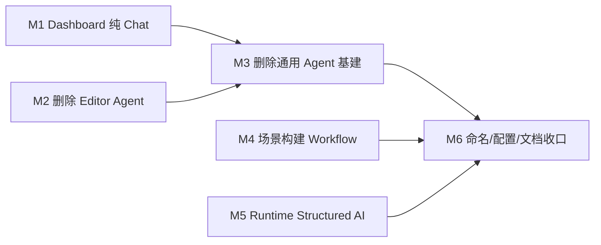

# NextAI 面向具体产品能力的轻量化重构计划

> 目标架构、产品边界和 Tool Call 决策见 [NextAI 面向具体产品能力的目标架构](../designs/nextai-product-focused-architecture.md)。本文只描述迁移顺序、代码改动和验收方式。
>
> 先前的通用 Agent/Coding Agent 计划已经标记为“已被取代”。统一 provider、profile、bridge 和本地模型管理继续保留。

## 0. 交付范围

本轮完成以下迁移：

1. Dashboard 默认从通用 Agent Loop 切到普通 Chat，只保留一个显式 Tool Call Smoke 探针。
2. 删除 gkNextEditor 的 AI 场景操作 Agent，手工 Script Console 独立保留。
3. 删除失去生产使用方的通用 Agent、repo tools 和 remote tools 基础设施。
4. 固化 ScadStudio、MagicaLego 的领域生成/校验/一次修复流程，并先定义 BrickPlayer 构建契约。
5. 为 StudioSim、AirportSim 补齐 structured output、校验和 deterministic fallback。
6. 清理 Agent 命名、RPC、配置和文档。

不在本轮处理：AgentDriver、`gnb validate`、agentscript、游戏 NPC `AgentSystem`，以及新的 BrickPlayer AI 功能实现。

## 1. 当前到目标的差异

| 范围 | 当前 | 目标 |
| --- | --- | --- |
| Dashboard | 默认 `RunAgent` + 8 个 repo tools | 默认 `Router.Chat`；可选一个内存 Tool Probe |
| gkNextEditor | 17 个 remote scene/editor tools | 无 LLM Agent；保留独立手工 Script Console |
| gnb runtime | 通用 Agent Loop、Tool Registry、RepoTools | Chat/Structured/Workflow；无开放式 Agent |
| Engine bridge | `agent.run`、`tools.register`、`tool.execute` | `llm.chat`、`workflow.run`、session/cancel |
| NextAI C++ | Chat DTO + Tool DTO/Registry/remote handlers | 轻量 Chat/Structured client |
| 场景辅助 | prompt 后直接抽取产物 | 领域解析、校验、最多一次修复、预览后应用 |
| 运行时 AI | 文本请求后手工截取 JSON | schema/JSON mode + validator + fallback |

当前代码证据：

- Dashboard 在 [`handlers_chat.go`](../../tools/gnb/internal/dashboard/handlers_chat.go#L292) 调用 `Runtime.RunAgent`；
- repo tools 在 [`runtime.go`](../../tools/gnb/internal/ai/runtime.go#L80) 默认注册；
- Editor 在 [`EditorAIService.cpp`](../../src/Application/Editor/gkNextEditor/AI/EditorAIService.cpp#L99) 注册 remote tools，并在[同文件](../../src/Application/Editor/gkNextEditor/AI/EditorAIService.cpp#L716)调用 `agent.run`；
- ScadStudio 已走普通 `ChatStream`，见 [`ScadAIService.cpp`](../../src/Application/Editor/ScadStudio/ScadAIService.cpp#L301)；
- StudioSim/AirportSim 已是异步单次推理，分别见 [`GoalSystem.cpp`](../../src/Application/Game/StudioSim/GoalSystem.cpp#L224) 和 [`DecisionScheduler.cpp`](../../src/Application/Game/AirportSim/DecisionScheduler.cpp#L416)。

## 2. 实施顺序



M1 与 M2 可独立实施；两者都完成后才能做 M3。M4、M5 不依赖通用 Agent，可与 M1/M2 并行，但不要在同一 PR 同时修改多个应用。

### M1：Dashboard 改为默认纯 Chat

目标：解除 Dashboard 对通用 Agent Loop 和 repo tools 的依赖。

任务：

- [ ] 普通和流式 handler 从 `Runtime.RunAgent` 改为 `Router.Chat`。
- [ ] 默认请求不附带 tools。
- [ ] 移除 Agent steps/tool progress UI，改为请求诊断信息。
- [ ] 保留 provider/model/profile、thinking、stream、usage、finish reason 和错误展示。
- [ ] 增加显式 `Tool Call Smoke` 模式，只提供 `lookup_diagnostic_fixture(key)`。
- [ ] Probe 最多两次模型请求、一次工具执行；任何额外调用直接诊断失败。
- [ ] 增加普通 Chat 和 Tool Probe 的 handler/provider contract tests。

退出条件：

- Dashboard 默认路径不引用 `agent.Run` 或 repo tools；
- 关闭 Tool Call Smoke 时，请求体不出现 `tools`；
- Probe 不访问文件、Git、Shell、Scene、网络或用户数据。

验证：

```powershell
cd tools/gnb
go test ./internal/dashboard/... ./internal/ai/provider/... ./internal/ai/router/...
go test ./...
```

### M2：删除 gkNextEditor AI 操作 Agent

目标：移除唯一的 Engine remote tools 使用方，同时保住非 AI 的手工脚本能力。

任务：

- [ ] 从 Editor UI 删除 AI Assistant、provider selector、conversation、Agent steps 和 pending AI actions。
- [ ] 删除 `FEditorAIService`、`EditorTools` 和远程工具注册。
- [ ] 把 `FEditorScriptExecutor` 及手工 UI 迁到 `Automation/` 或 `Script Console`。
- [ ] 清理 Editor 的 NextAI include、状态泵送和主线程工具回调。
- [ ] 若无其他引用，从 `gkNextEditor` 解除 `NextAI` 链接。
- [ ] 保留 EditorScript/JavaScript 的显式执行和编辑器高风险确认语义。

候选删除文件：

- `src/Application/Editor/gkNextEditor/AI/EditorAIService.{hpp,cpp}`
- `src/Application/Editor/gkNextEditor/AI/EditorTools.{hpp,cpp}`

退出条件：

- `gkNextEditor` 不发起 `agent.run`，不注册 LLM tool；
- 场景修改只来自用户 UI 或用户显式脚本；
- Script Console 仍能执行只读命令和需确认的修改命令。

验证：

```powershell
./gnb.bat build gkNextEditor
./gnb.bat editor
```

### M3：删除通用 Agent/Tool 基础设施

目标：在 Dashboard 和 Editor 都迁出后，删除失去用途的公共代码。

任务：

- [ ] 删除 Go `internal/ai/agent/`、通用 `internal/ai/tool/` 和 `internal/repotools/`。
- [ ] 删除 `Runtime.RunAgent` 和 `gnb agent run`。
- [ ] bridge 删除 `agent.run`、`tools.register`、`tool.execute` 与对应事件。
- [ ] C++ client 删除 `RunAgent`、`RegisterTools` 和 remote tool dispatcher。
- [ ] 删除 C++ `IAITool`、`FToolRegistry` 及只为工具存在的事件类型。
- [ ] 精简 C++ `AIChat` DTO；Go protocol 只在诊断侧保留 Tool Call DTO。
- [ ] 将 `gnb agent bridge/doctor` 迁为 `gnb ai bridge/doctor`，保留一个版本的隐藏兼容别名。
- [ ] 用不含 remote tools 的精简协议替换 Agent Bridge Protocol v1 文档和 fixture。

候选删除文件：

- `src/Modules/NextAI/AI/IAITool.{hpp,cpp}`
- `src/Modules/NextAI/AI/ToolRegistry.{hpp,cpp}`
- `tools/gnb/internal/ai/agent/**`
- `tools/gnb/internal/ai/tool/**`
- `tools/gnb/internal/repotools/**`

退出条件：生产代码搜索不到：

```text
RunAgent
agent.run
tools.register
tool.execute
RegisterRepoTools
RegisterEditorTools
```

验证：

```powershell
cd tools/gnb
go test ./...
cd ../../..
./gnb.bat build --reconfigure
```

这是跨 Go/C++/CMake 的广面删除阶段，因此按仓库规则执行全量 reconfigure。

### M4：固化现有场景构建 workflow，并定义 BrickPlayer 契约

目标：让场景辅助的可靠性来自领域校验，而非 Tool Call。

任务：

- [ ] ScadStudio 抽出生成、解析、校验、最多一次修复和预览状态。
- [ ] 复用 SCAD parser/evaluator 的真实错误作为 repair 输入。
- [ ] MagicaLego 将 script parser/placement rule 错误接入最多一次修复。
- [ ] 为两者增加固定 prompt/output 回归夹具，覆盖成功、坏 fence、坏语法、修复成功和修复失败。
- [ ] 为 BrickPlayer 单独设计 `BrickBuildPlan` 或 `.ldr` 领域契约和 validator；本阶段不接模型。
- [ ] 如果 workflow 放在 gnb，RPC 只暴露业务请求和业务结果，不暴露内部“工具”。

退出条件：

- SCAD 和 MagicaLego 第一次返回非法产物时，最多进行一次可解释修复；
- 第二次失败可诊断且不修改场景；
- BrickPlayer 有可独立测试的领域契约设计，尚无通用 Agent 依赖。

验证：

```powershell
./gnb.bat build ScadStudio
./gnb.bat build MagicaLego
```

视觉结果分别使用对应 target 的 `gnb shot` 检查。

### M5：强化运行时 Structured AI

目标：让 StudioSim/AirportSim 获得稳定结构化响应和 fallback，不引入 Agent。

任务：

- [ ] 为 Go/C++ Chat request 增加 JSON mode/schema 能力描述。
- [ ] provider adapter 明确报告 native schema、JSON mode 或 prompt-only 降级。
- [ ] StudioSim 为各类请求定义独立 DTO 和 validator。
- [ ] AirportSim 为 NPC 决策定义 action/target allowlist、字符串限长和枚举校验。
- [ ] 两个游戏统一使用 deadline、generation ID、cancel 和主线程结果队列。
- [ ] 增加坏 JSON、未知 action、超时、provider unavailable 的 deterministic fallback 测试。
- [ ] 保持 `--agent-validation` 下不发真实模型请求。

退出条件：运行时 AI 的任何失败都不会卡住玩法、写入越代结果或产生非法游戏动作。

验证：

```powershell
./gnb.bat build StudioSim
./gnb.bat build AirportSim
```

并运行两者现有的 agentscript/隐藏窗口验证路径。

### M6：命名、配置和文档收口

目标：代码和文档不再暗示 NextEngine 提供通用 Agent。

任务：

- [ ] `GnbAgentClient` 重命名为 `GnbAIClient`。
- [ ] 删除 `editor` profile、`tool_sets`、`max_steps`、`max_tool_calls` 和 Agent 专用预算配置。
- [ ] 保留 `general`、`scad-scene`、`scad-studio`、`magicalego-script`、`simulation` 等业务 profile。
- [ ] 更新 `AGENTS.md`、Modules README、gnb CLI 文档和各产品指南。
- [ ] 清理 Dashboard 中 Agent/Coding/Research 模式用语。
- [ ] 运行 LOC/依赖检查，确认删除不是把同一机制改名后保留。

退出条件：面向用户和开发者的资料把 NextAI 描述为“模型接入 + 具体业务 AI”，不再描述成通用代码/场景 Agent 平台。

验证：

```powershell
cd tools/gnb
go test ./...
cd ../../..
./gnb.bat build gkNextRenderer gkNextUnitTests
./out/build/windows/bin/gkNextUnitTests "[AI]"
```

## 3. 验证矩阵

| 能力 | 自动验证 | 人工验证 |
| --- | --- | --- |
| Provider Chat | adapter mock contract tests | Dashboard 选择本地/外部 provider 各发一次请求 |
| Streaming | SSE 分片与取消测试 | Dashboard/ScadStudio 确认真流式 |
| Tool Call Smoke | 固定 fixture 两轮协议测试 | 查询 `beta` 返回 `B-42` |
| ScadStudio | parser/repair workflow tests | 生成模型并预览 |
| MagicaLego | script/placement/repair tests | 生成小型结构并确认后应用 |
| BrickPlayer | 领域 schema/validator tests | 功能实现后再增加模型 smoke |
| StudioSim | DTO、超时、fallback tests | 一天流程无阻塞完成 |
| AirportSim | allowlist、越代结果 tests | LLM 开关打开/关闭各运行一轮 |
| Editor | 编译 + Script Console smoke | 无 AI Agent，手工脚本可用 |
| Bridge | JSON-RPC fixture + shutdown/cancel tests | Engine 启停无孤儿进程 |

真实外部付费 provider 的 smoke 不进入默认 CI。本地 mock 覆盖协议，真实调用由 Dashboard Capability Lab 手工验证。

## 4. 风险与实施约束

| 风险 | 处理方式 |
| --- | --- |
| 删除 Editor Agent 时误删手工脚本能力 | 先拆 Script Console，再删除 AI 服务；两者分 PR |
| Dashboard Tool Probe 再次膨胀 | 固定一个内存工具；新增工具必须先更新目标架构并说明诊断缺口 |
| provider Tool Call 适配退化 | 保留 conformance test 和 Dashboard Smoke，不保留通用 Agent |
| structured output 在 provider 间不一致 | capability 明示 + adapter 降级标记 + 本地 validator |
| 业务 workflow 重复 | 只共享请求/取消/错误；不抽象领域 parser、repair prompt 和 apply 逻辑 |
| repair loop 变成隐性 Agent | 最多一次修复，步骤由代码固定 |
| BrickPlayer 过度设计 | 先定义领域产物和 validator，获验证前不加模型调用 |
| “Agent”同名导致误删其他系统 | 明确排除 AgentDriver、agentscript 和游戏 AgentSystem |

实施约束：

- 每个 PR 只迁移一个使用方或一个公共边界；
- 先迁出生产使用方，再删除公共基础设施；
- provider、profile、bridge 的普通 Chat 能力必须始终可用；
- 代码删除阶段不得顺带重写 prompt 或改变玩法；
- 常规阶段使用 targeted build，只有 M3 的广面 CMake/协议删除执行全量 reconfigure。

## 5. 完成定义

- [ ] gkNextEditor 不存在 LLM 驱动的场景操作 Agent；
- [ ] 手工 EditorScript/JavaScript 若保留，已成为独立非 AI 功能；
- [ ] Dashboard 默认请求不包含 tools，也不进入多步 Agent Loop；
- [ ] Dashboard 只有一个固定内存 Tool Call Probe，无文件/Git/Shell/Scene 权限；
- [ ] `gnb agent run`、repo tools 和 remote editor tools 已删除；
- [ ] Engine bridge 不再支持 `agent.run`、`tools.register` 或 `tool.execute`；
- [ ] `NextAI` 不包含 Tool Registry 或通用 Agent API；
- [ ] ScadStudio 和 MagicaLego 使用领域产物、本地校验和最多一次修复；
- [ ] BrickPlayer 在 AI 接入前具备明确领域 schema 和 validator；
- [ ] StudioSim/AirportSim 使用结构化单次推理，并有 deterministic fallback；
- [ ] provider/profile/streaming/session/cancel/usage 等统一基础设施继续可用；
- [ ] AgentDriver、`gnb validate` 和游戏 NPC Agent 不受影响；
- [ ] 文档和 CLI 不再把 NextAI 描述为通用 Coding/Scene Agent。
