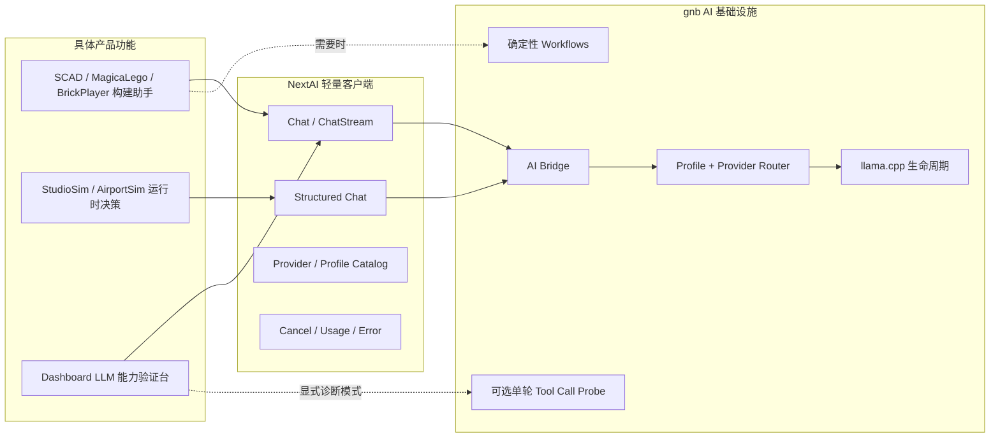

# NextAI 面向具体产品能力的轻量化重构计划

> 本计划是对 [gnb AI / Agent 统一控制面重构计划](gnb-ai-agent-unification-refactor-plan.md)、[gnb Chat Agent 质量目标架构](../designs/gnb-chat-agent-quality-architecture.md) 和 [gnb Chat Agent 质量提升开发计划](gnb-chat-agent-quality-roadmap.md) 的方向修正。
>
> 继续保留已经有实际价值的统一 provider、profile、本地模型生命周期和 Engine/gnb bridge；停止把 NextEngine 发展成通用自主 Agent 或 Coding Agent。AI 能力以具体产品需求为边界，默认采用单次推理或由代码驱动的确定性 workflow，只有出现无法由确定性流程表达的真实需求时，才重新评估 Tool Call。

## 0. 执行结论

重构完成后，NextEngine 的 AI 能力收敛为三类：

1. **场景构建助手**：ScadStudio、MagicaLego，以及未来的 BrickPlayer 构建辅助。模型生成明确的领域产物，代码负责解析、校验、修复、预览和应用。
2. **运行时 AI 推理**：StudioSim、AirportSim 等游戏在给定状态快照后请求一次结构化决策，游戏代码负责合法性校验和确定性 fallback。
3. **LLM 能力验证台**：Dashboard Chat 用来快速检查 provider、模型、流式输出、reasoning、JSON 输出和基础 Tool Call 是否正常，不承担仓库研究或代码修改职责。

对应的核心决策是：

- 删除 gkNextEditor 的通用 AI 场景操作 Agent；
- Dashboard 默认走普通 Chat，不再默认进入 `RunAgent`；
- 删除 repo/Git/Shell 工具集和开放式多步 ReAct 循环；
- Dashboard 如需验证 Tool Call，只提供 **1 个内存诊断工具**，最多执行一轮工具回填；
- ScadStudio、MagicaLego、BrickPlayer、StudioSim、AirportSim 不使用 Tool Call；
- `NextAI` 保持为轻量的 LLM 接入模块，而不是 Agent SDK；
- `gnb` 保持 provider、profile、凭据、模型路由和本地 llama.cpp 生命周期的统一所有者；
- SCAD 修复、脚本校验等多步行为由业务代码明确编排，不能把流程控制交给模型。

## 1. 为什么需要调整方向

### 1.1 当前具体需求并不需要开放式 Agent

现有产品使用方的实际驱动方式如下：

| 使用方 | 当前实际需求 | 合适抽象 | 是否需要 Tool Call |
| --- | --- | --- | --- |
| ScadStudio | 根据描述生成或修改完整 SCAD 工程 | 领域生成 workflow | 否 |
| MagicaLego | 根据描述和当前搭建上下文生成 `mlscript` | 领域生成 workflow | 否 |
| BrickPlayer | 未来根据零件目录和约束生成积木搭建方案 | 领域生成 workflow | 否 |
| StudioSim | 生成目标、任务、对白、会议决策和总结 | 结构化单次推理 | 否 |
| AirportSim | 为选中的 NPC 生成一次行动决策 | 结构化单次推理 | 否 |
| Dashboard Chat | 快速验证模型和 provider 功能 | Chat + 可选能力探针 | 默认否；诊断时有限支持 |
| gkNextEditor AI Panel | 自主查询并修改任意场景内容 | 通用 Editor Agent | 删除 |

ScadStudio 当前直接构造专业 system prompt，并通过 `ChatStream` 获取完整产物，见 [`ScadAIService.cpp`](../../src/Application/Editor/ScadStudio/ScadAIService.cpp#L301)。MagicaLego 生成完整脚本后再抽取执行，见 [`MagicaLegoAIService.cpp`](../../src/Application/Game/MagicaLego/MagicaLegoAIService.cpp#L533)。StudioSim 和 AirportSim 都是 `GenerateTextAsync` 后解析 JSON，见 [`GoalSystem.cpp`](../../src/Application/Game/StudioSim/GoalSystem.cpp#L224) 和 [`DecisionScheduler.cpp`](../../src/Application/Game/AirportSim/DecisionScheduler.cpp#L416)。

这些路径需要的是稳定的输出契约、校验、超时、取消和 fallback，而不是让模型自行探索工具、决定步骤和改变外部状态。

### 1.2 通用 Tool Call 带来的成本大于当前收益

当前 Editor Agent 为了支持 17 个场景工具，引入了：

- Tool schema、registry 和执行上下文；
- Engine 到 gnb 的远程工具注册与反向执行；
- 主线程派发、超时和取消；
- 高风险动作延迟确认；
- Agent step/tool event UI；
- fallback tool-call JSON 解析和 grounding retry；
- repo tools、场景工具和通用脚本逃生口的安全边界。

Dashboard 又默认注册 8 个仓库工具，并将普通聊天放入最多 12 步、32 次工具调用的 Agent Loop。当前注册发生在 [`runtime.go`](../../tools/gnb/internal/ai/runtime.go#L80)，Dashboard 调用发生在 [`handlers_chat.go`](../../tools/gnb/internal/dashboard/handlers_chat.go#L292)。

这些复杂度只有在产品目标是“自主研究并执行任意任务”时才合理。当前目标不是 Codex/Claude Code 类产品，因此不应继续为开放式能力承担协议、状态、安全、测试和 UI 成本。

### 1.3 不回退已经正确的统一基础设施

方向调整不等于恢复多套 provider 实现。以下成果继续保留：

- provider adapter 和字符串 provider ID；
- profile 驱动的 provider/model/temperature/token 配置；
- gnb 统一管理 API key 和本地 llama.cpp；
- Engine 通过长生命周期 bridge 使用 gnb；
- 普通 Chat、流式 Chat、会话、取消、usage 和统一错误；
- 由代码驱动的 `workflow.run`，例如 SCAD 生成与 commit message；
- provider 对原生 Tool Call 协议的适配能力，仅供 Dashboard 诊断模式验证。

调整的是产品抽象：从“所有 AI 最终汇入通用 Agent Runtime”改为“公共层只提供模型调用，具体应用拥有自己的确定性业务流程”。

## 2. 术语和边界

后续代码和文档统一使用以下术语：

| 名称 | 定义 | 示例 |
| --- | --- | --- |
| LLM Request | 一次模型推理，可普通或流式 | StudioSim 生成一次决策 |
| Structured Request | 带 JSON mode/schema 的一次模型推理 | AirportSim 的行动对象 |
| Assistant | 面向用户的特定功能入口 | ScadStudio Build Assistant |
| Generator | 生成一个明确领域产物的组件 | `mlscript` generator |
| Workflow | 由代码决定步骤的有限流程 | 生成 → 校验 → 修复一次 |
| Tool Call Probe | Dashboard 中验证模型工具协议的诊断流程 | 固定 fixture 查询 |
| AI Agent | 模型自主决定多步工具调用的循环 | 本计划不提供通用实现 |
| AgentDriver | `gnb validate` 的确定性输入与断言系统 | 与 LLM 无关，不在本计划删除范围内 |
| Game Agent | AirportSim 等游戏内的 NPC/行为实体 | 与 LLM Tool Call 无关 |

在命名上，不再把普通生成器、workflow 或 NPC 决策请求称为“Agent Loop”。只有真正由模型控制下一步和工具选择的系统才使用 `Agent` 一词。

## 3. 目标架构



### 3.1 固定依赖规则

- 应用知道自己的领域 DTO、prompt、解析器、校验器和 fallback。
- `NextAI` 不知道 SCAD、积木、机场 NPC、场景节点或 Editor 命令。
- gnb Router 不根据 prompt 猜 workflow，也不自动给普通请求附加工具。
- Workflow 的步骤由代码固定，模型只完成其中的生成或修复步骤。
- 模型输出不能直接修改 Scene；必须先变成领域产物，通过校验并由用户或游戏逻辑显式应用。
- Dashboard 的诊断 Tool Call 不能访问文件系统、Git、Shell、Scene、网络或用户数据。

## 4. 各产品能力的目标设计

### 4.1 场景构建助手：统一流程，不统一领域格式

ScadStudio、MagicaLego 和 BrickPlayer 共享以下流程语义：

```text
用户意图 + 当前领域上下文
        ↓
一次生成请求
        ↓
解析为领域产物
        ↓
本地校验
   ┌────┴────┐
 成功       失败
  ↓          ↓
预览/应用   可选一次定向修复请求
             ↓
          再次校验
```

约束：

- 默认最多一次生成；只有解析或领域校验明确失败时，才允许一次修复请求；
- 修复 prompt 必须包含机器产生的精确错误，不让模型自行调用“验证工具”；
- 第二次仍失败就向用户展示错误和原始输出，不继续自主循环；
- 生成结果先进入预览或 pending 状态，不直接改变当前场景；
- 每个助手单独维护 prompt 版本和回归样例，不建立全局 prompt/tool registry。

#### ScadStudio

保留现有多轮编辑体验和流式显示，但把结果处理明确成 `GenerateScadProject` workflow：

1. 输入当前 `main.scad`、相关项目文件、编辑范围和用户指令；
2. 返回完整 `scad-project` 或单文件 `scad`；
3. 校验路径安全、工程结构和 SCADLoader 支持的语法；
4. 可选进行一次带 parser/evaluator 错误的修复请求；
5. 成功后更新预览，用户保存或接受。

这里不注册 `read_file`、`write_file`、`compile_scad` 等工具。当前工程内容由调用方一次性作为上下文提供，编译和校验由 workflow 固定执行。

#### MagicaLego

把当前“prompt → fenced `mlscript` → parser”路径整理成 `GenerateLegoScript` workflow：

1. 输入用户意图、可用颜色/砖块规则，以及按需裁剪的当前搭建摘要；
2. 模型输出完整 `mlscript`；
3. 使用现有 `MagicaLegoScriptParser` 和 placement rules 校验；
4. 可选一次定向修复；
5. 在 UI 中预览脚本或构建结果，再由用户应用。

不向模型开放逐块 `place/move/delete` Tool Call。批量脚本是这个产品更稳定、可审计、可撤销的领域接口。

#### BrickPlayer

BrickPlayer 当前没有 NextAI 接入，因此本轮不为了“统一”提前加入一个通用 Agent。真正开始该功能时，先定义最小领域产物，优先考虑：

- 受 JSON schema 约束的 `BrickBuildPlan`；或
- 可被现有 LDraw/连接约束校验器解析的完整 `.ldr` 片段。

计划必须明确零件 ID、颜色、位姿、连接关系和库存约束；本地代码完成零件存在性、连接合法性、碰撞/吸附和库存校验。只有该契约完成后才接模型，不开放“查询零件、放置零件、反复观察场景”的工具循环。

### 4.2 StudioSim / AirportSim：结构化运行时推理

运行时 AI 使用统一模式：

```text
只读状态快照 → JSON schema 请求 → 解析/校验/钳制 → 主线程应用
                                      ↓失败
                               确定性本地 fallback
```

公共层需要补强的是 structured output，而不是 Tool Call：

- `FChatRequest` 增加可选 JSON mode / JSON schema；
- gnb provider adapter 将其翻译为各 provider 支持的结构化输出参数；
- 不支持 schema 的 provider 明确降级为 JSON prompt，并由调用方严格解析；
- 返回值包含 finish reason、usage、是否发生能力降级；
- 每个请求有 deadline、generation ID 和取消能力；迟到结果不能写入新一代游戏状态。

StudioSim 保留目标、任务分解、对白、会议决策、总结等不同 DTO；AirportSim 保留行动、目标、对白和 mood DTO。不要为了共享而合并为一个“万能游戏 Agent JSON”。两者只共享调用、超时、错误和统计设施。

运行时安全规则：

- LLM 只给建议数据，不持有 Scene/ECS 引用；
- worker 线程只解析并入队，主线程应用；
- action/target 必须在本地 allowlist 和当前状态中存在；
- 数值必须钳制，字符串必须限长；
- 请求失败、超时、坏 JSON 或 provider 不可用时立即使用本地 deterministic fallback；
- `--agent-validation` 继续禁用真实 LLM，以保证回放确定性。

### 4.3 Dashboard：从 Repo Agent 改为 LLM Capability Lab

Dashboard 的核心任务是快速回答以下问题：

- provider 是否配置正确；
- 指定模型是否能返回内容；
- streaming 是否真实工作；
- reasoning 开关是否生效；
- JSON mode/schema 是否生效；
- token usage、finish reason、延迟和错误分类是否正确；
- provider 声称支持 Tool Call 时，基础协议能否完成一次往返。

#### 默认 Chat 模式

- 直接调用 `Router.Chat`；
- 请求中不附带 `tools`；
- 不运行 `RunAgent`；
- 不做 grounding retry、fallback tool JSON 解析或自动续步；
- 保留多轮会话、流式文本、provider/model/profile 选择和 usage；
- UI 清楚显示实际 provider、model、能力降级和 finish reason。

#### Tool Call Smoke 模式

Tool Call 仅作为显式选择的诊断能力，约束为：

- 只提供一个内存工具：`lookup_diagnostic_fixture(key)`；
- fixture 是进程内固定 map，不读取仓库或外部状态；
- 第一次模型响应最多接受一个该工具调用；
- 代码执行后只允许再调用模型一次生成最终回答；
- 第二次模型仍请求工具时，诊断以失败结束；
- 不做工具名猜测、JSON fence fallback、grounding retry 或递归循环；
- UI 展示规范化后的 tool name、arguments、result、finish reason 和两次请求用量。

建议 fixture 只保留两个固定 key，例如 `alpha → A-17`、`beta → B-42`。用户可使用固定 prompt：

```text
请调用诊断工具查询 beta，并只回答它的值。
```

这已经足够验证 schema 传递、参数生成、tool result 回填和最终回答，不需要 `list_dir`、`read_file`、`search_text`、Git 或 Shell。

## 5. gkNextEditor 的处理方式

### 5.1 删除的功能

删除 AI Assistant 对场景进行自主查询和修改的整条路径：

- `FEditorAIService` 的 `agent.run` 调用；
- Editor remote tools 注册；
- `scene_*`、`cvar`、`run_editor_script`、`run_javascript` Tool Call 包装；
- Agent steps UI；
- AI pending high-risk action 确认队列；
- AI 会话、provider selector 和 Agent prompt；
- gkNextEditor 对 `NextAI` 的链接依赖（若清理后无其他使用方）。

候选删除文件：

- `src/Application/Editor/gkNextEditor/AI/EditorAIService.{hpp,cpp}`
- `src/Application/Editor/gkNextEditor/AI/EditorTools.{hpp,cpp}`

`Panels/AIPanel.cpp` 应拆除 AI Assistant tab，而不是保留一个失效入口。

### 5.2 保留的非 AI 能力

`FEditorScriptExecutor` 目前也承载手工 EditorScript/JavaScript 控制台。该能力不依赖模型，且对开发调试仍有价值，因此不能随 AI Agent 一起误删。

建议将其迁为独立的 `Automation` 或 `Script Console` 面板：

- 用户显式输入脚本并执行；
- 高风险动作仍由编辑器自身确认；
- 不连接 provider，不生成 prompt，不展示 Agent steps；
- 类和文件移出 `AI/` 命名空间/目录，避免继续暗示它属于 LLM Agent。

若产品确认手工脚本面板也无价值，可以在独立 PR 中删除；不能把这个决策和 Agent 清理隐式绑定。

## 6. 公共模块的目标形态

### 6.1 `src/Modules/NextAI`

保留：

- `FAIService` 或后续更准确的 `FLLMService` facade；
- `Chat`、`ChatStream`、`GenerateTextAsync`；
- structured output 请求字段；
- provider/profile/model catalog；
- session、cancel、usage、finish reason、统一错误；
- 启停 gnb bridge 的薄客户端。

删除：

- `IAITool`；
- `FToolRegistry`；
- Engine remote tool descriptor/handler；
- `RunAgent` client API；
- C++ `FChatRequest.tools`、`FChatResponse.toolCalls` 和 Tool role（确认无非 Editor 使用方后）；
- `SupportsTools()` 这类对 Engine 应用没有实际用途的接口。

候选删除文件：

- `src/Modules/NextAI/AI/IAITool.{hpp,cpp}`
- `src/Modules/NextAI/AI/ToolRegistry.{hpp,cpp}`

`GnbAgentClient` 建议最终重命名为 `GnbAIClient`。重命名放在功能删除后单独完成，避免把行为变化和机械改名混在同一 PR。

### 6.2 `tools/gnb/internal/ai`

保留目录职责：

```text
internal/ai/
├── protocol/       # Chat、stream、structured output、usage、errors
├── config/         # provider/profile/secrets
├── provider/       # 各 provider adapter
├── router/         # 明确的 profile/provider/model 选择
├── session/        # Dashboard/Engine 会话与取消
├── workflow/       # 代码驱动的领域 workflow
└── bridge/         # Engine RPC
```

删除或替换：

- 删除 `internal/ai/agent/` 通用多步 Agent Loop；
- 删除 `internal/ai/tool/` 通用执行 registry；
- 删除 `internal/repotools/`；
- 删除 `Runtime.RunAgent`；
- 删除 `gnb agent run`；
- bridge 删除 `agent.run`、`tools.register` 和反向 `tool.execute`；
- Dashboard 的 Tool Call Smoke 使用一个局部、固定、不可扩展为通用 registry 的实现。

Provider protocol 中可以继续保留 `ToolDescriptor`/`ToolCall`，因为 Dashboard 需要验证 provider 的原生能力。但它们属于 provider conformance/diagnostics，不再构成 NextEngine 的核心应用抽象。

### 6.3 CLI 与 bridge 命名

`gnb agent` 当前混合了 doctor、run 和 bridge。目标调整为：

```text
gnb ai doctor
gnb ai bridge --stdio
gnb llm chat ...
```

迁移期可给 `gnb agent doctor/bridge` 保留一个版本的隐藏兼容别名；`gnb agent run` 直接标记 deprecated 后删除，因为它代表不再支持的通用产品方向。

Bridge 的目标 RPC：

- `initialize`
- `providers.list`
- `profiles.list`
- `session.create/reset/close`
- `llm.chat`
- `workflow.run`
- `run.cancel`
- `shutdown`

不再包含远程工具注册和执行协议。

## 7. 配置收敛

保留 `[ai.providers.*]` 和面向业务的 profile，例如：

- `general`
- `scad-scene`
- `scad-studio`
- `magicalego-script`
- `brickplayer-build`（功能真正实现时再加入）
- `simulation`

移除或废弃通用 Agent 配置：

- `tool_sets`
- `max_steps`
- `max_tool_calls`
- `editor` Agent profile
- grounding retry / tool timeout 等 Agent 专用选项

业务 workflow 的限制使用业务名称，例如：

- `max_repair_attempts = 1`
- `request_timeout_seconds`
- `max_output_tokens`
- `max_concurrency`

Dashboard Tool Call Smoke 的限制写死在诊断实现中，不进入全局 profile，避免它逐渐演变成第二套 Agent 配置系统。

## 8. 分阶段实施计划

### M0：冻结方向并建立删除基线

目标：先停止继续扩建 Coding/Research Agent，再开始代码删除。

- [ ] 将本计划设为 NextAI 后续工作的当前入口。
- [ ] 将通用 Agent/Coding Agent 相关计划标记为“已被本计划取代”，保留作历史背景，不继续执行其未完成里程碑。
- [ ] 用 `rg` 和依赖图记录 Agent/Tool 类型的全部生产引用。
- [ ] 为 Dashboard 普通 Chat、ScadStudio、MagicaLego、StudioSim、AirportSim 建立最小行为 smoke 基线。
- [ ] 确认手工 EditorScript 面板保留还是独立删除；默认按本计划保留。

退出条件：不存在新的 repo tool、editor tool、Agent context/trace/coding mode 扩展任务进入实现。

### M1：Dashboard 改为默认纯 Chat

目标：先解除 Dashboard 对通用 Agent Loop 的依赖。

- [ ] 普通和流式 handler 从 `Runtime.RunAgent` 改为 `Router.Chat`。
- [ ] 请求默认不带 tools。
- [ ] 移除 Agent steps/tool progress UI，改为轻量请求诊断信息。
- [ ] 保留 provider/model/profile、thinking、stream、usage、finish reason 和错误展示。
- [ ] 增加显式 `Tool Call Smoke` 模式，只注册 `lookup_diagnostic_fixture`。
- [ ] Tool Call Smoke 最多两次模型请求、一次工具执行；任何额外调用直接报告诊断失败。
- [ ] 增加 provider contract tests：普通 Chat 不含 tools；Smoke 正确回填一次 tool result。

退出条件：Dashboard 的默认路径不引用 `agent.Run` 或 repo tools；关闭 Smoke 时网络请求体不出现 `tools`。

验证：

```powershell
cd tools/gnb
go test ./internal/dashboard/... ./internal/ai/provider/... ./internal/ai/router/...
go test ./...
```

### M2：删除 gkNextEditor AI 操作 Agent

目标：移除唯一的 Engine remote tools 使用方，同时保住独立脚本控制台。

- [ ] 从 Editor UI 删除 AI Assistant、provider selector、conversation、Agent steps 和 pending AI actions。
- [ ] 删除 `FEditorAIService`、`EditorTools` 和远程工具注册。
- [ ] 把 `FEditorScriptExecutor` 及手工 UI 迁到 `Automation/` 或 `Script Console`。
- [ ] 清理 Editor 的 NextAI include、状态泵送和主线程工具回调。
- [ ] 若无其他引用，从 `gkNextEditor` 解除 `NextAI` 链接。
- [ ] 保留 EditorScript/JavaScript 的现有显式执行和高风险确认语义。

退出条件：`gkNextEditor` 不发起 `agent.run`，不注册任何 LLM tool，场景修改只能来自用户 UI 或用户显式脚本。

验证：

```powershell
./gnb.bat build gkNextEditor
./gnb.bat editor
```

人工检查：Script Console 可以执行一条只读命令和一条需确认的修改命令；Editor 中不再出现 AI Agent 入口。

### M3：删除通用 Agent/Tool 基础设施

目标：在两个生产使用方都迁出后，删除失去用途的公共代码。

- [ ] 删除 Go `agent`、通用 `tool.Registry` 和 `repotools`。
- [ ] 删除 `Runtime.RunAgent` 和 `gnb agent run`。
- [ ] bridge 删除 `agent.run`、`tools.register`、`tool.execute` 与对应事件。
- [ ] C++ client 删除 `RunAgent`、`RegisterTools` 和 remote tool dispatcher。
- [ ] 删除 C++ `IAITool`、`FToolRegistry` 及只为工具存在的事件类型。
- [ ] 精简 C++ `AIChat` DTO；Go protocol 只在诊断侧保留 Tool Call DTO。
- [ ] 将 `gnb agent bridge/doctor` 迁为 `gnb ai bridge/doctor`，提供短期兼容别名。
- [ ] 更新/替换 Agent Bridge Protocol v1 文档和 fixture，形成不含 remote tools 的精简协议版本。

退出条件：生产代码搜索不到 `RunAgent`、`agent.run`、`tools.register`、`tool.execute`、`RegisterRepoTools` 或 `RegisterEditorTools`。

这是跨 Go/C++/CMake 的广面删除阶段，完成后执行：

```powershell
cd tools/gnb
go test ./...
cd ../../..
./gnb.bat build --reconfigure
```

### M4：固化三个场景构建 workflow

目标：让场景辅助的可靠性来自领域校验，而非 Tool Call。

- [ ] ScadStudio 抽出明确的生成、解析、校验、一次修复和预览状态。
- [ ] 复用 SCAD parser/evaluator 的真实错误作为 repair 输入。
- [ ] MagicaLego 将脚本 parser/placement rule 错误接入一次修复流程。
- [ ] 为两者增加固定 prompt/output 回归夹具，覆盖成功、坏 fence、坏语法、修复成功和修复失败。
- [ ] 为 BrickPlayer 编写独立的领域产物设计；在设计获批前不接 LLM。
- [ ] 如果某 workflow 放在 gnb，RPC 只暴露一个业务请求和一个业务结果，不暴露业务内部“工具”。

退出条件：SCAD 和 MagicaLego 在模型第一次返回非法产物时能进行最多一次可解释修复；第二次失败可诊断且不修改场景。

验证：

```powershell
./gnb.bat build ScadStudio
./gnb.bat build MagicaLego
```

渲染结果需要肉眼确认时分别使用对应 target 的 `gnb shot`。

### M5：强化运行时 structured inference

目标：让 StudioSim/AirportSim 获得稳定的结构化响应和 fallback，不引入 Agent。

- [ ] 为 Go/C++ Chat request 增加 JSON mode/schema 能力描述。
- [ ] provider adapter 明确报告 native schema、JSON mode 或 prompt-only 降级。
- [ ] StudioSim 为每种请求定义独立 DTO 和 validator。
- [ ] AirportSim 为 NPC 决策定义 action/target allowlist、字符串限长和枚举校验。
- [ ] 两个游戏统一使用 deadline、generation ID、cancel 和主线程结果队列。
- [ ] 建立坏 JSON、未知 action、超时、provider unavailable 的 deterministic fallback 测试。
- [ ] 保持 `--agent-validation` 下不发真实模型请求。

退出条件：运行时 AI 的任何失败都不会卡住玩法、写入越代结果或产生非法游戏动作。

验证：

```powershell
./gnb.bat build StudioSim
./gnb.bat build AirportSim
```

并运行两者现有的 agentscript/隐藏窗口验证路径。

### M6：清理命名、文档和遗留配置

目标：代码结构和文档不再暗示 NextEngine 提供通用 Agent。

- [ ] `GnbAgentClient` 重命名为 `GnbAIClient`。
- [ ] 删除 `editor` profile、tool sets 和 Agent budget 配置。
- [ ] 更新 `AGENTS.md`、Modules README、gnb CLI 文档和各产品指南。
- [ ] 将已被取代的 Agent/Coding Agent 文档标成历史状态并链接本计划。
- [ ] 清理 Dashboard 中 Agent/Coding/Research 模式用语。
- [ ] 运行 LOC/依赖检查，确认删除不是把同一机制改名后保留。

退出条件：面向用户和开发者的文档把 NextAI 描述为“模型接入 + 具体业务 AI”，不再描述成通用代码/场景 Agent 平台。

## 9. 验证矩阵

| 能力 | 自动验证 | 人工验证 |
| --- | --- | --- |
| Provider Chat | adapter mock server contract tests | Dashboard 选择本地/外部 provider 各发一次请求 |
| Streaming | SSE 分片与取消测试 | Dashboard/ScadStudio 确认真流式 |
| Tool Call Smoke | 固定 fixture 两轮协议测试 | 查询 `beta` 返回 `B-42` |
| ScadStudio | parser/repair workflow tests | 生成一个模型并预览 |
| MagicaLego | script/placement/repair tests | 生成小型结构并确认后应用 |
| BrickPlayer | 先完成领域 schema/validator tests | 功能实现后再增加 |
| StudioSim | DTO、超时、fallback tests | 一天流程无阻塞完成 |
| AirportSim | action allowlist、越代结果 tests | LLM 开关打开/关闭各运行一轮 |
| Editor | 编译 + Script Console smoke | 无 AI Agent，手工脚本仍可用 |
| Bridge | JSON-RPC fixture + shutdown/cancel tests | Engine 启停无孤儿进程 |

外部付费 provider 的 smoke 不进入默认 CI。本地 mock 覆盖协议；真实调用由 Dashboard Capability Lab 手工验证。

## 10. 风险与约束

| 风险 | 处理方式 |
| --- | --- |
| 删除 Editor Agent 时误删手工脚本能力 | 先拆 Script Console，再删除 AI 服务；两者分 PR |
| Dashboard Tool Probe 再次膨胀 | 固定一个内存工具；新增工具必须修改本计划并说明具体诊断缺口 |
| provider Tool Call 适配无人使用后退化 | 保留一个统一 conformance test 和 Dashboard Smoke，不保留通用 Agent |
| structured output 在不同 provider 上不一致 | capability 明示 + adapter 降级标记 + 本地 validator |
| 业务 workflow 重复 | 只共享请求/取消/错误等稳定机制；不要抽象领域 parser、repair prompt 和 apply 逻辑 |
| repair loop 变成隐性 Agent | 最大一次修复，步骤由代码固定，模型不能选择或跳转步骤 |
| BrickPlayer 为未来需求过度设计 | 先定义领域产物和 validator，未获验证前不加模型调用 |
| 旧计划继续被自动执行 | 在文档索引和旧计划顶部明确“已被取代” |
| “Agent”同名导致误删验证/NPC系统 | 明确排除 AgentDriver、agentscript 和游戏 AgentSystem |

## 11. 重新引入 Tool Call 的门槛

未来某个具体产品确实需要 Tool Call 时，必须先证明以下条件全部成立：

1. 输入上下文无法在一次请求中合理提供；
2. 步骤不能由代码根据校验结果确定；
3. 模型必须根据中间观察自行选择下一步；
4. 相比固定 workflow，有可量化的成功率或体验收益；
5. 工具集合是该产品私有、最小且有明确 side-effect policy；
6. 已有失败、取消、超时、幂等和回滚测试。

即使满足，也优先实现产品内的有限 Agent：

- 默认不超过 3 个工具；
- 不自动获得 repo/Git/Shell/Scene 通用权限；
- 不进入 `NextAI` 全局 registry；
- 不让 Dashboard 自动继承；
- 不以“以后可能有用”为由抽成通用框架。

## 12. 完成定义

以下条件全部满足才算本轮重构完成：

- [ ] gkNextEditor 不存在 LLM 驱动的场景操作 Agent；
- [ ] 手工 EditorScript/JavaScript 若保留，已成为独立非 AI 功能；
- [ ] Dashboard 默认请求不包含 tools，也不进入多步 Agent Loop；
- [ ] Dashboard 只有一个固定内存 Tool Call Probe，无文件/Git/Shell/Scene 权限；
- [ ] `gnb agent run`、repo tools 和 remote editor tools 已删除；
- [ ] Engine bridge 不再支持 `agent.run`、`tools.register` 或 `tool.execute`；
- [ ] `NextAI` 不包含 Tool Registry 或通用 Agent API；
- [ ] ScadStudio 和 MagicaLego 使用领域产物 + 本地校验 + 最多一次修复；
- [ ] BrickPlayer 在 AI 接入前先具备明确领域 schema 和 validator；
- [ ] StudioSim/AirportSim 使用结构化单次推理，并有确定性 fallback；
- [ ] provider/profile/streaming/session/cancel/usage 等统一基础设施继续可用；
- [ ] AgentDriver、`gnb validate` 和游戏 NPC Agent 不受本轮删除影响；
- [ ] 旧的通用/Coding Agent 计划已明确标记为被本计划取代。

最终目标不是让 NextEngine 拥有更少的 AI 功能，而是让每一项 AI 功能都能直接对应一个产品需求、一个有限输出契约和一套可验证的失败处理路径。
