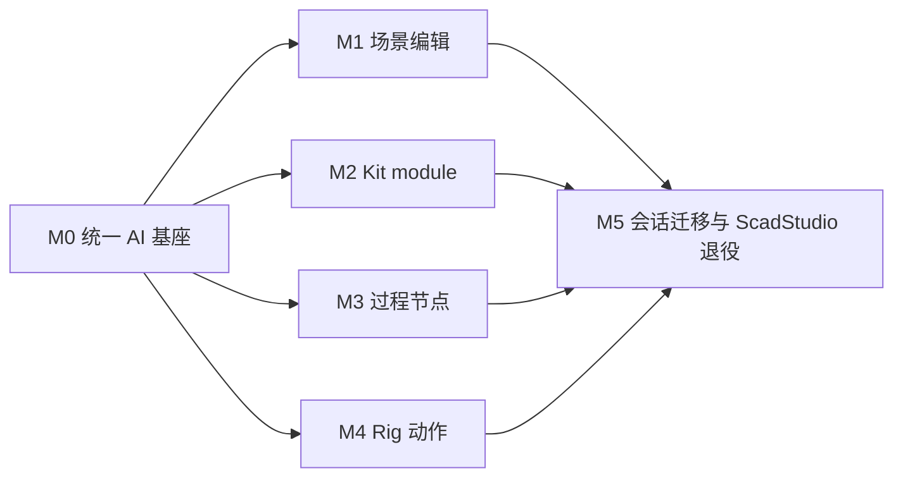

# ScadLibrary AI 融合开发计划

## 1. 交付目标

按 [ScadLibrary AI 融合创作架构](../designs/scadlibrary-ai-authoring-integration.md) 把
ScadStudio 的自然语言创作能力迁入 ScadLibrary，并完成四条可独立验收的纵向链路：

1. 单 Kit module 修改；
2. SCAD 场景创建/修改；
3. Terrain feature / process rule 调整；
4. Rig clip 调整/新增。

计划刻意先建立统一 proposal/revision/validation 基座，再并行开发 adapter，避免四套聊天、
线程、修复和保存逻辑。

## 2. 依赖关系与并行边界



- M0 必须先合入。
- M1 的 source index 可与 M2 共用，建议先完成 `SL-AI-110`。
- M2、M3、M4 在 M0 后可由不同开发者并行；各自只能通过公共 contracts/controller 接入。
- M5 是最后一步，不能与功能 adapter 并行删除 ScadStudio。

每个任务都应保持可单独构建和测试。不要在一个提交里同时做 UI 大改、NextAI 协议扩展和
多个 adapter。

## 3. M0：统一 AI 基座

### SL-AI-001：公共 contracts 与 revision

新增：

- `src/Application/Editor/ScadLibrary/AI/ScadAIContracts.hpp/.cpp`
- `src/Application/Editor/ScadLibrary/AI/ScadAIValidationPolicy.hpp`

内容：

- `EScadAIEditKind`、target、document revision、request envelope；
- proposal/artifact variant、validation issue、proposal state；
- canonical snapshot hash；
- operation/source/history 的集中 hard limits；
- strict JSON key/type helper。

验收：

- 相同 canonical snapshot 得到相同 hash；
- generation 或 content 变化都会让 proposal stale；
- JSON helper 拒绝未知字段、非有限数和错误类型。

### SL-AI-002：NextAI 显式 run/cancel

修改：

- `src/Modules/NextAI/AI/AIChat.hpp`
- `src/Modules/NextAI/AIService.hpp/.cpp`
- 必要时 `GnbClient/GnbAIClient.*`
- `src/Tests/Test_GnbAIClient.cpp`

内容：

- 允许产品传入/取得 run id；
- `FAIService` 暴露受控 cancel；
- cancel 走 Bridge v2 `run.cancel`；
- controller 请求固定使用 `stateless=true`；
- deadline/cancel 后不会把迟到响应当成功 proposal。

不要给 NextAI 增加 SCAD 类型或通用 tool registry。

验收：

- fake/bridge fixture 能取消一个在途 run；
- cancel 后 worker 可结束，应用退出不被 blocking Chat 长时间卡住；
- stateless 请求不读取或追加 Bridge session history。

### SL-AI-003：Controller、history 与 fake transport

新增：

- `AI/IScadAITransport.hpp`
- `AI/NextAIScadTransport.*`
- `AI/ScadAIController.*`
- `AI/ScadAIHistoryStore.*`
- `src/Tests/Test_ScadAIController.cpp`

内容：

- 单一 in-flight request；
- bounded local conversation；
- stream buffer、mutex/atomic handoff；
- 一次且仅一次 deterministic repair；
- request/target/revision 路由；
- user-data session/proposal persistence；
- deterministic fake transport。

验收夹具必须覆盖：

- 成功；
- schema failure → 一次 repair → 成功；
- 两次 failure 后停止；
- provider failure；
- cancel；
- 请求期间切文档/手工编辑 → stale 且零 mutation；
- 删除目标后迟到结果丢弃；
- native schema 与 prompt-only mode。

### SL-AI-004：AI 面板与 target resolver

新增：

- `AI/ScadAIPanel.*`
- `AI/ScadAITargetResolver.*`

修改：

- `ScadLibraryInterface.hpp/.cpp`
- `ScadLibrary/CMakeLists.txt`
- `gnb.toml`

内容：

- ScadLibrary 链接 `NextAI`；
- 新增 `scad-authoring` profile，保留 `scad-studio`；
- 右侧 `属性 | AI` 页签、标题栏 toggle；
- provider/model、target chip/pin、input/send/cancel；
- proposal card 的公共状态、warnings、preview/apply/reject/regenerate/undo；
- AI 延迟初始化，离线不影响手工功能。

此阶段 adapter 可用 fake “no-op proposal” 占位，但不能把 target-specific 逻辑写进 panel。

验收：

- ScadLibrary 在无 gnb/provider 时正常启动和编辑；
- 三个 workspace mode 切换时 target chip 正确；
- 在途 target 不随 UI selection 漂移；
- `--agent-validation` 能验证面板开关、离线态和 proposal fixture，不访问真实模型。

### M0 完成标准

```bash
./gnb.sh build ScadLibrary gkNextUnitTests
./out/build/<preset>/bin/gkNextUnitTests "[AI][ScadLibrary]"
```

M0 合入后，任何 adapter 都不得自行创建 `std::jthread`、provider selector、repair loop 或
session store。

## 4. M1：SCAD 场景创建与修改

### SL-AI-110：共享 SCAD source index/validator

目标：替代仅有 line 的脆弱 source 定位。

建议修改：

- `src/Modules/ScadLoader/FScadLexer.*`：token byte begin/end；
- `src/Modules/ScadLoader/FScadParser.*` / 新 `FScadSourceIndex.*`：top-level definition span；
- `ScadStudio/ScadOutline.*`：迁移期包装共享 validator；
- 新增 `src/Tests/Test_ScadSourceIndex.cpp`。

必须覆盖字符串、行/块注释、嵌套 block、单行 module、`use/include` blanking、UTF-8 文本和
CRLF。不能用正则或单纯数大括号替代 parser-aware span。

### SL-AI-111：自由 source adapter

新增 `AI/Adapters/SceneSourceAIAdapter.*`：

- 捕获 `assemblySource_`、路径、used Kit、selected source scope；
- 小文件/新场景支持完整 source candidate；
- 大文件支持唯一 `expectedText → replacementText` edits；
- 本地产生 source diff；
- 完整 lex/parse/program/evaluator validation；
- candidate preview 使用唯一 request workspace；
- confirm 后写回内存 source、增加 revision、标记 dirty，不自动保存。

路径规则：

- 新场景首次保存到 `assets/scad/scenes/`；
- 当前文件必须在 `assets/scad` 且不是 `lib/`；
- `gen/` 只能另存副本；
- 多文件一次只编辑一个 selected file，所有相对路径继续经过安全化。

### SL-AI-112：对象场景 adapter

新增 `AI/Adapters/SceneObjectsAIAdapter.*`：

- snapshot id 映射；
- add/update/remove/duplicate/reorder operation parser；
- module catalog allowlist；
- args 的 parser/evaluator validation；
- clone apply 和 semantic diff；
- candidate `BuildBenchSource()` + preview；
- confirm 后替换 bench、保持选择尽可能稳定、标记 dirty。

复杂场景的 evaluated bench 只能先另存副本，不能覆盖原始逻辑。

### SL-AI-113：场景 UI 与回归

修改场景对象/源码页，增加明确的 AI 入口和 target selection。新增：

- adapter unit tests；
- controller + scene adapter fixture；
- `assets/agentscripts/scadlibrary-ai-scene.agentscript.json`。

至少覆盖：

- 空白 draft 创建场景；
- 选中对象调整 TRS/args；
- 新增 catalog module；
- 删除后其他 snapshot id 不漂移；
- invalid module/args；
- source parse 成功但 evaluator 失败；
- 手工修改导致 stale；
- `gen/` 强制另存；
- reject/undo 恢复最后良好 preview。

### M1 完成标准

```bash
./gnb.sh build ScadLibrary gkNextUnitTests
./out/build/<preset>/bin/gkNextUnitTests "[AI][ScadLibrary][Scene]"
./gnb.sh validate --script assets/agentscripts/scadlibrary-ai-scene.agentscript.json
./gnb.sh shot --target ScadLibrary --scene assets/scad/terrain_layout_demo.scad --ui
```

## 5. M2：单 Kit module AI 编辑

### SL-AI-210：Kit module draft 文档

新增：

- `AI/KitModuleDocument.*` 或等价的非 UI draft；
- module source span、original/candidate、revision；
- dependency/helper closure；
- preview arguments；
- before/after metrics。

模块名和签名默认锁定。若产品以后允许改签名，必须作为显式高风险 scope，不能暗中放宽首版
schema。

### SL-AI-211：Kit adapter 与影响分析

新增 `AI/Adapters/KitModuleAIAdapter.*`：

- 精确完整 module artifact；
- clone replacement；
- 定义集合不变量；
- program/evaluator validation；
- triangle/bbox/color/warning diff；
- 场景/角色对 Kit/module 的引用扫描；
- 唯一 candidate Kit + wrapper preview。

必须测试同一 Kit 中 helper function/module、mandatory args、单行 module、comments 和 CJK text。

### SL-AI-212：Catalog builder 复用与保存事务

当前 catalog 生成集中在 `src/Application/Util/ScadCatalog/ScadCatalogMain.cpp`。将可复用逻辑抽成
无 UI builder，供 CLI 和 ScadLibrary 共用：

- 对 candidate Kit 重建完整 entry；
- 合并并原子更新 `assets/scad/lib/catalog.json`；
- Kit + catalog 逻辑事务失败时恢复旧 Kit；
- 成功后 `RescanKits()` 并刷新 module metrics/line。

不能通过模型或 shell tool 修改 catalog；它只能由 deterministic builder 生成。

### SL-AI-213：Kit UI 与回归

Kit module row 增加 AI 入口；proposal card 增加 source diff、metrics、影响面、“应用到草稿”和
“保存 Kit”状态。

新增：

- `Test_KitModuleAIAdapter.cpp`；
- `Test_ScadCatalogBuilder.cpp`；
- `assets/agentscripts/scadlibrary-ai-kit.agentscript.json`。

测试使用临时 Kit/catalog，绝不能覆盖仓库真实 Kit。

### M2 完成标准

```bash
./gnb.sh build ScadLibrary ScadCatalog gkNextUnitTests
./out/build/<preset>/bin/gkNextUnitTests "[AI][ScadLibrary][Kit]"
./gnb.sh validate --script assets/agentscripts/scadlibrary-ai-kit.agentscript.json
```

## 6. M3：Terrain feature / process rule AI 编辑

### SL-AI-310：Terrain snapshot codec

新增纯 DTO codec：

- `FTerrainSpec` ↔ compact JSON；
- feature/rule ↔ JSON；
- `fN/rN` snapshot id；
- operation parser；
- semantic diff。

已有 `FTerrainProcessDocument` 保持 source-preserving owner；不要再造第二个 Terrain parser。

### SL-AI-311：Terrain adapter

新增 `AI/Adapters/TerrainProcessAIAdapter.*`：

- set/add/update/remove/move 操作；
- 按原 snapshot id 解析，再统一 apply 到 clone；
- field/type/range/catalog validation；
- `BuildSource` → reparse → evaluator；
- warning policy：河/路/桥、水、pad、scatter、slope；
- 非字面量和未识别 source 保持只读。

### SL-AI-312：过程编辑 UI 与 preview

- AI 入口默认聚焦当前选中的 feature/rule；
- proposal card 展示语义变化，不用原始 JSON 淹没用户；
- preview 保持 camera；
- apply 后选择新/修改节点并滚动到可见位置；
- reject/undo 恢复 document、selection、camera。

### SL-AI-313：测试

扩展 `Test_ScadLibraryTerrainProcess.cpp` 并新增 adapter/controller tests：

- 调整 river width/path；
- 新增 pad/road/scatter；
- 删除/移动 feature 后 id 仍指向原对象；
- unknown module；
- invalid points/cells/slope/count；
- nonliteral rule 拒绝修改；
- 注释和自由 SCAD byte-preserving；
- 一次 repair；
- stale 零 mutation。

新增 `assets/agentscripts/scadlibrary-ai-terrain.agentscript.json`，使用 fake artifact。

### M3 完成标准

```bash
./gnb.sh build ScadLibrary gkNextUnitTests
./out/build/<preset>/bin/gkNextUnitTests "[AI][ScadLibrary][Terrain]"
./gnb.sh validate --script assets/agentscripts/scadlibrary-ai-terrain.agentscript.json
./gnb.sh shot --target ScadLibrary --scene assets/scad/terrain_layout_demo.scad --ui
```

## 7. M4：Rig 动作调整与新增

### SL-AI-410：Workbench 新增 clip 基础能力

先扩展 `CharacterWorkbench.*`：

- clip name 查找、创建、替换、删除的显式 API；
- `CommitRigEdit` 的完整 normalize/validate；
- `ApplyToAsset` 从“数量/顺序必须不变”改为按 name 安全重建；
- candidate `FRigAsset` clone；
- 新 clip 保存 marker 后重新加载一致；
- preview selection/playback 恢复。

此任务不接 LLM，先把手工/程序化新增 clip 做成可测试产品能力。

### SL-AI-411：Rig clip adapter

新增 `AI/Adapters/RigClipAIAdapter.*`：

- skeleton/clip context builder；
- create/replace/meta/channel/key operation parser；
- bone/channel/name/time/value validation；
- SCAD authoring-space conversion；
- candidate asset sampling；
- semantic diff（时长、loop、channels、keys）。

### SL-AI-412：动作 AI UX

- `AI 调整当前动作` 默认带当前 clip、time、selected bone；
- `AI 新动作` 要求新名称或让模型提议合法名称；
- Preview 在 candidate asset 上播放；
- Apply 写回 `FCharacterWorkbench::Clips()`、dirty，并自动选中新 clip；
- Undo 恢复 clip、selection、time、pause/speed。

### SL-AI-413：测试

新增：

- `Test_RigClipAIAdapter.cpp`；
- 扩展 `Test_ScadRig.cpp` / `Test_RigAnimator.cpp`；
- `assets/agentscripts/scadlibrary-ai-rig.agentscript.json`。

覆盖：

- 给已有 walk/idle 加 key；
- 新增非 loop wave；
- unknown bone/channel；
- duplicate clip/channel；
- 非递增/负时间；
- scale ≤ 0、NaN/Inf、异常 key 数；
- candidate sampling；
- 保存后真实 loader 重新读出同一 clip；
- reject/undo/stale。

### M4 完成标准

```bash
./gnb.sh build ScadLibrary gkNextUnitTests
./out/build/<preset>/bin/gkNextUnitTests "[AI][ScadLibrary][Rig]"
./gnb.sh validate --script assets/agentscripts/scadlibrary-ai-rig.agentscript.json
```

Rig 视觉验收由 agentscript 驱动到角色工作室并在 candidate 播放状态截图，不要把角色文件当
普通 scene 传给 `gnb shot`，也不要绕过真实 `FRigPreview`。

## 8. M4.5：低成本扩展（不阻塞首批退出）

完成 M0–M4 后可追加：

- `CharacterDesignerAIAdapter`：部件选择、配色、accessory enable；
- `EquipmentAIAdapter`：attachment add/update/remove；
- UI 沿用同一 target/proposal/preview/apply 流程。

这两项必须仍是 typed DTO，不能退回整角色 SCAD 生成。

## 9. M5：旧会话迁移与 ScadStudio 退役

### SL-AI-510：旧 session importer

读取 ScadStudio `sessions.json` / `<id>.json`：

- 列出 single/multi-file artifact；
- 显示目标路径与冲突；
- 导入为新 scene draft、selected-file project 或 Kit draft；
- 默认不复制 archived chat 进 active conversation；
- 不覆盖现有资产；
- 导入后用 ScadLibrary 真实 validator/preview。

### SL-AI-511：功能等价审计

逐项核对：

- 新模型；
- 多轮修改；
- provider/model；
- streaming/cancel；
- source/module scope；
- history/restore proposal；
- single/multi-file import；
- invalid artifact/repair；
- 会话切换和删除时的结果路由。

未达到设计 §11.2 的任一门槛，ScadStudio target 继续保留。

### SL-AI-512：退役

门槛全部通过后：

- 删除或改造 `src/Application/Editor/ScadStudio/`；
- 更新 `src/Application/Editor/CMakeLists.txt`、`gnb.toml` target/profile；
- 将仍通用的 tests/fixtures 改名并归属 ScadLibrary/ScadLoader；
- 更新 `docs/projects/scad-studio/architecture.md`、`docs/README.md`、相关 guide；
- 保留清晰的旧数据迁移说明。

### M5 完成标准

```bash
./gnb.sh build ScadLibrary gkNextUnitTests
./gnb.sh validate --script assets/agentscripts/scadlibrary-ai-scene.agentscript.json
./gnb.sh validate --script assets/agentscripts/scadlibrary-ai-kit.agentscript.json
./gnb.sh validate --script assets/agentscripts/scadlibrary-ai-terrain.agentscript.json
./gnb.sh validate --script assets/agentscripts/scadlibrary-ai-rig.agentscript.json
./gnb.sh validate --script assets/agentscripts/scadlibrary-assembly.agentscript.json
./gnb.sh validate --script assets/agentscripts/scadlibrary-terrain-process.agentscript.json
./gnb.sh validate --script assets/agentscripts/scadlibrary-workbench.agentscript.json
./gnb.sh validate --script assets/agentscripts/scadlibrary-designer.agentscript.json
```

ScadStudio target 删除涉及应用/CMake/测试面较广，最终退役提交应额外构建所有直接受影响目标；
只有影响面确实扩展为广泛 header/ABI 时才执行全量 `build --all --reconfigure`。

## 10. 全局测试矩阵

| 层 | 必测内容 | 是否调用真实 LLM |
| --- | --- | --- |
| Contract unit | strict JSON、unknown field、范围、snapshot id、revision | 否 |
| Controller unit | stream、cancel、一次 repair、stale、history | 否，fake transport |
| Adapter unit | clone apply、semantic diff、domain validation | 否 |
| SCAD/Rig integration | parser/evaluator/loader/animator、真实临时资产 | 否 |
| Agent validation | AI 面板、target、proposal、preview/apply/undo | 否，fixture |
| Manual provider smoke | provider/model/stream/cancel、自然语言质量 | 是，非 CI |
| Visual | Kit/scene/terrain/rig candidate 与恢复 | 否或人工触发 |

真实 provider smoke 不能成为 CI 或 deterministic agentscript 的前提。`--agent-validation` 下必须
注入 fake transport，不能悄悄降级为调用本地 Llama。

## 11. 交接规则

后续开发者接任务前应先读：

- 本计划与对应设计；
- [ScadStudio 当前架构](../projects/scad-studio/architecture.md)；
- [NextAI 产品化边界](../designs/nextai-product-focused-architecture.md)；
- [SCAD Scene Compose](../designs/scad-scene-compose-design.md)；
- `AGENT_GUIDE/SCADLoader.md`、`AGENT_GUIDE/ScadTerrain.md`、`AGENT_GUIDE/ScadRig.md`；
- `assets/scad/README.md`。

每项 journal/PR 应明确：

- 修改了哪个 target adapter；
- authoritative state 是什么；
- proposal 在何处 clone、validate、preview、apply；
- 如何证明 stale/invalid/cancelled 是零 mutation；
- 哪些测试使用 fake artifact；
- 是否改变保存路径、catalog 或 marker 契约。

## 12. 总体完成定义

只有同时满足以下条件，才能报告“ScadStudio 已融合进 ScadLibrary”：

- 四类目标均可从自然语言得到 proposal、预览、确认应用、撤销和显式保存；
- AI 关闭时所有原有 ScadLibrary agentscript 仍通过；
- 无任何模型路径可越过 adapter 写文件/Scene；
- target/revision 路由、一次 repair、cancel 和 prompt-only fallback 有单测；
- Kit source/catalog 不会不一致；
- Terrain 自由源码不丢失；
- Rig 新 clip 保存后能被真实 loader/animator 使用；
- ScadStudio 旧资产/会话有迁移路径；
- 文档索引和现行架构文档已更新。
