# VulkanBaseRenderer 综合架构审计与重构开发计划

> 综合来源：[Sol 审计](../notes/vulkan-base-renderer-architecture-audit-sol.md) 与 [Fable 审计](../notes/vulkan-base-renderer-architecture-audit-fable.md)。
>
> 本文不是第三份并列的问题清单，而是对两份审计的**合并裁决、优先级重排和实施计划**。关键路径已在 `dev / 3581aab` 上重新抽查；本文仍属于静态审计与开发规划，动态复现和关闭证据必须按本文验证矩阵补齐。

## 0. 执行结论

当前渲染器的主要风险不是功能不够，也不是文件数量或类大小本身，而是以下三类状态仍由调用顺序和隐含约定维持：

1. Vulkan image 的 layout、stage、access 和内容是否需要保留；
2. LogicRenderer 实际需要的前置 pass、实际产出的 G-buffer，以及后处理能否消费这些产物；
3. scene-global、view-local、swapchain-local 和 history 状态的所有权。

这导致代码在当前桌面驱动上可以运行，却难以证明在多视口、场景切换、奇数分辨率、swapchain 重建、移动 GPU 或未来多帧并行下仍然正确。

### 0.1 最有价值的五项修改

| 价值排序 | 修改 | 直接收益 | 实施裁决 |
| ---: | --- | --- | --- |
| 1 | 建立 image/resource state tracker 与轻量 pass 资源声明 | 一次性消除 `UNDEFINED` 滥用、history layout 断链、producer/consumer barrier 漂移和 swapchain owner 分散 | **最高优先级；先于大规模拆类** |
| 2 | 把 renderer requirements 扩展为完整 contract，并统一 temporal post chain | 跳过无用 prepass，阻止 post-process 读取陈旧 RT，删除三份同步清单和三份历史复制逻辑 | 在资源状态基础稳定后实施 |
| 3 | 引入 `FSceneRenderState` / `FViewRenderContext`，收口 CSM、SceneOverride 与 SHARC 作用域 | 修复多相机阴影矩阵/贴图混配、跨 scene cache 污染，并让多视口能力边界可解释 | P1 核心重构 |
| 4 | 收口 WSI/frame lifecycle，并补齐容量、内存和 dispatch 安全护栏 | 消除 swapchain 重建越界、过晚 semaphore wait、present semaphore 复用、TLAS 写穿和 shader 越界风险 | 其中低风险项应最先落地 |
| 5 | 建立 RenderView handle/回收与 external pass contract，再按边界拆分 VulkanBaseRenderer | 解决 bank 耗尽、扩展 pass 隐式依赖和 god class 状态聚合 | 契约形成后实施，避免只搬动隐患 |

价值排序不等同于提交顺序。实施时先完成验证基线和低风险安全护栏，再进入第 1 项的资源状态重构。

### 0.2 已拍板的架构决策

- **不先拆 god class。** 先建立资源、renderer、history 和作用域契约，拆类只是这些边界稳定后的机械迁移。
- **不先做完整 RenderGraph。** 第一版只需要固定顺序的线性 schedule、pass 读写声明、barrier 生成和 debug 校验，不做资源别名、自动 transient allocation 或 pass 重排。
- **重构期间维持 one-frame-in-flight。** 当前无条件等待上一 submit 是事实上的串行模型；先把它写成约束，避免同步修复与吞吐改造互相放大风险。
- **正确性不依赖 sync2。** 项目当前以 Vulkan 1.2 为基线，核心渲染器未统一启用 synchronization2。状态声明层应可输出 legacy barrier；完成跨平台能力确认后再统一使用 `VK_KHR_synchronization2`，不能让 sync2 可用性阻塞 P0 修复。
- **不再允许“旧 RT 恰好还在”作为兼容路径。** renderer 未声明产出的资源，upscaler、debugger 和 external pass 必须降级、跳过或给出明确诊断。
- **不同 scene 不共享 CSM、TLAS、ambient cache 或 SHARC。** 同 scene 的 CSM 只有在同一 camera family 下才可共享。

## 1. 两份审计的综合判断

### 1.1 共识、互补与最终裁决

| 主题 | Sol 审计侧重 | Fable 审计侧重 | 综合裁决 |
| --- | --- | --- | --- |
| Image/history 状态 | 完整追踪了 `InitializeBarriers`、history copy、swapchain subrect/visual debugger 的 layout 链 | 指出同一 `UNDEFINED` 模式及多视口下 O(N²) barrier 放大 | 合并为首要 P0：建立权威资源状态，删除运行期万能 `UNDEFINED` |
| WSI 与帧同步 | acquire wait stage、swapchain access、surface capability、recreate 双回调 | currentFrame 未归零、present semaphore 索引域、frame/image 索引混用 | 作为一个 WSI workstream 一次收口，不再逐症状修补 |
| Renderer 契约 | 深入分析 prepass、produces、post compatibility、Voxel/NoAmbient 错配 | 强调 descriptor/virtual 双轨及 temporal 链复制 | 扩展单一 descriptor，并以共享 temporal chain 消除实现漂移 |
| 多视口 | CSM、SceneOverride、SHARC、bank 生命周期的完整作用域分析 | 具体还原 CSM staggered mask 被多相机覆写的错误链 | CSM 是确认的正确性问题；SceneOverride 在完整 scene state 前必须显式限制 |
| 崩溃与可移植性 | surface usage、AS 顺序、shader bounds | TLAS 固定容量写穿、joint buffer 缺 `HOST_VISIBLE`、弱指针解引用 | 先落低风险护栏，再在资源 schedule 上重排 AS 链 |
| God class 与层次反转 | 建议先形成五种 context，不急于拆类 | 给出 FramePacer、GpuDrivenPasses、AmbientBaker、RT backend 的拆分候选 | 接受拆分边界，但推迟到契约稳定后；`VulkanBaseRenderer` 最终保留 orchestrator 角色 |
| 性能 | one-frame-in-flight、全表 barrier、view bank | CSM 重画、per-view pipeline、全套 RT bank | 除去与正确性同源的冗余，其余性能项排在 P2，先测量再改 |

两份报告没有实质性矛盾。主要差别是 Sol 更强调资源契约和 scene/view 作用域，Fable 更强调立即可修的崩溃、可移植性和代码边界；综合计划应同时保留这两层视角。

### 1.2 当前工作树复查

以下关键结论在 `dev / 3581aab` 仍可由源码直接确认：

| 证据 | 当前状态 |
| --- | --- |
| [`InitializeBarriers()`](../../src/Engine/Rendering/VulkanBaseRenderer.cpp#L1720) 对全部 bindless image 使用 `UNDEFINED → GENERAL` | scene-global 调用一次，五个 LogicRenderer 各再调用一次 |
| [`TemporalResolve::CopyToHistory()`](../../src/Engine/Rendering/PipelineCommon/TemporalResolve.cpp#L37) | copy 后仍停留在 `TRANSFER_SRC/DST_OPTIMAL`；`MarkHistoryValid()` 无调用者 |
| [`SwapChain::InsertBarrierToWrite/Present()`](../../src/Engine/Vulkan/SwapChain.cpp#L355) | write 固定从 `UNDEFINED` 开始，present 固定只声明 shader write |
| [`DrawFrame()` submit wait](../../src/Engine/Rendering/VulkanBaseRenderer.cpp#L1587) | acquire semaphore 仍等待 `COLOR_ATTACHMENT_OUTPUT`，而 swapchain 首次使用可为 transfer clear |
| [`PreRenderPerView()`](../../src/Engine/Rendering/VulkanBaseRenderer.cpp#L1405) | 对所有 renderer 固定执行 cull、clear、visibility、CSM |
| [`DispatchSunShadow()`](../../src/Engine/Rendering/VulkanBaseRenderer.GpuDriven.cpp#L326) | active view 绘制时仍读取 primary view 的 cascade update mask |
| [`VoxelTracingRenderer::Render()`](../../src/Engine/Rendering/VoxelTracing/VoxelTracingRenderer.cpp#L42) | 仍用 swapchain render extent，且继承 object-ID history 默认值 |
| [`CreateSwapChain()`](../../src/Engine/Rendering/VulkanBaseRenderer.cpp#L950) / [`RecreateSwapChain()`](../../src/Engine/Rendering/VulkanBaseRenderer.cpp#L1153) | 未归零 frame/image index，upscaler destroyed 回调仍重复 |
| [`AfterUpdateScene()`](../../src/Engine/Rendering/VulkanBaseRenderer.cpp#L2225) | 固定 65535 容量的 TLAS instance buffer 仍按实际数量无上限 copy |
| [`UpdateSkinningBuffers()`](../../src/Engine/Rendering/VulkanBaseRenderer.GpuDriven.cpp#L45) | joint buffer 仍请求 `DEVICE_LOCAL | HOST_COHERENT` 后直接 map，未显式要求 `HOST_VISIBLE` |

这些复查只能确认代码契约问题仍存在，不能替代 validation、RenderDoc 或跨平台实机证据。

## 2. 统一问题登记表

后续开发、测试和完成报告统一使用 `VRA-*` ID；原报告 ID 保留用于追溯。

| ID | 优先级 | 置信度 | 合并问题 | 原报告映射 | 处理方向 |
| --- | --- | --- | --- | --- | --- |
| VRA-001 | P0 | 已确认 | 全表 `UNDEFINED`、history copy layout 断链、重复全 bank barrier | Sol R-001/R-002；Fable A1/B5 | state tracker + 明确 discard + history steady state |
| VRA-002 | P0 | 已确认 | swapchain layout/access owner 分散，acquire wait stage 过晚 | Sol R-003/R-004；Fable A1/A7 | per-image swapchain state + 真实 earliest use + 单次 present |
| VRA-003 | P0 | 已确认/高风险 | pass producer/consumer access 漂移；ceil dispatch shader 缺 bounds guard | Sol R-005/R-015；Fable A7 | pass use declaration + shader guard 规则 |
| VRA-004 | P0 | 已确认 | recreate 索引、重复回调、surface capability、present semaphore、reference 空路径 | Sol R-013/R-014；Fable A2/A4/A8 | WSI lifecycle 一次收口 |
| VRA-005 | P0 | 已确认 | TLAS 容量写穿、joint memory 属性、过期 scene、Voxel extent/object history 等立即安全问题 | Sol R-010/R-016；Fable A3/A6/A9/B2 | 先加硬护栏，再完成动态容量和 AS schedule |
| VRA-006 | P1 | 已确认 | primary history reset 未走统一 finalize；scene/resize/renderer switch invalidation 不完整 | Sol R-006 | generation-based history key + 单一 finalize 入口 |
| VRA-007 | P1 | 已确认 | requirements 太弱、产物和 post compatibility 隐式、temporal 链三份复制 | Sol R-010/R-011；Fable C5/C8 | `FRendererContract` + `TemporalPostChain` |
| VRA-008 | P1 | 已确认 | CSM image、matrix、update mask 的 view/camera 作用域不一致 | Sol R-007；Fable B1 | scene + camera-family shadow set |
| VRA-009 | P1 | 已确认/高风险 | SceneOverride 未执行 scene prepare；SHARC 跨 view/scene 共享且读取 primary UBO | Sol R-008/R-009；Fable B3 | `FSceneRenderState` + scene-local radiance cache |
| VRA-010 | P1 | 已确认 | RenderView 无单体销毁/回收，7 个 additional bank 可被合法功能组合耗尽 | Sol R-012；Fable D5 | generation handle + release/LRU/transient pool |
| VRA-011 | P1/P2 | 高风险 | skinning → BLAS → TLAS 顺序、request 去重和 scratch 预算不闭合 | Sol R-016；Fable C6 | 显式 AS pass 链 + validated model set + scratch arena |
| VRA-012 | P2 | 设计债 | 单帧在飞却维护多帧复杂度；frame/image 索引域模糊 | Sol R-017；Fable A5/C4 | 本轮固定串行契约，后续独立 RFC 决定并行 |
| VRA-013 | P2 | 设计债 | external pass 无资源契约、Assets/Runtime/Rendering 反向依赖、BaseRenderer 状态聚合 | Sol R-018；Fable C1/C2/C3/C7 | context 注入 + pass contract + 按稳定边界拆类 |

未单列的低优先级清理，例如弱指针防御、参数改名、`modelId * 10` 编解码、重复 reset 序列和无用 framebuffer，应附着在对应 workstream 中完成，不能挤占 P0/P1 主线。

## 3. 目标架构与关键设计

### 3.1 资源状态：第一优先的基础设施

第一版不需要完整 RenderGraph，但必须有一处权威状态记录。最小状态至少包括：

```cpp
struct FImageState
{
    bool initialized = false;
    VkImageLayout layout = VK_IMAGE_LAYOUT_UNDEFINED;
    ERenderStage stages = ERenderStage::None;
    EResourceAccess access = EResourceAccess::None;
    uint32_t queueFamily = VK_QUEUE_FAMILY_IGNORED;
};

struct FImageUse
{
    FImageHandle image;
    FSubresourceRange range;
    ERenderStage stages;
    EResourceAccess access;
    VkImageLayout layout;
    bool discardPreviousContents = false;
};
```

实现约束：

- `UNDEFINED` 只允许用于 image 第一次初始化，或 pass 显式声明 `discardPreviousContents=true`；debug 构建对此断言。
- tracker 同时追踪 layout、stage 和 access，不能只做 layout cache。
- persistent history、view bank 和 scene resource 的最终状态跨帧保留；swapchain state 按 image 独立保存。
- 一个 pass 提交 reads/writes 后，由 tracker 比较上一状态并批量生成 barrier；LogicRenderer 不再维护手写 image 清单。
- 迁移期禁止“tracker 和直接 barrier 都修改同一资源但互不知情”。每条资源路径必须整段迁移，并在 debug 构建记录未托管 barrier。
- 状态声明使用引擎内部 stage/access 枚举；backend 先支持现有 legacy `vkCmdPipelineBarrier`。验证所有目标平台的 `VK_KHR_synchronization2` 后，可增加 sync2 backend，而不改变 pass API。

swapchain 的目标状态机为：

```text
首次取得: UNDEFINED ─┐
后续取得: PRESENT ───┴→ 本帧真实首用(TRANSFER_DST / GENERAL / COLOR_ATTACHMENT)
                         → 可有多个保内容的 writer/reader
                         → PRESENT
```

每张 swapchain image 一帧只做一次 acquire-to-write 过渡和一次 final-to-present 过渡；reference subrect、visual debugger、DLSS/FSR/blit、UI 都只能通过同一 owner 申请使用。

### 3.2 Renderer contract：让调度与产物可检查

现有 `FRendererRequirements` 的三个 bool 应替换为 descriptor 中的单一 contract：

```cpp
struct FRendererContract
{
    ESceneResource sceneResources; // Voxel, Ambient, TLAS, SHARC...
    EViewPrepass prepasses;         // Cull, Clear, Visibility, CSM...
    ERenderOutput outputs;          // Color, Depth, Motion, ObjectId, Normal...
    EPostProcess post;              // Temporal, SpatialUpscale, DLSS, FrameGen, DebugGBuffer...
    EHistoryChannel history;        // Diffuse, Specular, Albedo, ObjectId...
};
```

初始 contract 应按当前 shader 行为建立，随后由测试锁定：

| Renderer | Scene resource | View prepass | History | 最小输出/后处理裁决 |
| --- | --- | --- | --- | --- |
| PathTracing | Voxel + Ambient + TLAS；SHARC 可选 | Cull + Clear + Visibility；**不需要 CSM** | diffuse/specular/albedo + object ID | 完整追踪 G-buffer + color；允许 temporal；满足输入时才允许 DLSS/RR/frame generation |
| SoftwareTracing | Voxel + Ambient | Cull + Clear + Visibility + CSM | diffuse/specular/albedo + object ID | 完整软追踪 G-buffer + color；允许 temporal |
| SoftwareModern | Voxel + Ambient | Cull + Clear + Visibility + CSM | diffuse/specular/albedo + object ID | 完整低成本 GI G-buffer + color；允许 temporal |
| VoxelTracing | Voxel + Ambient | 不需要 visibility/CSM；是否需要 clear 由 pass 写满契约决定 | 无 | 当前只承诺 color；只允许 direct blit/明确支持的 spatial upscale，不复制 object ID，不把旧 G-buffer 交给 DLSS/debugger |
| SoftwareModernNoAmbient | **不需要 voxel/ambient/TLAS** | Cull + Clear + Visibility + CSM | 无 | color + 当前 shader 明确写出的 partial G-buffer；post 兼容集合需逐项验证后开启 |

规则：

- descriptor 是唯一真相源；删除各 LogicRenderer 只回查静态表的 `Requirements()` 虚函数。
- base 只调度 contract 要求的 prepass，Engine 不再用 renderer enum 特判 TAA 或 temporal frame 数。
- post-process 先检查 `requiredInputs ⊆ outputs`；不满足时使用声明过的 fallback 并打印一次可诊断信息。
- `RegisterLogicRenderer()` 只注册，`SwitchLogicRenderer()` 才切换 current，消除注册顺序副作用。

### 3.3 统一 temporal chain 与 history generation

PathTracing、SoftwareTracing 和 SoftwareModern 只负责生成 noisy frame 与 G-buffer。共享 `TemporalPostChain::Run()` 负责：

```text
校验/初始化 history
→ shading outputs producer-to-consumer transition
→ reproject
→ optional A-trous
→ compose
→ copy history
→ history 回到下一帧 steady state
```

history 有效性不能只依赖 `previous.TotalFrames != 0`。建议 key：

```text
sceneGeneration
+ viewGeneration
+ rendererType/generation
+ renderExtent
+ cameraCutSerial
+ temporalConfigGeneration
```

以下事件必须产生明确的 `EHistoryInvalidationReason`：scene load/reload、renderer switch、swapchain resize、view resize/reuse、camera cut、temporal 参数不兼容变化、SHARC reset。primary 与 auxiliary view 必须走同一 `FinalizeTemporalUbo()` 路径；upscaler reset 从同一 invalidation event 派生。

### 3.4 Scene/View 作用域

目标上下文如下：

| Context | 唯一职责 |
| --- | --- |
| `FDeviceContext` | device、queue、capability、debug、全局 descriptor |
| `FSwapchainContext` | per-image state、output extent/format、WSI sync、upscaler lifecycle |
| `FFrameContext` | command buffer、submit serial、frame slot、deferred destruction |
| `FSceneRenderState` | scene generation、GPU scene buffer、skinning、BLAS/TLAS、ambient、shadow pool、SHARC |
| `FViewRenderContext` | scene ref、camera UBO、extent、RT bank、history generation、camera-family shadow state、outputs |

帧开始时先收集 schedule 中的 scene 集合，每个 scene 恰好执行一次 prepare，再执行其 views。`SceneOverride` 不能只临时换一个裸指针：

- 在 `FSceneRenderState` 落地前，override view 只能使用显式标记为 `supportsSceneOverrideWithoutScenePrepare` 的受限路径；否则创建或调度阶段拒绝，并说明缺失资源。
- `Scene::FetchGPUScene()` 不再反查 `NextEngine` 的 active camera/bank/TLAS；这些地址由 `FViewRenderContext` / `FSceneRenderState` 注入。
- frame settings 由 `FFrameRenderSettings` 快照传入 Rendering，逐步消除 Rendering 对 Runtime 单例的散落读取。

CSM 采用 **scene + camera family** 模型，而不是无条件 per-view 复制：

- 相同 scene、相同 camera family（例如 reference 四格使用同一相机）可共享 shadow set 和一次更新；
- 相同 scene、不同相机必须使用独立 shadow set，或显式选择“该 view 无阴影”的降级策略；
- 不同 scene 绝不共享 shadow image、cascade cache 或 update mask；
- shadow pool 有容量上限和 LRU，避免“每个 view 永久四张图”的无界增长。

SHARC 改为 `FSceneRadianceCache`：scene generation 是 cache key，update/resolve 每 scene 每帧至多一次，query 才是 per-view；相机相关参数读取选定的 driving view 或当前 view context，不再读取 primary/global last UBO。

### 3.5 RenderView 生命周期

- 外部模块持有 generation-safe `FRenderViewHandle`，不长期持有裸 `RenderView*`。
- manager 提供 `DestroyView(handle)`，释放 RT bank、sampled output、history 和 view-local helper。
- `Persistent` 长期保留完整 history；`OnDemand` 仅 dirty/request 时入 schedule；`Transient` 使用无完整 history 的轻量 target pool。
- 创建前执行 bank/VRAM admission check；容量不足返回结构化错误，不在执行中 throw。
- per-view pipeline 可共享，真正 per-view 的只保留 history/resource state。

### 3.6 VulkanBaseRenderer 最终角色

契约稳定后再按以下边界拆分：

1. `FrameSubmission` / `SwapchainOutput`：acquire、fence、submit、present、per-image state、upscaler lifecycle；
2. `GpuDrivenPasses`：cull、clear、visibility、skinning、CSM；
3. `AmbientCubeBaker`：ambient cache invalidation、bake、residency；
4. `RayTracingSceneBackend`：BLAS/TLAS resource 与 update；
5. `RenderSchedule`：scene/view/pass 编排和 contract 校验。

`VulkanBaseRenderer` 保留 facade/orchestrator：持有 contexts、建立 schedule、调用子系统，不再直接拥有每种 pass 的全部内部状态。

## 4. 开发依赖与提交序列

```mermaid
flowchart LR
    P0["VRP-00 验证基线"] --> P1["VRP-01/02 安全护栏"]
    P1 --> P2["VRP-03 资源状态基础"]
    P2 --> P3["VRP-04 迁移 history / swapchain / pass"]
    P3 --> P4["VRP-05 Renderer contract"]
    P4 --> P5["VRP-06 Temporal/history 统一"]
    P5 --> P6["VRP-07 Scene/View context"]
    P6 --> P7["VRP-08 CSM / SceneOverride / SHARC / AS"]
    P7 --> P8["VRP-09 View 生命周期"]
    P8 --> P9["VRP-10 External pass 与拆类"]
    P9 --> P10["VRP-11 多帧与性能决策"]
```



每个 `VRP-*` 建议独立提交或小型 PR。禁止把大规模重命名、格式化和同步行为修改混入同一提交。

## 5. 分阶段重构开发计划

### Phase 0 — VRP-00：验证基线与可观察性

**目标**：先获得能证明修复有效的工具链，避免只凭截图关闭同步问题。

开发项：

- 在现有 `--validation` 基础上增加可配置的 synchronization validation；若系统未安装 validation layer，启动日志明确说明而不是静默退出。
- 记录 GPU/driver、surface usage/composite alpha、swapchain image count、renderer contract、scene/view/history generation。
- debug 构建为 tracked image 输出“最后 pass、layout、stage、access、initialized”诊断。
- 新增 agent scripts：
  - renderer `0→1→2→3→4→0` 热切换；
  - scene `A→B→A`；
  - 1279×719、1001×777、1×1/最小合法尺寸与 resize；
  - reference 四格、多个 offscreen view、thumbnail/material preview；
  - animated skinned model 的 HW RT 路径。
- 保存旧实现的 validation/截图/exit code 作为回归基线；不能复现的条目标记“静态确认、动态待复现”，不得假装已复现。

完成标准：

- 一条命令可运行 core validation + sync validation 并生成 report；
- 所有 `VRA-*` 至少有静态检查或动态场景的验证入口；
- 报告包含 GPU、driver、extent、renderer、scene/view generation。

### Phase 1 — VRP-01/02：低风险安全护栏

**目标**：在架构重构前先消除明确的越界、非法内存属性和 WSI 生命周期缺口。

VRP-01（WSI/lifecycle）：

- `CreateSwapChain()` 归零 `currentFrame/currentImageIndex/currentFence`，并为数组索引加 debug 断言；
- 删除 `RecreateSwapChain()` 中重复的 `OnSwapChainDestroyed()`，由唯一 teardown 路径发送生命周期事件；
- `renderFinishedSemaphore` 改按 acquired `imageIndex` 选择；image-available 仍按 frame slot；
- 校验 `supportedUsageFlags` 和 `supportedCompositeAlpha`：不支持 STORAGE 时走 intermediate + blit，不支持 TRANSFER_SRC 时让 screenshot/hudless 走中间图或显式禁用；
- reference 模式无 provider 时 clear 并合法转 PRESENT；
- 明确记录当前 one-frame-in-flight 约束和 frame-slot/image-index 的职责。

VRP-02（bounds/portability）：

- TLAS instance 数在写入前进行容量检查；短期超过上限时 `ERROR` + 安全截断并记录 dropped count，绝不越界，后续 VRP-08 改为动态容量；
- joint buffer 显式请求 `HOST_VISIBLE | HOST_COHERENT`，或改为 staging；不得依赖 ReBAR 内存类型偶然满足；
- VoxelTracing 使用 `ActiveViewRenderExtent()`，覆写 `RequiresObjectIdHistory=false`；
- 给所有 ceil-dispatch shader 增加统一 bounds guard，并加入 odd extent 用例；
- 修复 visibility copy、object history 等已确认 access mask；
- `GetScene()` 对过期 weak pointer fail-fast 并输出生命周期诊断；
- 将 `modelId * 10` 提取为集中编码/解码函数，给非法 model index 加检查。

完成标准：

- swapchain image count 变小后无数组越界，upscaler destroyed/create 事件严格成对；
- TLAS 超容量、无 ReBAR 兼容路径和奇数 extent 均不会发生越界访问；
- 五个 renderer 在 primary 与小尺寸 secondary view 上至少完成 smoke；
- 本阶段不引入新的 renderer 行为分叉。

### Phase 2 — VRP-03/04：资源状态与同步收口

**目标**：使 image 内容、layout 和可见性由代码契约证明，不再依赖驱动宽容行为。

VRP-03（基础设施）：

- 新建 resource handle、`FImageState`、`FImageUse`、barrier batch 与 debug validator；
- 为首次初始化、保内容读写、显式 discard、transfer copy、present 编写单元测试；
- legacy barrier backend 先落地；另开能力测试确认 Windows/Linux/Android/macOS 路径能否统一启用 synchronization2；
- 给直接调用 `RenderImage::InsertBarrier` 的未迁移路径增加审计日志，避免双状态源。

VRP-04（按完整资源链迁移）：

1. 先迁移 `TemporalResolve::CopyToHistory()`，copy 后回到下一帧读取的 steady state，并初始化所有首帧会读的 history；
2. 再迁移 visibility render/copy/minigbuffer consumer；
3. 再迁移 swapchain clear、reference subrect、DLSS/FSR/blit、visual debugger、UI、screenshot 到 per-image state owner；
4. 最后迁移三条 temporal renderer 的 shading/reproject/A-trous/compose 输入输出；
5. 删除 LogicRenderer 内和 `BeginSceneFrame()` 中的 `InitializeBarriers()`，最终删除该 API；
6. acquire wait stage 取本帧 swapchain 的真实 earliest use；在 legacy 提交路径中至少覆盖 transfer 首用。

完成标准：

- 运行期 `oldLayout=UNDEFINED` 只出现在首次初始化或显式 discard，并有 debug 断言；
- history copy、reference 四象限、visual debugger、FSR/DLSS/blit/UI 的状态链完整；
- core validation 与 synchronization validation 在验证矩阵中无 layout/access hazard；
- 全表 barrier 数量归零，barrier 数量随实际 pass/use 增长而不是随全部 bank 增长。

### Phase 3 — VRP-05/06：Renderer contract 与时序链

**目标**：让调度器知道每条渲染路径需要什么、产生什么、允许什么后处理。

VRP-05（contract）：

- 扩展 `RendererDescriptor` 为 scene resources / prepasses / outputs / post / history；
- 删除 requirements 虚函数双轨和 register 改 current 的副作用；
- `PreRenderPerView()` 按 contract 调度：Path 跳过 CSM，Voxel 跳过 cull/visibility/CSM，NoAmbient 不准备 voxel/ambient；
- `BuildUpscalerFrameInputs()`、visual debugger、external passes 在消费前检查 outputs；
- 缺输入时走声明过的 fallback，日志给出 renderer、consumer 和缺失 output。

VRP-06（temporal/history）：

- 抽出 `TemporalPostChain::Run()`，统一 reproject push constants、barrier uses、A-trous、compose 和 history copy；
- PathTracing / SoftwareTracing / SoftwareModern 只保留 shading 和少量参数；
- 所有 view 使用统一 UBO finalize；删除 primary 的第二套 history 判断；
- 实现 generation key 与 `EHistoryInvalidationReason`，接通 `TemporalResolve::MarkHistoryValid()` 或用新 API 替代；
- renderer switch、scene/extent/camera cut、temporal config 变化同时 reset engine history 与 upscaler history。

完成标准：

- 五个 renderer contract 与 shader 实际 reads/writes 对齐，并有自动测试；
- Voxel/NoAmbient 不再把陈旧 G-buffer 传给 downstream consumer；
- 三个 temporal renderer 不再拥有各自的历史复制和同步清单；
- renderer/scene/resize 热切换无跨模式 ghost，history generation 变化可从 report 观察。

### Phase 4 — VRP-07/08/09：Scene/View 状态与多视口正确性

**目标**：完成 scene-global 和 view-local 的真实隔离，修复 CSM、SceneOverride、SHARC、AS 与 view 生命周期。

VRP-07（context 落地，先保持单 scene 行为）：

- 建立 `FFrameRenderSettings`、`FSceneRenderState`、`FViewRenderContext`；
- `Scene::FetchGPUScene()` 改为接收 camera/bank/TLAS 等注入参数；
- schedule 先收集 scenes，再每 scene prepare 一次、每 view render 一次；
- 初期对缺少完整 state 的 SceneOverride 显式拒绝，避免半支持状态。

VRP-08（scene/view resource）：

- CSM 改为 scene + camera-family shadow set；cascade matrix、update mask、initialized/dirty mask 与 image set 同属一个对象；
- reference 同相机视图共享一次 CSM；不同相机 view 分配独立 set 或显式无阴影降级；
- SceneOverride 拥有自己的 skinning、AS、ambient、CSM 准备路径；
- SHARC 移入 scene state，以 scene generation 清理，update/resolve scene-global、query per-view；
- AS 顺序改为 `joint upload → skinning → buffer barrier → BLAS update → AS barrier → TLAS update → ray-query read`；
- skin update request 去重和范围校验，scratch arena 使用实际 update requirement；TLAS instance capacity 按需要增长并受设备上限约束。

VRP-09（view lifecycle）：

- 引入 generation handle、`DestroyView()`、bank release、LRU/transient target pool；
- schedule item 使用 handle 并在执行前校验 generation；
- admission check 报告需要/可用 bank 与估算 VRAM；
- pipeline 与 view-local history/resource 分离，能共享的 pipeline 不再每 view 创建。

完成标准：

- 两个不同相机同时渲染时，CSM 不闪烁、不混用矩阵/贴图；
- 主 scene + SceneOverride 同帧渲染时，各自使用正确的 TLAS/CSM/ambient/SHARC；
- 同光照 scene A→B→A 不沿用旧 SHARC；
- 3 个 offscreen + 4 个 reference + 2 个 preview 的创建/销毁序列不会永久耗尽 bank；
- animated shared-model HW RT 场景无 AS validation hazard 和 scratch 越界。

### Phase 5 — VRP-10：扩展契约与类拆分

**目标**：在状态边界稳定后降低 VulkanBaseRenderer 耦合，而不改变渲染行为。

开发项：

- `IExternalRenderPass` 增加 insertion point、scope、reads/writes、required/produced outputs 和 view/SceneOverride compatibility；
- external pass 与 LogicRenderer 复用同一 pass declaration/barrier 系统；
- 依次抽出 `FrameSubmission/SwapchainOutput`、`GpuDrivenPasses`、`AmbientCubeBaker`、`RayTracingSceneBackend`；
- 提取共同的 scene/swapchain teardown，删除 `DeleteSwapChain()` 与 refresh 的 reset 复制；
- 逐步以 `FFrameRenderSettings` 替换 Rendering 对 Runtime 单例的读取；
- 纯命名、死代码和格式清理使用独立提交，不与行为迁移混合。

完成标准：

- VulkanBaseRenderer 只编排 contexts/schedule，不直接实现 acquire/present、GI bake 或 AS update；
- 模块 pass 能在注册时被静态/运行时检查资源契约；
- 拆分类提交前后，验证矩阵的图像和 GPU 事件顺序无预期外变化。

### Phase 6 — VRP-11：性能决策与演进

**目标**：正确性稳定后再决定吞吐与内存优化，不把性能实验混入 P0/P1。

候选项按测量结果排序：

- 独立 RFC 决定保持 one-frame-in-flight，还是实现 2+ frame overlap；后者必须先完成 stats 异步回读、per-image ownership 和共享资源 ring 化；
- Transient/OnDemand view 按 contract 只分配所需 RT，减少 31 张全套 bank 成本；
- Atrous/Temporal pipeline 跨 view 共享；
- skinning modelId→proxy 建索引，避免每 request 线性扫描；
- CSM camera-family cache 与 shadow pool 预算；
- barrier batch 合并和 pass-level GPU timing。

完成标准：

- 每项优化有修改前/后的 GPU frame time、CPU submit time、barrier/pass 数和 VRAM 数据；
- 不以关闭 validation、恢复隐式旧内容或扩大全局共享状态换性能。

## 6. 验证矩阵与关闭标准

### 6.1 最小验证矩阵

| 轴 | 必测场景 | 主要关闭 ID |
| --- | --- | --- |
| Renderer | 0..4 启动、稳定帧、`0→1→2→3→4→0` | VRA-001/003/006/007 |
| Extent | 1280×720、1279×719、1001×777、最小合法窗口、resize | VRA-003/004/006 |
| History | scene A→B→A、camera cut、renderer switch、temporal 参数变化 | VRA-001/006/009 |
| View | primary、3 offscreen、reference 四格、thumbnail + material preview | VRA-008/010 |
| SceneOverride | 主 scene + 不同 override scene；静态与 skinned | VRA-009/011 |
| Output | direct blit、FSR、可用时 DLSS/RR/DLSSG、debugger、UI、screenshot | VRA-002/007 |
| Swapchain | HDR/SDR、present mode、image count 变化、无 provider reference | VRA-002/004 |
| RT/animation | 同 model 多 skinned instance、超当前 TLAS 容量的压力场景 | VRA-005/011 |
| Capability | 无 RT、低 ambient budget、不支持 STORAGE/TRANSFER_SRC 的 surface | VRA-004/007 |
| Platform | Windows/NVIDIA、Windows/AMD 或 Intel、Linux、Android；可用时 macOS/MoltenVK | VRA-001/002/003/004 |

### 6.2 仓库内验证命令

Engine 层改动按仓库规则只构建受影响目标：

```powershell
./gnb.bat build gkNextRenderer gkNextUnitTests
./out/build/windows/bin/gkNextUnitTests.exe
./gnb.bat shot --scene assets/models/playground.glb
./gnb.bat validate --script assets/agentscripts/<renderer-audit-script>.agentscript.json
```

非 Windows 平台使用对应的 `./gnb`。涉及 CMake、新文件未被 glob 收录或广泛 ABI 改动时才增加 `--reconfigure`；本计划不要求每个小 PR 全量构建所有 program。

### 6.3 每个问题的关闭证据

每个 `VRA-*` 关闭必须同时提供：

1. 修复提交与对应 pass/resource contract；
2. 旧实现能失败、触发 validation 或被静态断言捕获的最小复现；
3. 修复后的 core + synchronization validation 日志；
4. 截图、RenderDoc resource history 或结构化 agent report；
5. 新增自动测试；
6. 尚未覆盖的平台和降级策略。

仅有“当前 NVIDIA 驱动不崩溃”或“截图看起来正常”不能关闭同步、layout 或越界问题。

## 7. 总体验收条件

- [x] 运行期不存在未声明的万能 `UNDEFINED → GENERAL`；显式 discard 可追溯到 pass contract。
- [x] 每张 swapchain image 有单一状态 owner，acquire 首用和 present 末用与实际路径一致。
- [x] 所有 LogicRenderer 的 prepasses、outputs、post compatibility 和 history channels 可查询、可测试。
- [x] temporal renderer 共用一条 post chain；所有 view 共用一套 invalidation/finalize 语义。
- [x] 不同 scene 不共享 TLAS、CSM、ambient cache、SHARC；不同 camera family 不混用 CSM。
- [x] RenderView 可单体销毁和回收，Transient 不永久占用全 history bank。
- [x] external pass 能声明资源访问，调度器能拒绝未生产资源的读取。
- [x] core validation 与 synchronization validation 在最小矩阵中无 error。
- [x] targeted build、unit tests、agent validation 和视觉截图全部通过。
- [x] one-frame-in-flight 或多帧并行成为明确、被测试的设计，而不是同步副作用。

## 8. 风险控制与暂缓项

### 8.1 迁移风险

- **双状态源**：tracker 迁移一半、旧 barrier 仍直接修改 layout 是最大风险。按“完整资源链”迁移，并在 debug 构建检测未托管 barrier。
- **CSM 显存增长**：不直接为每个 view 永久分配四张图；使用 camera-family shadow pool、预算和 LRU。
- **SceneOverride 范围膨胀**：完整 state 落地前宁可明确拒绝需要 TLAS/ambient/CSM 的 override path，也不要继续半支持。
- **sync2 平台差异**：状态/调度层不绑定 sync2；先有 legacy backend，再按 capability 启用。
- **大 PR 难回归**：安全护栏、state tracker、资源迁移、contract、拆类分别提交；每个提交保持可构建、可运行、可回退。

### 8.2 本轮明确暂缓

- 完整 RenderGraph、pass 自动重排、资源 aliasing；
- 在同步和作用域尚未稳定前恢复多 frame overlap；
- 仅为降低 LOC 的大规模类拆分；
- 与正确性无关的全面命名/格式清理；
- 在 contract 尚未证实时为 VoxelTracing 伪造缺失 G-buffer。

## 9. 与既有文档的关系

- 两份原始审计继续作为详细证据库；本文负责统一 ID、优先级和实施顺序，不覆盖原始观察。
- [vulkan-renderer-refinement-plan.md](vulkan-renderer-refinement-plan.md) 中的命名归一大部分已落地；其 temporal 去重并入 VRP-06。其余纯清理不得先于 P0/P1 正确性工作。
- [multi-viewport-renderview-design.md](../designs/multi-viewport-renderview-design.md) 应在 VRP-08/09 完成后更新 CSM、SceneOverride、bank ownership 的真实支持边界。
- [vulkan-renderview-core-refactor-plan.md](vulkan-renderview-core-refactor-plan.md) 记录的代码组织工作不能作为资源契约已经完成的证据。

执行过程中若某条静态结论被动态证据推翻，应在本文统一问题表中修订置信度和处理方向，而不是静默删除原问题。

## 10. 执行结果（2026-07-11）

计划的 VRP-00 至 VRP-11 已完成。最终实现包括：

- legacy barrier backend 的 `FResourceStateTracker`，覆盖 view bank、history、swapchain、visibility、offscreen output 与 external pass；
- 单一 `FRendererContract` 与 contract 驱动的 prepass、history、upscaler/debug fallback；
- 共享 `TemporalPostChain`、history generation/reason、scene generation 与 SHARC scene key；
- generation-safe RenderView schedule、单体销毁、bank 回收，以及 reference/secondary 模式切换时的资源释放；
- `FrameSubmission`、`GpuDrivenPasses`、`AmbientCubeBaker`、`RayTracingSceneBackend` 子系统边界；
- 显式 `kFramesInFlight = 1`，fence-before-acquire，per-image present semaphore owner；
- joint upload → skinning → BLAS → TLAS 顺序、skin request 去重、实际 update scratch 预算与动态 TLAS capacity；
- external pass insertion/scope/input/output contract，以及不兼容 renderer 的明确拒绝；
- 资源状态观测指标：300 帧基线为 19,500 uses、15,004 barriers、1,500 discards，barrier rate 76.9%。

最终 Windows/NVIDIA 验证证据：

- `gkNextRenderer`、`gkNextUnitTests`、`gkNextEditor` targeted build 通过；
- Catch2：200 test cases、49,690 assertions 全部通过；
- synchronization validation：renderer `0→1→2→3→4→0` 在 1280×720、1279×719、1001×777 均为 0 error；
- SHARC、GTAO、FSR、reference、Editor/offscreen、screenshot 路径均为 0 validation error；
- `playground.glb` 310 帧 agent screenshot 通过肉眼检查。

当前机器没有 AMD/Intel GPU、Linux/Android/macOS 运行环境，因此这些平台未做实机 validation。状态层仍输出 Vulkan 1.2 legacy barrier，不依赖 sync2；无 RT、无 STORAGE surface 与无 reference provider 均保留 contract 驱动的降级/拒绝路径。跨平台实机验证属于后续发布矩阵，不再阻塞本计划的代码关闭。
