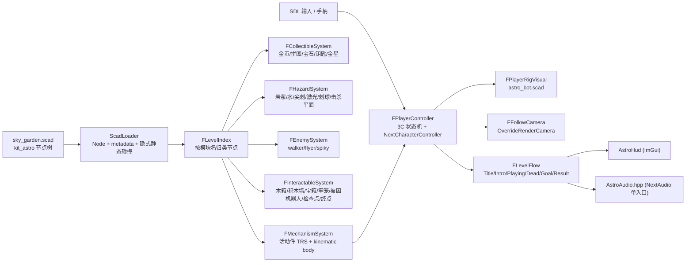

# NextAstrobot 3D 平台跳跃设计

> 本文是 `NextAstrobot` 的**设计记录**：为什么这样切分，以及每条契约当初的取舍。
> **现行契约以 [`AGENT_GUIDE/NextAstrobot.md`](../../AGENT_GUIDE/NextAstrobot.md) 为准**——
> 那里描述代码现在的样子，本文描述它为什么长成这样。P0–P3 已全部实施，开发计划已按生命周期
> 规则删除；剩余的 P4 打磨项列在文末 §11。

## 1. 决策摘要

`NextAstrobot` 是一个 C++ 原生子应用（目标 `NextAstrobot`，源码 `src/Application/Game/NextAstrobot/`），
把最近一次提交里的 `kit_astro` 零件库和 `sky_garden.scad`「星尘花园」示例关卡做成可完整游玩的
一关：机器人从出生岛出发，跑、跳、悬浮、拳击，踩着移动平台、摆锤、跷跷板、旋转盘、滑索穿过
三座悬浮岛，一路吃金币、捡拼图、救出被困机器人，最后抵达糖果条纹终点门。

五条关键决策，后面各节展开：

1. **原生 C++ 应用，不走 C# 托管游戏。** 平台跳跃需要 Jolt 角色控制器、场景节点按名索引与射线
   查询；C# 绑定面目前只有原始刚体 API，没有这三样。路线与 `NextDayz` 一致：
   `gk_add_application` + `ScadLoader` 模块 + `NextGameplay`。
2. **场景就是关卡，场景节点就是运行时对象。** `.scad` 是唯一关卡数据源：金币、机关、敌人、检查点
   都是 kit module 调用；引擎把每个调用变成一个具名 Node，游戏在 `OnSceneLoaded` 扫描
   `scene.Nodes()` 建索引，直接驱动这些节点的 transform / 可见性。不复制一份 JSON 关卡表。
3. **机关活动件是 kit 契约，不是运行时猜测。** `kit_astro` 的每个可动机关拆出 `ab_part_*` 活动件
   子模块（局部原点 = 转轴/滑轨基准），静态壳用 `gk_flatten()` 折成单节点；module 具名参数由
   ScadLoader 写进 `Node::metadata`，运行时据此还原摆臂长、滑轨长、周期等数据。
4. **活动件碰撞用 kinematic 盒体，不用 mesh。** Jolt 的 MeshShape 只能静态；位移类活动件由游戏创建
   kinematic box 并每帧 `MoveKinematicBody`，旋转对称件（旋转盘/滚筒/传送带）保留隐式静态碰撞、
   由游戏按脚下位置附加表面速度。
5. **角色控制器补两项引擎能力后再写玩法。** 现有 `NextCharacterController` 把重力和起跳速度写死、
   也不继承地面速度，站不住移动平台；本项目先给 `INextCharacterControllerBackend` 增加
   「游戏侧给定完整速度 + 继承地面速度」的更新入口，玩法层再做跳跃/悬浮/弹跳。

## 3. 产品目标与一关体验

### 3.1 一关的节奏（约 4~6 分钟）

```text
标题画面 → 路径机位飞越关卡（可跳过）→ 出生岛降落台起身
  → 金币引导 → 积木台阶取拼图 → 弹跳垫上云取金币环 → 三块递升圆盘跨峡谷
  → 检查点 → 北线：易碎石板过水池 → 旋转盘金币环 → 弹跳垫上立柱 → 拳击牢笼救人
            南线：踩按钮开栅栏 → 跷跷板 → 拳击积木墙 → 宝石 / 宝箱
  → 弹簧上立柱 → 滑索速降 / 轨道平台过桥
  → 检查点 → 摆动刺球门架 → 逆行传送带取拼图 / 激光宝石 → 岩浆池滚筒
  → 终点门：金星 + 金币环 + 欢呼机器人 → 结算（金币 / 拼图 / 救援 / 死亡数 / 用时）
```

### 3.2 玩家能力（Astro 式）

| 动作 | 输入 | 规则 |
| --- | --- | --- |
| 跑 | 左摇杆 / WASD，相机相对 | 6 m/s，0.12 s 加速，空中控制 80% |
| 跳 | A / 空格 | 起跳 8.9 m/s（重力 20 m/s² 下 2.0 m 顶点）；松键提前截断上升；土狼时间 0.12 s；跳跃缓冲 0.15 s |
| 悬浮 | 空中长按跳 | 过顶点后按住：下落速度钳制到 −1 m/s，最长 1.0 s，脚底喷射可见；每次离地一次 |
| 拳击 | X / 鼠标左键 | 0.35 s，前方 1.2 m、90° 扇区；打碎木箱/积木墙/宝箱/牢笼，击退巡逻敌人 |
| 踩踏 | 下落中落到敌人顶部 | 击杀 + 反弹 5 m/s；刺背敌人不能踩 |
| 受伤 | 碰到敌人侧面 / 危险物 / 坠落 | 一击即死，0.8 s 淡出后在最近检查点复活，死亡计数 +1，不扣收集物 |

### 3.3 收集与目标

| 物 | 来源模块 | 计数 |
| --- | --- | --- |
| 金币 | `ab_item_coin`（含 row / arc / ring 子节点） | HUD 计数，结算展示 X / 总数 |
| 拼图 | `ab_item_puzzle` | 关卡目标之一，结算 X / 总数 |
| 被困机器人 | `ab_prop_cage`（拳击开笼）、`ab_char_bot_lost`（走近拉出） | 关卡目标之一 |
| 宝石 | `ab_item_gem` | 计入金币 ×10 |
| 钥匙 | `ab_item_key` | 打开带 `locked=true` 的栅栏门（本关可不用） |
| 金星 | `ab_item_star`（终点门上） | 触碰即通关 |

## 4. 技术路线决策

### 4.1 C++ 原生应用 vs C# 托管游戏

| 需求 | C# 绑定现状（`EngineApi.def.h`） | C++ |
| --- | --- | --- |
| 角色控制器（胶囊、走楼梯、贴地、地面状态） | 无 | `NextCharacterController` |
| 场景节点按名索引、遍历子树 | 无（只有 `FindNodeIdWithComponent`） | `Scene::Nodes()` / `Node::Children()` |
| CPU 射线（相机弹簧臂、落点探测） | 无 | `FCPUAccelerationStructure::RayCastInCPU` |
| kinematic 刚体 | 有 | 有 |
| ScadRig | 有（`Rig.*`） | 有 |

补齐 C# 侧缺口是三条独立绑定工作，不在本项目范围。结论：**C++**。后续若要 C# 化，`NextAstrobot`
的系统边界（§7）刻意保持「引擎句柄 + 纯数据」形态，便于迁移。

### 4.2 场景节点即运行时对象

不建对象池、不复制关卡数据：金币节点自转并在拾取时隐藏；敌人节点由游戏接管 transform；机关活动件
节点由游戏每帧写 TRS。代价是 `OnSceneLoaded` 要做一次全场景扫描（`sky_garden` 折叠后约几百个
节点，毫秒级）。

运行时新增的节点只有主角 rig；`GOption->KeepCPUMeshData = true`（同 NextDayz），因为运行时追加
节点会重建 mesh buffer。

### 4.3 关卡文件归属

`sky_garden.scad` 留在 `assets/scad/source/astro/`（README 已把它归入 astro 分类），原地做玩法化
改造；后续关卡同目录 `levelNN_<name>.scad`。`assets/configs/nextastrobot/levels.json` 只列关卡
顺序、显示名、入场机位名和击杀平面高度。

## 5. 资产契约

### 5.1 kit_astro 机关活动件契约

**规则**（写进 `kit_astro.scad` 文件头，与现有放置契约并列）：

1. 可动机关模块 = `gk_flatten() { 静态壳 }` + 若干 `ab_part_<机关>_<件>()` 活动件调用。活动件
   **不得**放进 `gk_flatten`，否则会折进父节点丢失自己的 Node。
2. 活动件模块自己的几何全部包在 `gk_flatten()` 里：一件 = 一个 Node = 一个 Model。
3. 活动件局部原点 = 运动基准：转动件原点在转轴上，平移件原点在行程中点，升降件原点在落位。
   父模块用 `translate/rotate` 把它摆到绑定姿态；运行时只改活动件节点的**局部** TRS。
4. 玩法参数（周期、相位、速度、行程、是否上锁）作为模块的**具名参数**声明，即使几何不使用；
   ScadLoader 会把它们写进 `Node::metadata`（§6.1）。参数名跨模块统一：`period`（秒）、`phase`
   （0..1）、`speed`（m/s 或 °/s）、`amp`（°）、`idx`（序号）、`locked`（布尔）。
5. 无碰撞件（光束、刺球、按钮帽、旗帜、叶片）也是 `ab_part_*`，运行时按名把它们排除出隐式碰撞。
6. 现有模块签名保持向后兼容：新增参数只能带默认值；`ab_plat_moving` 的 `t`、`ab_plat_pendulum`
   的 `ang`、`ab_plat_seesaw` 的 `tilt` 继续表示绑定姿态。

**活动件清单**（P0 只做 ★ 项，其余按计划推进）：

| 机关模块 | 新活动件 | 原点 / 绑定 | 运行时驱动 | 碰撞 |
| --- | --- | --- | --- | --- |
| ★ `ab_plat_moving(rail, L, W, t, c, speed=2.5, phase=0)` | `ab_part_moving_car(L, W, c)` | 车厢底面中心，父模块 `translate([px,0,0])` | 局部 x 在 ±(rail−L)/2 之间往返，端点缓动 | kinematic box (L, W, 0.4)，顶面 z=0.7 |
| ★ `ab_plat_pendulum(h, arm, ang, w, period=3, phase=0)` | `ab_part_pendulum_arm(arm, w)` | 铰点，臂沿 −z | 局部绕 SCAD y 轴 `ang·sin(2πt/period + phase)` | kinematic box (2.4, w, 0.3) 在臂端 |
| ★ `ab_plat_seesaw(L, W, tilt, amp=12, speed=25)` | `ab_part_seesaw_plank(L, W)` | 轴心 | 目标倾角 = 玩家在板上的 x 侧 × amp，按 speed °/s 逼近；无人时回 0 | kinematic box (L, W, 0.18) |
| ★ `ab_plat_spin(r, speed=30)` | 无（整盘旋转对称） | —— | 视觉：盘节点绕 z 转；碰撞不动 | 隐式静态 + 表面速度 ω×r |
| ★ `ab_plat_crumble(L, D, seed, warn=0.6, respawn=4)` | `ab_part_crumble_slab(L, D, seed)` | 板底面中心 | 踩上 warn 秒后抖动 → 下坠 1.2 m 并隐藏 → respawn 秒后复位 | kinematic box，塌落后 `SetBodyActive(false)` |
| ★ `ab_plat_bounce(r, launch=6)` | 无 | —— | 触发：脚底在 r 内且着地 → 竖直速度 √(2·g·launch) | 隐式静态 |
| ★ `ab_plat_spring(r, h, launch=8)` | `ab_part_spring_cap(r)` | 顶盘底面 | 触发后顶盘压缩 0.15 s 再弹回（纯视觉） | 隐式静态 |
| ★ `ab_plat_roller(L, r, speed=2.5)` | `ab_part_roller_drum(L, r)` | 轴心 | 视觉绕 x 轴转 speed/r；脚下附加 SCAD −y 向表面速度 | 隐式静态（圆筒对称） |
| ★ `ab_plat_conveyor(L, W, speed=2)` | 无 | —— | 脚下附加 +x 表面速度 | 隐式静态 |
| ★ `ab_plat_zipline(L, drop, t, speed=8)` | `ab_part_zipline_car()` | 滑车挂点 | 玩家进入起点 1.2 m 范围并按跳 → 附着，沿缆绳匀速到终点后释放 | 无（纯视觉） |
| ★ `ab_prop_button(r, idx=0)` | `ab_part_button_cap(r)` | 帽底面中心 | 脚底在 r 内 → 帽下压 0.15 m，锁存，触发同 idx 的门 | 隐式静态（底座） |
| ★ `ab_prop_gate_bars(w, h, idx=0, locked=false)` | `ab_part_gate_grid(w, h)` | 栏栅底 | 触发后 1.0 s 升到 h+0.2；`locked` 需钥匙 | kinematic box (w, 0.3, h) |
| ★ `ab_prop_cage(seed, r, h)` | `ab_part_cage_dome(r, h)` | 穹顶底环 | 拳击 → 穹顶升 1.5 m，笼内机器人切 win，救援 +1 | 栏杆保留静态（`gk_flatten` 壳） |
| `ab_bldg_gantry` + `ab_prop_spike_ball_chain(h, r, amp=35, period=2.4)` | `ab_part_spike_ball(h, r)` | 吊钩 | 绕 y 摆动；刺球球心做危险球 | 无（危险体积） |
| `ab_prop_laser(L)` | `ab_part_laser_beam(L)` | 发射口 | 静止危险线段 | 无 |
| `ab_prop_fan(s, force=6)` | `ab_part_fan_blades()` | 轮毂 | 叶片旋转；−y 向 8 m 锥形风区推力 | 底座静态 |
| `ab_prop_fountain_jet(h, r)` | `ab_part_fountain_column(h, r)` | 喷口 | 柱内上升气流托起 | 无 |
| `ab_bldg_windmill(h, seed, speed=20)` | `ab_part_windmill_blades()` | 轮毂 | 视觉旋转 | 塔身静态 |
| `ab_prop_chest(seed)` | `ab_part_chest_lid()` | 铰链 | 拳击开盖 + 喷金币 | 箱体静态 |
| `ab_prop_lever()` | `ab_part_lever_handle()` | 轴 | 拳击/触碰扳动，作用同按钮 | 底座静态 |
| `ab_prop_checkpoint(h, idx=0)` | `ab_part_checkpoint_flag(h)` | 杆顶 | 激活后旗帜升起 + 换色 | 底座静态 |

被 ★ 项引用的旧调用（例如 `ab_plat_moving(..., t = 0.3)`）不需要改，绑定姿态语义不变。

**验收**：`gnb scad catalog` 0 warning；`astro_showcase.scad` 与 `sky_garden.scad` 各机位截图与改造
前无肉眼差异；每个新 `ab_part_*` 在 catalog 里 `ok=true`。

### 5.2 无碰撞 / 触发类名单

运行时在 `BeforeSceneRebuild` 对下列前缀的节点子树 `RenderComponent::SetRayCastVisible(false)`，
避免隐式静态 mesh body：

```text
ab_item_*                      收集物：距离触发
ab_char_*                      敌人与机器人：游戏接管，几何重叠判定
ab_part_*（碰撞列为"无"者）     光束 / 刺球 / 按钮帽 / 旗帜 / 叶片 / 滑车 / 水柱
ab_nature_grass_tuft, ab_nature_flower, ab_prop_balloon, ab_prop_bubble, ab_nature_cloud(s<1.0)
```

`ab_nature_cloud`（s ≥ 1.0）在 sky_garden 里是踏脚点，保留碰撞。

### 5.3 sky_garden 玩法化改造

在 `assets/scad/source/astro/sky_garden.scad` 原地修改：

1. 删掉出生岛上的静态主角 `ab_char_bot(seed = 0, pose = 0, hat = 0)`；出生点 = `ab_bldg_startpad`
   顶面中心，朝向 +x。
2. 两个 `ab_prop_checkpoint` 加 `idx = 1 / 2`；终点 `ab_bldg_goal` 保持。
3. 机关调用补玩法参数：轨道平台 `speed`，摆锤 `period`，跷跷板 `amp`，按钮/栅栏 `idx = 1`。
4. 被困机器人（沙坑 / 倒栽葱 / 牢笼 / 秘境）保持现状，救援计数由运行时按模块名统计。
5. 岩浆池、水池、激光、刺球门架、刺背敌人、巡逻/飞行敌人保持现状；运行时按模块名归类为危险
   或敌人。
6. 保留全部 `gk_camera_lookat*`：`overview` 作标题画面机位，`level-flythrough` 作入场飞越。

### 5.4 主角 rig：`assets/scad/characters/astro_bot.scad`

`kit_astro` 的 `ab_char_bot` 是静态整体模型，rig 需要按骨骼重新拼装（复用 `use <../lib/kit_astro.scad>`
的配色函数与 `ab_gloss`、`ab_ellipsoid` 等工具，所以外观与关卡里的 NPC 机器人一致）。

```text
bone_root                         足底地面锚点 z=0，面朝 SCAD −y
├─ bone_leg_l / bone_leg_r        髋 pivot (±0.15, 0, 0.45)：白色小腿 + 蓝色悬浮脚
└─ bone_torso                     pivot (0, 0, 0.45)：白色椭球躯干 + 蓝腰带 + 胸灯 + 背包
   ├─ bone_head                   pivot torso-local (0, 0, 0.50)：白球 + 黑目镜 + 蓝眼 + 耳灯
   ├─ bone_arm_l / bone_arm_r     肩 pivot torso-local (±0.30, 0, 0.47)：白臂 + 蓝手球
   └─ bone_jet                    pivot torso-local (0, 0, −0.03)：悬浮喷焰锥（默认由游戏隐藏）
```

- `ROLECOLOR`（纯品红）用于腰带 / 手 / 脚 / 眼灯等蓝色点缀，运行时默认染成 `ab_BLUE()`，
  给第二玩家或被救机器人换色留口。
- 必需 clip（`Test_AstroBotRig` 硬性检查）：`idle`、`run`、`jump`（非循环）、`fall`、`hover`、
  `land`（非循环）、`punch`（非循环）、`hurt`（非循环）、`win`、`zip`、`wave`。
- `run` 周期 0.5 s 对应 6 m/s；`hover` 时腿并拢、双臂外展 80°。
- 材质：在 §6.3 落地前 rig 是 Lambertian；落地后 `ab_gloss` 的 roughness 0.12 生效。

## 6. 引擎与共享层改动

只有三处，都很小；每处都必须让现有消费端零改动通过编译与 `[Scad]` / `[Rig]` / `[Gameplay]` 测试。

### 6.1 ScadLoader：module 参数落 Node

- `Assets::Node` 新增 `std::string metadata_`（默认空）与 `GetMetadata()/SetMetadata()`；不进
  反射，不进 outliner。
- `FScadLoader::BuildScadSceneNodeRecursive` 把 `Scad::SceneNode::parameters` 中的标量（number /
  bool / string）序列化为 `k=v;k=v`（number 用 `%g`，bool 用 `true/false`，string 原样）写进
  `metadata`；向量、列表跳过。`gk_flatten` 子树里的调用本来就不产生 Node，不受影响。
- `Scad` 命名空间提供 `ParseScadMetadata(std::string_view)` 与 `MetadataNumber(node, key, fallback)`
  便利函数，放 `FScadShared.h`。
- 单测：`Test_ScadLoader.cpp` 新增用例，加载含 `module m(a = 1, b = true, c = "x") {}` 的内存场景，
  断言 `metadata == "a=1;b=true;c=x"`。

### 6.2 NextPhysics：角色控制器接受完整速度并继承地面速度

`INextCharacterControllerBackend` 新增：

```cpp
/// Sets the character velocity for this step exactly as given (the game integrates gravity,
/// jump, hover and launch itself), then runs ExtendedUpdate. When inheritGround is true and the
/// character is on ground, the ground body velocity at the contact point is added, so a
/// character riding a kinematic platform or a rotating disc keeps its footing.
virtual void UpdateWithVelocity(const glm::vec3& worldVelocity, bool inheritGround, float deltaSeconds) = 0;
virtual glm::vec3 GetGroundVelocity() const = 0;
virtual glm::vec3 GetGroundNormal() const = 0;
virtual NextBodyID GetGroundBodyID() const = 0;
```

- Jolt 实现：`character_->UpdateGroundVelocity()` 后按 Jolt 官方 `CharacterVirtualTest` 的写法合成
  速度；地面竖直速度也要保留（平台上升时不能穿透）。
- 旧的 `Update(inputDirection, speed, jump, dt)` 保持原样，NextDayz / CharacterDemo 不迁移。
- `NextCharacterController` façade 同步暴露这四个方法。
- 单测：新建 `Test_CharacterGroundVelocity.cpp`：一个 kinematic box 以 2 m/s 平移，角色站上去
  1 s 后位移 ≥ 1.8 m。

### 6.3 ScadRig：保留 PBR 段（可延后到 P1 末）

- `Assets::FRigPart` 新增 `std::vector<float> sectionRoughness` / `sectionMetalness`（与
  `sectionColors` 对齐，默认 1 / 0）。
- `FScadRig.cpp` 的 `RigBucket` 键由量化颜色改为量化 (颜色, roughness, metalness)。
- 现有消费端（`RigSubsystem.cpp`、`CharacterPool.cpp`、NextDayz、Brotato3D）继续只读
  `sectionColors`，行为不变；NextAstrobot 的 `PlayerRigVisual` 按 `Material::Mixture(rgb, roughness)`
  + `Metalness` 建材质（同 `FScadLoader.cpp` 的 `ScadMaterialFromColor`；建议把该函数搬到
  `FScadShared.h` 复用）。

## 7. 运行时架构

### 7.1 总体



文件布局（照 Brotato3D「上帝类 + 按域拆翻译单元」，数据类型与系统各自独立可测）：

```text
src/Application/Game/NextAstrobot/
├── CMakeLists.txt                     gk_add_application(NextAstrobot ... MODULES ${GK_STANDARD_RUNTIME_MODULES} ScadLoader LINK NextGameplay)
├── NextAstrobotGameInstance.{hpp,cpp} 生命周期、OnTick 编排、输入分发、相机覆盖、agent queries
├── NextAstrobotConfig.{hpp,cpp}       JSON → FConfig（gameplay.json / levels.json）
├── AstroAudio.hpp                     音效单入口
├── Level/LevelIndex.{hpp,cpp}         FLevelIndex：扫描 scene.Nodes()，产出各系统的节点表
├── Level/LevelFlow.{hpp,cpp}          FLevelFlow：状态机 + 结算数据（纯逻辑，可单测）
├── Player/PlayerController.{hpp,cpp}  3C：运动、跳跃、悬浮、拳击、死亡/复活、滑索附着
├── Player/PlayerRigVisual.{hpp,cpp}   rig 注入 / 实例化 / clip 选择 / 喷焰可见性
├── Player/FollowCamera.{hpp,cpp}      跟随相机 + 路径机位飞越
├── Mechanisms/MechanismSystem.{hpp,cpp} 活动件驱动（每类一个 struct + Update）
├── Mechanisms/MechanismCurves.hpp     往返 / 正弦摆 / 逼近 等纯函数（可单测）
├── World/CollectibleSystem.{hpp,cpp}
├── World/HazardSystem.{hpp,cpp}
├── World/EnemySystem.{hpp,cpp}
├── World/InteractableSystem.{hpp,cpp}
└── UI/AstroHud.{hpp,cpp}
assets/configs/nextastrobot/{gameplay.json, levels.json, i18n.json}
assets/scad/characters/astro_bot.scad
assets/agentscripts/nextastrobot-*.agentscript.json
```

### 7.2 生命周期

```text
CreateGameInstance   Modules::Scad::Register()；ConfigureWindow("NextAstrobot", 1920x1080)
OnInit               KeepCPUMeshData=true；读 gameplay.json/levels.json；LoadRig(astro_bot.scad)
                     RequestLoadScene(levels[0].scene)
BeforeSceneRebuild   §5.2 名单 SetRayCastVisible(false)；rig InjectAssets；
                     不在此处改任何节点 transform（节点尚不可寻址）
OnSceneLoaded        FLevelIndex::Build(scene) → 各系统 Bind(index)
                     MechanismSystem 为位移类活动件创建 kinematic box 并 Scene::BindPhysicsBody(部件节点, body, Kinematic)
                     PlayerController::Create(physics, spawn)；rig Instantiate；FollowCamera::Snap
                     LevelFlow → Intro（若有路径机位）否则 Playing
OnTick               见 §7.4
OnSceneUnloaded      各系统只清运行时指针与 body id，不清注入产物（ScadRig 铁律）
OnDestroy            Destroy controller / bodies
```

### 7.3 碰撞策略总表

| 类别 | 碰撞来源 | 谁负责 |
| --- | --- | --- |
| 岛屿、平台、建筑、植被、静态道具 | 加载时隐式静态 mesh body | 引擎 |
| 位移类活动件（车厢/摆臂/跷跷板/栅栏/穹顶/易碎板） | 游戏创建 kinematic box → `Scene::BindPhysicsBody`（自动移除隐式体）→ 每帧 `MoveKinematicBody` | MechanismSystem |
| 旋转对称件（旋转盘/滚筒/传送带） | 隐式静态体 + 游戏按脚底位置附加表面速度 | MechanismSystem → PlayerController |
| 收集物、敌人、危险视觉、装饰 | 无（`RayCastVisible=false`）；几何重叠判定 | 各系统 |
| 主角 | Jolt CharacterVirtual（高 1.5 m、半径 0.35 m、台阶 0.55 m、坡 50°） | PlayerController |

「脚底在部件上」的判定统一为几何：`onGround && 脚点在部件 XZ 足迹内 && |脚点 y − 部件顶面 y| < 0.15`。
`GetGroundBodyID()` 作为 P3 的精确化手段（把 body id 映射回部件），不是 P0 依赖。

### 7.4 帧顺序

```text
1. 输入：SDL 回调只更新 held/one-shot 状态；手柄轴走 OnGamepadInput
2. LevelFlow.Update(dt)：非 Playing 状态 → GetPhysicsEngine()->SetPaused(true)，跳到 9
3. MechanismSystem.Update(t, dt)：算每个活动件的局部 TRS → node->SetTransform → 取 world TRS → MoveKinematicBody
                                    表面速度件写 surfaceVelocity 表；跷跷板读上一帧玩家位置
4. PlayerController.Update(dt)：
     a. 状态机 Ground/Air/Hover/Zip/Punch/Dead
     b. 合成水平速度（相机相对输入 + 表面速度）与竖直速度（重力 20、跳 8.9、悬浮钳 −1、弹跳/弹簧 launch）
     c. controller.UpdateWithVelocity(v, inheritGround = state != Zip, dt)
     d. 读回位置 / 地面状态；土狼 / 缓冲计时
5. CollectibleSystem：距离 0.9 m 拾取 → 隐藏节点 + 计数 + 音效
6. HazardSystem：重叠 → PlayerController.Kill(reason)；y < killY 同理
7. EnemySystem：巡逻 / 悬停；踩踏（玩家下落且脚点 ≥ 敌顶 −0.2）→ 击杀；侧碰 → Kill；拳击范围 → 击退/击杀
8. InteractableSystem：按钮锁存→栅栏；拳击→木箱/积木墙/宝箱/牢笼；被困机器人接近→救援；检查点激活；终点/金星→Goal
9. PlayerRigVisual.Update：world node = 脚点 + yaw；按状态选 clip；喷焰可见性
10. FollowCamera.Update；HUD 快照；Scene::MarkTransformDirty() 一次
```

跷跷板读「上一帧」玩家位置是刻意的：机关先于角色更新，才能保证角色站的是本帧的平台位置。

### 7.5 关卡索引

`FLevelIndex::Build(Assets::Scene&)` 一次遍历 `scene.Nodes()`，按 `GetName()` 前缀分桶；每条记录
保存 `Node*`、`instanceId`、`metadata` 解析结果、世界 TRS 与父节点。活动件通过父节点的
`Children()` 中名字匹配 `ab_part_*` 的子节点定位；同一机关的多个活动件（如未来的双门）按参数区分。

```cpp
struct FIndexedNode { Assets::Node* node; uint32_t id; Scad::FMetadata meta; glm::vec3 worldPos; glm::quat worldRot; };
struct FLevelIndex {
    std::vector<FIndexedNode> coins, puzzles, gems, keys, stars;
    std::vector<FMechanismRecord> mechanisms;      // kind + 根节点 + 活动件节点表
    std::vector<FIndexedNode> hazards, enemies, interactables, checkpoints;
    FIndexedNode spawn, goal;
    static FLevelIndex Build(Assets::Scene& scene, std::vector<std::string>* warnings);
};
```

缺 spawn / goal 时记 warning 并回退到（原点 / 无终点）；索引结果通过 `game.index.*` agent query 可见。

### 7.6 机关曲线（纯函数，`MechanismCurves.hpp`）

```cpp
float PingPong01(float t, float period);                 // 0→1→0，端点 smoothstep
float Swing(float t, float period, float phase01, float amp);   // amp·sin
float Approach(float current, float target, float rate, float dt);
```

单测覆盖：周期性、端点值、`Approach` 不越过目标。

### 7.7 相机

- 跟随：目标 = 脚点 + (0, 1.2, 0)；相机 = 目标 + R_yaw·(0, 4.2, −7.5)，FOV 45°，位置阻尼 8/s。
- 相机 yaw 默认缓慢对齐移动方向（1.5 rad/s）；右摇杆 / 鼠标右键拖拽手动环绕；1 s 无输入后恢复自动。
- 入场飞越：`LevelFlow == Intro` 时用场景里 `level-flythrough` 相机轨道（`Scene::EvaluateTracks`），
  按任意键跳过。
- 弹簧臂（P4）：`FCPUAccelerationStructure::RayCastInCPU` 从目标向相机探测，命中则拉近。

### 7.8 HUD 与流程

- HUD：左上 金币 / 拼图 X/Y / 救援 X/Y；右上 用时；中央提示（检查点 / 救援成功）；死亡淡黑。
- Title：`overview` 机位 + "Press Start"；Result：本关统计 + 重玩 / 下一关；Esc 暂停。
- ImGui 立即模式，与 Brotato3D `Brotato3DUI` 同一套写法；文案走 `i18n.json`（可先中文硬编码）。

### 7.9 配置默认值（`gameplay.json`，都是调参起点）

```text
RunSpeed 6.0   RunAccel 50   AirControl 0.8
Gravity 20     JumpSpeed 8.9  JumpCutMultiplier 0.5   CoyoteSeconds 0.12  JumpBufferSeconds 0.15
HoverMaxSeconds 1.0   HoverFallSpeed -1.0
StompBounceSpeed 5.0  PunchSeconds 0.35  PunchRange 1.2  PunchArcDegrees 90
ControllerHeight 1.5  ControllerRadius 0.35  MaxStepHeight 0.55  MaxSlopeDegrees 50
PickupRadius 0.9   DeathFadeSeconds 0.8   KillPlaneOffset -20（相对本关最低岛面）
Camera: Distance 7.5  Height 4.2  Fov 45  Damping 8  AutoYawRate 1.5
```

## 8. 可观察性与验收契约

`RegisterAgentQueries` 至少注册：

```text
game.state            "title" | "intro" | "playing" | "dead" | "goal" | "result"
game.playerX/Y/Z      脚点世界坐标
game.onGround         bool
game.locomotion       "idle" | "run" | "jump" | "fall" | "hover" | "zip" | "punch" | "dead"
game.coins / game.coinsTotal / game.puzzles / game.puzzlesTotal / game.rescued / game.rescuedTotal
game.deaths           int
game.checkpoint       int（−1 = 出生点）
game.index.mechanisms / game.index.coins / game.index.enemies   索引数量（关卡资产回归）
game.mech.<name>.t    指定机关的归一化相位（脚本里读取以断言"平台在动"）
```

调试 CVar：`astro.teleport x,y,z`、`astro.god`（免死）、`astro.timescale`。

agentscript（全部走 `gnb validate`，进程返回码即结论）：

| 脚本 | 覆盖 |
| --- | --- |
| `nextastrobot-smoke` | 场景提交、索引数量 ≥ 期望、玩家在出生点、截图 |
| `nextastrobot-locomotion` | 跑 → 跳 2 m → 悬浮 1 s → 落地 clip 序列 |
| `nextastrobot-mechanisms` | teleport 到轨道平台上，等 2 s，playerX 随平台位移；摆锤 / 跷跷板 / 旋转盘同理 |
| `nextastrobot-collect` | 经过金币行，coins == 5 |
| `nextastrobot-goal` | teleport 到终点，state == goal → result |

肉眼验收用 `gnb shot --target NextAstrobot --ui`（HUD）与 `gnb shot --target NextAstrobot --frames 300`。

## 9. 非目标（本期不做）

- 多关卡以外的世界地图 / 存档；本期只有 `sky_garden` 一关 + 一个可选的验证关。
- Astro 特殊道具（弹簧蛙腿、猴爬、气球背包）与 Boss。
- 主角分层动画（`FRigLayeredAnimator`）：拳击是全身 one-shot，不与跑步叠加。
- 敌人 rig 与寻路：敌人沿固定巡逻段往返，用场景节点作视觉。
- 联机、回放对比、移动端打包（注册进 `MobileApplications.json` 留在 P4）。
- C# 绑定扩展。

## 10. 风险与缓解

| 风险 | 缓解 |
| --- | --- |
| 拆活动件改变了 kit 节点结构，ScadLibrary 场景组装或 catalog 回归 | 只改模块内部，顶层调用签名向后兼容；`gnb scad catalog` + showcase 截图门禁 |
| `gk_flatten` 把多色几何合到一个 Model，超过 16 材质槽 | 大岛 ≤ 6 色，机关 ≤ 8 色；超限时 loader 会自动拆 `__render` 子节点，不影响索引（索引只看模块节点） |
| Jolt 地面速度在旋转 kinematic 盒上抖动 | 摆锤 / 跷跷板角速度小；实测抖动再加 `mStickToFloorStepDown` 调整或角速度上限 |
| 角色卡在活动件与静态壳缝隙 | 活动件盒体比视觉大 2 cm；壳与件之间留 5 cm |
| 隐式静态体对每个模块节点 cook mesh，加载慢 | `gk_flatten` 后 sky_garden 约 300 节点；对照 SCADLoader 指南的 1 km tile 数据（90 节点 34 ms）足够 |
| 运行时隐藏金币节点触发渲染重建 | Brotato3D 已验证 `SetVisible` 每帧可用；不删节点 |
| rig 无 PBR 段前主角是哑光 | §6.3 独立任务，随时可插入；玩法不依赖 |

## 11. 实施结果与剩余项（2026-09-02）

P0–P3 全部实施完成，验收全绿：`gkNextUnitTests "[NextAstrobot],[AstroBotRig]"` 与五个
agentscript（smoke / locomotion / collect / mechanisms / goal）。实施过程中相对本文的偏差：

- **`ab_part_cage_dome(r)`** 只取 `r`；本文 §5.1 写的 `(r, h)` 里 `h` 无用途。
- **新增调试 CVar `astro.ride "<机关名>"`**：把玩家传送到指定机关的站立点。没有它，
  「站上移动平台」这类脚本必须猜活动件此刻在哪，测试会变成时序赌博。
- **`sky_garden.scad` 补了一台摆锤**（岛 B 北缘 `(0, 10, 3)`）。本文 §3.1 的流程和计划的 E2
  验收都要求关卡里有摆锤，但原关卡没有。
- **击杀平面要夹在场景地板之上**：`Scene::RebuildMeshBuffer` 会在场景 AABB 最低点建一个无限
  平面，本文 §7.9 的 `KillPlaneOffset -20` 在 sky_garden 里落到那个平面之下，掉下去只会站在
  空气上。运行时取 `max(最低岛面 + offset, sceneAABBMin.y + 2)`。
- **拳击判定是水平扇区**，不是 3D 锥：站在牢笼底下或面对比自己高的积木墙时，3D 锥会判不中。
- **§6.3 的 ScadRig PBR 段没有做**（设计里就标了「可延后」）：主角仍是 Lambertian。

P4 打磨项（2026-09-02 第二轮，三项已完成）：

| 项 | 状态 |
| --- | --- |
| 非 ★ 活动件 | **已完成**。八件都拆出了 `ab_part_*` 并接进 `MechanismSystem`：刺球摆动（致命判定跟随活动件）、激光按占空比开关（灭时不致命）、风扇风区（`FMechanismEffects::wind`，m/s 折进水平目标速度）、喷泉托举（`liftSpeed` 给竖直速度设下限）、风车叶片、宝箱盖（打碎 = 掀盖，箱子留在世界里）、拉杆（拳击触发同 idx 栅栏门）、检查点旗帜（踩到后升旗）。`sky_garden` 补了风扇塔（峡谷顺风）、喷泉高台与拉杆宝箱格 |
| 相机弹簧臂 | **已完成**。`FFollowCamera` 收可选 `Scene*` 做 `RayCastInCPU`；两个反直觉的坑写进了 AGENT_GUIDE：不能设最小臂长（会把镜头顶穿墙），臂长必须是对阻尼结果的**钳位**而非缩放（缩放会复利收敛到注视点，`glm::lookAt` 退化） |
| 被救机器人换 rig 实例 | **已完成**。`FRescueRigVisual` 复用主角注入的 rig 资产建实例池，救出即换掉 kit 静态几何并播 `wave` / `win`，且沿远离玩家的方向让开 0.8 m |
| 第二关 + 流转 | **已完成**。新增 `dune_relay.scad`「落日沙洲」（三座沙洲，57 金币 / 3 拼图 / 3 救援 / 17 机关），主题就是教这一轮做的非 ★ 活动件；结算画面按 `levels.json` 顺序走：有下一关就 `[Space] Next: <名字>`，最后一关变成 RUN COMPLETE + campaign 合计 + `[Space] Start over`。新增 `astro.level` cvar 与 `game.{level,levelId,levelCount,campaignCoins,campaignDeaths}` 查询 |
| ScadRig PBR 段 | 未做。§6.3；落地后主角机身会有高光 |

第二轮的验收在两个脚本里：`nextastrobot-props` 覆盖八件活动件、弹簧臂（`game.springArm` /
`game.cam{X,Y,Z}`）与被救机器人（`game.rescueRigs`）；`nextastrobot-levels` 覆盖两关流转与第二
关自身的机关。

两个踩过的坑记在 AGENT_GUIDE 里：**风力对站着的玩家要减弱**（满强度会把人从它本该帮忙够到的
小圆盘上推下去），以及 **`game.levelId` 必须报真正加载完的关**（`levelCursor_` 在请求加载那一
刻就变了，脚本等 cursor 会拿着旧场景跑下一步）。
