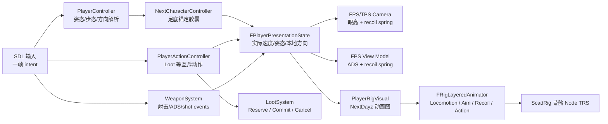
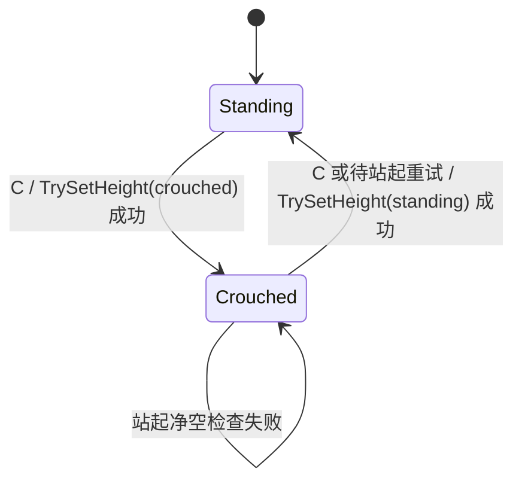

# NextDayz 复杂 3C 与 ScadRig 分层动画设计

> 本文以 2026-07-26 的当前代码为基线，设计 NextDayz 的蹲姿、四方向移动、步行/跑步/冲刺、举枪瞄准、开火后坐力和 loot 动作。它取代
> [NextDayz MVP 设计](nextdayz-mvp-design.md) 中 §5.1～§5.3 关于后续 3C/角色动画的简化方案，但不改变其地图、背包、昼夜和 HUD 边界。
> 对应执行顺序见 [开发计划](nextdayz-3c-scadrig-development-plan.md)。
>
> **实现状态（2026-07-26）**：P0～P7 已落地。本文中的状态模型、动态胶囊、四层动画图、
> shot event 和 loot 两阶段提交均为现行实现；NextDayz 专用资产为
> `assets/scad/characters/nextdayz_survivor.scad`。应用内没有另设
> `PlayerAnimationController`，动画图职责由 `PlayerRigVisual` 承担。

## 1. 目标与边界

### 1.1 本期必须交付

1. 站姿和蹲姿都支持前、后、左、右及相邻方向的连续混合。
2. 站姿具有 Walk / Run / Sprint 三种独立步态；不是把同一个 walk clip 简单加速三倍。
3. 蹲姿具有静止和四方向 crouch-walk；蹲姿不能冲刺。
4. 角色胶囊随实际姿态改变高度；低矮空间下站起失败时，视觉、相机和碰撞仍保持蹲姿。
5. 站姿/蹲姿、静止/移动时都可举枪瞄准；瞄准姿态只覆盖上身，不打断腿部 locomotion。
6. 每一发子弹都产生：
   - FPS 相机和 view model 的后坐力；
   - TPS ScadRig 上身的 recoil 叠加动画；
   - 不丢失连发事件的一次性 shot presentation event。
7. loot 时播放全身 loot 动作，在动作中段提交拾取；动作期间移动、瞄准、开火被显式锁定。
8. 所有状态可通过 `game.*` agent query 观察，并有输入驱动回归脚本和截图。

### 1.2 本期不做

- 趴下、侧身探头、攀爬、翻越、游泳。
- 脚部 IK、手部 IK、motion matching、root motion 驱动位移。
- 换弹、受伤、近战等额外全身动作；架构应能以后按同一 Action Layer 接入。
- 第一人称完整手臂 rig；FPS 继续使用独立 view model，TPS 使用完整 ScadRig。
- 网络复制和预测。状态结构不得主动阻碍未来复制，但本期不实现。
- 修改 `kit_char.scad` 的七骨骼通用角色标准。复杂人形骨架先作为 NextDayz 专用资产验证，出现第二个消费端后再抽成通用 humanoid kit。

## 2. 当前实现与缺口

当前实现已经具备完整 MVP 链路，但不足以直接叠加这些动作：

| 当前代码 | 已有能力 | 不能满足的部分 |
| --- | --- | --- |
| `Player/PlayerController.*` | Jolt 控制器、WASD、两档速度、FPS/TPS 相机、ADS FOV | 无 crouch；胶囊高度创建后不可变；只有 `Idle/Walk/Run`，没有本地四方向和第三档步态 |
| `Gameplay/Character/NextCharacterController.*` | 对物理后端的轻量封装 | 后端没有 `TrySetHeight`，无法在站起前检查头顶净空 |
| `Gameplay/Rig/RigInstance.*` | 单 clip 播放、速度、phase offset、两 clip crossfade | 没有骨骼遮罩、方向 clip 混合、override/additive layer、可重触发 one-shot |
| `Player/PlayerRigVisual.*` | `idle/walk/fire` 离散切换；run 复用 walk 加速 | fire 会替换 locomotion；不能同时“跑 + 瞄准 + recoil” |
| `next_ra_soldier.scad` | 7 骨骼和 `idle/walk/fire` | 手臂和腿各是一根刚体；步枪烘在 torso；没有肘、膝和武器 socket |
| `Weapons/WeaponSystem.*` | hitscan、ADS、换弹、FPS view model | 只有 `ConsumeFiredThisFrame()` 布尔脉冲；无 camera/view-model recoil；低帧率下一帧无法表达多发 |
| `Inventory/LootSystem.*` | E 键立即入包并隐藏节点 | 没有 reservation、动作锁和延迟 commit，无法可靠同步 loot 姿势 |

因此本期不是继续扩充 `EAnimState` 的 `switch`，而是补齐两个可复用基础能力：

- 角色控制器的**足底锚定动态高度**；
- ScadRig 的**分层 pose 混合**。

## 3. 产品默认值

下列是未另行确认时的开发默认值，都必须放在 NextDayz 配置中，不写死在状态机：

| 行为 | 默认输入/规则 |
| --- | --- |
| 蹲下/站起 | `C` 切换；站起被阻挡时保持蹲姿并继续重试 |
| Walk | 按住 `Ctrl` |
| Run | 无速度修饰键时的默认步态 |
| Sprint | 按住 `Shift`；仅站姿且未 ADS、未 loot 时允许 |
| 四方向 Sprint | 支持 F/B/L/R clip；后退和侧向通过方向速度系数降低实际速度 |
| ADS | 鼠标右键按住；ADS 将 Walk/Run/Sprint 解析结果限制为 Walk |
| 蹲姿移动 | 只有 crouch-walk 一档；方向速度系数仍生效 |
| 蹲姿跳跃 | 拒绝；跳跃输入先请求站起，净空不足则本次跳跃失败 |
| loot | E 开始，约 `0.9s`；`55%` 进度提交物品；提交前可由移动/跳跃取消 |

建议初始数值：

```text
StandWalkSpeed     2.0 m/s
StandRunSpeed      4.2 m/s
StandSprintSpeed   7.6 m/s
CrouchWalkSpeed    1.55 m/s
BackwardScale      0.72
StrafeScale        0.82
AimMoveScale       0.65
StandingHeight     1.80 m
CrouchedHeight     1.18 m
StandingEyeHeight  1.65 m
CrouchedEyeHeight  1.02 m
```

这些是调参起点，不是资产契约。

## 4. 总体架构



### 4.1 所有权

- `PlayerController`：原始移动 intent、实际 stance/gait、Jolt 控制器、基础 look yaw/pitch、相机眼高。
- `PlayerActionController`：loot 等互斥全身动作的权威 timer、锁、commit/cancel 事件。
- `WeaponSystem`：武器和弹药权威状态、射击判定、每发 `FShotEvent`。
- `PlayerRigVisual`：ScadRig 资产生命周期、动画图、TPS 武器 attachment；只消费 presentation state，不决定玩法。
- `FRigLayeredAnimator`：通用 pose 采样/混合/应用，不知道 NextDayz 的 crouch、枪械或 loot。
- `NextDayzGameInstance`：按固定顺序转发输入、更新系统和处理事件，不重新收容业务状态。

### 4.2 帧顺序

1. SDL 回调只更新 held input 或排队 one-frame command，不在回调内直接拾取、切姿态或开火。
2. `PlayerActionController` 先解析动作锁；loot 会禁止本帧 movement/aim/fire。
3. `PlayerController` 解析目标姿态和 gait，尝试改变胶囊，随后更新物理控制器。
4. `LootSystem` 更新准星候选；`WeaponSystem` 更新射击并产生零到多个 `FShotEvent`。
5. shot event 逐个施加到 camera/view-model recoil spring，并逐个重触发 TPS recoil layer。
6. action timer 到 commit 点时，GameInstance 调 `LootSystem::Commit`；视觉资产缺失也不能阻止玩法提交。
7. 组装只读 `FPlayerPresentationState`，驱动相机、view model 和 `PlayerRigVisual`。
8. `FRigLayeredAnimator` 一次求值并只做一次根节点 `RecalcTransform(true)`；Scene 每帧最多一次 `MarkTransformDirty()`。

## 5. 共享状态模型

建议在 `src/Application/Game/NextDayz/Player/PlayerState.hpp` 定义：

```cpp
enum class EPlayerStance
{
    Standing,
    Crouched,
};

enum class EPlayerGait
{
    Idle,
    Walk,
    Run,
    Sprint,
};

enum class EPlayerAction
{
    None,
    LootGround,
};

struct FPlayerLocomotionState
{
    EPlayerStance desiredStance = EPlayerStance::Standing;
    EPlayerStance actualStance = EPlayerStance::Standing;
    EPlayerGait gait = EPlayerGait::Idle;
    glm::vec2 localMove{0.0f};       // x=right, y=forward, [-1,1]
    glm::vec3 worldVelocity{0.0f};
    float horizontalSpeed = 0.0f;
    bool onGround = false;
    bool standBlocked = false;
};

struct FPlayerPresentationState
{
    FPlayerLocomotionState locomotion;
    EPlayerAction action = EPlayerAction::None;
    float actionTime01 = 0.0f;
    float aimWeight = 0.0f;
    float aimPitchRadians = 0.0f; // 不含 recoil；后坐力由独立 additive layer 表达
    bool hasWeapon = false;
};
```

`desiredStance` 和 `actualStance` 必须分开。动画、相机和 HUD 只能读 `actualStance`；否则在矮屋檐下按 C 会出现视觉站起但胶囊仍蹲着的穿模。

## 6. 物理姿态与移动解析

### 6.1 通用角色控制器 API

在 [`NextPhysics.hpp`](../../../src/Engine/Runtime/Subsystems/NextPhysics.hpp) 的
`INextCharacterControllerBackend` 增加：

```cpp
virtual bool TrySetHeight(float height) = 0;
virtual float GetHeight() const = 0;
```

[`NextCharacterController`](../../../src/Gameplay/Character/NextCharacterController.h) 提供同名 façade，并只在后端成功后更新缓存高度。

Jolt 5.4 的 `CharacterVirtual::SetShape` 已直接支持 stance 切换和扩张碰撞检查。实现约束：

1. 抽出 `CreateFootAnchoredCapsule(height, radius)`：
   - capsule cylinder half-height 为 `(height - 2 * radius) / 2`；
   - 外层 `RotatedTranslatedShape` 的 Y offset 为 `height / 2`；
   - CharacterVirtual position 继续表示脚底，因此换高时世界脚点不跳。
2. `height >= 2 * radius + epsilon`，非法值返回 false 并记录错误。
3. 变矮只减少占用体积，可用无扩张检查路径。
4. 变高必须调用带 broad/object/body/shape filter 和有限 penetration tolerance 的 `SetShape`；失败时保留原 shape 和实际高度。
5. 若以后启用 CharacterVirtual inner body，成功后同步 `SetInnerBodyShape`；本期不为了 crouch 主动启用 inner body。
6. 不能 destroy/recreate controller 来切 crouch；那会丢失接触、速度并在楼梯或移动地面上跳点。

### 6.2 姿态状态机



- 蹲下通常立即成功；成功后才改变 `actualStance`。
- 请求站起但失败时设置 `standBlocked=true`，每 tick 低频重试或在角色移动后重试。
- 相机眼高用阻尼平滑到实际姿态眼高；先成功换 shape，再抬高相机。
- crouch 视觉切换用 `0.12～0.18s` crossfade；碰撞体不做连续缩放，避免多次昂贵 shape query 和中间态钻缝。

### 6.3 步态和方向

输入先解析为相机水平空间的 `localMove`，物理移动仍由 camera forward/right 合成。

步态优先级：

```text
Loot/其它锁定动作 -> Idle
Crouched           -> Walk（使用 crouch 速度）
ADS                -> Walk
Shift              -> Sprint
Ctrl               -> Walk
其它               -> Run
```

方向速度系数按 `abs(localMove.x/y)` 连续混合，避免斜向跨阈值突变；对角输入在合成世界方向前仍需归一化，不能获得 √2 速度。

动画方向使用**实际水平速度投影**，起步首帧可用 intent 做 fallback。这个策略可复用
[`CharacterAnimationComponent`](../../../src/Gameplay/Components/CharacterAnimationComponent.cpp) 已有的“实际速度优先、commanded direction 兜底”思路，避免撞墙时原地高速踏步。

## 7. ScadRig 分层动画框架

### 7.1 不扩展资产 DSL 的内容

现有 clip 已经表达相对 bind pose 的 `pos/rot/scale`，足以做 override 和 additive。本期不把以下运行时概念写进 `.scad`：

- layer 名；
- bone mask；
- additive 标记；
- gameplay event。

原因是同一 clip 可被不同游戏以不同层语义使用，loot 的权威 commit 也不能依赖视觉资产。`.scad` 格式继续只保留现有 `["loop", bool]` 元数据，避免破坏 loader 和作者工具。

### 7.2 新的通用类型

在 `src/Gameplay/Rig/` 增加格式无关的 pose/mixer 实现，建议接口形状如下：

```cpp
enum class ERigLayerBlendMode
{
    Override,
    Additive,
};

struct FRigBonePose
{
    glm::vec3 t{0.0f};
    glm::quat r{1.0f, 0.0f, 0.0f, 0.0f};
    glm::vec3 s{1.0f};
    uint8_t authoredComponents = 0; // Position / Rotation / Scale bits
};

struct FRigBoneMask
{
    std::vector<float> weights; // 与 asset.bones 对齐，0..1

    static FRigBoneMask FullBody(const Assets::FRigAsset& asset);
    static FRigBoneMask FromSubtree(
        const Assets::FRigAsset& asset, std::string_view rootBone, float weight = 1.0f);
};

struct FRigClipBlendSample
{
    const Assets::FRigClip* clip = nullptr;
    float weight = 0.0f;
};
```

新增 `FRigLayeredAnimator`，至少提供四类操作：

```cpp
Bind(asset, boneNodes, root)
CreateLayer(name, blendMode, boneMask)
SetLoopBlend(layer, samples, syncGroup, playRate, fadeSeconds)
SetStaticBlend(layer, samples, fadeSeconds)
SetManualBlend(layer, samples, normalizedTime, fadeSeconds)
PlayOneShot(layer, clip, playRate, fadeIn, fadeOut, restartIfSame)
SetLayerWeight(layer, weight, fadeSeconds)
IsOneShotComplete(layer)
Update(deltaSeconds)
```

接口命名可在实现时微调，但这些语义必须保留：

- locomotion 的多个方向 clip 共享一个 normalized phase；
- 同一 one-shot 可被每发子弹强制重触发；
- layer 和 clip 名在 Bind/切换时解析，不在每骨骼每帧做字符串查找；
- Update 热路径不做无界分配；
- 缺失 mask root 或必需 clip 时 warning 只打印一次，并提供可测试的错误状态。

### 7.3 Pose 求值语义

1. 求值从 offset identity 开始：`t=0`、`r=identity`、`s=1`。
2. 每个骨骼、每个 TRS component 都保留 authored bit。一个 clip 没写 rotation 时，不能把下层 rotation 混回 identity。
3. 同一层多个 clip 混合时，只在真正写了该 component 的样本之间归一化权重。
4. Override：
   - `w = layerWeight * boneMaskWeight`；
   - position/scale 线性混合；
   - rotation 使用 hemisphere-corrected weighted nlerp 或等价、顺序无关的归一化混合。
5. Additive：
   - `out.t += delta.t * w`；
   - `out.r *= slerp(identity, delta.r, w)`；
   - `out.s *= mix(1, delta.s, w)`。
6. 所有层混完后才应用一次 bind：
   `L_final = L_bind · T(offset.pos) · R(offset.rot) · S(offset.scale)`。
7. 最后只从 rig root 做一次 transform 递归刷新。

### 7.4 旧 API 兼容

现有 `FRigAnimator::Bind/Play/SetPlaySpeed/SetPhaseOffset/CurrentClip/Update` 必须继续编译且行为不变。

推荐把采样和 apply 抽成共享内部实现，再让旧 `FRigAnimator` 表现为“一个 full-body override base layer”；不要求 AirportSim、StudioSim、CitySolSim、ScadLibrary 或 Brotato3D 迁移。现有 `[Rig]` 单测中的采样、loop、non-loop、crossfade、phase 和 same-clip no-op 都是兼容门禁。

## 8. NextDayz 动画图

### 8.1 固定层

```text
Layer 0  Locomotion  FullBody   Override   永远存在
Layer 1  Aim         UpperBody  Override   aimWeight 0..1
Layer 2  Recoil      UpperBody  Additive   每发重触发 one-shot
Layer 3  Action      FullBody   Override   loot 时最高优先级
```

执行顺序即上表顺序。Action 权重为 1 时完全覆盖其它层；进入 loot 时 Aim/Recoil 权重主动淡出，不能依赖“最后一层刚好遮住”来维持 gameplay 规则。

UpperBody mask 从 `bone_torso` 子树构建，再做权重微调：

- torso 约 `0.65`；
- head 约 `0.25`，避免准星转动时头部完全僵住；
- upper arm / forearm / hand / weapon socket 为 `1.0`；
- pelvis、腿和脚为 `0.0`。

Recoil mask 可将 head 设为 0，避免整颗头随枪弹跳。

### 8.2 四方向 blend

把 rig 面向定义为本地 +forward，`localMove = (right, forward)`：

```text
wF = max( localMove.y, 0)
wB = max(-localMove.y, 0)
wR = max( localMove.x, 0)
wL = max(-localMove.x, 0)
```

非零权重按和归一化。对角方向自然得到相邻两个 clip 的混合，不需要首期制作 8 个方向。速度接近 0 时再与当前 stance 的 idle clip 混合。

同一个 gait 的四个 clip 必须：

- duration 相同或误差不超过 2%；
- 左右脚触地相位一致；
- 使用共享 normalized phase。

从 walk 切到 run/sprint 或从 stand 切到 crouch 时保留 locomotion sync group 的 phase，再做短 crossfade，避免每次换方向都从左脚第一帧重新开始。

播放速度只做小范围步幅补偿：

```text
playRate = clamp(actualSpeed / authoredSpeed, 0.75, 1.35)
```

超出范围应切换 gait，而不是继续把 walk clip 拉伸到 sprint。

### 8.3 瞄准

Aim layer 使用三张静态 pose：

- `aim_rifle_down`
- `aim_rifle_center`
- `aim_rifle_up`

由相机 pitch 在配置的上下限间做一维 blend。角色 world yaw 继续跟随基础 camera yaw，因此首期不需要额外 aim-yaw blend；camera recoil yaw 不旋转整个人。

Aim layer 的权重用阻尼在 `0 ↔ 1` 间过渡。站立、蹲下、四方向移动时均可叠加；Sprint 和 loot 会把 ADS 请求解析为 false。

### 8.4 开火后坐力

TPS 使用 `recoil_rifle` non-loop additive clip，内容必须以 identity offset 开始和结束。每个 `FShotEvent` 都调用
`PlayOneShot(..., restartIfSame=true)`。

FPS 不依赖 TPS clip：

- `PlayerController` 持有 camera recoil pitch/yaw spring；
- view model 持有 position/rotation recoil spring；
- shot 先按当时准星方向做 hitscan，再施加 recoil impulse；
- 后续 shot 的方向读取已经包含尚未回正的 camera recoil，形成可控连发抬枪。

`FWeaponDef` 增加数据化参数，例如：

```cpp
float recoilPitchDegrees;
float recoilYawDegrees;
float recoilReturnRate;
float viewModelKick;
float rigRecoilScale;
```

`WeaponSystem` 用 `std::vector<FShotEvent>`、小型固定队列或 callback 输出每发事件，不再用单个
`ConsumeFiredThisFrame()` bool。随机横向 recoil 使用现有确定性 RNG，并把 shot sequence 放进事件，保证 agent 回放稳定。

### 8.5 Loot 动作

新增 `PlayerActionController`，loot 流程为：

1. E 键请求 `LootSystem::ReserveHovered()`，返回稳定 handle；entry 进入 Reserved，不能再次拾取。
2. 成功后进入 `LootGround`，清 sprint/ADS/trigger，速度解析为 0，FPS view model 下压或隐藏。
3. Action Layer 以权威 `actionTime01` 手动采样 `loot_ground` non-loop full-body clip，不另起一个可能漂移的视觉 timer。
4. 权威 action timer 到 `commitNormalizedTime` 后产生一次 `CommitLoot(handle)` 事件；GameInstance 调 `LootSystem::Commit` 入包并隐藏节点。
5. timer 结束后淡回 locomotion。
6. commit 前若移动、跳跃或目标失效，调用 `Cancel(handle)` 并淡回；commit 后不回滚物品。

关键不变量：**loot 成功与否由 gameplay timer 决定，不由 `PlayerRigVisual` 或 clip 是否存在决定**。这样无 rig fallback、服务器逻辑和测试都不会因为视觉资产缺失而卡死。

## 9. NextDayz ScadRig v2 资产契约

新建专用资产 `assets/scad/characters/nextdayz_survivor.scad`，不直接改共享的
`next_ra_soldier.scad`。

### 9.1 骨架

```text
bone_root                         # 足底世界锚点，不做水平 root motion
└─ bone_pelvis
   ├─ bone_torso
   │  ├─ bone_head
   │  ├─ bone_upperarm_l
   │  │  └─ bone_forearm_l
   │  │     └─ bone_hand_l
   │  └─ bone_upperarm_r
   │     └─ bone_forearm_r
   │        └─ bone_hand_r
   │           └─ bone_weapon_socket  # 可为空骨骼
   ├─ bone_thigh_l
   │  └─ bone_calf_l
   │     └─ bone_foot_l
   └─ bone_thigh_r
      └─ bone_calf_r
         └─ bone_foot_r
```

约束：

- `bone_weapon_socket` 不烘焙枪模型；当前装备的 TPS 武器 node 在运行时挂上去，并设为不可 raycast。
- helmet 仍挂 `bone_head`，backpack 仍挂 `bone_torso`。
- 角色仍遵守 1 unit = 1 m、Z-up、面朝 SCAD −Y、root 落地。
- locomotion clip 只做 in-place 动画；`bone_root` 的水平 position 偏移必须接近 0。

### 9.2 必需 clip

| 类别 | clip |
| --- | --- |
| Stand idle | `stand_idle` |
| Stand walk | `stand_walk_f/b/l/r` |
| Stand run | `stand_run_f/b/l/r` |
| Stand sprint | `stand_sprint_f/b/l/r` |
| Crouch | `crouch_idle`、`crouch_walk_f/b/l/r` |
| Aim poses | `aim_rifle_down/center/up` |
| Fire | `recoil_rifle`，`["loop", false]` |
| Interaction | `loot_ground`，`["loop", false]` |

循环 clip 的周期和 authored speed 由 NextDayz animation profile 配置，不写入通用 `FRigClip`。首次资产可以在同一个 SCAD 文件内用 helper function 生成镜像和相位变体；在第二个复杂人形消费端出现前，不新增全局 kit。

## 10. 生命周期与武器 attachment

继续严格遵守现有顺序：

```text
OnInit              LoadRig
BeforeSceneRebuild  注入 rig parts、服装、TPS/FPS 武器 models/materials
OnSceneLoaded       Instantiate、建立 masks/layers、挂 attachment
OnSceneUnloaded     只清 animator、Node 和 scene 指针
```

`OnSceneUnloaded` 不能清注入产物。新 layered animator 和 attachment node 不改变这条 ScadRig/AirportSim 已验证的生命周期规则。

第一人称：

- 完整 rig 隐藏；
- WeaponSystem 的 view model 展示 ADS/recoil；
- loot 时 view model 淡出/下压。

第三人称：

- 完整 rig 展示分层动画；
- 当前武器 model 挂 `bone_weapon_socket`；
- Fire ray 仍从 camera/weapon gameplay 逻辑发出，不从动画后的枪口骨骼反推权威弹道。

## 11. 可观察性与验收契约

至少新增：

```text
game.stance              "standing" | "crouched"
game.desiredStance       "standing" | "crouched"
game.standBlocked        bool
game.controllerHeight    number
game.gait                "idle" | "walk" | "run" | "sprint"
game.localMoveX          number
game.localMoveY          number
game.baseAnim            string
game.aimWeight           number
game.action              "none" | "loot_ground"
game.actionTime          number (0..1)
game.shotSequence        integer
game.recoilActive        bool
```

视觉验收必须在 TPS 截图中覆盖：

- 站立 idle；
- Walk / Run / Sprint 的 F/B/L/R；
- crouch idle 和 crouch F/B/L/R；
- stand/crouch 的 ADS 静止与移动；
- locomotion + aim + recoil 同时存在；
- loot 动作 commit 前后。

FPS 验收覆盖 ADS FOV、view-model 对齐、每发 kick 和平滑回正。

## 12. 兼容性与失败策略

1. **旧 ScadRig 消费端零迁移**：简单角色继续使用 `FRigAnimator`。
2. **旧资产零修改**：新骨架放在 `nextdayz_survivor.scad`；NextRA battlefield 和现有 `[ScadRig][NextRA]` 测试不受影响。
3. **缺 clip 不静默**：开发构建记录一次 warning；NextDayz 资产单测把所有必需 clip/骨骼当硬失败。运行时可回退到 bind/idle，不能崩溃。
4. **物理是真实姿态来源**：站起失败永远不能只做视觉站起。
5. **玩法不依赖视觉**：无 rig 时仍能移动、射击、loot；动画只消费事件。
6. **无 root motion**：控制器位置唯一权威来源，避免动画和 Jolt 双重位移。

## 13. 主要风险

| 风险 | 缓解 |
| --- | --- |
| 多方向 clip 混合时脚滑/脚相位跳变 | 同 gait 等周期、共享 normalized phase、限定 play-rate、小范围 crossfade |
| 刚体骨架的瞄准/蹲姿过于僵硬 | NextDayz v2 增加肘、膝、脚和 weapon socket，不强行复用七骨骼 kit |
| 站起穿顶或重建 controller 跳点 | Jolt `SetShape` 净空检查，足底锚定，失败保留实际 crouch |
| fire 覆盖走路 | recoil 作为 upper-body additive layer，不再切换 base clip |
| full-auto 某些帧丢 recoil | 每发 `FShotEvent`，不使用一帧 bool |
| loot 动画丢失导致物品不能拾取 | 权威 action timer 独立于 visual/clip |
| 共享动画器改动破坏模拟项目 | 旧 API 兼容门禁 + `[Rig]` 回归 + 目标化编译现有消费端 |

## 14. 开发前可调整但不阻断架构的问题

以下仅影响配置/资产数量，不要求重做框架：

1. `C` 是 toggle 还是 hold。
2. 默认无修饰键是 Run 还是 Walk。
3. Sprint 是否允许完整后退/侧向，还是输入存在但自动降级为 Run。
4. loot 动作时长、commit 点及提交前的取消规则。
5. 首期是否只做 rifle aim profile，还是同时制作 pistol/shotgun profile。

若没有额外产品决定，按 §3 的默认值和 rifle-first profile 开发。
