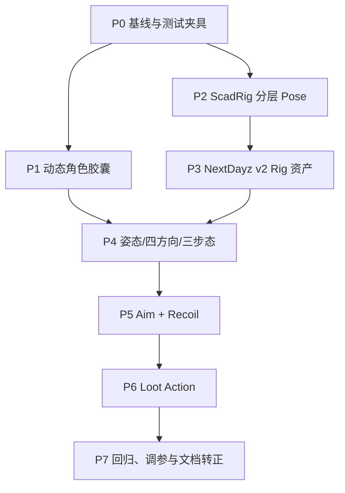

# NextDayz 复杂 3C 与 ScadRig 分层动画开发计划

> 本计划只描述尚未实现的工作。架构、状态所有权和混合语义以
> [复杂 3C 与 ScadRig 分层动画设计](nextdayz-3c-scadrig-design.md) 为准。后续 agent 应按阶段顺序交付，每阶段保持可编译、可测试、可回滚。

## 1. 执行原则

1. 开始前阅读：
   - 本计划；
   - [设计文档](nextdayz-3c-scadrig-design.md)；
   - [`AGENT_GUIDE/ScadRig.md`](../../../AGENT_GUIDE/ScadRig.md)；
   - 当前 `PlayerController`、`PlayerRigVisual`、`WeaponSystem`、`LootSystem` 和 `RigInstance` 实现。
2. 先运行 `git status --short`。工作树中的现有改动属于用户；不要覆盖或整理无关文件。
3. 不修改 `src/ThirdParty/`、`external/` 或生成的 `out/`。
4. `gnb build` 同步且必须串行等待完成；不得同时启动第二个 gnb/CMake/Ninja 构建。
5. 公共框架阶段先补测试再迁移 NextDayz；不要一边改 `FRigAnimator` 旧语义一边靠应用截图猜回归。
6. 玩法状态不依赖视觉对象。无 rig、clip 缺失或第一人称隐藏 rig 时，移动、射击和 loot 仍须完成。
7. 新增可调数值放进 `NextDayzConfig.hpp` 或 weapon/profile 数据，不散落 magic number。
8. 每完成一个阶段，记录实际改动、测试结果和未解决风险，交给下一位 agent；不要跨阶段顺手扩展 prone、reload animation 或 IK。

Windows 命令使用 `gnb.bat`；Linux/macOS 把它替换为 `./gnb.sh`。下文不重复列两套。

## 2. 阶段依赖



P1 和 P2 在代码依赖上可分别实现，但都改公共头/公共测试，建议由后续 agent 串行完成；至少不能并发构建同一个 Windows build tree。P3 以后严格按顺序。

## 3. P0 — 固化基线与测试入口

### 工作

1. 确认当前以下行为仍可运行：
   - NextDayz 加载 `riverland_1km.scad`；
   - W 移动、Shift 当前奔跑、V 切 TPS；
   - RMB ADS、LMB 开火、E 拾取；
   - 现有 `nextdayz-smoke` 通过。
2. 保存改动前 TPS/FPS 截图，作为“功能未退化”参考，不把截图加入 Git。
3. 在实现分层动画前运行现有 `[Rig]`、`[ScadRig]` 测试。
4. 记录当前 `next_ra_soldier.scad` 的骨骼/clip 数，后续确认旧资产完全未改。

### 验证

```powershell
gnb.bat build NextDayz gkNextUnitTests
out/build/windows/bin/gkNextUnitTests.exe "[Rig]"
out/build/windows/bin/gkNextUnitTests.exe "[ScadRig]"
gnb.bat validate --script assets/agentscripts/nextdayz-smoke.agentscript.json
```

### 完成标准

- 构建和现有回归结果已记录。
- 若基线本身失败，先报告，不把既有失败误归因于本计划。

## 4. P1 — 动态角色胶囊与站起净空检查

### 涉及文件

- `src/Engine/Runtime/Subsystems/NextPhysics.hpp`
- `src/Modules/NextPhysics/JoltPhysicsBackend.cpp`
- `src/Gameplay/Character/NextCharacterController.h`
- `src/Gameplay/Character/NextCharacterController.cpp`
- `src/Tests/Test_PhysicsSync.cpp`

### 工作

1. 给 `INextCharacterControllerBackend` 增加 `TrySetHeight` 和 `GetHeight`。
2. 给 `NextCharacterController` 增加 façade；只在成功后更新 cached settings。
3. 把 Jolt capsule 构造抽成一个足底锚定 helper，Create 和 Resize 共用。
4. 变矮与变高使用不同的 penetration 检查策略；变高失败不修改 shape。
5. 为参数下限、无 backend、相同高度 no-op 定义清楚的返回值。
6. 不重建 `CharacterVirtual`，不改现有 gravity/jump/update 语义。

### 测试

在 `Test_PhysicsSync.cpp` 增加 `[Integration][Physics][Character]`：

1. 从 standing 变 crouched 成功，足底 X/Y/Z 在容差内不变。
2. crouched 再变 standing 成功，实际高度恢复。
3. 头顶放静态 ceiling 时，crouch 成功、stand 返回 false、实际高度保持 crouched。
4. 移除/停用 ceiling 后，stand 重试成功。
5. 改变 shape 前后，角色仍能在 floor 上移动且不掉穿。

### 构建与验收

```powershell
gnb.bat build gkNextRenderer gkNextUnitTests CharacterDemo NextDayz
out/build/windows/bin/gkNextUnitTests.exe "[Integration][Physics][Character]"
```

验收不只看返回值；必须断言脚点与实际高度。

## 5. P2 — 通用 ScadRig Pose Mixer 与分层动画器

### 涉及文件

建议新增：

- `src/Gameplay/Rig/RigPose.h`
- `src/Gameplay/Rig/RigPose.cpp`
- `src/Gameplay/Rig/RigLayeredAnimator.h`
- `src/Gameplay/Rig/RigLayeredAnimator.cpp`

需要调整：

- `src/Gameplay/Rig/RigInstance.h`
- `src/Gameplay/Rig/RigInstance.cpp`
- `src/Tests/Test_RigAnimator.cpp`

不要修改 `.scad` loader DSL；`FRigAsset/FRigClip/FRigChannel` 当前数据已足够。

### 工作拆分

#### P2.1 Pose 采样

1. 建立与 `asset.bones` 对齐的 `FRigPose`，每个骨骼带 TRS authored bits。
2. 抽出 clip-at-time 采样；单 key、空 channel、loop/non-loop 必须与旧实现一致。
3. 抽出 bind-once apply；一次更新只递归刷新 root 一次。

#### P2.2 Bone mask

1. `FullBody`。
2. `FromSubtree(asset, rootBone)`。
3. 支持按 bone index 覆盖权重，用于 torso/head/arm 不同权重。
4. 未知 root 返回明确错误/空 mask，warning 只打印一次。

#### P2.3 Layer mixer

实现设计文档 §7.3 的精确语义：

- component-aware override；
- translation/rotation/scale additive；
- quaternion hemisphere 修正；
- layer weight × mask weight；
- 没写某 component 的上层不能清空下层。

#### P2.4 播放控制

1. loop blend 支持多个 weighted clip 共用 normalized phase。
2. sync group 切换 clip set 时保持 phase。
3. static blend 不推进时间。
4. manual blend 可由外部 normalized time 驱动，供权威 gameplay action timer 使用。
5. one-shot 支持 fade-in/fade-out、完成查询、同 clip 强制 restart。
6. layer 权重可平滑变化。
7. 缓存 clip/bone 解析结果，Update 热路径避免每帧字符串查找和无界分配。

#### P2.5 旧动画器兼容

旧 `FRigAnimator` API 和行为保持不变。可以内部复用新 sampler，但不要强迫现有消费端迁移。

### 单测清单

在 `Test_RigAnimator.cpp` 增加：

1. UpperBody override 改 arm，不改 leg。
2. Aim override 与 locomotion 同时存在。
3. Recoil additive 叠在 aim 结果之上，而不是替换 aim。
4. 上层 clip 未写 position 时，下层 position 保留。
5. 两方向 clip 以 0.5/0.5 混合得到确定 pose。
6. 换方向、换 gait 后 normalized phase 保持。
7. one-shot 同 clip 连续重触发会重新开始。
8. one-shot 完成后 layer 淡出，base pose 恢复。
9. rotation 混合不会因 quaternion 正负表示翻转。
10. 原有 `FRigAnimator` 的全部现有测试结果不变。

### 构建与验收

```powershell
gnb.bat build gkNextRenderer gkNextUnitTests AirportSim StudioSim CitySolSim ScadLibrary Brotato3D NextDayz
out/build/windows/bin/gkNextUnitTests.exe "[Rig]"
out/build/windows/bin/gkNextUnitTests.exe "[ScadRig]"
```

若改动 `RigInstance.h` 后出现消费端编译错误，必须在本阶段修完，不能留给 NextDayz 集成阶段。

## 6. P3 — NextDayz ScadRig v2 资产与资产契约测试

### 涉及文件

- 新增 `assets/scad/characters/nextdayz_survivor.scad`
- `src/Tests/Test_ScadRig.cpp`
- 可选：NextDayz 专用 animation profile 数据文件/头文件

### 工作

1. 按设计文档 §9 建 17 骨骼层级，至少有 pelvis、肘、膝、脚和空 `bone_weapon_socket`。
2. 从现有士兵造型迁移几何，但不要从 `next_ra_soldier.scad` 删除或改名任何内容。
3. 步枪不再烘焙在 torso；weapon socket 的 bind orientation 要有注释。
4. 制作全部必需 clip：
   - stand idle；
   - Walk/Run/Sprint × F/B/L/R；
   - crouch idle + crouch F/B/L/R；
   - aim down/center/up；
   - recoil；
   - loot ground。
5. 利用 SCAD helper function 生成镜像/相位变体，避免复制大段 key list；helper 先留在项目资产内。
6. 为每套 locomotion 记录 authored speed 和 duration 到 NextDayz animation profile。
7. 本阶段不要把运行中的 NextDayz 从旧资产切到 v2；现有单层 `PlayerRigVisual` 还不认识新 clip，生产路径切换留到 P4 原子完成。

### 资产单测

新增 `[ScadRig][NextDayz]` section：

- 骨骼全集存在，父子关系正确；
- `bone_weapon_socket` 即使无 geometry 也被 loader 保留；
- 必需 clip 全集存在；
- locomotion/idle 为 loop，recoil/loot 为 non-loop；
- 同 gait 四方向 duration 误差不超过 2%；
- locomotion 的 root 水平 position 不超过约定容差；
- recoil 第一/末帧接近 identity；
- 总三角形数落在明确预算内；
- 原有 `[ScadRig][NextRA]` 仍通过，证明旧资产未被替换。

### 视觉验收

先用 ScadLibrary rig preview 或临时 NextDayz debug clip selector 逐 clip 看一遍。重点检查：

- 蹲姿脚没有整体穿地；
- backward/strafe 的脚相位方向合理；
- aim 三姿态里武器 socket 和两只手相对稳定；
- recoil 开始/结束无 pose 跳变；
- loot 手能接近地面且结束回 neutral。

### 构建

```powershell
gnb.bat build gkNextUnitTests NextDayz
out/build/windows/bin/gkNextUnitTests.exe "[ScadRig][NextDayz]"
out/build/windows/bin/gkNextUnitTests.exe "[ScadRig][NextRA]"
```

## 7. P4 — NextDayz 姿态、四方向与三步态集成

### 涉及文件

建议新增：

- `src/Application/Game/NextDayz/Player/PlayerState.hpp`
- `src/Application/Game/NextDayz/Player/PlayerMovementPolicy.hpp`
- `src/Application/Game/NextDayz/Player/PlayerAnimationController.hpp/.cpp`

调整：

- `NextDayzConfig.hpp`
- `Player/PlayerController.hpp/.cpp`
- `Player/PlayerRigVisual.hpp/.cpp`
- `NextDayzGameInstance.hpp/.cpp`
- `assets/agentscripts/nextdayz-3c-locomotion.agentscript.json`

### 工作

#### P4.1 输入和配置

1. 将当前 `WalkSpeed/RunSpeed` 迁移为 StandWalk/StandRun/StandSprint/CrouchWalk。
2. 增加 stance height/eye height、方向速度系数、crossfade 和 authored speed 配置。
3. `C` 排队 crouch toggle，`Ctrl` 是 walk modifier，`Shift` 是 sprint modifier。
4. SDL 回调不再直接做姿态业务；one-frame command 在 Tick 尾部清除。

#### P4.2 PlayerController

1. 分开 desired/actual stance。
2. 实现站起净空失败和重试。
3. actual stance 驱动 camera eye height。
4. 按动作锁、stance、ADS、modifier 的优先级解析 gait。
5. 输出本地移动、实际速度、on-ground、stand-blocked snapshot。
6. 增加 `Pitch()` 查询，为 aim profile 准备。
7. 蹲姿 jump 按设计默认规则处理。

#### P4.3 Locomotion animation

1. 将 NextDayz rig 路径切到 `nextdayz_survivor.scad`，并让 `PlayerRigVisual` 从离散 `EAnimState` 切到 `FPlayerPresentationState`。
2. 建 Locomotion layer，按 stance/gait 选择四方向 clip set。
3. 用本地实际速度计算 F/B/L/R 权重；blocked 时逐渐回 idle。
4. gait、方向、stance 切换保持 sync phase。
5. 专用 clip 缺失时 warning + idle fallback，但 asset test 必须使正常发布路径不走 fallback。

#### P4.4 Agent queries

增加 design §11 中 stance/gait/localMove/baseAnim/controllerHeight/standBlocked 查询。

### 自动验证脚本

新脚本至少完成：

1. V 切 TPS。
2. C -> `game.stance == "crouched"`，controllerHeight 接近 crouch height，截图 crouch idle。
3. crouch 下分别 W/S/A/D，断言位置对应变化，截图至少保留 forward + strafe。
4. C 站起。
5. Ctrl+W -> gait walk。
6. W -> gait run。
7. Shift+W -> gait sprint，速度/位移增量顺序满足 walk < run < sprint。
8. Walk/Run/Sprint 分别覆盖一次 backward 和 strafe query/截图。
9. 构造或选择一个低顶验证场景，断言站起失败时 `standBlocked=true` 且 actual stance 仍 crouched。

低顶测试可优先放物理 integration test；应用脚本若地图没有稳定低顶点，不要靠脆弱坐标硬凑。

### 构建与验收

```powershell
gnb.bat build NextDayz gkNextUnitTests
out/build/windows/bin/gkNextUnitTests.exe "[Rig]"
out/build/windows/bin/gkNextUnitTests.exe "[ScadRig][NextDayz]"
gnb.bat validate --script assets/agentscripts/nextdayz-3c-locomotion.agentscript.json
```

完成标准是“物理状态、query 和 TPS pose 三者一致”，不是只看角色能移动。

## 8. P5 — 举枪瞄准与逐发后坐力

### 涉及文件

- `Weapons/WeaponDefs.hpp`
- `Weapons/WeaponSystem.hpp/.cpp`
- `Player/PlayerController.hpp/.cpp`
- `Player/PlayerRigVisual.hpp/.cpp`
- `Player/PlayerAnimationController.hpp/.cpp`
- `NextDayzConfig.hpp`
- `NextDayzGameInstance.hpp/.cpp`
- `assets/agentscripts/nextdayz-3c-combat.agentscript.json`

### 工作

#### P5.1 Aim layer

1. 从 `bone_torso` 构建 upper-body weighted mask。
2. 由 pitch 混合 aim down/center/up。
3. `aimWeight` 平滑进出；站姿、蹲姿、移动时都保持 locomotion。
4. ADS 时 gait 限制到 Walk；Sprint/loot 时 ADS 请求被解析为 false。
5. TPS 武器 node 挂 `bone_weapon_socket`，装备切换同步显隐；node 不参与 raycast。

#### P5.2 Shot event

1. 定义 `FShotEvent`，至少有 sequence、weapon id、camera impulse、view-model impulse、rig scale。
2. WeaponSystem 每发产生一个事件；删除或停用“单 bool 表示整帧开火”的主路径。
3. semi-auto release gate 和 full-auto cooldown 继续成立。
4. 若一次大 dt 跨过多个 fire interval，事件容器能表达多个 shot；设置合理每帧上限防止异常帧爆发。

#### P5.3 FPS recoil

1. 基础 look yaw/pitch 与 recoil offset 分离。
2. hitscan 使用 shot 前视线，随后施加 impulse。
3. camera spring 和 view-model spring 独立回正。
4. ADS/hip、不同武器读取不同 recoil profile。
5. AgentValidation 下 RNG/shot sequence 完全确定。

#### P5.4 TPS recoil

1. 每个 shot event 重触发 `recoil_rifle` additive layer。
2. recoil 不改变 leg/pelvis，不重启 locomotion phase。
3. 一次 recoil 结束后准确回到 aim + locomotion pose。

### 自动验证

脚本覆盖：

1. TPS standing idle ADS：`aimWeight` 达到阈值，截图。
2. ADS + W/A：gait 为 Walk，base locomotion 仍在，截图。
3. crouch ADS + movement：stance 保持 crouched，截图。
4. 单发：ammo -1、shotSequence +1、recoilActive=true，随后回 false。
5. AK 连发：ammo 递减多发，shotSequence 增量等于实际发数，不能只增加 1。
6. Fire 期间 `game.baseAnim`/locomotion phase 不被改成 fire。
7. FPS 截图确认 ADS 对齐；必要时 `--visible` 人工检查 camera kick，但自动断言不能只依赖肉眼。

### 构建与验收

```powershell
gnb.bat build NextDayz gkNextUnitTests
gnb.bat validate --script assets/agentscripts/nextdayz-3c-combat.agentscript.json
```

## 9. P6 — Loot reservation、动作锁与姿势

### 涉及文件

建议新增：

- `Player/PlayerActionController.hpp`
- `Player/PlayerActionController.cpp`

调整：

- `Inventory/LootSystem.hpp/.cpp`
- `Player/PlayerRigVisual.hpp/.cpp`
- `NextDayzConfig.hpp`
- `NextDayzGameInstance.hpp/.cpp`
- `UI/NextDayzHUD.*`
- `assets/agentscripts/nextdayz-3c-loot.agentscript.json`

### 工作

#### P6.1 LootSystem 两阶段提交

1. 将 `PickupHovered` 拆为 `ReserveHovered`、`Commit`、`Cancel`。
2. handle 至少带 node instance id 和 generation/index 校验，不能保留易失裸指针。
3. entry 状态为 Available/Reserved/Looted。
4. Reserved entry 不再成为 hover 候选；Cancel 恢复；Commit 只能执行一次。
5. 场景卸载会令所有 handle 失效，不能跨 scene commit。

#### P6.2 PlayerActionController

1. `TryBeginLoot` 启动权威 timer。
2. 输出 movement/aim/fire lock 和 `actionTime01`。
3. 到配置 commit 点只发一次 commit event。
4. commit 前移动/跳跃取消并 release reservation。
5. commit 后播放到结束，不回滚 inventory。
6. action 完成或取消后所有锁可靠释放。

#### P6.3 视觉

1. Action Layer 用 `actionTime01` 手动采样 `loot_ground` full-body override，不维护第二套视觉 timer。
2. 进入/退出有短 fade；Aim/Recoil 主动淡出。
3. FPS view model 下压/隐藏；TPS 展示完整 loot。
4. clip 缺失时 timer 和 Commit 仍完成，日志说明视觉 fallback。
5. HUD 在 Reserved/Action 中显示 `Looting…`，不继续显示可重复 E 提示。

### 自动验证

1. E 后 action 立即变 `loot_ground`，但 commit 点前 inventory/lootRemaining 不变。
2. commit 点后 inventory 增加、lootRemaining 减少、源节点隐藏。
3. E 后 commit 前移动取消，inventory 不变且 entry 可再次 hover。
4. loot 中 RMB/LMB/Shift 不进入 ADS、不开火、不冲刺。
5. 无 rig fallback（可通过测试注入或缺 clip fixture）仍 commit。
6. TPS 截图至少覆盖动作中段。

### 构建与验收

```powershell
gnb.bat build NextDayz gkNextUnitTests
gnb.bat validate --script assets/agentscripts/nextdayz-3c-loot.agentscript.json
```

## 10. P7 — 回归、调参与文档转正

### 回归矩阵

| 类别 | 必过内容 |
| --- | --- |
| Physics | crouch/stand、低顶失败、足底不跳、移动正常 |
| ScadRig legacy | 旧 sampling/crossfade/phase；AirportSim 等消费端编译 |
| ScadRig layered | mask、override、additive、sync phase、one-shot restart |
| Asset | NextDayz 必需骨骼/clip；NextRA 旧资产不变 |
| Locomotion | 站姿 3 gait × 4 direction；蹲姿 idle + 4 direction |
| Combat | stand/crouch/move ADS；每发 camera/view-model/TPS recoil |
| Loot | reserve/cancel/commit；动作锁；无视觉仍完成 |
| Existing MVP | inventory、换弹、切枪、昼夜、FPS/TPS、旧 smoke |

### 最终命令

```powershell
gnb.bat build gkNextRenderer gkNextUnitTests NextDayz CharacterDemo AirportSim StudioSim CitySolSim ScadLibrary Brotato3D
out/build/windows/bin/gkNextUnitTests.exe "[Integration][Physics][Character]"
out/build/windows/bin/gkNextUnitTests.exe "[Rig]"
out/build/windows/bin/gkNextUnitTests.exe "[ScadRig]"
gnb.bat validate --script assets/agentscripts/nextdayz-smoke.agentscript.json
gnb.bat validate --script assets/agentscripts/nextdayz-3c-locomotion.agentscript.json
gnb.bat validate --script assets/agentscripts/nextdayz-3c-combat.agentscript.json
gnb.bat validate --script assets/agentscripts/nextdayz-3c-loot.agentscript.json
```

构建命令必须逐个等待，不并发。只有在公共 ABI/header 影响面超出上述目标或出现无法判断的消费端时，才执行：

```powershell
gnb.bat build --all --reconfigure
```

### 视觉 QA

用 `gnb validate` 中的 screenshot 步骤获取具体动作状态；`gnb shot` 只能取稳定帧，不适合验证按键后的 crouch/recoil/loot 中间态。

必要时补一次：

```powershell
gnb.bat validate --script assets/agentscripts/nextdayz-3c-combat.agentscript.json --visible
```

`--visible` 会显示窗口，应先告知用户。普通自动回归使用隐藏模式。

### 文档收尾

全部实现后：

1. 更新 `AGENT_GUIDE/ScadRig.md`，把 layered animator、bone mask、one-shot 和兼容入口写成当前用法。
2. 将 [设计文档](nextdayz-3c-scadrig-design.md) 的状态改为“现行架构”，用实际类名替换提案名。
3. 更新 `nextdayz-mvp-design.md` 顶部说明：MVP 已实现，复杂 3C 以新设计为准。
4. 本 plan 完成后按 `docs/README.md` 生命周期规则退出“现行”索引；先把仍有效的验收契约提炼进 design/guide。
5. 不把一次性截图、构建日志或旧行号写进长期 design。

## 11. 每阶段交接模板

后续 agent 完成一个阶段时，至少交接：

```text
阶段：
实现：
改动文件：
兼容性：
执行的构建/测试及结果：
尚未执行的验证：
已知风险：
下一阶段可依赖的不变量：
```

不要只写“build passed”；例如 P1 必须明确“低顶站起返回 false，脚点不变”，P2 必须明确“旧 FRigAnimator 测试未变且 additive/mask 新测试通过”。
