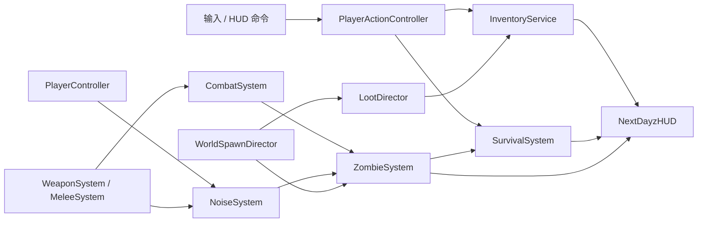

# NextDayz PVE 生存循环产品化设计

本文记录 `NextDayz` 单人 PVE 生存纵切的现行产品边界、运行时架构和验收契约。2026-08-02 已完成配套开发计划：容量化库存、生存代谢与水源、语义刷新点、感染者 AI/战斗/噪声、物资刷新、产品 HUD、死亡与同进程重开均已接入。复杂移动、ScadRig 分层动画的现行约束仍以 [复杂 3C 与 ScadRig 分层动画设计](nextdayz-3c-scadrig-design.md) 为准。

## 1. 决策摘要

首个产品化版本是一局可重复游玩的单人 PVE 生存沙盒：玩家低配出生，必须在 1 km² Riverland 地图中寻找食物、饮水、衣物、背包、近战武器、枪械和弹药，管理饥饿、口渴、生命与容器容量，躲避或击杀由世界规则刷新的感染者，死亡后可重新开始一局。

本期不做 PVP、联机同步、基地建造、载具、疾病、体温、复杂创伤、物品耐久和跨局持久化。它们不能阻塞“出生 → 搜刮 → 管理容量与生存值 → 遭遇感染者 → 战斗/逃跑 → 补给 → 死亡或继续生存”这一条主循环。

## 2. 实施基线（2026-07-31 历史快照）

本节保留产品化前的差距快照，用于解释后续架构取舍；不代表 2026-08-02 之后的当前能力。现行实现以本设计后续契约、代码和新增 `[NextDayz]` 测试为准。

### 2.1 已经可直接复用

| 能力 | 当前实现 | 结论 |
| --- | --- | --- |
| 地图与 POI | `riverland_1km.scad`，含村庄、加油站、碉堡、军事基地、小镇、工厂、通信站、坠机点和湖畔营地 | 世界空间和基础物资分布已足够支撑纵切 |
| 玩家 3C | FPS/TPS、站立/蹲伏、走/跑/冲刺、跳跃、翻越/攀爬、相机碰撞和输入锁 | 不重写，只在受伤、死亡、使用物品时增加状态门控 |
| 玩家表现 | `nextdayz_survivor.scad`、分层移动、瞄准、后坐力、换弹、切枪和搜刮动作 | 可扩展使用物品、近战和死亡动作 |
| 枪械 | 5 把枪、双武器槽、ADS、射速/散布、弹匣/备弹、换弹、后坐力和视图模型 | 目前射线只命中场景并做表现，不会对目标造成伤害 |
| 搜刮 | 场景节点扫描、59 个现有拾取点、瞄准与距离判定、两阶段 `Reserve → Commit`、拾取后隐藏节点 | 可保留交互事务语义，但没有容量拒绝和重新刷新 |
| 物品/装备 | 武器、弹药、服装、杂物字符串栈；头盔和背包有 TPS 附件 | `kMaxSlots=256` 只是防失控，不是玩法容量；食物、药品不能使用 |
| 世界时间 | 昼夜循环、阴天天候和 HUD 时钟 | 生存代谢必须与视觉昼夜时标解耦 |
| 验证 | smoke、locomotion、aim/recoil、loot、weapon UI agentscript；大量 `game.*` 查询 | 可在原有脚本上增加确定性的生存闭环验证 |

### 2.2 现有循环的终点

当前玩家出生即获得满弹 AK 和 60 发备弹；地图物品被拾取后永久隐藏；罐头、医疗包、绷带、背包和头盔只会进入列表或切换附件。世界里没有可受伤对象，玩家也没有生命、饥饿、口渴、受伤、死亡或重开状态。因此目前是“移动/搜刮/枪械手感陈列”，还不是生存游戏循环。

### 2.3 必须补齐的产品缺口

1. 可受伤、死亡、重开的玩家生存状态。
2. 有容量贡献的衣物/背包与受容量约束的物品事务。
3. 食物、饮水、治疗物品及使用动作。
4. 可寻路、感知、追击、攻击、受伤、死亡和回收的感染者。
5. 枪械/近战命中感染者、噪声吸引感染者的战斗闭环。
6. 按 POI 类型、玩家距离、视线和全局预算刷新的感染者与物资。
7. 面向玩家而非开发者的 HUD、库存、死亡和重开界面。

### 2.4 现状证据入口

- [NextDayzGameInstance.cpp](../../../src/Application/Game/NextDayz/NextDayzGameInstance.cpp)：系统编排、开局 AK/60 发备弹、输入、HUD snapshot 和 agent queries；
- [Inventory.hpp](../../../src/Application/Game/NextDayz/Inventory/Inventory.hpp)：当前字符串栈、服装 ID 列表和仅防失控的 256 项上限；
- [LootSystem.cpp](../../../src/Application/Game/NextDayz/Inventory/LootSystem.cpp)：场景节点映射、reservation/commit 和拾取后隐藏；
- [WeaponSystem.cpp](../../../src/Application/Game/NextDayz/Weapons/WeaponSystem.cpp)：CPU hitscan、弹药和后坐力；命中结果没有进入伤害系统；
- [NextDayzConfig.hpp](../../../src/Application/Game/NextDayz/NextDayzConfig.hpp)：只有 3C、枪械表现、loot 距离和昼夜参数，没有生存/感染者配置；
- [nextdayz-smoke.agentscript.json](../../../assets/agentscripts/nextdayz-smoke.agentscript.json)：当前 59 个 loot、枪械、拾取、TPS 和天候基线。

## 3. 产品目标与一局体验

### 3.1 目标体验

- 首次进入后 60 秒内找到第一件可用补给或近战武器。
- 3～5 分钟内出现第一次可规避的感染者遭遇。
- 8～12 分钟内形成一次“容量取舍”：丢弃低价值物品、换穿衣物或寻找背包。
- 15～20 分钟内至少完成一次枪械战斗、补充食物/饮水并迁移到另一个 POI。
- 空手玩家始终可以逃跑；感染者不能在玩家眼前凭空出现，也不能无限追踪全地图。
- 玩家死亡有明确原因，重开不需要重启进程。

### 3.2 开局与软目标

默认开局不再赠送 AK。玩家只获得基础衣物容器、一个绷带和一个空水瓶，出生在村庄或加油站外围的安全点。HUD 依次给出不强制的软目标：

1. 找到饮水或水井；
2. 找到食物；
3. 找到背包或大容量衣物；
4. 找到近战武器或枪械与匹配弹药；
5. 前往高风险 POI 获取高级物资。

完成软目标不会结束游戏；它只负责把新玩家带入可持续沙盒循环。

### 3.3 明确不做

- PVP、联机服务器、反作弊和网络预测；
- 温度、疾病、血型、骨折、复杂出血和药理；
- 武器耐久、卡壳、附件改装和弹匣逐颗装填；
- 基地建造、车辆、耕作、狩猎和跨局存档；
- 大规模感染者群。首版全图活跃上限以 24～32 只为目标。

## 4. 总体架构

`NextDayzGameInstance` 继续只负责编排。新增系统之间通过小型事件传递，不允许 `WeaponSystem` 直接持有感染者容器，也不允许 HUD 修改业务成员。



建议目录：

```text
src/Application/Game/NextDayz/
├── Data/
│   ├── ItemDefs.{hpp,cpp}
│   ├── ZombieDefs.{hpp,cpp}
│   └── WorldProfiles.{hpp,cpp}
├── Combat/
│   ├── CombatEvents.hpp
│   ├── CombatSystem.{hpp,cpp}
│   └── NoiseSystem.{hpp,cpp}
├── Inventory/
│   ├── Inventory.{hpp,cpp}
│   ├── InventoryTransactions.{hpp,cpp}
│   └── LootSystem.{hpp,cpp}
├── Player/
│   ├── SurvivalSystem.{hpp,cpp}
│   └── PlayerActionController.{hpp,cpp}
├── World/
│   ├── WorldAnchorRegistry.{hpp,cpp}
│   ├── LootDirector.{hpp,cpp}
│   └── ZombieSpawnDirector.{hpp,cpp}
├── Zombies/
│   ├── ZombieSystem.{hpp,cpp}
│   ├── ZombieAI.{hpp,cpp}
│   └── ZombieVisualPool.{hpp,cpp}
└── UI/
    ├── NextDayzHUD.{hpp,cpp}
    └── InventoryScreen.{hpp,cpp}
```

纯数据和纯规则文件应加入 `gkNextUnitTests`；场景、物理、渲染和输入留在应用集成测试中。

## 5. 物品、衣物与容量

### 5.1 从字符串栈迁移到物品实例

每个物品定义使用稳定字符串 ID；运行时实例使用单调递增的 `instanceId`。可堆叠物品仍以栈保存，但枪械、衣物、背包和近战武器必须是离散实例。

```text
FItemDef
  id / displayName / kind
  volumePerUnit / maxStack
  equipSlotMask
  containerCapacity（非容器为 0）
  hungerDelta / hydrationDelta / healthDelta
  weaponDefId / worldVisualId

FItemInstance
  instanceId / defId / count
  containerId
  loadedAmmo（仅枪械）
```

首版容量使用整数“格”而不是公斤：一格是 UI 和平衡单位，不承诺真实体积。示例初值：绷带 1、罐头 2、水瓶 2、手枪 4、长枪 10、弹药栈 1～2。

### 5.2 容器模型

固定装备槽：头部、躯干、腿部、背部、主武器、副武器、手持。可储物容器包括：

| 容器 | 初始容量 | 说明 |
| --- | ---: | --- |
| 基础上衣口袋 | 6 | 开局拥有，不可丢弃的最低保障 |
| 基础裤袋 | 4 | 开局拥有 |
| 夹克 | 10～14 | 替换躯干衣物后提供容量 |
| 工装裤 | 8～12 | 替换腿部衣物后提供容量 |
| 小/中型背包 | 16 / 28 | 背部槽，TPS 显示现有 backpack 附件 |
| 武器肩带 | 2 个离散槽 | 不占普通格，只接受长枪 |

首版不允许容器嵌套。脱下容器前必须把内部物品转移到其他有空间的容器；无法转移时事务失败并显示缺少多少格。拾取也必须先执行 `CanAdd`，不能出现“地上物品消失但背包没收到”的情况。

### 5.3 事务不变量

- `TryAdd/TryMove/TrySplit/TryConsume/TryEquip/TryUnequip/Drop` 要么完整成功，要么不改变任何状态。
- 栈拆分和合并后总数量守恒。
- `usedCapacity <= capacity` 永远成立。
- 枪械弹匣状态属于枪械实例，备弹属于库存栈。
- 换装导致容量减少时，必须先通过容量预检。
- Loot 的 `Commit` 只有在库存事务成功后才能隐藏世界节点；容量不足则取消预留并保持世界物品可见。

## 6. 生存状态与消耗品

### 6.1 首版状态

```text
health      0..100
hunger      0..100（100 为饱足）
hydration   0..100（100 为充分饮水）
```

饥饿和口渴使用真实仿真秒推进，不跟随 `TimeSystem::TimeScale`。按 T 跳过视觉时间不会瞬间饿死玩家。基准调参目标：静止状态饥饿约 45 分钟从满值降到零，口渴约 30 分钟；冲刺分别加速 25% 和 60%。低于 20 时给出提示，降到 0 后以可感知但不瞬杀的速度扣除生命。

感染者攻击直接扣生命，并使用约 0.35 秒受击保护避免一帧内多次结算。首版不做出血；绷带可改为小额治疗物品，以保留现有地图资源的用途。

### 6.2 使用动作

食用、饮用、治疗均走 `PlayerActionController`：开始时锁移动/开火，提交点消费物品并应用效果，提交前被攻击或移动可取消，提交后动画缺失也不能回滚业务结果。该语义沿用现有 Loot 两阶段提交。

新增基础物资：罐头、饮用水瓶、空水瓶、绷带、医疗包。`cw_prop_well` 是无限水源，但饮用需要 2 秒动作；空瓶可在水井补满。燃油桶不能饮用。

### 6.3 死亡与重开

生命归零进入 `Dead`，立即停止移动、攻击、拾取和 AI 仇恨更新，播放死亡反馈并显示本局存活时间、击杀数、访问 POI 数。玩家选择“重新开始”后重置运行时世界、库存、刷新计时和 RNG，重新部署而不重启可执行文件。

首版不做死亡掉落和尸体回收，避免在持久世界尚不存在时引入半套规则。

## 7. 世界语义、物资刷新与水源

### 7.1 地图标记契约

现有拾取物节点继续作为首轮物资点。为感染者和可随机化物资增加只表达类别的 SCAD 标记模块；模块名携带 profile，世界变换携带位置，不依赖解析 SCAD 参数：

```text
nd_spawn_player_safe
nd_spawn_zombie_civilian
nd_spawn_zombie_military
nd_spawn_zombie_industrial
nd_spawn_zombie_wilderness
nd_spawn_loot_residential
nd_spawn_loot_medical
nd_spawn_loot_military
nd_spawn_loot_industrial
```

标记可使用极小的调试几何，运行时扫描后必须隐藏、关闭 raycast，并只在 F5 世界调试中显示。不要把 POI 坐标硬编码进 C++。

### 7.2 POI 配置

| POI | 物资侧重 | 感染者 profile | 风险/回报 |
| --- | --- | --- | --- |
| 西部村庄 | 食物、水井、基础衣物、猎枪 | civilian | 新手区，低密度 |
| 桥西加油站 | 医疗、燃油、杂物 | civilian / industrial | 交通节点，中低风险 |
| 桥东碉堡 | 弹药、头盔、步枪 | military | 小范围高风险 |
| 军事基地 | 自动步枪、狙击枪、弹药、背包、医疗 | military | 最高密度与最长刷新 |
| 东南小镇 | 食物、水、衣物、手枪、医疗 | civilian | 高密度但补给全面 |
| 河畔工厂 | 工具、近战武器、猎枪、杂物 | industrial | 中风险 |
| 通信站/坠机点 | 无线电、高级枪械、医疗 | military | 少量强感染者 |
| 湖畔营地 | 食物、饮水、基础猎枪 | wilderness | 低密度、路程长 |

### 7.3 LootDirector

每个刷新槽具有 `Available / Reserved / Cooldown` 三态、profile、最近一次消费时间和稳定 seed。首轮可沿用场景中 59 个物品；后续刷新从所在 profile 的加权表选择。

刷新约束：

- 玩家距槽位至少 60 m，且槽位离开相机视锥/视线至少 20 秒；
- 同一 POI 和全图都受 category 上限控制；
- 食物/饮水基准 8～15 分钟，医疗 12～20 分钟，弹药 15～25 分钟，枪械 30～45 分钟；
- 时间使用独立 world simulation clock，不因昼夜快进被批量刷新；
- 读取稳定 seed，在 agent-validation 下同一局产生同一序列；
- 场景重载和重开必须使旧 `FLootHandle` 失效。

若首期随机世界模型成本过高，可让槽位只重生原类别与原外观，但状态机和 profile 接口必须一次建对。

## 8. 感染者系统

### 8.1 运行时状态

每个感染者使用带 generation 的稳定 handle，保存 pool slot、profile、生命、位置、状态、目标最后可见位置、路径、攻击/受击计时和所属刷新点。建议状态：

```text
Dormant → Wander → Investigate → Chase → Attack
                    ↑              ↓       ↓
                    └──── Lost ────┘    Stagger
                                          ↓
                                         Dead → Recycle
```

### 8.2 感知与行为

- 视觉：35 m 基准距离、约 110° 水平视野，并通过 CPU raycast 验证无遮挡；
- 听觉：冲刺脚步、小型近战、手枪、步枪/霰弹枪产生不同半径的 `FNoiseEvent`；
- 追击：目标移动超过 2 m 或 0.6 秒后才重算路径，不能每帧 A*；
- 丢失：失去视线后前往最后已知位置，搜索 6～10 秒后返回巡逻；
- 攻击：进入约 1.25 m，0.45 秒前摇，命中时再次校验距离和朝向，随后约 1.1 秒冷却；
- 群体：只做局部软分离，不做队形和群体寻路。

感染者移动使用 NextGameplay `FNavGrid/FPathFollower` 思路，但不能直接用 `FCharacterPool` 的默认 0.45 m 全场网格；1 km² 地图首版使用约 1.5～2.0 m cell，并按玩家附近 active bubble 更新。河流需通过 `TerrainComponent::IsWater` 或等价语义屏蔽，桥面保持可走。

### 8.3 刷新规则

- `ZombieSpawnDirector` 每 2 秒评估一次，不在每帧扫描所有点；
- 全图活跃上限 24，压力测试上限 32；每个 POI 通常 2～6；
- 生成点距玩家 35～140 m、不可在视线内、必须可导航到所在 POI；
- 玩家 180 m 外、未警觉且持续 30 秒的感染者可回收；尸体展示 20～30 秒后回收；
- 同一刷新槽死亡后冷却 8～15 分钟，且玩家离开该 POI 后才可重生；
- 军事/工业/平民 profile 先只改变生命、速度、感知和外观色，不引入特殊技能。

### 8.4 视觉与命中代理

新增 `nextdayz_infected.scad`，最少提供 idle、walk、run、attack、hit、die 六个 clip，并遵守现有 ScadRig 部件预算。视觉对象池启动时一次创建，运行中只 Acquire/Release。

枪械命中不能依赖字符串猜测。感染者实例化时把所有可命中的 render node instance ID 注册到 `FHitProxyRegistry`，映射为 `{zombieHandle, hitZone}`。若动态 ScadRig 在 CPU acceleration structure 中的射线更新不能稳定通过技术尖刀，则退化为每只感染者一个跟随身体的低成本 kinematic capsule 命中代理；这项验证必须在开发第一阶段完成。

## 9. 战斗、噪声与伤害

### 9.1 统一命中事件

`WeaponSystem` 继续负责射击手感和弹药，只产出 `FWeaponHitEvent`：武器 ID、射手、射线起点/方向、命中 instance ID、命中点、基础伤害、序号。`CombatSystem` 解析命中代理、距离衰减和 hit zone，并调用 `ZombieSystem::ApplyDamage`。

推荐初始伤害语义：头部 2.0 倍、躯干 1.0 倍、四肢 0.65 倍；具体枪械伤害写入 `FWeaponDef`，不能散落在系统代码中。霰弹枪产生固定数量 pellet trace，并限制同一目标单发最大伤害，保证可调试。

### 9.2 近战

首版至少加入刀/斧或撬棍之一，使无枪开局可完成战斗。近战使用相机前方短距离 sweep/ray、攻击前摇、明确冷却和一次命中集合；一次挥击不能在多帧重复伤害同一目标。近战噪声远小于枪声，但会吸引近处感染者。

### 9.3 噪声总线

噪声是瞬时数据，不进入场景 ECS。每个事件包含位置、半径、强度、类型和序号；ZombieAI 在感知 tick 消费当前/最近事件。枪械半径示例：手枪 55 m、步枪 110 m、霰弹枪 130 m；数值由调参决定，不绑定渲染音效。

## 10. 玩家界面

### 10.1 常驻 HUD

- 左下：生命、饥饿、口渴三项图标/短条，仅在变化或低值时提高可见度；
- 右下：当前武器、射击模式、弹匣/备弹、双武器槽；
- 中央：准星、交互提示、容量不足/动作取消的短时反馈；
- 顶部：只在新手阶段显示当前软目标；
- 受伤、饥渴临界和感染者命中使用短时边缘反馈，不常驻大段文字。

### 10.2 库存界面

库存打开时显示 Nearby、角色装备和各容器三列。每个容器显示 `已用/总容量`；支持点击移动和 ImGui drag/drop，操作最终都调用同一事务 API。世界继续渲染但暂停玩家移动和攻击；单人首版可选择暂停感染者仿真，默认建议不暂停以保留风险，并在 UI 上明确提示。

### 10.3 局外状态

增加轻量开始页、暂停菜单、死亡总结和重新开始按钮。F5 才显示现有位置、动画、AI、刷新预算等开发面板；发布默认不显示 `NextDayz Debug`。

## 11. 确定性与可观察性

新增启动级 `nextdayz.seed`，所有物资 roll、感染者刷新和行为抖动从局 seed 派生，禁止各系统用当前时间独立播种。逻辑状态至少暴露：

```text
game.runState
game.health / hunger / hydration
game.inventoryUsed / inventoryCapacity
game.activeZombies / alertedZombies / zombieKills
game.lastDamageSource / lastHitZombie
game.lootAvailable / lootCooldown
game.currentObjective
```

测试钩子可以设置生存值、传送到命名测试点或强制导演评估，但只能在 agent-validation 下注册为命令，正常游戏不能暴露作弊入口。

## 12. 性能预算

| 项目 | 首版预算 |
| --- | --- |
| 活跃感染者 | 默认 24，压力上限 32 |
| 感染者决策 | 5～10 Hz 分桶；视觉每帧插值 |
| A* 重算 | 每只最多约 1.5 次/秒，跨帧分桶 |
| 刷新导演 | 0.5 Hz |
| Loot 槽位 | 当前 59 个起步，目标不超过 128 |
| 感染者 render proxy | 进入现有 32,767 可见代理预算前必须实测记录 |
| 热路径分配 | 感知、命中、AI tick 不做无界 vector 扩容 |

## 13. 产品化完成标准

以下条件全部满足才算跑通 PVE 生存循环：

1. 默认开局无 AK，玩家可找到并装备近战武器或枪械与匹配弹药。
2. 背包/衣物真实改变容量；容量不足时拾取、换装和移动事务均正确拒绝。
3. 饥饿和口渴随真实仿真时间下降，食物、水瓶和水井可恢复，归零会伤害生命。
4. 感染者只在语义正确的 POI、玩家视线外和安全距离外刷新，能够巡逻、听声、追击、攻击、丢失目标、死亡和回收。
5. 枪械和近战均可伤害感染者；枪声会改变附近感染者行为；感染者可伤害并杀死玩家。
6. 被消费物资按 profile、冷却、距离和全局预算重新出现，不发生眼前刷新。
7. HUD/库存/死亡/重开构成一条无开发面板依赖的用户流程。
8. 一条确定性 agentscript 能完成“搜刮饮水和食物 → 扩容 → 获取武器 → 击杀感染者 → 消耗补给 → 观察刷新冷却”的闭环。

## 14. 主要风险与降级

| 风险 | 预警信号 | 降级方案 |
| --- | --- | --- |
| 1 km² NavGrid 构建过慢/占用过高 | 首次加载明显停顿或内存暴涨 | cell 提到 2 m；只覆盖 POI 走廊；分区网格，不退回逐帧物理寻路 |
| 动态 ScadRig CPU 射线命中不稳定 | 可见命中与 instance ID 不一致 | 使用跟随的 kinematic capsule 代理，视觉只做表现 |
| 感染者在建筑内卡死 | repath/停滞计数持续增长 | 首版刷新点放在可达入口/庭院；超时回收到所属刷新点，不瞬移到玩家附近 |
| 物资经济失控 | 食物永久过剩或软锁死 | profile 上下限、保底计时和 director 统计；不通过全图统一随机率硬调 |
| 库存迁移破坏现有枪械逻辑 | 换弹丢弹或枪械复制 | 先建事务单测与兼容适配层，再迁移 WeaponSystem |
| UI 范围膨胀 | drag/drop 阻塞核心循环 | 先交付点击移动与容量反馈；拖拽是同一事务 API 的第二表现入口 |
