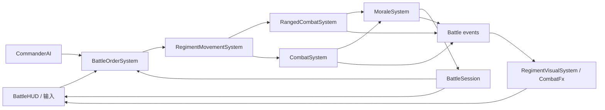

# NextTotalwar 基础战斗循环产品化设计

本文记录 `NextTotalwar` 可独立游玩的单场战斗纵切之现行产品边界、运行时架构和验收契约。2026-08-02 已完成配套开发计划：数据驱动 scenario、蓝军所有权、统一订单、士气/溃逃/重整、弓兵齐射、Commander AI、BattleSession、产品 HUD、胜负与同进程重赛均已接入。[行军、地图与大规模表现约束](nexttotalwar-mvp-design.md) 解释战场、编队和渲染契约；代码地图与当前数据流见 [NextTotalwar 代码导览](../../AGENT_GUIDE/NextTotalwar.md)。

## 1. 决策摘要

首个产品化版本是一场 12 个蓝方军团对 12 个红方军团的单人即时战术战斗。玩家只控制蓝方；确定性 Commander AI 控制红方。玩家通过选择、编队、移动、攻击、冲锋、停止和撤退命令，利用矛兵、剑兵、弓兵的角色差异、地形、侧背和士气击溃对手。战斗具备准备、进行、暂停、胜负结算和原地重开流程，并使用面向玩家的战场 HUD 取代默认调试面板。

本期不做战役地图、城镇经营、外交、攻城、骑兵、多人联机、录像系统和复杂弹道物理。弓兵远程齐射属于基础兵种闭环，必须纳入本期。

## 2. 实施基线（2026-07-31 历史快照）

本节保留产品化前的差距快照，用于解释后续架构取舍；不代表 2026-08-02 之后的当前能力。现行实现以本设计后续契约、代码导览和 `[NextTotalwar]` 测试为准。

### 2.1 已经完成的基础

| 能力 | 当前实现 | 产品化判断 |
| --- | --- | --- |
| 战场 | 400×400 m `greenfield_400.scad`、河流/桥、TerrainComponent 与 2 m NavGrid | 可作为首发单场景 |
| 规模 | 双方各 12 个 regiment、每队 100 人，共 2,400 人 | 保留为压力与视觉规模基线 |
| 兵种/表现 | 矛兵、剑兵、弓兵；每兵 6 个共享 part；idle/walk/march/run/attack/die | 资产覆盖近战与死亡，弓箭齐射表现仍缺 |
| 相机 | WASD/MMB 平移、Q/E 旋转、滚轮缩放、跟随选中 | 基础可用，仍缺边缘滚屏和输入设置 |
| 选择 | 点选、框选、Shift 加选、双击同兵种、底部军团按钮 | 当前双方都可选，必须建立玩家阵营边界 |
| 命令/行军 | RMB 拖出目标与朝向、多部队最短分配、A*、过桥语义 waypoint、阵型重整、排数调整 | 是产品化命令层的基础，但目前只有“移动” |
| 近战 | 20 Hz 固定 tick、军团接战、空间网格配对、1 对多攻击槽、攻防命中、侧背/冲锋加成字段、减员 | C0/C1 主体已经实现 |
| 战斗表现 | 受击闪白、死亡 clip、尸体、256 个血迹池 | C2 主体已经实现 |
| 自动验证 | formation/combat/camera 单测与 select/march/camera/battle agentscript | 现成单测基线为 19 个 `[NextTotalwar]` case、4,238 个断言通过 |

### 2.2 只存在数据或半成品的能力

- `morale` 初始化并显示，也会在低于 40 时影响攻击，但没有任何系统修改它。
- `Charging/Route/Rally/Routing` 枚举和事件已定义，玩家命令和系统没有完整状态迁移；当前冲锋窗口通常不会由正常输入触发。
- 弓兵拥有独立数值和 rig，但按弱近战兵参战，没有射程、弹药、齐射或远程命令。
- 战斗能够在军团接触后自行结算，但没有统一胜负判定、战斗阶段、结果页和重开流程。
- UI 能显示军团、性能、调参和血条，但以开发面板为主，底部同时列出蓝红双方单位卡。

### 2.3 完全缺失的能力

1. 敌方 Commander AI；
2. 玩家阵营所有权与敌军不可选规则；
3. Attack/Charge/Halt/Withdraw 等语义命令；
4. 士气、动摇、溃逃、集结与胜负；
5. 弓兵远程战斗；
6. 准备/进行/暂停/结束/重开 session；
7. 面向玩家的战场顶部栏、单位卡、命令栏、兵牌、提示和结算页。

### 2.4 现状证据入口

- [NextTotalwarGameInstance.cpp](../../../src/Application/Game/NextTotalwar/NextTotalwarGameInstance.cpp)：24 队部署、行军/选择/输入、固定 tick 编排、当前调试 HUD 和全部 agent queries；
- [NextTotalwarTypes.h](../../../src/Application/Game/NextTotalwar/NextTotalwarTypes.h)：`morale`、Charging/Routing 等预留状态和当前军团/士兵数据；
- [CombatSystem.cpp](../../../src/Application/Game/NextTotalwar/Battle/CombatSystem.cpp)：接战、空间配对、命中、伤害、死亡和 Destroyed；没有士气推进或 AI；
- [NextTotalwarCombatConfig.hpp](../../../src/Application/Game/NextTotalwar/NextTotalwarCombatConfig.hpp)：三兵种当前近战数值和 combat tuning；
- [Test_NextTotalwarCombat.cpp](../../../src/Tests/Test_NextTotalwarCombat.cpp)：确定性近战、攻击弧、接战、脱战和一对多槽位测试；
- [nexttotalwar-battle.agentscript.json](../../../assets/agentscripts/nexttotalwar-battle.agentscript.json)：当前减员、尸体、追击/脱战和可见预算基线。

## 3. 产品目标与战斗循环

### 3.1 一局流程

```text
Briefing → Deployment → ActiveBattle ↔ Paused → Victory/Defeat → Rematch
```

- Briefing：显示场景目标、双方兵力和三兵种简短说明。
- Deployment：蓝方可在己方部署区调整位置、朝向和阵型深度；红方由 scenario/AI 部署。点击“开始战斗”后锁定部署区规则。
- ActiveBattle：玩家侦察、选军团、布阵、接战、侧击、远程压制并处理溃逃；AI 同步下令。
- Paused：单人战斗允许暂停后下令；恢复时命令进入统一队列。
- Victory/Defeat：一方失去所有可作战军团后结算，显示伤亡、击杀、溃逃、战斗时长并允许同 seed 重开或新 seed 再战。

### 3.2 基础战术选择

- 矛兵：高防、较长近战距离，适合正面固定战线；
- 剑兵：攻击与冲锋较强，适合突破和侧背；
- 弓兵：在 30～55 m 保持距离齐射，近战脆弱、弹药有限；
- 阵型深度：窄而深更适合穿越和承受冲击，宽而薄覆盖正面但更易被突破；
- 士气：伤亡、侧背、局部劣势和友军溃逃可比单纯全歼更快结束战斗。

### 3.3 产品验收目标

- 不下令的玩家会被 Normal AI 在合理时间内击败，证明对手能独立完成战斗循环。
- 玩家能通过至少两种战术取得明显优势：远程消耗后接战、正面牵制加侧背冲锋。
- 一场标准战斗目标时长 8～15 分钟；结果由指挥和 seed 共同决定，不在开战数十秒内随机雪崩。
- 从启动到再战全程不需要打开 F5 或重启进程。

## 4. 产品化架构

当前 `NextTotalwarGameInstance.cpp` 同时承担部署、行军、士兵运动、选择、输入、HUD、世界 overlay 和战斗编排，已接近 2,000 行。新增 AI/UI 前必须先建立子系统边界，但不能在同一阶段重写已经通过验证的 Formation/Combat 纯逻辑。



建议目录：

```text
src/Application/Game/NextTotalwar/
├── Battle/
│   ├── BattleSession.{h,cpp}
│   ├── BattleOrder.{h,cpp}
│   ├── BattleOrderSystem.{h,cpp}
│   ├── FormationLayout.{h,cpp}
│   ├── RegimentMovementSystem.{h,cpp}
│   ├── CombatSystem.{h,cpp}
│   ├── RangedCombatSystem.{h,cpp}
│   ├── MoraleSystem.{h,cpp}
│   └── CommanderAI.{h,cpp}
├── Data/
│   ├── UnitDefs.{h,cpp}
│   └── BattleScenario.{h,cpp}
├── Render/
│   ├── BattleCamera.{h,cpp}
│   ├── RegimentVisualSystem.{h,cpp}
│   ├── CombatFx.{h,cpp}
│   └── WorldOverlay.{h,cpp}
└── UI/
    ├── BattleHUD.{h,cpp}
    ├── UnitCards.{h,cpp}
    └── BattleScreens.{h,cpp}
```

`FGameInstance` 最终只负责场景生命周期、系统创建、固定 tick 编排、输入路由和 UI snapshot 汇总。

## 5. 数据与所有权

### 5.1 稳定 ID

军团使用 session 内稳定 `FRegimentId`，不得继续把 `vector` 下标当长期外部句柄。战斗订单、AI 目标、UI hover 和事件都存 ID；通过 registry 在当前 tick 解析。士兵仍可在所属军团内使用紧凑 index，死亡后不 erase，保持视觉和确定性映射稳定。

### 5.2 阵营所有权

```text
playerFaction = 0
aiFactionMask = 1 << 1
```

选择入口、单位卡、快捷键和命令系统都必须检查 ownership。敌军可 hover/查看公开信息，但不能进入玩家 selection。Debug takeover 只能由 F5 或 agent-validation cvar 启用，不能混入正常 UI。

### 5.3 数据驱动

把兵种和场景部署从 `FGameInstance` 构造函数/`DeployArmies` 的硬编码迁到：

```text
assets/configs/nexttotalwar/unit_defs.json
assets/configs/nexttotalwar/scenarios/greenfield_clash.json
```

Unit def 包含移动、阵型、近战、远程、士气和 UI 图标字段；scenario 包含场景、seed、部署区、军团编成、出生 transform、玩家阵营、AI 难度和胜负规则。加载失败必须报错并停止开局，不用静默默认值掩盖坏数据。

## 6. BattleSession 与时间控制

### 6.1 状态

```text
Loading
Briefing
Deployment
Active
Paused
Finished
```

只有 Active 推进移动/战斗/士气/AI；Deployment 允许合法部署但不结算攻击；Paused 停止仿真但允许 UI 和相机；Finished 停止新命令和 AI，保留尸体/战场观察。

### 6.2 胜负

`MoraleSystem` 每个固定 tick 产出军团战斗资格，`BattleSession` 只在 tick 末统一判定：

- `Operational`：仍有兵力且未永久离场；
- `Routing`：暂时不可控，但仍可能集结；
- `Eliminated`：兵力为零，或溃逃越过本方撤退边界；
- 一方没有 Operational 且没有可集结 Routing 军团时失败；
- 双方同 tick 同时失去资格则按剩余兵力/士气判平局或惨胜，规则写入 scenario。

胜负产生后清空未执行订单、停止 AI 和伤害结算，再进入 Finished；不能依赖 HUD 扫描军团自行推断。

### 6.3 暂停和速度

首版支持暂停、1×、2×。2× 仍使用相同 fixed step，只增加每帧 substep 上限；AgentValidation 保持每渲染帧一个固定 tick。避免直接把大 dt 传给战斗系统。

## 7. 统一命令层

### 7.1 订单模型

```text
FBattleOrder
  sequence / issuedTick / issuer(Player|AI)
  regimentIds[]
  type(Move|Attack|Charge|Halt|Withdraw|SetFormation)
  worldTarget / targetRegimentId
  facing / ranks / run
```

所有命令先验证 ownership、session phase、目标有效性和 `orderLock`，再在固定 tick 边界提交。玩家和 AI 必须走同一个 `BattleOrderSystem`，AI 不得直接改 `path/state/target`。

### 7.2 命令语义

- Move：到目标并按拖拽朝向重整；
- Attack：追踪目标军团，进入接战距离后由 CombatSystem 接管；目标溃逃时默认停止追击，可由设置改变；
- Charge：对目标的高速攻击，进入接触后开启有限冲锋加成，冷却期间不可反复触发；
- Halt：清路径、保持当前朝向并重整；
- Withdraw：脱离当前接战，向玩家指定位置移动，承担受追击风险；
- SetFormation：改变 ranks，使用现有 nearest reform，不能瞬间传送槽位。

右键地面为 Move，右键敌军为 Attack；拖拽决定最终朝向。双击/命令按钮触发 Charge，快捷键提供 Halt/Withdraw。世界 overlay 必须在松键提交前预览订单类型、目标和合法性。

## 8. 仿真顺序

Active 状态的每帧/固定 tick 顺序固定为：

```text
每渲染帧：
  收集玩家输入与 UI command
  CommanderAI 低频产出 command
  BattleOrderSystem 在 tick 边界提交
  RegimentMovementSystem 推进 anchor/path

每 0.05 s fixed battle tick：
  RangedCombatSystem 选目标并结算 volley
  CombatSystem 更新接战、配对和近战
  MoraleSystem 消费本 tick 事件，推进士气/溃逃/集结
  BattleSession 判定胜负

每渲染帧末：
  Soldier/Regiment visual 插值
  CombatFx 消费事件
  生成只读 UI snapshot
```

同一 tick 的事件先完整收集，再由士气统一消费，避免 vector 遍历顺序决定早死的一方是否产生士气冲击。

## 9. 近战与士气

### 9.1 保留的近战契约

保留现有 `FCombatGrid`、regiment OBB 接战、最多三名攻击者共享目标、前/侧/后攻击弧、确定性 RNG 和 20 Hz 结算。产品化阶段只通过统一订单/状态接入 Charge/Withdraw，不重写已通过单测的命中模型。

### 9.2 士气输入

每个军团计算目标士气，再按升/降速率逼近：

```text
baseMorale
- 总伤亡比例
- 最近 8 秒伤亡冲击
- 正遭受侧面/背面攻击
- 局部敌我兵力劣势
- 附近友军溃逃/被歼灭
- 被远程压制
+ 附近侧翼安全的友军
+ 脱战恢复
```

所有输入来自固定 tick snapshot，不做每兵全图搜索。局部兵力使用军团中心的粗粒度网格或已存在接战关系。

### 9.3 状态与迟滞

- Steady：`morale >= 40`；
- Wavering：`15 < morale < 40`，攻击和移动有轻微惩罚；
- Routing：低于 15 持续约 1.5 秒，清除玩家命令并向本方撤退边界寻路；
- Rally：脱离敌军、士气恢复到 35 且未越界，可在有限次数内重整；
- Eliminated：兵力归零或溃逃越界。

阈值、持续时间、恢复次数均进入 tuning。溃逃不是“换个 state 就不再移动”；必须有可见撤退路径、失控单位卡、追击关系和越界处理。

## 10. 弓兵远程闭环

### 10.1 数值结算

`RangedCombatSystem` 以 regiment 为主体：Attack 订单或自动防御选择 5～55 m 内目标；每个 volley 根据存活射手数、命中率、目标阵型宽深、距离、侧背和遮挡得到确定性命中数量，再把伤害分配给目标存活士兵。每队弓兵有有限 ammo，默认约 20 轮齐射。

近战接触后停止射击并使用现有弱近战数值。首版不做友军误伤和复杂抛物线碰撞，但桥/山体等大型遮挡必须通过少量代表射线判断，不能隔山齐射。

### 10.2 表现

使用固定容量箭矢/曳光池表现一轮中的代表性箭矢，不为每次命中生成永久 scene node。远距离只画 volley arc/落点粒子；数值结算不依赖视觉箭矢是否真正碰撞。弓兵单位卡显示 ammo 和射程状态。

### 10.3 AI 与玩家语义

弓兵默认保持距离：目标进入近战危险距离且可撤退时，AI 发 Move/Withdraw；玩家的 Attack 订单表示远程攻击，不强制弓兵冲入近战。按住修饰键或命令按钮才能强制近战。

## 11. Commander AI

### 11.1 边界

AI 是确定性、规则驱动、军团粒度的指挥官，不使用 LLM，也不为每名士兵运行行为树。它读取只读 snapshot，每 0.5～1.0 秒评估一次，并通过 `BattleOrderSystem` 下令。

### 11.2 快照

每个军团视图只含 AI 合法获知的数据：阵营、兵种、中心/朝向、兵力、士气、状态、当前订单、接战对象、弹药和粗略局部兵力。首版默认完全可见战场，不实现战争迷雾；AI 不读取玩家输入队列或未来 RNG。

### 11.3 战术角色

- Line：矛兵/部分剑兵组成主线，向威胁最大的敌军推进并保持相互支援；
- Flank：剑兵绕主线侧翼，优先攻击已接战或暴露侧背的目标；
- Ranged：弓兵保持射程、集火低士气/高价值目标，受逼近时后撤；
- Reserve：至少 1～2 队留在二线，填补缺口、反制侧翼或追击溃军。

### 11.4 决策阶段

```text
Deploy → Advance → Engage → Exploit → Regroup
```

- Advance：形成主线并接近射程，不把所有单位指向一个点；
- Engage：Line 固定正面，Ranged 集火，Flank 寻找侧背；
- Exploit：敌军动摇/溃逃时投入预备队和冲锋；
- Regroup：局部战斗结束后重整并选择新目标。

### 11.5 防抖与公平

- 同一军团 2～4 秒订单冷却；目标移动不足 8 m 不重发同类命令；
- 已接战单位除 Withdraw/Charge 外不被频繁改令；
- Normal AI 不获得攻击/防御加成；难度只改变反应间隔、协同阈值和是否保留预备队；
- 每个 AI 订单记录 reason code，F5 和 agent query 可查看；
- AI 必须能在玩家完全不操作时推进、接战并结束一局。

## 12. 产品化 UI

### 12.1 顶部战况栏

- 中央：战斗时间、Pause/1×/2×；
- 两侧：双方剩余兵力、可作战军团数和 balance-of-power 条；
- 下方短行：当前目标或胜负条件；
- 正常模式不显示 proxy、CPU 毫秒、NavGrid 尺寸等开发指标。

### 12.2 世界信息

- 每个军团上方显示小型兵牌：阵营色、兵种图标、人数、士气状态；远距离聚合，近距离淡出避免遮挡士兵；
- 选中框、hover 框、Attack/Charge 目标线、移动路径、阵型预览使用不同且色盲可区分的形状；
- 敌军 hover 只显示公开信息；不可选状态有明确反馈；
- 溃逃、动摇、无弹药、被侧击使用短时状态图标。

### 12.3 底部单位卡与命令栏

单位卡只列玩家军团。每张卡显示兵种、人数、生命/兵力比例、士气、弹药和当前订单；支持 Shift/Ctrl 选择、数字编组和双击聚焦。

命令栏提供 Halt、Move、Attack、Charge、Withdraw、阵型宽深、Run/Walk 和 Guard/Fire-at-will（弓兵）最小集合。无效命令禁用并给 tooltip，不允许按钮看似成功但系统静默忽略。

### 12.4 局流程与调试界面

Briefing、Deployment 开始按钮、Pause、Victory/Defeat 结果页均由 `BattleScreens` 管理。F5 才显示现有性能、战斗 tick、接战/尸体/血迹、AI reason 和 NavGrid 调试；`showDebug_` 发布默认改为 false。

UI 必须尊重 `ImGuiIO::WantCaptureMouse/Keyboard`。点击单位卡或命令按钮不能同时在世界中框选/下令。

## 13. 确定性、测试与可观察性

BattleSession 持有唯一 seed，战斗、远程、AI 的子流从 `{seed, systemTag}` 派生。固定 tick 中禁止读取 wall clock。订单有 sequence 和 issuedTick，测试可以重放订单序列得到相同伤亡、溃逃和胜负。

新增/保留 agent queries：

```text
game.battlePhase / battleResult / battleSeconds
game.playerFaction / aiOrderCount / lastAIReason
game.selectedRegiments / playerSelectableRegiments
game.factionStrength0 / factionStrength1
game.waveringRegiments / routingRegiments / ralliedRegiments
game.rangedVolleys / arrowsInFlight / factionAmmo0 / factionAmmo1
game.operationalRegiments0 / operationalRegiments1
game.lastOrderType / lastOrderAccepted
```

纯规则测试至少覆盖 Order、Morale、Ranged、AI 和 Session；现有 Formation/Combat/Camera 测试保持不变。

## 14. 性能预算

| 子系统 | 预算/策略 |
| --- | --- |
| 视觉规模 | 保持 2,400 人；总 render proxy 不突破当前约 32,767 可见项硬预算 |
| 近战 | 20 Hz；复用空间网格，不做全体两两搜索 |
| 士气 | 20 Hz × 24 regiment，忽略级成本 |
| 远程 | 20 Hz 检查，volley 低频结算；视觉箭矢固定池 |
| AI | 1～2 Hz × 12 敌方 regiment；只读 snapshot |
| UI | 每帧生成一次 24 项 regiment snapshot；不遍历 2,400 士兵画独立控件 |
| 动画 | 保留近/中/远分帧策略和现有共享 part 模型 |

标准 1600×900 战斗中，新增 Morale+Ranged+AI 的 CPU 总预算目标 < 1.0 ms/frame（典型值），最终以 T6 实测为准。

## 15. 产品化完成标准

以下条件全部满足才算跑通基础全面战争战斗循环：

1. 玩家只能选择和指挥蓝方；红方由 AI 从部署到胜负独立作战。
2. Move/Attack/Charge/Halt/Withdraw/SetFormation 都通过统一订单层，玩家和 AI 行为一致。
3. 近战伤亡会改变士气；侧背、局部劣势、友军溃逃产生可观察影响；军团能溃逃、集结或离场。
4. 弓兵能在射程内齐射、消耗弹药、造成伤亡/压制，并在近战中处于明显劣势。
5. BattleSession 支持 Briefing、Deployment、Active、Pause、Finished 和不重启进程的 Rematch。
6. 顶部战况栏、世界兵牌、玩家单位卡、命令栏、暂停和结算页组成完整 UI；开发指标默认隐藏。
7. Normal AI 对空闲玩家能结束战斗，并能执行主线、侧翼、远程和预备队至少三类可辨识行为。
8. 同 seed + 同订单流得到相同胜负、最终兵力和溃逃序列。

## 16. 主要风险与降级

| 风险 | 预警信号 | 降级方案 |
| --- | --- | --- |
| 士气雪崩 | 数秒内连锁全军 Routing | 限制每 tick 友军溃逃冲击、增加持续阈值与下降速率上限 |
| AI 抖动/拥堵 | 多队反复改向或争同一目标点 | 订单冷却、目标去重、角色专属走廊和 reserve，不允许 AI 直接写 path |
| 弓兵计算/表现过重 | volley 时 frame spike 或 proxy 增长 | 数值按军团结算、代表箭矢池；不创建逐箭永久节点 |
| UI 遮挡战场 | 兵牌/路线覆盖士兵与目标 | 距离 LOD、聚合、淡入淡出和只显示选中/hover 详情 |
| GameInstance 拆分引入回归 | 原 select/march/battle 脚本失败 | D0 只做等价搬迁；每抽一个系统立即跑原脚本，不与新规则同提交 |
| 24 单位控制负担过高 | 玩家无法读懂底部卡和编组 | 玩家卡分兵种排序、数字编组、双击同类、默认部署清晰；不直接削掉压力基线 |
