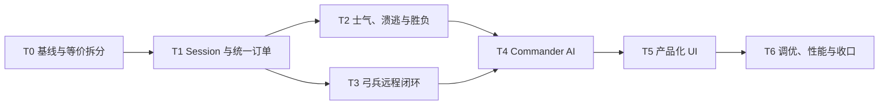

# NextTotalwar 基础战斗循环产品化开发计划

本计划实现 [NextTotalwar 基础战斗循环产品化设计](nexttotalwar-productization-design.md)。估算按一名熟悉本仓库的工程师计算，为 29～37 人日；UI 美术、额外场景和音频精修不在估算内。旧战斗 MVP 的 C0～C2 视为已有基线，C3/C4 的有效设计被纳入 T2/T4，不再单独按旧计划推进。

## 1. 执行原则

1. 先隔离现有 1,974 行 GameInstance 的职责，再增加 AI 和产品 UI；重构阶段不得改变玩法。
2. Formation、CombatModel、CombatGrid、CombatSystem 已有测试覆盖，非必要不重写。
3. 玩家和 AI 只提交 `FBattleOrder`；任何直接修改敌我 `path/state` 的新代码都视为架构违规。
4. 战斗、远程、士气、AI 和胜负只在固定 tick/明确低频 tick 推进。
5. 每阶段保持 24 regiment / 2,400 soldier 基线可跑，不用缩规模掩盖问题。
6. 产品 UI 与 F5 调试 UI 分离；调试统计不能成为玩家操作入口。

## 2. 阶段依赖



T2/T3 的纯规则可并行设计，但都会改 BattleState/UnitDef 和 fixed-tick 事件，代码合流与构建必须串行。

## 3. T0 — 基线固化与等价拆分（3～4 人日）

### 工作

- 固化现有 `[NextTotalwar]` 19 个 test case、4,238 个断言与五条 agentscript 基线。
- 记录 2,400 人场景的启动时间、FPS、combat CPU、animator updates、proxy 和血迹池占用。
- 从 `FGameInstance` 无行为变化地抽出：`RegimentMovementSystem`、`RegimentVisualSystem`、`WorldOverlay` 和只读 `FBattleUISnapshot`。
- 把选择/路径/战斗的当前更新顺序写成显式编排，保留 deterministicCombat 行为。
- 复核并随等价拆分更新 `AGENT_GUIDE/NextTotalwar.md` 的文件地图和数据流。
- 为后续 Order/Morale/Ranged/AI 测试准备纯数据 fixture，不创建场景或 Vulkan。

### 验收

- 原 select/march/camera/battle/battle-c2 agentscript 全绿且关键 query 数值不变。
- `[NextTotalwar]` 单测断言数不减少；若等价搬迁改变测试入口，必须说明而非删除覆盖。
- 抽取前后同 seed 的合成战斗 strength history 完全一致。

## 4. T1 — BattleSession、场景数据与统一订单（4～5 人日）

### 工作

1. 新增 `BattleSession` 的 Loading/Briefing/Deployment/Active/Paused/Finished 状态。
2. 新增 `FRegimentId` registry、`FBattleOrder` 和 `BattleOrderSystem`。
3. 把现有 `IssueMoveOrders` 拆为验证、目标分配和单军团执行；玩家右键改为提交订单。
4. 实现 Move/Attack/Charge/Halt/Withdraw/SetFormation 的状态语义和拒绝原因。
5. 建立 `playerFaction=0` 所有权门：世界点选、框选、双击、底部卡和快捷键都不能选红方。
6. 把 unit defs 与 greenfield 部署迁入 JSON，加入 schema/值域校验和失败日志。
7. 支持 Pause/1×/2×，AgentValidation 继续固定一步一帧。

### 单元测试

- session 合法/非法迁移；
- 敌方和 Destroyed/Routing 军团订单拒绝；
- 同 tick sequence 顺序稳定；
- Attack 目标失效、Charge 冷却、Withdraw 脱战和 Halt 清路径；
- 多选目标分配仍保持 minimum travel；
- JSON 缺字段、坏 ID、重叠 regiment ID 明确失败。

### 验收

- 玩家无法通过任何正常入口选红方，hover 仍可显示敌军。
- Attack/Charge/Move 有不同 overlay 和 `game.lastOrderType`。
- Briefing → Deployment → Active → Pause/Resume 可由 UI 与 agentscript 驱动。

## 5. T2 — 士气、溃逃、集结与胜负（4～5 人日）

### 工作

- 新增 `MoraleSystem`、tuning、最近伤亡窗口和局部战况 snapshot。
- 实现伤亡、短时冲击、侧背、局部劣势、友军溃逃/歼灭、远程压制和脱战恢复。
- 实现 Steady/Wavering/Routing/Rally/Eliminated 迟滞与持续阈值。
- Routing 生成本方撤退路径，锁玩家订单；越界后永久离场；满足条件可有限次 Rally。
- 近战追击与 Withdraw 明确：撤退方脱离后追击方重整或按 Attack order 继续。
- `BattleSession` 在 fixed tick 末统一判断 Victory/Defeat/Draw。
- 扩展 `BattleState` 事件并让 CombatFx/UI 消费 Rout/Rally/Result。

### 单元测试

- 每项士气因子的方向、clamp 和限速；
- 路由阈值持续时间与 rally 迟滞；
- 同 tick 多事件与遍历顺序无关；
- 溃逃越界、全歼、双方同 tick 失去资格的胜负；
- 同 seed/同 order 的 morale timeline 完全一致。

### 验收

- 合成侧背战比正面战更快使目标 Wavering/Route。
- 世界兵牌/调试 query 能观察士气变化、溃逃路径和集结。
- 一场无弓兵合成战能以溃逃或全歼结束并进入 Finished。

## 6. T3 — 弓兵远程战斗（4～5 人日）

### 工作

1. 扩展 unit defs：ranged flag、range/minRange、volleyInterval、accuracy、damage、ammo、suppression。
2. 新增 `RangedCombatSystem`，按 regiment 选目标、检查代表 LOS、确定性计算 volley 命中并分配伤亡。
3. 弓兵 Attack 默认保持射程；危险距离内自动停止射击，AI/玩家可撤退或强制近战。
4. 新增 FireAtWill/HoldFire 与 ammo 状态。
5. 建立固定容量箭矢/arc 表现池，远处允许简化；数值不依赖视觉碰撞。
6. 远程伤亡与压制事件接入 T2 MoraleSystem。
7. 为弓兵补齐齐射 clip/表现；若资产期不足，可先用 attack clip + 弧线箭矢，但接口不降级为近战。

### 单元/集成测试

- 射程边界、min range、ammo 和 volley cadence；
- 同 seed 命中数一致；
- 遮挡目标不可射、近战接触停止射击；
- 远程伤亡正确进入 strength/death/FX/morale；
- 箭矢池复用不增长 scene node 数。

### 验收

- 玩家可用弓兵攻击并消耗弹药，敌方会受伤/动摇；被剑兵逼近后弓兵不能隔身齐射。
- 24 队场景连续齐射无可见 frame spike 或无界 proxy 增长。

## 7. T4 — Commander AI 对手（5～6 人日）

### 工作

- 新增只读 `FAIBattleSnapshot` 和可单测 `CommanderAI`。
- 实现 Deploy/Advance/Engage/Exploit/Regroup 阶段与 Line/Flank/Ranged/Reserve 角色。
- 开局分配主线、侧翼、弓兵和预备队；军团被歼灭/集结后有限重分配。
- AI 只通过 `BattleOrderSystem` 提交 Move/Attack/Charge/Withdraw/Halt。
- 实现订单冷却、目标移动阈值、目标占用和路径失败退化，避免反复重发。
- Normal AI 不加战斗数值；Easy/Hard 只调反应间隔和协同阈值。
- 记录 order count、last reason、role 和 target，提供 F5/agent query。

### 单元测试

- 角色分配稳定且保留 reserve；
- line 推进、flank 选择已接战侧翼、ranged 保距、reserve 填缺口；
- 低士气/近战危险下撤退；敌军溃逃时有限追击；
- 冷却和 8 m 去抖；
- AI 不可给玩家军团下令，不直接改变 path/state；
- 同 snapshot/seed 产生同 order sequence。

### 自动验收

- 新增 `nexttotalwar-ai-idle-player.agentscript.json`：玩家不操作，AI 必须产生订单、推进、接战并在时限内结束战斗；
- 新增 `nexttotalwar-ai-flank.agentscript.json`：固定布局下出现可辨识 flank/charge reason；
- 新增 `nexttotalwar-ai-ranged.agentscript.json`：弓兵保持距离并完成 volley。

### 验收

- 正常 AI 能独立跑完整战斗，不出现全军挤向单点或数秒一次反复改令。
- 通过 F5 可解释每次 AI 订单，不接受不可诊断的随机策略。

## 8. T5 — 产品化战场 UI 与交互（5～6 人日）

### 工作

1. 建立统一 style、颜色/图形语义和只读 `FBattleUISnapshot`。
2. 实现 Briefing、Deployment 开始、Pause 和 Victory/Defeat/Rematch 页面。
3. 实现顶部战况栏：时间、速度、双方兵力/军团、balance of power、目标。
4. 重做底部单位卡，只显示玩家 12 队；加入兵种、人数、士气、ammo、订单和状态图标。
5. 增加命令栏与快捷键、禁用原因 tooltip、数字编组和双击聚焦。
6. 增加距离 LOD 世界兵牌、敌军 hover、Attack/Charge/Move/Withdraw overlay。
7. 处理 `WantCaptureMouse/Keyboard`、DPI、16:9/16:10 和安全区。
8. 现有性能/NavGrid/combat tick 面板统一移到 F5，默认关闭。

### UX 验收场景

- 新玩家不读文档也能开始战斗、选蓝军、攻击红军、辨认士气/弹药和看到胜负；
- 点击任何 UI 不会向世界透传选择/命令；
- 1600×900、1920×1080、2560×1600 下顶部栏/单位卡/命令栏不重叠；
- 色盲模拟下 Move/Attack/Charge 仍可通过线型/图标区分；
- 12 张玩家卡无需水平滚动才能看到关键状态，或有明确分页/缩放策略。

### 验收

- 一条 UI agentscript 完成 Briefing → Deployment → 选军 → Attack/Charge → Pause → Finished → Rematch。
- 截图中默认没有 `Render proxies`、`Combat CPU`、`NavGrid` 等开发文案。

## 9. T6 — 平衡、性能、回归与文档收口（4～6 人日）

### 平衡矩阵

- 矛 vs 剑正面、剑侧击矛、弓远射剑、剑接近弓；
- 正面接战 vs 侧背冲锋的士气时间线；
- Easy/Normal/Hard AI 对 idle player 和基准 scripted player；
- 8～15 分钟标准战斗时长，避免 30 秒雪崩或 30 分钟磨血。

### 性能矩阵

记录：

- Active 空闲、全军行军、12 队近战、6 队齐射、全系统 AI 战；
- FPS、combat/morale/ranged/AI CPU、animator updates、proxy、事件峰值、箭矢/血迹池；
- 1600×900 默认渲染器与 AgentValidation deterministic 两种路径；
- 连续 Rematch 三次的 scene node、pool、内存和 handle 稳定性。

### 回归命令

```powershell
gnb.bat build NextTotalwar gkNextUnitTests
out\build\windows\bin\gkNextUnitTests.exe "[NextTotalwar]"
gnb.bat shot --target NextTotalwar --ui
gnb.bat validate --script assets/agentscripts/nexttotalwar-select.agentscript.json
gnb.bat validate --script assets/agentscripts/nexttotalwar-march.agentscript.json
gnb.bat validate --script assets/agentscripts/nexttotalwar-battle.agentscript.json
gnb.bat validate --script assets/agentscripts/nexttotalwar-ai-idle-player.agentscript.json
gnb.bat validate --script assets/agentscripts/nexttotalwar-product-loop.agentscript.json
```

常规应用改动只构建 `NextTotalwar`；纯系统源码加入 tests 后构建 `gkNextUnitTests`。只有公共 Gameplay/Engine header 或 ABI 广泛变化才考虑全量构建。

### 文档收口

- 把产品化设计状态改为“现行架构”，填入真实默认值和性能记录；
- 更新 `AGENT_GUIDE/NextTotalwar.md` 的文件地图、订单、AI、UI 和验证入口；
- 旧 battle MVP 标为被产品化设计吸收，不让 C3/C4 与新阶段形成两个执行源；
- 本计划完成后退出 `docs/README.md` 的现行计划入口。

## 10. 交付清单

- BattleSession、统一 Order、阵营所有权和数据驱动 scenario；
- 士气、动摇、溃逃、集结、离场和胜负；
- 弓兵射程、齐射、弹药、压制和表现池；
- 可解释、确定性的敌方 Commander AI；
- 产品顶部栏、世界兵牌、玩家单位卡、命令栏、暂停和结算流程；
- Order/Morale/Ranged/AI/Session 单测与完整 agentscript；
- 2,400 人实测性能、平衡和连续重开报告。

## 11. 阶段退出门

出现下列任一情况不得进入下一阶段：

- AI 直接修改 `regiment.path/state`；
- 玩家可从世界或 UI 选择敌军；
- fixed tick 使用 wall clock 或非 seed RNG；
- 士气/胜负依赖 HUD 扫描；
- 一轮 volley 创建数量随战斗时间无限增长的 scene nodes；
- UI 点击会透传为世界命令；
- Rematch 后旧订单、目标 ID 或视觉对象仍引用上一局。
